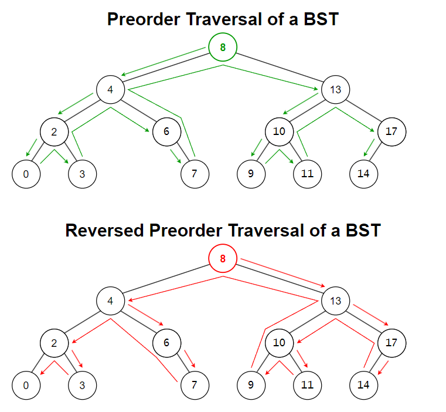
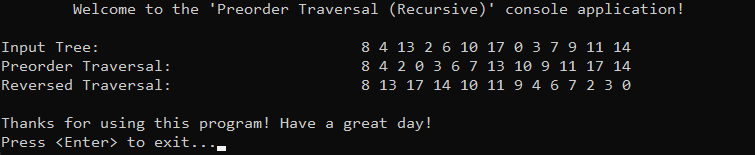

# &#128209; Table of Contents
- [💡 Overview](#-overview)
  - [Introduction](#introduction)
  - [Important Details](#important-details)
  - [Algorithm Steps (Recursive)](#algorithm-steps-recursive)
- [💻 Implementation](#-implementation)
  - [Design Decisions](#design-decisions)
  - [Complete Implementation](#complete-implementation)
  - [Detailed Walkthrough](#detailed-walkthrough)
- [📊 Analysis](#-analysis)
  - [Characteristics](#characteristics)
  - [Trade-Offs](#trade-offs)
- [📝 Application](#-application)
  - [Common Use Cases](#common-use-cases)
  - [Some Practical Problems](#some-practical-problems)
- [🕙 Origins](#-origins)
- [📖 Resources](#-resources)
- [🤝 Contributing](#-contributing)
- [🔏 License](#-license)


# &#128161; Overview
**Preorder traversal** is a fundamental algorithm for visiting nodes in a binary tree. When you think of traversal names as root placement plus left-to-right reading order, it is possible to observe that the name «PREorder» means the root is visited BEFORE the left and right subtrees. Knowledge and understanding of it lay a solid foundation for algorithmic design and tackling more complex problem-solving strategies.
<p align="center"></p>


## Introduction
The algorithm visits the root node before its left and right children — following the order Root-Left-Right in the standard version, and Root-Right-Left in the reversed version.


## Important Details
1. Can be implemented using **recursion** or **iteration**, where the recursive approach relies on an implicit function call stack, and the iterative approach uses an explicit stack to manually manage the traversal state.


## Algorithm Steps (Recursive)
**Standard Version:**
1. Set up the base case, stopping recursion when traversal reaches the end of a branch.
2. Process the current node (this step depends on the specific task at hand).
3. Recursively traverse the left subtree by calling the function on the left child.
4. Recursively traverse the right subtree by calling the function on the right child.

---
**Reversed Version:**
1. Set up the base case, stopping recursion when traversal reaches the end of a branch.
2. Process the current node (this step depends on the specific task at hand).
3. Recursively traverse the right subtree by calling the function on the right child.
4. Recursively traverse the left subtree by calling the function on the left child.


# &#x1F4BB; Implementation
The program manually constructs a binary tree that resembles a BST, but does not strictly enforce its rules — nodes are added in a predefined order rather than inserted dynamically. It then displays the order of insertion and applies both preorder and reversed preorder traversals, each of which simply prints the visited node values.
<p align="center"></p>


## Design Decisions
To prioritize simplicity and emphasize algorithm itself, several design decisions were made:
- Replacing tree-like structure with a simple node struct and predefined order of nodes.
- Printing node values as the only processing step during traversal.


## Complete Implementation
The preorder traversal algorithm is implemented in `preorderTraversal()`, the reversed preorder traversal in `reversedPreorderTraversal()`, both are declared in [PreorderTraversal.h](https://github.com/vezzolter/DSA/blob/main/Algorithms/TreeAlgorithms/PreorderTraversal/Include/PreorderTraversal.h) header file and defined in [PreorderTraversal.cpp](https://github.com/vezzolter/DSA/blob/main/Algorithms/TreeAlgorithms/PreorderTraversal/Source/PreorderTraversal.cpp) source file. This approach is adopted to ensure encapsulation, modularity and compilation efficiency. The tree construction and traversal execution are handled within the `main()` function located in the [Main.cpp](https://github.com/vezzolter/DSA/blob/main/Algorithms/TreeAlgorithms/PreorderTraversal/Source/Main.cpp) file. Below you can find related code snippets.

```cpp
void preorderTraversal(TreeNode* root) {
	if (!root) { return; }
	std::cout << root->val << " ";
	preorderTraversal(root->left);
	preorderTraversal(root->right);
}

void reversedPreorderTraversal(TreeNode* root) {
	if (!root) { return; }
	std::cout << root->val << " ";
	reversedPreorderTraversal(root->right);
	reversedPreorderTraversal(root->left);
}
```


## Detailed Walkthrough
**Standard Version:**
1. Start by setting up the base case, where if the current node is `nullptr`, the function returns immediately, stopping recursion.  
```cpp
  if (node == nullptr) { return; }
```
2. Process the current node, which in this case involves printing its value (designer decision).
```cpp
  std::cout << node->val << " ";
```
3. Recursively traverse the left subtree by calling the function on the left child.
```cpp
  preorderTraversal(node->left);
```
4. Recursively traverse the right subtree by calling the function on the right child.
```cpp
  preorderTraversal(node->right);
```

---
**Reversed Version:**
1. Start by setting up the base case, where if the current node is `nullptr`, the function returns immediately, stopping recursion.
```cpp
  if (node == nullptr) { return; }
```
2. Process the current node, which in this case involves printing its value (designer decision).
```cpp
  std::cout << node->val << " ";
```
3. Recursively traverse the right subtree by calling the function on the right child.
```cpp
  reversedPreorderTraversal(node->right);
```
4. Recursively traverse the left subtree by calling the function on the left child.
```cpp
  reversedPreorderTraversal(node->left);
```


# &#128202; Analysis
Understanding the characteristics of an algorithm is essential for choosing the right solution to a problem, as it reveals their impact on resource utilization, potential limitations, and capabilities. Additionally, understanding its strengths and weaknesses enables more informed decisions, helping to determine the most suitable algorithm for a given problem among alternative approaches.


## Characteristics
- **Time Complexities:**  
  - $O(n)$ — each node is visited exactly once.
- **Auxiliary Space Complexity:**  
  - $O(height)$ — the recursion depth depends on the height of the tree, which is $O(\log n)$ for balanced trees and $O(n)$ for skewed trees. The iterative implementation uses a stack to track nodes.


## Trade-Offs
> **Note**: I think it doesn’t make sense to evaluate this algorithm in terms of «pros and cons» — just like a tool, it serves a specific purpose. We don’t ask whether a hammer or a table has advantages or disadvantages; we simply use them as needed for the task at hand. 


# &#128221; Application
Understanding some of the most well-known use cases of an algorithm is crucial for grasping its practical relevance and potential impact in real-world scenarios. Additionally, familiarizing oneself with common practical problems and practicing their solutions ensures that you remember the essential details and develop a deep, intuitive understanding of the functionality and limitations.


## Common Use Cases
- **Tree Copying or Cloning** — preorder traversal is ideal when you want to replicate a binary tree's structure, since it visits the root before its subtrees. This makes it easy to create a new node first and then recursively attach its left and right children.

- **Serialization & Deserialization** — preorder traversal is widely used in binary tree serialization, as visiting the root first allows the structure to be preserved during encoding. When combined with a marker for `nullptr` (or similar) children, it enables complete and unambiguous reconstruction of the original tree.

- **Expression Tree Construction** — preorder traversal reflects prefix notation (Polish notation), where operators come before their operands. It’s used to construct or evaluate prefix expressions from expression trees in compilers or interpreters.


## Some Practical Problems
Since inorder traversal is widely used in tree-related problems, common problems that involve it are best described in the [tree's respective section](../../../DataStructures/Tree/Tree.md#some-practical-problems).


# &#x1F559; Origins
I couldn’t find any definitive records tracing its origins, so I’m assuming it just naturally emerged as people started working with trees in computer science. As trees became more common, the Root-Left-Right order was probably recognized as a natural way to process hierarchical structures by visiting parents before their children.


# &#128214; Resources
&#128218; **Books:**
- **"Algorithms in C++, Parts 1-4: Fundamentals, Data Structure, Sorting, Searching" (3rd Edition)** — by Robert Sedgewick
  - Section 5.6: Tree Traversal
  - Section 5.7: Recursive Binary-Tree Algorithms
- **"Data Structures and Algorithm Analysis in C++" (4th Edition)** — by Mark Allen Weiss
  - Section 4.1: Preliminaries
  - Section 4.2: Binary Trees
  - Section 4.6: Tree Traversals (Revisited)
- **"The Art of Computer Programming, Volume 1: Fundamental Algorithms" (3rd Edition)** — by Donald Ervin Knuth
  - Section: 2.3.1: Traversing Binary Trees

---
&#127891; **Courses:**
- [Accelerated Computer Science Fundamentals Specialization](https://www.coursera.org/specializations/cs-fundamentals) on Coursera
  - Section 2.2: Introduction to Tree Structures
- [Mastering Data Structures & Algorithms using C and C++](https://www.udemy.com/course/datastructurescncpp/) on Udemy
  - Section 15: Trees


# &#129309; Contributing
Contributions are highly appreciated! For detailed guidelines, contact details, and additional information, please refer to the [root directory's contributing section](../../../#-contributing).


# &#128271; License
This project is licensed under the MIT License — see the [LICENSE](https://github.com/vezzolter/DSA/blob/main/LICENSE) file for details.

[](https://opensource.org/licenses/MIT)