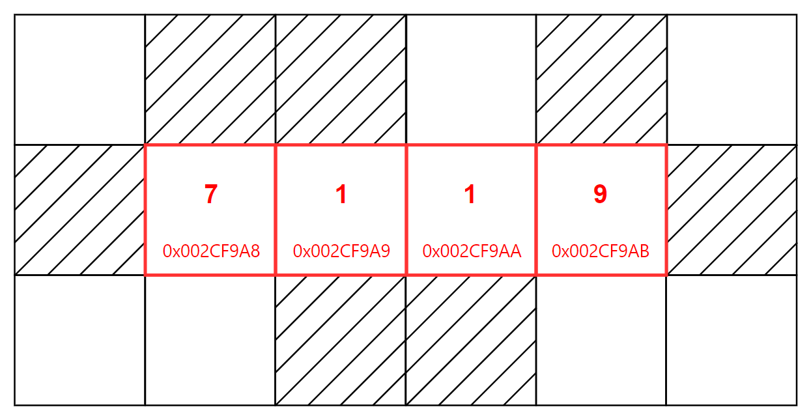
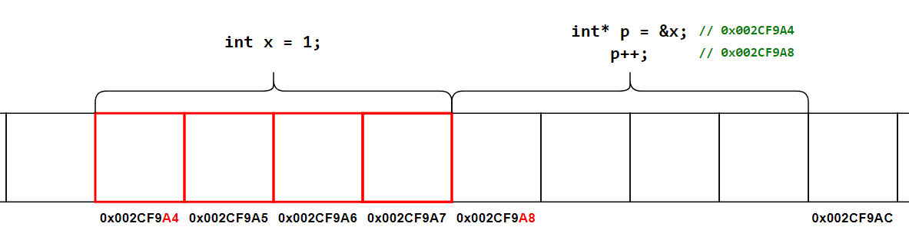
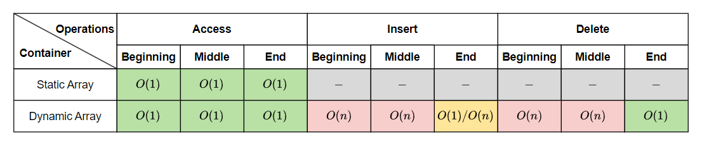

# &#128209; Table of Contents
- [💡 Overview](#-overview)
  - [Essential Terminology](#essential-terminology)
- [💻 Implementation](#-implementation)
  - [Core Mechanics](#core-mechanics)
  - [Existing Solutions](#existing-solutions)
  - [Repository Containers](#repository-containers)
- [📊 Analysis](#-analysis)
  - [Evaluating Characteristics](#evaluating-characteristics)
  - [Comparing Containers](#comparing-containers)
- [📝 Application](#-application)
  - [Common Use Cases](#common-use-cases)
  - [Some Practical Problems](#some-practical-problems)
- [🕙 Origins](#-origins)
- [🤝 Contributing](#-contributing)
- [📧 Contacts](#-contacts)
- [🙏 Credits](#-credits)
- [🔏 License](#-license)


# &#128161; Overview
**Array** is a data structure that stores elements of same memory size in contiguous memory locations, allowing for efficient and direct access to them through indexing. The name comes from the concept of an «array» as a systematic arrangement of similar objects in rows and columns. Knowledge and understanding of it lay a solid foundation in designing data structures and optimizing their application.
<p align="center"></p>


## Essential Terminology
- **Data Structure** — is a theoretical model of data organization, used to design containers in an efficient or specific ways.
  - **Container** — is a concrete implementation of data structure, used to manage actual data through specific operations. Since, in practice, containers are primarily used for the operations they provide and the guarantees they offer. As long as those guarantees are met, the underlying data structure can be changed or adapted.
- **Array** — is a data structure that stores elements of the same memory size (thus same data type) in contiguous memory locations, meaning a single block of memory with no gaps between elements.
  - **Size** — is a number of elements contained in the array. 
- **Element** — is an individual entity within a collection.
  - **Index** — is a positive integer value which specifies position of an element within array. Since elements of an array don't have their unique names, the only way to access them is through their respective indices.
  - **Value** — is an actual information stored within the element. It can be anything from primitive types such as integers to more complex types like instances of classes.


# &#x1F4BB; Implementation 
Understanding the underlying mechanics of a data structure is essential to grasp how it operates and manages data. Since one data structure can have different implementations, it's crucial to recognize these distinctions, especially by learning from existing solutions, which often offer efficient, well-tested approaches to handling data and optimizing performance.


## Core Mechanics
The core concept of an array revolves around **contiguous memory allocation** and **direct (random) access** to elements based on an index. All elements of an array are stored one after the other in a continuous block of memory, starting from the base address of the first element, with each subsequent element stored at the next memory address, each occupying the same amount of memory based on its data type. This allows arrays to provide constant-time access $O(1)$ to any element, because instead of using traversal methods, the memory address of any element can be calculated directly by leveraging address arithmetic with its index.
<p align="center"></p>
 
**Address Arithmetic** — is the concept of manipulating memory addresses using arithmetic operations, allowing to access previous or successive elements in memory with minimal overhead.
```cpp
  int val = 5;
  int *ptr = &val;     // points to variable of type 'int'              002CF9A4
  int *prev = ptr - 1; // points to prev value of int (-4 bytes)        002CF9A0
  int *next = ptr + 1; // points to next value of int (+4 bytes)        002CF9A8
```

**Array Indexing** — is the process of accessing elements within an array. Internally, this is achieved through address arithmetic. The name of an array itself acts as a pointer to the first element, and since the address of the first element is known, we can add element's index to it, thereby computing element's position in memory. This is also the reason why indexing starts from zero: `array[0]` means that the first element is $0$ element away from itself.
```cpp
  int array[5] = {7, 8, 2}; 
  cout << array[1];   // this accesses the value at index 1 (8)
  cout << *(array+1); // equivalent to array[1]
```
However, accessing an element outside the defined bounds of the array (either due to an invalid index or overflow) can lead to **undefined behavior**, often resulting in memory errors or data corruption. Arrays do not inherently track their own boundaries at runtime, leaving it up to the programmer (or the container implementation) to ensure valid access within the array’s limits.


## Existing Solutions
Quite often in computer science, there is ambiguity between definitions, as the term data structure typically refers to the abstract organization of data, focusing on logical operations such as insertion, deletion, and traversal. However, in practical applications, these data structures are implemented as containers, which not only provide these operations but also manage underlying performance and memory constraints.

---
When it comes to arrays, there are two primary types, each tailored for different use cases and optimized for specific performance characteristics. While the detailed differences between these types can be found in their corresponding sections of this repository, here’s a brief description to give you a foundational understanding:
- **Static Array** — is a type of array where the main property is that the size is fixed, meaning it can't be changed during runtime.
- **Dynamic Array** — is a type of array where the main property is that the size is dynamic, meaning it can be changed during runtime.

---
It's generally recommended to rely on well-established, widely recognized implementations that already exist, rather than reinventing the wheel. Proven implementations provide optimized, reliable solutions while saving time and effort. In the context of C++, the Standard Template Library (STL) offers trusted containers for both types of arrays:
- **std::array** — is a container that encapsulates fixed size arrays.
- **std::vector** — is a container that encapsulates dynamic size arrays.


## Repository Containers
Understanding the design principles and core mechanics of array data structures is essential for deeper insight into their efficiency and performance. The following implementations provide simplified versions of both static and dynamic arrays, showcasing key aspects of their design and operation.
- [Static Array](https://github.com/vezzolter/DSA/tree/main//DataStructures/Array/StaticArray) ✅
- [Dynamic Array](https://github.com/vezzolter/DSA/tree/main//DataStructures/Array/DynamicArray) ✅


# &#128202; Analysis
In practice, when analyzing a data structure, it's really about analyzing the containers that are based on that structure, because data structures themselves are theoretical concepts, whereas containers are the actual implementations you can use. Containers may not only perform the same operations differently, leading to distinct behaviors and performance characteristics, but they may also offer entirely different operations. Moreover, when working with existing solutions, each developer may implement the container in a unique way, resulting in additional variations. Therefore, it's always recommended to first consult the documentation to understand how the specific container operates and what guarantees it provides to the user.


## Evaluating Characteristics
- **Time Complexities** — refers to the speed of operations (e.g. insertion, deletion, etc) at different edge cases (e.g. at the end, in an empty container, etc).
- **Space Expenses** — refers to how much memory the container requires, both in terms of the data stored and any additional overhead (e.g. pointers, resizing buffers, etc). 
- **Special Metrics** — refers to features that define the container's uniqueness in comparison to others (e.g. balancing for trees, specific element order for queues, etc).


## Comparing Containers
For detailed evaluations of specific container characteristics, please refer to the corresponding container directories. Here, I will provide a comparison table that serves as a quick reference for the time complexities of core-defining operations, allowing for easy look-up and comparison across containers for this data structure.
<p align="center"></p>


 
# &#128221; Application
The concrete situations where a data structure is best (and worst) used stem directly from the inherent advantages (and disadvantages) of the container. For example, one advantage of static arrays is that their size must be known and fixed at compile time. Therefore, a suitable use case would be a scenario where the size is known in advance or remains constant throughout the entire runtime, while an anti-use case would involve situations where the size can’t be determined at the moment of creation or requires changing during runtime. In order to avoid, this sort of rephrasing, the following section outlines common real-world scenarios where these use cases are frequently encountered. Additionally, familiarizing oneself with common practical problems and practicing their solutions ensures that you remember the essential details and develop a deep, intuitive understanding of the functionality and limitations.


## Common Use Cases
- **Data Storage** — arrays are fundamental for storing collections of data, such as lists of numbers, strings, or objects. They provide a structured way to organize data and allow efficient access through indexing, making them ideal for handling large amounts of information.

- **Algorithms and Data Structures** — arrays serve as a foundation for many algorithms and data structures. Arrays enable quick access to elements, making them ideal for sorting, searching, and forming the basis for other structures like stacks, queues, and hash tables.

- **Image and Signal Processing** — arrays are commonly used to represent images or signals in computer vision and audio processing. Each pixel in an image or each sample in a signal can be efficiently stored and manipulated in arrays, allowing for fast access and transformation of data.

- **Text Processing** — arrays are heavily utilized in handling strings and characters for tasks like searching, parsing, and modifying text. The sequential structure of arrays makes them perfect for working with ordered sequences of characters.

- **Matrices and Linear Algebra** — arrays, particularly 2D arrays, are essential in representing matrices in linear algebra. They are widely used in scientific computing, physics simulations, and machine learning for performing matrix operations.

- **Database Management** — arrays help in managing and processing data within databases, especially for tabular structures like rows and columns. They provide a fast, organized way to handle large sets of structured data efficiently.

- **Game Development** — arrays manage various game elements such as characters, items, or terrain data. Their fast access and manipulation capabilities are crucial for handling real-time data and interactions in games.

- **Embedded Systems** — arrays are widely used in embedded systems for managing sensor data, controlling outputs, or storing configuration settings. Their simplicity and memory efficiency make them an ideal choice for low-resource environments.


## Some Practical Problems
**Easy Problems:**
1. [Build Array from Permutation](https://leetcode.com/problems/build-array-from-permutation)
2. [Remove Element](https://leetcode.com/problems/remove-element)
3. [Find Missing and Repeated Values](https://leetcode.com/problems/find-missing-and-repeated-values)
4. [Contains Duplicate](https://leetcode.com/problems/contains-duplicate)
5. [Remove Duplicates from Sorted Array](https://leetcode.com/problems/remove-duplicates-from-sorted-arra)
6. [Majority Element](https://leetcode.com/problems/majority-element)
7. [Two Sum](https://leetcode.com/problems/two-sum)
8. [Intersection of Two Arrays](https://leetcode.com/problems/intersection-of-two-arrays)
9. [Image Smoother](https://leetcode.com/problems/image-smoother)
10. [Longest Continuous Increasing Subsequence](https://leetcode.com/problems/longest-continuous-increasing-subsequence)

---
**Medium Problems:** 
1. [Rotate Array](https://leetcode.com/problems/rotate-array)
2. [Find Minimum in Rotated Sorted Array](https://leetcode.com/problems/find-minimum-in-rotated-sorted-array)
3. [Maximum Gap](https://leetcode.com/problems/maximum-gap)
4. [Insert Interval](https://leetcode.com/problems/insert-interval)
5. [Top K Frequent Elements](https://leetcode.com/problems/top-k-frequent-elements)
6. [Maximum Product Subarray](https://leetcode.com/problems/maximum-product-subarray)
7. [Longest Consecutive Sequence](https://leetcode.com/problems/longest-consecutive-sequence)
8. [Valid Sudoku](https://leetcode.com/problems/valid-sudoku)
9. [Difference of Number of Distinct Values on Diagonals](https://leetcode.com/problems/difference-of-number-of-distinct-values-on-diagonals)
10. [Product of Array Except Self](https://leetcode.com/problems/product-of-array-except-self)
11. [Jump Game](https://leetcode.com/problems/jump-game)
12. [Rotate Image](https://leetcode.com/problems/rotate-image/)
13. [Peeking Iterator](https://leetcode.com/problems/peeking-iterator)
14. [Reduce Array Size to The Half](https://leetcode.com/problems/reduce-array-size-to-the-half)
15. [Product of the Last K Numbers](https://leetcode.com/problems/product-of-the-last-k-numbers)

---
**Hard Problems:** 
1. [Largest Rectangle in Histogram](https://leetcode.com/problems/largest-rectangle-in-histogram)
2. [Sliding Window Maximum](https://leetcode.com/problems/sliding-window-maximum)
3. [Trapping Rain Water](https://leetcode.com/problems/trapping-rain-water)
4. [Median of Two Sorted Arrays](https://leetcode.com/problems/median-of-two-sorted-arrays)
5. [Count of Range Sum](https://leetcode.com/problems/count-of-range-sum)
6. [Reverse Pairs](https://leetcode.com/problems/reverse-pairs)
7. [Make Array Empty](https://leetcode.com/problems/make-array-empty)
8. [Longest Increasing Path in a Matrix](https://leetcode.com/problems/longest-increasing-path-in-a-matrix)
9. [Candy](https://leetcode.com/problems/candy)
10. [Remove Boxes](https://leetcode.com/problems/remove-boxes)


# &#x1F559; Origins
The idea of the array, due to its simplicity and efficiency, can be observed in many real-world systems and structures. In computer science, arrays became one of the earliest data structures to be implemented in programming languages. While their origin can't be attributed to a single person or moment, there are still important dates worth noting:

- In **1945**, the Von Neumann architecture, introduced by John von Neumann, laid the groundwork for modern computing by proposing a **sequential memory model**. This concept of storing both data and instructions in linear memory influenced the development of data structures like arrays, enabling efficient, contiguous memory allocation.

- In **1957**, FORTRAN, one of the first high-level programming languages, introduced **static arrays**. These arrays had a fixed size, determined at compile time, and became essential for scientific and engineering computations due to their simplicity and efficiency in memory use.

- In the **late 1950s**, ALGOL 58 and ALGOL 60 advanced the concept of arrays by introducing early forms of **dynamic arrays**. These arrays allowed memory to be allocated during runtime, offering more flexibility than static arrays and influencing future programming languages by showing how arrays could be more dynamic in nature.

- In **1972**, the C programming language, developed by Dennis Ritchie, introduced **address arithmetic** as a method for interacting with arrays at a low level. This innovation allowed programmers to manipulate memory directly, making arrays more efficient for system-level programming and solidifying their role in performance-critical applications.


# &#129309; Contributing
Contributions are highly appreciated! For detailed guidelines, please refer to the [root directory's contributing section](../../#-contributing).


# &#128231; Contacts
For contact details and additional information, please refer to the [root directory's contact information section](../../#-contacts).


# &#128591; Credits
&#128218; **Books:**
- **"Algorithms in C++, Parts 1-4: Fundamentals, Data Structure, Sorting, Searching" (3rd Edition)** — by Robert Sedgewick
  - Section 3.1: Building Blocks
  - Section 3.2: Arrays
- **"Data Structures and Algorithm Analysis in C++" (4th Edition)** — by Mark Allen Weiss
  - Section 3.3: `vector` and `list` in the STL
  - Section 3.4: implementation of `vector`
- **"The Algorithm Design Manual" (2nd Edition)** — by Steven S. Skiena
  - Section 3.1: Contiguous vs. Linked Data Structures
- **"The Art of Computer Programming, Volume 1: Fundamental Algorithms" (3rd Edition)** — by Donald Ervin Knuth 
  - Section 2.5: Dynamic Storage Allocation
  - Section 2.6: History and Bibliography

---
&#127891; **Courses:**
- [Mastering Data Structures & Algorithms using C and C++](https://www.udemy.com/course/datastructurescncpp/) on Udemy
   - Section 6: Arrays Representations
   - Section 7: Array ADT
   - Section 9: Matrices
   - Section 10: Sparse Matrix and Polynomial Representation
- [Accelerated Computer Science Fundamentals Specialization](https://www.coursera.org/specializations/cs-fundamentals) from Coursera
   - Course 2.1: Linear Structures

--- 
&#127760; **Web-Resources:**
- [Array (data structure)](https://en.wikipedia.org/wiki/Array_(data_structure)) (Wikipedia)
- [Dynamic array](https://en.wikipedia.org/wiki/Dynamic_array) (Wikipedia)
- [std::array](https://en.cppreference.com/w/cpp/container/array) (Documentation)
- [std::vector](https://en.cppreference.com/w/cpp/container/vector) (Documentation)
- [Iterator library](https://en.cppreference.com/w/cpp/iterator) (Documentation)
- [Writing an ITERATOR in C++](https://www.youtube.com/watch?app=desktop&v=F9eDv-YIOQ0) (Video)


# &#128271; License
This project is licensed under the MIT License — see the [LICENSE](https://github.com/vezzolter/DSA/blob/main/LICENSE) file for details.

[](https://opensource.org/licenses/MIT)