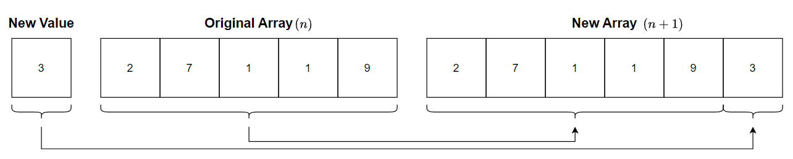

# &#128209; Table of Contents
- [💡 Overview](#-overview)
	- [Essential Terminology](#essential-terminology)
- [💻 Implementation](#-implementation)
	- [Core Mechanics](#core-mechanics)
	- [Existing Solutions](#existing-solutions)
	- [Implemented Arrays](#implemented-arrays)
- [📊 Analysis](#-analysis)
	- [How to Analyze](#how-to-analyze)
	- [Advantages](#advantages)
	- [Disadvantages](#disadvantages)
- [📝 Application](#-application)
	- [Common Use Cases](#common-use-cases)
	- [Some Practical Problems](#some-practical-problems)
- [🕙 Origins](#-origins)
- [🤝 Contributing](#-contributing)
- [📧 Contacts](#-contacts)
- [🙏 Credits](#-credits)
- [🔏 License](#-license)


# &#128161; Overview
**Array** is a data structure that stores a collection of elements of same memory size in contiguous memory locations, allowing for efficient and direct access to them through indexing. The name comes from the concept of an «array» as a systematic arrangement of similar objects in rows and columns. Knowledge and understanding of it lay a solid foundation in designing data structures and optimizing their application.
<p align="center"></p>


## Essential Terminology
- **Collection** — is a data structure (or container), which is used to group multiple elements together.
  - **Linear Collection** — is a type of collection, where elements are arranged in linear sequence, i.e. each element has a predecessor and a successor, except for the first and last elements.
- **Array** — is a linear collection that stores elements of the same data type in contiguous and adjacent memory locations.
  - **Size** — is a number of elements contained in the array. 
- **Element** — is an individual entity within a collection.
  - **Index** — is an integer value which specifies position of an element within collection. Since elements of an array don't have their unique names, the only way to access them is through their respective indices.
  - **Value** — is an actual information stored within the element. It can be anything from primitive types such as integers to more complex types like instances of classes.


# &#x1F4BB; Implementation 
Currently in Progress...


## Core Mechanics
One of the most prominent feature of the arrays is that they provide efficient **random (direct) access**. It is mainly possible, because of the fact, that name of an array generates a pointer to the first element of the array (index 0), which results in synergy for address arithmetic and array indexing.
<p align="center"></p>

**Address (Pointer) Arithmetic** — is a concept of manipulating memory addresses using arithmetic operations, which allows for efficient navigation through data structure.
```cpp
int value = 5;
int *ptr = &value; // points onto variable of type 'int'             002CF9A4
cout << ptr + 1;   // point onto next value of int (+4 bytes)        002CF9A8
cout << ptr - 1;   // point onto prev value of int (-4 bytes)        002CF9A0
```

**Array Indexing** — process of accessing elements within an array, typically achieved internally through address arithmetic.
```cpp
int arr[5] = {7, 8, 2}; // simple static array          value:    7     8    2
cout << array[1];   //  this                            index:    0     1    2
cout << *(array+1); //  equals to this             expression: array  a+1  a+2
```

Because arrays use single-block memory allocation, any operation that alters their size requires the resource-intensive process of allocating a new array, copying values, and deallocating the previous one. While dynamic arrays address this inefficiency to some extent with their capacity feature, the need to 'move' arrays still exists, albeit less frequently.
<p align="center"></p>


## Existing Solutions
Currently in Progress..


## Implemented Arrays
Currently in Progress..


# &#128202; Analysis
Understanding how to analyze the particular implementation of a data structure in terms of time and space complexity is crucial for optimizing performance and ensuring efficient resource utilization within the constraints of the given environment. Additionally, knowing the pros and cons of different data structures allows to make informed decisions, helping to choose the most suitable approach for a given problem.


## How to Analyze
Will be updated in the future...


## Advantages
- **Efficient Random Access** — arrays facilitate efficient access to the elements within the collection. Regardless of the array's length, accessing elements has a constant time complexity of $(O(1))$.
- **Efficiency Memory Utilization** — as arrays store data in contiguous memory locations, preventing additional memory wastage. Also, ability for the allocation of memory in a single block, reduces memory fragmentation.
- **Convenient Multi-Dimensional Representations** — arrays provide a straightforward and natural way to represent multi-dimensional data structures, especially some type of grids or matrices.


## Disadvantages
- **Allocated Memory is Static** — in scenarios where the size needs adjustments or insertion leads to the shift of other elements, then resourceful operation of creating a new array and copying data arises, e.g. insertion and deletion takes $O(n)$ time.
- **Enormous Single Block** — allocating a large array can be problematic, especially in systems with limited memory, which potentially can cause a crash.
- **Wasted Space** — if an array is not fully populated, there may be wasted space in the allocated memory. This can be a concern in memory-constrained environments.
- **Out-of-Bound Access** — if an index outside the valid range is used, it can lead to unpredictable behavior or even program crashes.


# &#128221; Application
Understanding some of the most well-known use cases of a data structure is crucial for grasping its practical relevance and potential impact in real-world scenarios. Additionally, familiarizing oneself with common practical problems and practicing their solutions ensures that you remember the essential details and develop a deep, intuitive understanding of the functionality and limitations.


## Common Use Cases
- **Data Storage** — arrays are fundamental for storing collections of data, such as lists of numbers, strings, or objects. They provide a structured and efficient way to organize and access this information.
- **Algorithms and Data Structures** — many algorithms and data structures rely on arrays. Sorting algorithms, searching algorithms, and various data structures like stacks, queues, and hash tables often use arrays as their underlying structure.
- **Image and Signal Processing** — arrays are commonly used to represent images or signals in applications like computer vision and audio processing. The pixel values of an image or the samples of a signal can be stored in arrays.
- **Text Processing** — arrays are extensively used in handling strings and characters. Text processing tasks, like searching, parsing, or manipulating strings, often involve the use of arrays.
- **Matrices and Linear Algebra** — matrices, a specialized form of 2D arrays, are fundamental in linear algebra. They are extensively used in scientific computing, graphics, physics simulations, and machine learning.
- **Database Management** — arrays play a role in managing and processing data within databases. Tabular data, such as rows and columns in a database table, can be represented using arrays.
- **Game Development** — arrays are crucial in game development for managing various game elements, such as characters, items, or terrain data. They provide a structured way to organize and manipulate in-game entities.
- **Embedded Systems** — in embedded systems programming, arrays are often used to manage sensor data, control outputs, or store configuration information due to their simplicity and efficiency.


## Some Practical Problems
- [Build Array from Permutation](https://leetcode.com/problems/build-array-from-permutation/)
- [Find Missing and Repeated Values](https://leetcode.com/problems/find-missing-and-repeated-values/)
- [Count Pairs Whose Sum is Less than Target](https://leetcode.com/problems/count-pairs-whose-sum-is-less-than-target/)
- [Majority Element](https://leetcode.com/problems/majority-element/)
- [Contains Duplicate](https://leetcode.com/problems/contains-duplicate/)
- [Remove Element](https://leetcode.com/problems/remove-element/)
- [Rotate Image](https://leetcode.com/problems/rotate-image/)
- [Difference of Number of Distinct Values on Diagonals](https://leetcode.com/problems/difference-of-number-of-distinct-values-on-diagonals/)
- [Top K Frequent Elements](https://leetcode.com/problems/top-k-frequent-elements/)
- [Longest Consecutive Sequence](https://leetcode.com/problems/longest-consecutive-sequence/)
- [Valid Sudoku](https://leetcode.com/problems/valid-sudoku/)
- [Product of Array Except Self](https://leetcode.com/problems/product-of-array-except-self/)
- [Two Sum](https://leetcode.com/problems/two-sum/)
- [Contains Duplicate](https://leetcode.com/problems/contains-duplicate/)
- [Make Array Empty](https://leetcode.com/problems/make-array-empty/)
- [Find the Minimum Cost Array Permutation](https://leetcode.com/problems/find-the-minimum-cost-array-permutation/)
- [Largest Rectangle in Histogram](https://leetcode.com/problems/largest-rectangle-in-histogram/)
- [Count of Range Sum](https://leetcode.com/problems/count-of-range-sum/)


# &#x1F559; Origins
While early assembly and machine languages offered basic memory management constructs, they lacked the sophisticated abstraction and versatility inherent in arrays found in modern programming languages. Consequently, individuals worldwide independently devised solutions to address this limitation. As a result, the concept of organizing data into ordered sequences has undergone continuous evolution, with no single individual credited for the development of arrays.


# &#129309; Contributing
Contributions are highly appreciated! For detailed guidelines, please refer to the [root directory's contributing section](../../#-contributing).


# &#128231; Contacts
For contact details and additional information, please refer to the [root directory's contact information section](../../#-contacts).


# &#128591; Credits
&#128218; **Books:**
- **"Algorithms in C++, Parts 1-4: Fundamentals, Data Structure, Sorting, Searching" (3rd Edition)** — by Robert Sedgewick
  - Section 3.1: Building Blocks
  - Section 3.2: Arrays
  - Section 4: Abstract Data Types
- **"Data Structures and Algorithm Analysis in C++" (4th Edition)** — by Mark Allen Weiss
  - Section 3.1: Abstract Data Types
  - Section 3.3: `vector` and `list` in the STL
  - Section 3.4: implementation of `vector`
- **"The Algorithm Design Manual" (2nd Edition)** — by Steven S. Skiena
  - Section 3.1: Contiguous vs. Linked Data Structures
- **"The Art of Computer Programming, Volume 1: Fundamental Algorithms" (3rd Edition)** — by Donald Ervin Knuth 
  - Section 2.5: Dynamic Storage Allocation
  - Section 2.6: History and Bibliography

---
&#127891; **Courses:**
- [Mastering Data Structures & Algorithms using C and C++](https://www.udemy.com/course/datastructurescncpp/) on Udemy
   - Section 6: Arrays Representations
   - Section 7: Array ADT
   - Section 9: Matrices
   - Section 10: Sparse Matrix and Polynomial Representation
- [Accelerated Computer Science Fundamentals Specialization](https://www.coursera.org/specializations/cs-fundamentals) from Coursera
   - Course 2.1: Linear Structures

--- 
&#127760; **Web-Resources:**
- [Array (data structure)](https://en.wikipedia.org/wiki/Array_(data_structure)#:~:text=In%20computer%20science%2C%20an%20array,one%20array%20index%20or%20key.) (Wikipedia)
- [Pointer Arithmetic](https://hackingcpp.com/cpp/lang/pointer_arithmetic.html)
- [Array (ADT)](https://brilliant.org/wiki/arrays-adt/#:~:text=The%20array%20is%20a%20basic,types%20like%20instances%20of%20classes.)
- [Difference between Static Arrays and Dynamic Arrays](https://www.geeksforgeeks.org/difference-between-static-arrays-and-dynamic-arrays/)
- [std::array](https://en.cppreference.com/w/cpp/container/array)
- [std::vector](https://en.cppreference.com/w/cpp/container/vector)
- [Applications, Advantages and Disadvantages of Array](https://www.geeksforgeeks.org/applications-advantages-and-disadvantages-of-array-data-structure/)
- [What are the Advantages and Disadvantages of Arrays?](https://www.prepbytes.com/blog/arrays/advantages-and-disadvantages-of-arrays/)
- [List of 50+ Array Coding Interview Problems](https://iq.opengenus.org/list-of-array-problems/)
- [Top 50 Array Coding Problems for Interviews](https://www.geeksforgeeks.org/top-50-array-coding-problems-for-interviews/)


# &#128271; License
This project is licensed under the MIT License — see the [LICENSE](https://github.com/vezzolter/DSA/blob/main/LICENSE) file for details.

[](https://opensource.org/licenses/MIT)