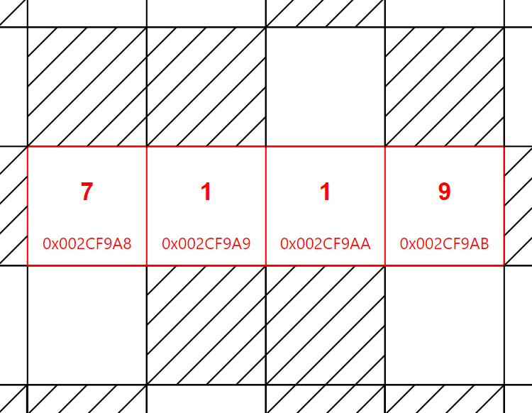
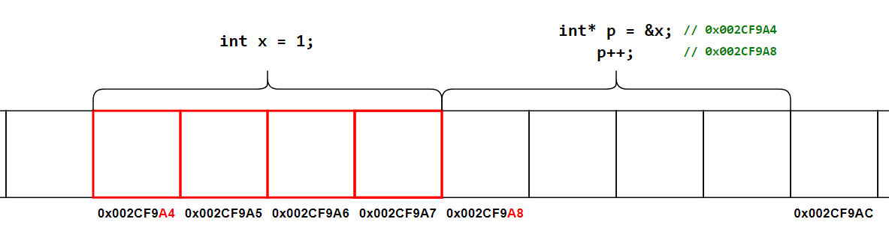
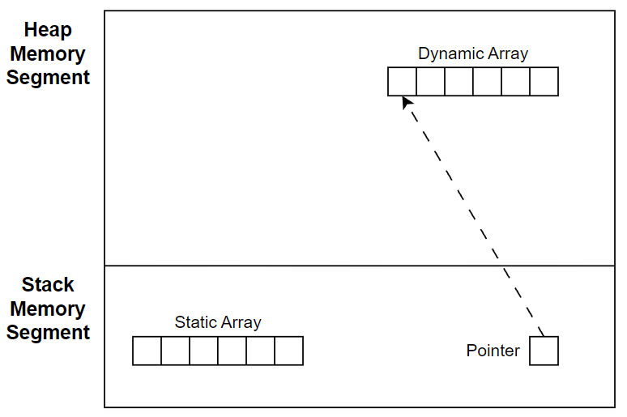
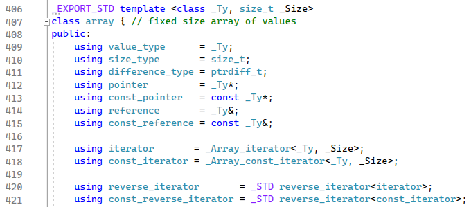
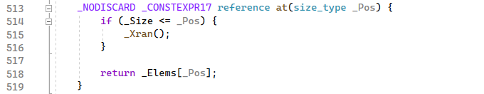
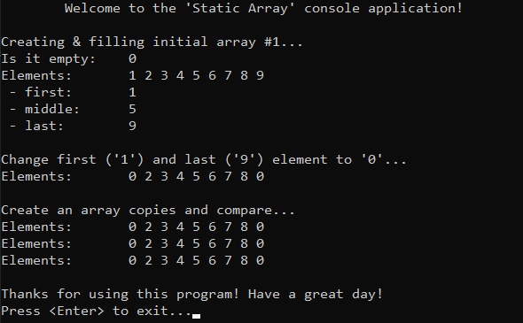

# &#128209; Table of Contents
- [💡 Overview](#-overview)
- [💻 Implementation](#-implementation)
  - [🧍‍♂️ Static Array](#️-static-array)
  - [🚶‍♂️ Dynamic Array](#️-dynamic-array)
- [📊 Analysis](#-analysis)
- [📝 Application](#-application)
- [🕙 Origins](#-origins)
- [🤝 Contributing](#-contributing)
- [📧 Contacts](#-contacts)
- [🙏 Credits](#-credits)
- [🔏 License](#-license)


# &#128161; Overview
The **Array** stands out as one of the most fundamental concept in computer science, that serves as a linear collection of elements. The term array encompasses both a basic data structure in programming language, and an abstract data type (ADT), which involves a representation that defines operations without specifying the implementation details. This subsection explores the last meaning not only to enhance comprehension of its concepts, but also to establish a solid foundation for a more complex algorithmic designs and problem-solving strategies.
<p align="center"></p>

---
**Essential Terminology:**
- **Collection** — is a data structure (or container), which is used to group multiple elements together.
  - **Linear Collection** — is a type of collection, where elements are arranged in linear sequence, i.e. each element has a predecessor and a succressor, except for the first and last elements.
- **Array** — is a linear collection that stores elements of the same data type in contiguous and adjacent memory locations.
  - **Length/Size** — is a number of elements contained in the array.
  - **Capacity** — is the maximum number of possilbe elements for which there is currently allocated memory within array. This term is primarily associated with dynamic arrays because they aim to minimize frequent resize operations by reserving additional space for potential future elements. 
- **Element/Record/Item** — is an individual entity within a collection.
  - **Index/Key of Element** — is an integer value which specifies position of an element within collection. Since elements of an array don't have their unique names, the only way to access them is through their respective indices.
  - **Value/Data of Element** — is an actual information stored within the element. It can be anything from promitive types such as integers to more complex types like instances of classes.


---
**Common Operations for ADT Array:**
- **Traversal** — iterating through the elements of the array.
- **Acess** — retrieving or updating the value of an existing element.
- **Insertion** — adding a new element to the array.
- **Deletion** — removing an element from the array.
- **Search** — locating a specific element within the array.
- **Sorting** — arranging the elements of the array in a specific order.
- **Merging** — combining two arrays into one.
- **Splitting** — dividing the array into two or more parts.
- **Filtering** — selecting specific elements based on certain criteria.

---
One of the most prominent feature of the arrays is that they provide efficient **random (direct) access**. It is mainly possible, because of the fact, that name of an array generates a pointer to the first element of the array (index 0), which results in synergy for address arithmetic and array indexing.
<p align="center"></p>

**Address (Pointer) Arithmetic** — is a concept of manipulating memory addresses using arithmetic operations, which allows for efficient navigation through data structure.
```cpp
int value = 5;
int *ptr = &value; // points onto variable of type 'int'                         >>>   002CF9A4
cout << ptr + 1;   // point onto next value of int (+4 bytes)                          002CF9A8
cout << ptr - 1;   // point onto prev value of int (-4 bytes)                          002CF9A0
```

**Array Indexing** — process of accessing elements within an array, typically achieved internally through address arithmetic.
```cpp
int arr[5] = {7, 8, 2}; // simple static array                value:    7     8    2
cout << array[1];   //  this                                  index:    0     1    2
cout << *(array+1); //  equals to this                   expression: array  a+1  a+2
```

---
Because arrays use single-block memory allocation, any operation that alters their size requires the resource-intensive process of allocating a new array, copying values, and deallocating the previous one. While dynamic arrays address this inefficiency to some extent with their capacity feature, the need to 'move' arrays still exists, albeit less frequently.
<p align="center"></p>

---
When it comes to classification, there are broadly two types of arrays: static and dynamic. While these types share some common ideas, each possesses distinctive characteristics. The choice between them depends on the specific requirements of the case at hand.
<p align="center"></p>

1. **Static Array** — array with a fixed nature, possesses the following properties:
    - memory is allocated on the stack during compile time;
    - automatic memory management;
    - length can not be changed during runtime.

2. **Dynamic Array** — array with a flexible nature, possesses the following properties:
    - memory is allocated on the heap during runtime;
    - manual memory management (potential issues like dangling pointers and memory leaks);
    - length cannot be changed during runtime, but there is a resourceful alternative: creating a new one, copying values, and performing respective memory operations.


# &#x1F4BB; Implementation 
Discussing ADT, it's evident that well-established and widely recognized implementations already exist for both static and dynamic arrays. In the context of C++, `std::array` is a representative of static arrays, and `std::vector` stands as the counterpart for dynamic arrays. It's commonly recommended to rely on these proven implementations rather than reinventing the wheel. However, within the scope of this subsection, we'll take a closer look at simplified versions of these arrays. This exploration is aimed at gaining a deeper understanding of the fundamental concepts that underlie them.


## 🧍‍♂️ Static Array
Keeping its educational aim in mind, the `SA` class developed here closely resembles the behavior of `std::array`, with minor adjustments aimed at emphasizing simplicity and focusing on the core aspects of the data structure.

<p align="center"></p>
One significant simplification is the omission of the iterator classes as a member variables. This decision was made to avoid the complexities associated with navigating the intricate hierarchy of iterator classes and templates found in `std::vector`, allowing to maintain focus on the key features of the ADT.

<p align="center"></p>
Additionally, various types of bounds checking were omitted due to the situational nature of error resolution. As an instance of this omission, one of the ways of element access, known as method `at()` in `std::array` was skipped.

---
<p align="center"></p>

**Detailed Overview:**
1. The `SA` class is declared in `StaticArray.h` header file and defined in `StaticArray.cpp` source file. This approach is adopted to ensure encapsulation, modularity and compilation efficiency. Testing of the class functionalities is conducted within the `main()` function located in the `Main.cpp` file.

2. Whole class declaration:
```cpp
template<class T, int MAX_SIZE>
class SA {
private:
	int _size;
	T _data[MAX_SIZE];

public:
	// Special Member Functions
	SA();
	SA(int size);
	SA(const SA& rhs);
	SA& operator=(const SA& rhs);
	~SA() = default;

	// Element Access
	T& operator[](const int index);
	const T& operator[](const int index) const;
	T& front();
	const T& front() const;
	T& back();
	const T& back() const;

	// Capacity
	bool empty() const;
	int size() const;
};
```

3. Special member functions:
```cpp
// Default constructor
template<class T, int MAX_SIZE>
SA<T, MAX_SIZE>::SA() : _size(0) {
    for (int i = 0; i < MAX_SIZE; ++i)
        _data[i] = 0;
}

// Parameterized constructor, no range check
template<class T, int MAX_SIZE>
SA<T, MAX_SIZE>::SA(int size) : _size(size) {
    for (int i = 0; i < MAX_SIZE; ++i)
        _data[i] = 0;
}

// Shallow copy constructor
template<class T, int MAX_SIZE>
SA<T, MAX_SIZE>::SA(const SA& rhs) : _size(rhs._size) {
    for (int i = 0; i < _size; ++i)
        _data[i] = rhs._data[i];
}

// Shallow copy assignment operator
template<class T, int MAX_SIZE>
SA<T, MAX_SIZE>& SA<T, MAX_SIZE>::operator=(const SA& rhs) {
    // Self-assignment guard
    if (this == &rhs)
        return *this;

    _size = rhs._size;
    for (int i = 0; i < _size; ++i)
        _data[i] = rhs._data[i];

    return *this;
}
```

4. Element access:
```cpp
// Accesses the element at the specified index, no range check, allows modification
template<class T, int MAX_SIZE>
T& SA<T, MAX_SIZE>::operator[](const int index) { return _data[index]; }

// Accesses the element at the specified index, no range check, denies modification
template<class T, int MAX_SIZE>
const T& SA<T, MAX_SIZE>::operator[](const int index) const { return _data[index]; }

// Accesses the first element in the container, no range check, allows modification
template<class T, int MAX_SIZE>
T& SA<T, MAX_SIZE>::front() { return _data[0]; }

// Accesses the first element in the container, no range check, denies modification
template<class T, int MAX_SIZE>
const T& SA<T, MAX_SIZE>::front() const { return 0; }

// Accesses the last element in the container, no range check, allows modification
template<class T, int MAX_SIZE>
T& SA<T, MAX_SIZE>::back() { return _data[_size - 1]; }

// Accesses the last element in the container, no range check, denies modification
template<class T, int MAX_SIZE>
const T& SA<T, MAX_SIZE>::back() const { return 0; }
```

5. Capacity methods:
```cpp
// Checks if the container has no elements
template<class T>
bool DA<T>::empty() const { return (_size == 0); }

// Returns the number of elements in the container
template<class T>
int DA<T>::size() const { return _size; }
```


## 🚶‍♂️ Dynamic Array
Key difference between static and dynamic ADT lies in the implementation of the memory management. The well-known `std::vector` operates on the principle of capacity, meaning:

> The storage of the vector is handled automatically, being expanded as needed. Vectors usually occupy more space than static arrays, because more memory is allocated to handle future growth. This way a vector does not need to reallocate each time an element is inserted, but only when the additional memory is exhausted — cppreference

At first glance, I thought I will just double the capacity each time it requires more for explanatory purposes, but I guess it may lead to misinformation, so I just chosen to implement solely based on the length. Even though it contradics the main principle, it doesn't abstruct to grasp the idea behind other memory management. This resulted in some type of misleading nature of some methods, thus I've placed notes, where it does so. Overall, this implementation has the same minor adjustments as previous type.

---
<p align="center"></p>

**Detailed Overview:**
1. The `DA` class is declared in `DynamicArray.h` header file and defined in `DynamicArray.cpp` source file. This approach is adopted to ensure encapsulation, modularity and compilation efficiency. Testing of the class functionalities is conducted within the `main()` function located in the `Main.cpp` file.

2. Whole class declaration:
```cpp
template<class T>
class DA {
private:
	int _size;
	T* _data;

public:
	// Special Member Functions
	DA();
	DA(int newSize, T newData = T());
	DA(const DA& rhs);
	DA& operator=(const DA& rhs);
	~DA();

	// Element Access
	T& operator[](const int index);
	const T& operator[](const int index) const;
	T& front();
	const T& front() const;
	T& back();
	const T& back() const;

	// Capacity
	bool empty() const;
	int size() const;
	
	// Modifiers
	void pushBack(const T& newData);
	void insert(int index, const T& newData);
	void remove(int index);
	void resize(int newSize);
	void clear();
};
```

3. Special member functions:
```cpp
// Default constructor
template<class T>
DA<T>::DA() : _size(0), _data(nullptr) {}

// Parameterized constructor, no range check
template<class T>
DA<T>::DA(int newSize, T newData) : _size(size) {
    // Allocate memory for new array
    _data = new T[size];

    // Fill with elements
    for (int i = 0; i < size; ++i) {
        _data[i] = newData;
    }
        
}

// Deep copy constructor
template<class T>
DA<T>::DA(const DA& rhs) : _size(rhs._size) {
    if (rhs._data) {
        // Allocate memory for new array
        _data = new T[_size];

        // Copy the elements
        for (int i = 0; i < _size; ++i)
            _data[i] = rhs._data[i];
    }
    else {
        _data = nullptr;
    }
        
}

// Deep copy assignment operator
template<class T>
DA<T>& DA<T>::operator=(const DA& rhs) {
    // Self-assignment guard
    if (this == &rhs)
        return *this;
        
    // Prevent memory leak
    delete[] _data;
    // Set corresponding size
    _size = rhs._size;

    if (rhs._data) {
        // Allocate memory for new array
        _data = new T[_size];

        // Copy the elements
        for (int i = 0; i < _size; ++i)
            _data[i] = rhs._data[i];
    }
    else {
        _data = nullptr;
    }
        
    return *this;
}

// Destructor
template<class T>
DA<T>::~DA() { delete[] _data; }
```

4. Element access:
```cpp
// Accesses the element at the specified index, no range check, allows modification
template<class T>
T& DA<T>::operator[](const int index) { return _data[index]; }

// Accesses the element at the specified index, no range check, denies modification
template<class T>
const T& DA<T>::operator[](const int index) const { return _data[index]; }

// Accesses the first element in the container, no range check, allows modification
template<class T>
T& DA<T>::front() { return _data[0]; }

// Accesses the first element in the container, no range check, denies modification
template<class T>
const T& DA<T>::front() const { return _data[0]; }

// Accesses the last element in the container, no range check, allows modification
template<class T>
T& DA<T>::back() { return _data[_size - 1]; }

// Accesses the last element in the container, no range check, denies modification
template<class T>
const T& DA<T>::back() const { return _data[_size - 1]; }
```

5. Capacity methods:
```cpp
// Checks if the container has no elements
template<class T>
bool DA<T>::empty() const { return (_size == 0); }

// Returns the number of elements in the container
template<class T>
int DA<T>::size() const { return _size; }
```

6. Modifiers:
```cpp
// Appends the given element to the end of the container
// Note: without potential memory-reserving adjustments and bounds checking
template<class T>
void DA<T>::pushBack(const T& newData) {
    // Allocate memory for new array, one element more
    T* newArray = new T[_size + 1];

    // Copy elements
    for (int i = 0; i < _size; ++i)
        newArray[i] = _data[i];

    // Insert the new value at the end
    newArray[_size] = newData;

    // Manage memory and pointers
    delete[] _data; // dealloc
    _data = newArray; // point to new
    ++_size; // reflect change on the size

}

// Inserts elements at the specified position, shifting other elements as needed.
// Note: without potential memory-reserving adjustments and bounds checking
template<class T>
void DA<T>::insert(int index, const T& newData) {
    if (index == _size - 1) {
      pushBack(newData);
    }
    else {
        // Allocate memory for new array, one element more
        T* newArray = new T[_size + 1];

        // Copy elements before the position
        for (int before = 0; before < index; ++before)
            newArray[before] = _data[before];

        // Insert the new value at the specified position
        newArray[index] = newData;

        // Copy elements after the position
        for (int after = index; after < _size; ++after)
            newArray[after + 1] = _data[after];

        // Manage memory and pointers
        delete[] _data; // dealloc
        _data = newArray; // point to new
        ++_size; // reflect change on the size
    }
}

// Removes an element at the specified position
// Note: without potential memory-reserving adjustments and bounds checking
template<class T>
void DA<T>::remove(int index) {
    // Case: one element
    if (_size == 1) {
        clear();
        return;
    }

    // Allocate memory for new array, one element less
    T* newArray = new T[_size - 1];

    // Copy before position
    for (int before = 0; before < index; ++before)
        newArray[before] = _data[before];

    // Copy after position
    for (int after = index + 1; after < _size; ++after)
        newArray[after - 1] = _data[after];

    // Manage memory and pointers
    delete[] _data; // dealloc
    _data = newArray; // point to new
    --_size; // reflect change on the size
}

// Changes the size of an array exactly to the given
// Note: without potential memory-reserving adjustments
template<class T>
void DA<T>::resize(int newSize) {
    // Case: already required size
    if (newSize <= _size) {
        return;
    }

    if (newSize > _size) {
        // Allocate memory for new array
        T* newArray = new T[newSize];

        // Copy the elements
        for (int i = 0; i < _size; ++i)
            newArray[i] = _data[i];

        // Manage memory and pointers
        delete[] _data; // dealloc
        _data = newArray; // point to new
        _size = newSize; // reflect change on the size
    }
}

// Clears the entire content of the dynamic array, freeing memory.
// Note: without potential memory-reserving adjustments
template<class T>
void DA<T>::clear() {
    delete[] _data; // dealloc
    _data = nullptr; // avoid dangling pointer
    _size = 0; // reflect change on the size
}
```


# &#128202; Analysis
**Advantages:**
- **Efficient Random Acess** — arrays facilitate efficient access to the elements within the collection. Regardless of the array's length, accessing elements has a constant time complexity of $(O(1))$.
- **Efficiency Memory Utilization** — as arrays store data in contiguous memory locations, preventing additional memory wastage. Also, ability for the allocation of memory in a single block, reduces memory fragmentation.
- **Convenient Multi-Dimensional Representations** — arrays provide a straightforward and natural way to represent multi-dimensional data structures, especially some type of grids or matries.

---
**Disadvantages:**
- **Allocated Memory is Static** — in scenarios where the size needs adjustments or insertion leads to the shift of other elements, then resourceful operation of creating a new array and copying data arises, e.g. insertion and deletion takes $O(n)$ time.
- **Enourmous Single Block** — allocating a large array can be problematic, especially in systems with limited memory, which potentially can cause a crash.
- **Wasted Space** — if an array is not fully populated, there may be wasted space in the allocated memory. This can be a concern in memory-constrained environments.
- **Out-of-Bound Access** — if an index outside the valid range is used, it can lead to unpredictable behavior or even program crashes.


# &#128221; Application
**Some of the Most Well-Known Use Cases:**
- **Data Storage** — arrays are fundamental for storing collections of data, such as lists of numbers, strings, or objects. They provide a structured and efficient way to organize and access this information.
- **Algorithms and Data Structures** — many algorithms and data structures rely on arrays. Sorting algorithms, searching algorithms, and various data structures like stacks, queues, and hash tables often use arrays as their underlying structure.
- **Image and Signal Processing** — arrays are commonly used to represent images or signals in applications like computer vision and audio processing. The pixel values of an image or the samples of a signal can be stored in arrays.
- **Text Processing** — arrays are extensively used in handling strings and characters. Text processing tasks, like searching, parsing, or manipulating strings, often involve the use of arrays.
- **Matrices and Linear Algebra** — matrices, a specialized form of 2D arrays, are fundamental in linear algebra. They are extensively used in scientific computing, graphics, physics simulations, and machine learning.
- **Database Management** — arrays play a role in managing and processing data within databases. Tabular data, such as rows and columns in a database table, can be represented using arrays.
- **Game Development** — arrays are crucial in game development for managing various game elements, such as characters, items, or terrain data. They provide a structured way to organize and manipulate in-game entities.
- **Embedded Systems** — in embedded systems programming, arrays are often used to manage sensor data, control outputs, or store configuration information due to their simplicity and efficiency.

---
**Common Practical Problems:**
- Reverse the array.
- Find the Kth largest and Kth smallest number in an array.
- Find the occurrence of an integer in the array.
- Subarray with given Sum.
- Find duplicates in an array.
- Find GCD of all elements in an array.
- Finding LCM of an array of numbers.
- Find the missing integer.
- Find the factorial of a large number.
- Minimum number of jumps to reach the end.
- Find whether an array is a subset of another array.
- Maximum Index.
- Coin Change Problem.
- Longest Alternating subsequence.
- Stock buy and sell Problem.
- Move negative elements to front of array.


# &#x1F559; Origins
While early assembly and machine languages offered basic memory management constructs, they lacked the sophisticated abstraction and versatility inherent in arrays found in modern programming languages. Consequently, individuals worldwide independently devised solutions to address this limitation. As a result, the concept of organizing data into ordered sequences has undergone continuous evolution, with no single individual credited for the development of arrays.


# &#129309; Contributing
Contributions are highly appreciated! For detailed guidelines, please refer to the [root directory's contributing section](../../#-contributing).


# &#128231; Contacts
For contact details and additional information, please refer to the [root directory's contact information section](../../#-contacts).


# &#128591; Credits
&#128218; **Books:**
- **"Algorithms in C++, Parts 1-4: Fundamentals, Data Structure, Sorting, Searching" (3rd Edition)** — by Robert Sedgewick
  - Section 3.1: Building Blocks
  - Section 3.2: Arrays
  - Section 4: Abstract Data Types
- **"Data Structures and Algorithm Analysis in C++" (4th Edition)** — by Mark Allen Weiss
  - Section 3.1: Abstract Data Types
  - Section 3.3: `vector` and `list` in the STL
  - Section 3.4: implementation of `vector`
- **"The Algorithm Design Manual" (2nd Edition)** — by Steven S. Skiena
  - Section 3.1: Contiguous vs. Linked Data Structures
- **"The Art of Computer Programming, Volume 1: Fundamental Algorithms" (3rd Edition)** — by Donald Ervin Knuth 
  - Section 2.5: Dynamic Storage Allocation
  - Section 2.6: History and Bibliography

---
&#127891; **Courses:**
- [Mastering Data Structures & Algorithms using C and C++](https://www.udemy.com/course/datastructurescncpp/) on Udemy
   - Section 6: Arrays Representations
   - Section 7: Array ADT
   - Section 9: Matrices
   - Section 10: Sparse Matrix and Polynomial Representation
- [Accelerated Computer Science Fundamentals Specialization](https://www.coursera.org/specializations/cs-fundamentals) from Coursera
   - Course 2.1: Linear Structures

--- 
&#127760; **Web-Resources:**
- [Array (data structure)](https://en.wikipedia.org/wiki/Array_(data_structure)#:~:text=In%20computer%20science%2C%20an%20array,one%20array%20index%20or%20key.) (Wikipedia)
- [Pointer Arithmetic](https://hackingcpp.com/cpp/lang/pointer_arithmetic.html)
- [Array (ADT)](https://brilliant.org/wiki/arrays-adt/#:~:text=The%20array%20is%20a%20basic,types%20like%20instances%20of%20classes.)
- [Difference between Static Arrays and Dynamic Arrays](https://www.geeksforgeeks.org/difference-between-static-arrays-and-dynamic-arrays/)
- [std::array](https://en.cppreference.com/w/cpp/container/array)
- [std::vector](https://en.cppreference.com/w/cpp/container/vector)
- [Applications, Advantages and Disadvantages of Array](https://www.geeksforgeeks.org/applications-advantages-and-disadvantages-of-array-data-structure/)
- [What are the Advantages and Disadvantages of Arrays?](https://www.prepbytes.com/blog/arrays/advantages-and-disadvantages-of-arrays/)
- [List of 50+ Array Coding Interview Problems](https://iq.opengenus.org/list-of-array-problems/)
- [Top 50 Array Coding Problems for Interviews](https://www.geeksforgeeks.org/top-50-array-coding-problems-for-interviews/)


# &#128271; License
This project is licensed under the MIT License — see the [LICENSE](https://github.com/vezzolter/DSA/blob/main/LICENSE) file for details.

[](https://opensource.org/licenses/MIT)