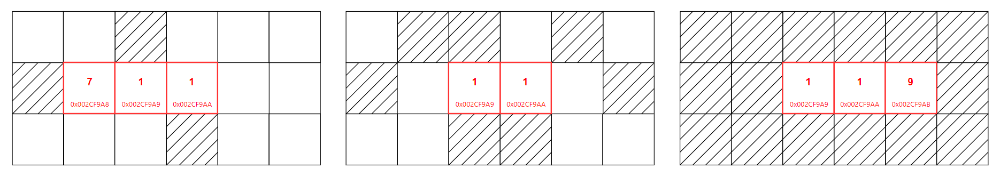

# &#128209; Table of Contents
- [💡 Overview](#-overview)
	- [Introduction](#introduction)
	- [Important Details](#important-details)
	- [Operations](#operations)
- [💻 Implementation](#-implementation)
	- [Design Decisions](#design-decisions)
	- [Iterator Implementation](#iterator-implementation)
	- [Complete Implementation](#complete-implementation)
	- [Detailed Walkthrough](#detailed-walkthrough)
- [📊 Analysis](#-analysis)
	- [Characteristics](#characteristics)
	- [Advantages](#advantages)
	- [Disadvantages](#disadvantages)
- [📝 Application](#-application)
	- [Common Use Cases](#common-use-cases)
	- [Some Practical Problems](#some-practical-problems)
- [🕙 Origins](#-origins)
- [🤝 Contributing](#-contributing)
- [📧 Contacts](#-contacts)
- [🙏 Credits](#-credits)
- [🔏 License](#-license)

# &#128161; Overview
**Dynamic array** is an implementation of an array where the size is dynamic, meaning it can be changed during runtime. Its name comes from this characteristic. Knowledge and understanding of it lay a solid foundation in designing data structures and optimizing their application.

## Important Details
1. **Size (Dynamic)** — dynamic array can't change its size in a direct way, instead it creates a new array of the required size, copies the values, and adjusts memory allocation. Since this process involves multiple operations, dynamic arrays leverage the concept of capacity to minimize the need for frequent resizing.
2. **Capacity** — dynamic array includes a feature called capacity, which refers to the maximum number of possible elements for which memory is currently allocated within array.
3. **Time for Allocation (Runtime)** — dynamic array doesn't require knowing size at its creation, meaning its size can be based on values that are not known during compilation.
4. **Place for Allocation (Heap)** — dynamic array is allocated in the heap memory section, meaning size can be extremely large compared to the stack and provided there is enough available memory.
5. **Memory Management (Manual)** — dynamic array requires manual memory management, meaning you must handle allocation and deallocation yourself, which introduces risks such as dangling pointers or memory leaks, if not properly managed.

## Operations
Currently in Progress...

# &#x1F4BB; Implementation 
Currently in Progress...

## Design Decisions
Currently in Progress...

## Iterator Implementation
Currently in Progress...

## Complete Implementation
Currently in Progress...

## Detailed Walkthrough
Currently in Progress...

# &#128202; Analysis
Currently in Progress...

## Characteristics
Currently in Progress...

## Advantages
Currently in Progress...

## Disadvantages
Currently in Progress...

# &#128221; Application
Understanding some of the most well-known use cases of a data structure is crucial for grasping its practical relevance and potential impact in real-world scenarios. Additionally, familiarizing oneself with common practical problems and practicing their solutions ensures that you remember the essential details and develop a deep, intuitive understanding of the functionality and limitations.

## Common Use Cases
Since dynamic arrays share the foundational principles of the general concept of arrays, their common use cases is best described in the [arrays respective section](../Array.md#-application).

## Some Practical Problems
Since dynamic arrays share the foundational principles of the general concept of arrays, their common problems is best described in the [arrays respective section](../Array.md#-application).

# &#x1F559; Origins
Since dynamic arrays share the foundational principles of the general concept of arrays, their historical development is best described in the [arrays origins section](../Array.md#-origins).

# &#129309; Contributing
Contributions are highly appreciated! For detailed guidelines, please refer to the [root directory's contributing section](../../../#-contributing).

# &#128231; Contacts
For contact details and additional information, please refer to the [root directory's contact information section](../../../#-contacts).

# &#128591; Credits
Currently in Progress...

# &#128271; License
This project is licensed under the MIT License — see the [LICENSE](https://github.com/vezzolter/DSA/blob/main/LICENSE) file for details.

