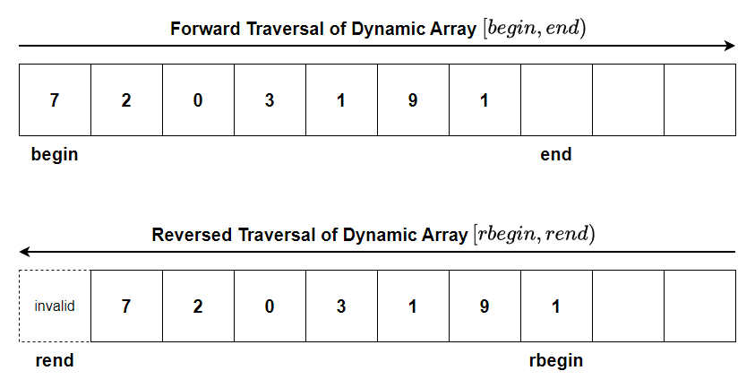
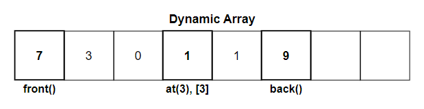
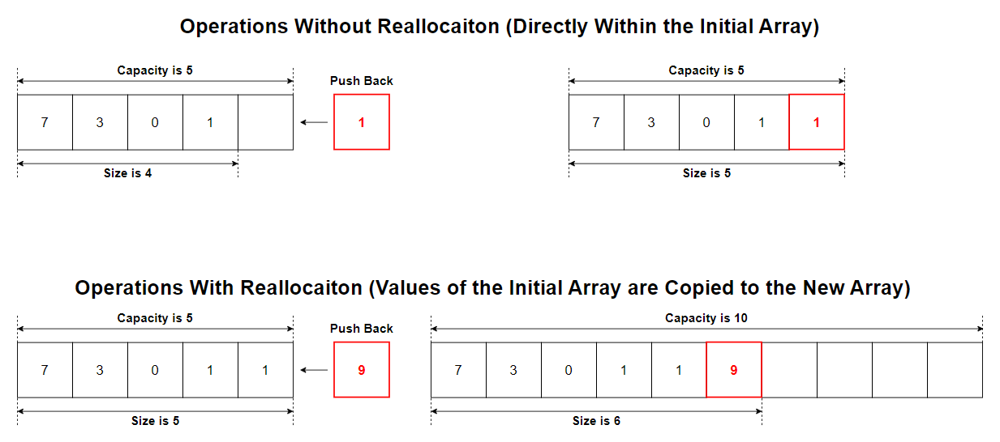
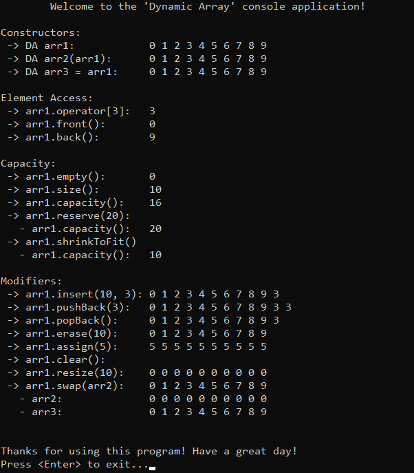

# &#128209; Table of Contents
- [💡 Overview](#-overview)
	- [Important Details](#important-details)
	- [Container Methods](#container-methods)
- [💻 Implementation](#-implementation)
	- [Design Decisions](#design-decisions)
	- [Iterator Implementation](#iterator-implementation)
	- [Container Implementation](#container-implementation)
- [📊 Analysis](#-analysis)
	- [Characteristics](#characteristics)
	- [Trade-Offs](#trade-offs)
- [📝 Application](#-application)
	- [Common Use Cases](#common-use-cases)
	- [Some Practical Problems](#some-practical-problems)
- [🕙 Origins](#-origins)
- [🤝 Contributing](#-contributing)
- [📧 Contacts](#-contacts)
- [🙏 Credits](#-credits)
- [🔏 License](#-license)

# &#128161; Overview
**Dynamic array** is an implementation of an array where the size is dynamic, meaning it can be changed during runtime. Its name comes from this fact. Knowledge and understanding of it lay a solid foundation in designing data structures and optimizing their application.

## Important Details
1. **Size (Dynamic)** — dynamic array can't change its size in a direct way, instead it creates a new array of the required size, copies the values, and adjusts memory allocation. Since this process involves multiple operations, dynamic arrays leverage the concept of capacity to minimize the need for frequent resizing.
2. **Capacity** — dynamic arrays include a feature called capacity, which refers to the maximum number of elements for which memory is currently allocated, as opposed to the size, which is the actual number of elements in the array. Dynamic arrays allocate additional memory beyond the current size to accommodate future growth without needing to resize frequently, and if a resize occurs, typically it doubles the capacity..
3. **Time for Allocation (Runtime)** — dynamic array doesn't require knowing size at its creation, meaning its size can be based on values that are not known during compilation.
4. **Place for Allocation (Heap)** — dynamic array is allocated in the heap memory section, meaning size can be extremely large compared to the stack and provided there is enough available memory.
5. **Memory Management (Manual)** — dynamic array requires manual memory management, meaning you must handle allocation and deallocation yourself, which introduces risks such as dangling pointers or memory leaks, if not properly managed.
6. **Speed of Allocation (Slow)** — dynamic array's allocation on heap is generally slower than allocating on the stack, because it requires more operations and resources to manage memory.

## Container Methods
When working with dynamic array, it's important to note that there is no universal standard defining a strict list of operations or guidelines for how they should be implemented. The design and functionality of a container can vary depending on several factors, such as the programming language, the purpose of the library, performance considerations, etc. Despite these variations, there are still common operations found across most implementations, typically derived from the fundamental needs of data manipulation, like accessing, modifying, or iterating over elements. Since this repository is dedicated to C++, the operations provided will closely resemble those found in `std::vector`.

---
**Compiler Generated:**
- **Default Constructor** — creates a new array: for primitive data types allocates space without initializing, for complex data types calls their corresponding constructors.
- **Copy Constructor** — creates a new array by copying elements from another array.
- **Move Constructor** — creates a new array by moving elements from another array, leaving the original array in a valid, but unspecified state. This avoids the overhead of copying and instead merely shifts the ownership of the memory.
- **Copy Assignment Operator** — overwrites every element of already existing array with the corresponding element of another array by copying them.
- **Move Assignment Operator** — overwrites every element of already existing array with the corresponding element of another array by moving them, leaving the original array in a valid, but unspecified state. This avoids the overhead of copying and instead merely shifts the ownership of the memory.
- **Destructor** — performs end-actions on array: for primitive data types does nothing because they don't hold resources that need to be explicitly cleaned up, for complex data types calls the corresponding destructors.

---

**Iterators:**
- `begin`, `cbegin` — returns an iterator (or constant iterator) to the first element.
- `end`, `cend` — returns an iterator (or constant iterator) to the position one past the last element, making range $[begin, end)$ easy for traversal.
- `rbegin`, `crbegin` — returns an iterator (or constant one) to the last element.
- `rend`, `crend` — returns an iterator (or constant one) to the position one before the first element, making range $[rend, rbegin)$ easy for traversal.

---

**Element Access:**
- `at()` — returns specified element with bounds checking; if element is not within the range of the container, throws an exception.
- `operator[]` — returns specified element without bounds checking; accessing a nonexistent element through this operator is undefined behavior.
- `front()` — returns the first element in the container; calling on an empty container causes undefined behavior.
- `back()` — returns the last element in the container; calling on an empty container causes undefined behavior.

---
**Capacity:**
- `empty()` — returns `true` if container is empty, otherwise `false`.
- `size()` — returns the number of elements in the container; basically distance from begin to end.
- `maxSize()` — returns the maximum number of elements the container is able to hold.
- `capacity()` — returns the number of elements that can be held in currently allocated storage.
- `reserve()` — increases the capacity of the array to a value that's greater or equal to given capacity; if given capacity is greater than current, new storage is allocated, otherwise does nothing.
- `shrinkToFit()` — reduces the capacity to the size of an array

---

**Modifiers:**
- `assign()` — assigns the given value to the elements.
- `swap()` — exchanges the contents of the container with other given container; doesn't cause iterators and references to associate with the other container.
- `clear()` — erases all elements from the container; invalidates any references, pointers, and iterators referring to contained elements; doesn't change capacity.
- `insert()` — inserts elements at the specified location in the container; if after the operations size is greater than capacity a reallocations takes place.
- `erase()` — erases the specified elements from the container. 
- `pushBack()` — appends the given element to the end of the container; if after the operations size is greater than capacity a reallocations takes place.
- `popBack()` — removes the last element of the container; calling on an empty container causes undefined behavior.
- `resize()` — resizes the container to contain given amount of elements; if given amount equals to size, does nothing; if given amount is less than size, the container is reduced to its first given elements; if given amount is greater, additional default (or specified) elements are appended.

# &#x1F4BB; Implementation 
The implemented console application demonstrates the basic functionality of the dynamic array by performing various operations and interactions with it. The program provides a clear view of changes made during usage, displaying the state of the data at different stages to illustrate its simplified behavior and characteristics.

## Design Decisions
To prioritize simplicity and emphasize data structure itself, several design decisions were made:
- Resembling the behavior of `std::vector` to provide familiarity for users.
- Restricting the implementation to the `int` data type to avoid the use of templates.
- Omitting cases where the container (object itself) is created on the heap.
- Implementing only regular iterator (no reverse, no const).
- Doubling the capacity whenever reallocation occurs.
- Avoiding any exception handling, thus range checks.
- Omitting certain optimizations to the container.

## Iterator Implementation
Currently in Progress...

## Container Implementation
Currently in Progress...

# &#128202; Analysis
Understanding how to analyze the particular container is crucial for optimizing performance and ensuring efficient resource utilization within the constraints of the given environment. Additionally, knowing its strengths and weaknesses allows for more informed decisions, helping to select the most suitable container for a given problem among similar options.

## Characteristics
🚀 **Time Complexities:** 
 - **Access** $O(1)$ — because the address can be computed directly for any position, without needing to traverse the collection.
 - **Insertion:**
   - **Beginning** $O(n)$ — because to insert a new element, all existing elements must be shifted one position to the right to make space.
   - **Middle** $O(n)$ — because inserting a new element requires shifting all elements from the insertion point onwards one position to the right.
   - **End** $O(1) / O(n)$ — because if there is available capacity, adding an element is a simple operation of assigning a value. However, if the array is full, a new array must be allocated, and all existing elements need to be copied.
 - **Deletion:**
   - **Beginning** $O(n)$ — because removing the first element requires shifting all remaining elements one position to the left to fill the gap.
   - **Middle** $O(n)$ — because removing an element from the middle requires shifting all elements after the deletion point one position to the left.
   - **End** $O(1)$ — because deleting the last element is a simple operation that doesn't require any shifting, making it a constant-time operation.
 - **Other** — while more operations exist, they are generally not considered core functionalities to pick a container for.

---
🧠 **Space Expenses:**
- **Extra Memory for Capacity** — dynamic arrays allocate additional memory beyond the current number of elements to accommodate future growth, resulting in unused capacity.
- **Duplication During Resizing** — when resizing is required, a new array is allocated, and all elements are copied over, causing temporary duplication of memory while both the old and new arrays coexist.

## Trade-Offs
➕ **Advantages:**
- **Efficient Random Access** — dynamic arrays facilitate efficient access to the elements within the collection. Regardless of the array's length, accessing elements has a constant time complexity.
- **Efficient Memory Utilization** — dynamic arrays store data in contiguous memory locations, preventing additional memory wastage for tracking elements. Also, ability for the allocation of memory in a single block, reduces memory fragmentation.
- **Scalable Size** — dynamic arrays can grow or shrink as needed, making them more flexible for situations where the amount of data is not known ahead of time. This ensures efficient memory use without preallocating excess space.
- **Multi-Dimensional Representations** — static arrays provide a straightforward and natural way to represent multi-dimensional data structures, especially some type of grids or matrices.

---
➖ **Disadvantages:**
- **Not Really Flexible** — dynamic arrays provide efficient access to elements, allowing constant time complexity for accessing any element, regardless of the array’s length.
- **Enormous Single Block** — dynamic arrays with large size can be problematic to allocate due to contiguous memory locations, which potentially can cause a crash.
- **Wasted Space** — dynamic arrays that are not not fully populated, may leave lots of memory unused.
- **Out-of-Bound Access** — dynamic arrays make it easy to miscalculate an index, leading to access outside the valid range and causing undefined behavior.

# &#128221; Application
Understanding some of the most well-known use cases of a container is crucial for grasping its practical relevance and potential impact in real-world scenarios. Additionally, familiarizing oneself with common practical problems and practicing their solutions ensures that you remember the essential details and develop a deep, intuitive understanding of the functionality and limitations.

## Common Use Cases
As mentioned in the [Array.md](https://github.com/vezzolter/DSA/blob/split-array/DataStructures/Array/Array.md), the concrete use cases (and anti use cases) directly derive from the advantages (and disadvantages) of the container, so there is no need for this sort of rephrasing. Since dynamic arrays share the foundational principles of the general concept of arrays, their common usage is best described in the [arrays respective section](../Array.md#-application).

## Some Practical Problems
Since dynamic arrays share the foundational principles of the general concept of arrays, their common problems is best described in the [arrays respective section](../Array.md#-application).

# &#x1F559; Origins
Since dynamic arrays share the foundational principles of the general concept of arrays, their historical development is best described in the [arrays origins section](../Array.md#-origins).

# &#129309; Contributing
Contributions are highly appreciated! For detailed guidelines, please refer to the [root directory's contributing section](../../../#-contributing).

# &#128231; Contacts
For contact details and additional information, please refer to the [root directory's contact information section](../../../#-contacts).

# &#128591; Credits
Dynamic arrays share the foundational principles of the general concept of arrays, the resources that contributed to their understanding are best described in the [arrays credits section](../Array.md#-credits).

# &#128271; License
This project is licensed under the MIT License — see the [LICENSE](https://github.com/vezzolter/DSA/blob/main/LICENSE) file for details.

