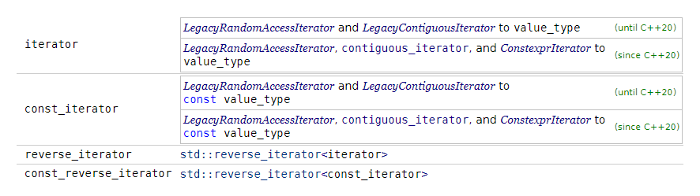

# &#128209; Table of Contents
- [💡 Overview](#-overview)
	- [Important Details](#important-details)
	- [Container Methods](#container-methods)
- [💻 Implementation](#-implementation)
	- [Design Decisions](#design-decisions)
	- [Container Implementation](#container-implementation)
	- [Iterators Implementations](#iterators-implementations)
- [📊 Analysis](#-analysis)
	- [Characteristics](#characteristics)
	- [Trade-Offs](#trade-offs)
- [📝 Application](#-application)
	- [Common Use Cases](#common-use-cases)
	- [Some Practical Problems](#some-practical-problems)
- [🕙 Origins](#-origins)
- [🤝 Contributing](#-contributing)
- [📧 Contacts](#-contacts)
- [🙏 Credits](#-credits)
- [🔏 License](#-license)


# &#128161; Overview
**Dynamic array** is an implementation of an array where the size is dynamic, meaning it can be changed during runtime. Its name comes from this fact. Knowledge and understanding of it lay a solid foundation in designing data structures and optimizing their application.
<p align="center"></p>


## Important Details
1. **Size (Dynamic)** — dynamic array can't change its size in a direct way, instead it creates a new array of the required size, copies the values, and adjusts memory allocation. Since this process involves multiple operations, dynamic arrays leverage the concept of capacity to minimize the need for frequent resizing.

2. **Capacity** — dynamic arrays include a feature called capacity, which refers to the maximum number of elements for which memory is currently allocated, as opposed to the size, which is the actual number of elements in the array. Dynamic arrays allocate additional memory beyond the current size to accommodate future growth without needing to resize frequently, and if a resize occurs, typically it doubles the capacity.

3. **Time for Allocation (Runtime)** — dynamic array doesn't require knowing size at its creation, meaning its size can be based on values that are not known during compilation.

4. **Place for Allocation (Heap)** — dynamic array is allocated in the heap memory section, meaning size can be extremely large compared to the stack and provided there is enough available memory.

5. **Memory Management (Manual)** — dynamic array requires manual memory management, meaning you must handle allocation and deallocation yourself, which introduces risks such as dangling pointers or memory leaks, if not properly managed.

6. **Speed of Allocation (Slow)** — dynamic array's allocation on heap is generally slower than allocating on the stack, because it requires more operations and resources to manage memory.


## Container Methods
When working with dynamic array, it's important to note that there is no universal standard defining a strict list of operations or guidelines for how they should be implemented. The design and functionality of a container can vary depending on several factors, such as the programming language, the purpose of the library, performance considerations, etc. Despite these variations, there are still common operations found across most implementations, typically derived from the fundamental needs of data manipulation, like accessing, modifying, or iterating over elements. Since this repository is dedicated to C++, the operations provided will closely resemble those found in `std::vector`.

---
**Compiler Generated:**
- `Default Constructor` — creates a new array: for primitive data types allocates space without initializing, for complex data types calls their corresponding constructors.
- `Copy Constructor` — creates a new array by copying elements from another array.
- `Move Constructor` — creates a new array by moving elements from another array, leaving the original array in a valid, but unspecified state. This avoids the overhead of copying and instead merely shifts the ownership of the memory.
- `Copy Assignment Operator` — overwrites every element of already existing array with the corresponding element of another array by copying them.
- `Move Assignment Operator` — overwrites every element of already existing array with the corresponding element of another array by moving them, leaving the original array in a valid, but unspecified state. This avoids the overhead of copying and instead merely shifts the ownership of the memory.
- `Destructor` — performs end-actions on array: deallocates all elements in the array, calling destructors for complex data types to ensure resources are cleaned up.

---
<p align="center"></p>

**Iterators:**
- `begin`, `cbegin` — returns an iterator (or constant iterator) to the first element.
- `end`, `cend` — returns an iterator (or constant iterator) to the position one past the last element, making range $[begin, end)$ easy for traversal.
- `rbegin`, `crbegin` — returns an iterator (or constant one) to the last element.
- `rend`, `crend` — returns an iterator (or constant one) to the position one before the first element, making range $[rend, rbegin)$ easy for traversal.

---
<p align="center"></p>

**Element Access:**
- `at()` — returns specified element with bounds checking; if element is not within the range of the container, throws an exception.
- `operator[]` — returns specified element without bounds checking; accessing a nonexistent element through this operator is undefined behavior.
- `front()` — returns the first element in the container; calling on an empty container causes undefined behavior.
- `back()` — returns the last element in the container; calling on an empty container causes undefined behavior.

---
**Capacity:**
- `empty()` — returns `true` if container is empty, otherwise `false`.
- `size()` — returns the number of elements in the container; basically distance from begin to end.
- `maxSize()` — returns the maximum number of elements the container is able to hold theoretically, if all available memory were dedicated to that single container.
- `capacity()` — returns the number of elements that can be held in currently allocated storage.
- `reserve()` — increases the capacity of the array to a value that's greater or equal to given capacity; if given capacity is greater than current, new storage is allocated, otherwise does nothing.
- `shrinkToFit()` — reduces the capacity to the size of an array

---
<p align="center"></p>

**Modifiers:**
- `insert()` — inserts elements at the specified location in the container; if after the operations size is greater than capacity a reallocations takes place.
- `erase()` — erases the specified elements from the container. 
- `pushBack()` — appends the given element to the end of the container; if after the operations size is greater than capacity a reallocations takes place.
- `popBack()` — removes the last element of the container; calling on an empty container causes undefined behavior.
- `assign()` — assigns the given value to the elements; any previous values will be replaced; invalidates any references, pointers, and iterators referring to contained elements.
- `clear()` — erases all elements from the container; invalidates any references, pointers, and iterators referring to contained elements; doesn't change capacity.
- `resize()` — resizes the container to contain given amount of elements; if given amount equals to size, does nothing; if given amount is less than size, the container is reduced to its first given elements; if given amount is greater, additional default (or specified) elements are appended.
- `swap()` — exchanges the contents of the container with other given container; doesn't cause iterators and references to associate with the other container.

# &#x1F4BB; Implementation 
The implemented console application demonstrates the basic functionality of the dynamic array by performing various operations and interactions with it. The program provides a clear view of changes made during usage, displaying the state of the data at different stages to illustrate its simplified behavior and characteristics.
<p align="center"></p>


## Design Decisions
To prioritize simplicity and emphasize data structure itself, several design decisions were made:
- Resembling the behavior of `std::vector` to provide familiarity for users.
- Doubling the capacity whenever reallocation occurs.
- Implementing only regular and const iterators (no reverse).
- Restricting the implementation to the `int` data type to avoid the use of templates.
- Omitting cases where the container (object itself) is created on the heap.
- Excluding move semantics to keep the focus on fundamental mechanics.
- Relying on manual memory management without using smart pointers.
- Avoiding any exception handling, thus certain range validations.
- Omitting certain possible optimizations to the container.


## Container Implementation
The container is implemented within the `DA` class, which is declared in [DynamicArray.h](https://github.com/vezzolter/DSA/blob/main/DataStructures/Array/DynamicArray/Include/DynamicArray.h) header file and defined in [DynamicArray.cpp](https://github.com/vezzolter/DSA/blob/main/DataStructures/Array/DynamicArray/Source/DynamicArray.cpp) source file. This approach is adopted to ensure encapsulation, modularity and compilation efficiency. To see the container's functionality in action, you can examine the `main()` function located in the [Main.cpp](https://github.com/vezzolter/DSA/blob/main/DataStructures/Array/DynamicArray/Source/Main.cpp) file. The full implementation can be found in the corresponding files, while the class declaration below offers a quick overview:

```cpp
class DA {
private:
	int _size;
	int _capacity;
	int* _data;

public:
	// --------------------
	//  Compiler Generated
	// --------------------
	DA();
	DA(int size);
	DA(int size, int data);
	DA(const DA& other);
	DA(const DA&& other)          = delete;
	DA& operator=(const DA& rhs);
	DA& operator=(const DA&& rhs) = delete;
	~DA();

	// -----------
	//  Iterators
	// -----------
	class Iterator;
	using iterator = Iterator;
	iterator begin();
	iterator end();
	class ConstIterator;
	using const_iterator = ConstIterator;
	const_iterator cbegin() const;
	const_iterator cend() const;

	// ----------------
	//  Element Access
	// ----------------
	int& operator[](const int pos);
	const int& operator[](const int pos) const;
	int& front();
	const int& front() const;
	int& back();
	const int& back() const;

	// ----------
	//  Capacity
	// ----------
	bool empty() const;
	int size() const;
	int capacity() const;
	void reserve(int cap);
	void shrinkToFit();
	
	// -----------
	//  Modifiers
	// -----------
	void insert(int pos, const int& data);
	void erase(int pos);
	void pushBack(const int& data);
	void popBack();
	void assign(int size, const int& val);
	void assign(Iterator first, Iterator last);
	void clear();
	void resize(int size, const int& val = 0);
	void swap(DA& other);
};
```


## Iterators Implementations
Since there are various types of iterators that can be implemented (e.g. the image below shows the iterators for `std::vector`), it's common practice to define them in separate classes and files. However, despite being implemented separately, their underlying principles are usually similar, with only slight adjustments for specific purposes. To keep things simpler and avoid cluttering the core concepts, this container implements regular and constant iterator classes. Those iterators cover the basic $[begin, end)$ range and demonstrates how typical iterators operations are handled, as well as how the iterators classes are integrated into the dynamic array container.
<p align="center"></p>

---
The `Iterator` class is defined as a public nested class within the `DA` container. This design makes `Iterator` accessible to users, enabling them to traverse and interact with array elements directly. Given the simplicity of the `Iterator` class, its functions are defined inline within the container's header file.

```cpp
class DA::Iterator {
private:
	int* _ptr = nullptr;

public:
	// --------------------
	//  Compiler Generated
	// --------------------

	Iterator()                               = default;
	Iterator(int* ptr) : _ptr(ptr) {}
	Iterator(const Iterator& other)          = default;
	Iterator(Iterator&& other)               = default;
	Iterator& operator=(const Iterator& rhs) = default;
	Iterator& operator=(Iterator&& rhs)      = default;
	~Iterator()                              = default;

	// ----------------------
	//  Overloaded Operators
	// ----------------------

	// Returns a reference to the element pointed to by the iterator
	int& operator*() { return *_ptr; }

	// Advances the iterator to the next element (pre-increment)
	Iterator& operator++() {
		++_ptr;
		return *this;
	}

	// Advances the iterator to the next element, returning the previous state
	Iterator operator++(int) {
		Iterator temp(*this);
		++_ptr;
		return temp;
	}

	// Moves the iterator to the previous element (pre-decrement)
	Iterator& operator--() {
		--_ptr;
		return *this;
	}

	// Moves the iterator to the previous element, returning the previous state
	Iterator operator--(int) {
		Iterator temp(*this);
		--_ptr;
		return temp;
	}

	// Returns true if two iterators point to the same element
	friend bool operator==(const Iterator& lhs, const Iterator& rhs) {
		return lhs._ptr == rhs._ptr;
	}

	// Returns true if two iterators point to different elements
	friend bool operator!=(const Iterator& lhs, const Iterator& rhs) {
		return lhs._ptr != rhs._ptr;
	}
};
```

---
The `ConstIterator` class is defined as a public nested class within the `DA` container. This design makes `ConstIterator` accessible to users, enabling them to traverse and interact with array elements directly. Given the simplicity of the `ConstIterator` class, its functions are defined inline within the container's header file.

```cpp
class DA::ConstIterator {
private:
	const int* _ptr = nullptr;

public:
	// --------------------
	//  Compiler Generated
	// --------------------

	ConstIterator()                                    = default;
	ConstIterator(const int* ptr) : _ptr(ptr) {}
	ConstIterator(const ConstIterator& other)          = default;
	ConstIterator(ConstIterator&& other)               = default;
	ConstIterator& operator=(const ConstIterator& rhs) = default;
	ConstIterator& operator=(ConstIterator&& rhs)      = default;
	~ConstIterator()                                   = default;

	// ----------------------
	//  Overloaded Operators
	// ----------------------
	
	// Returns a const reference to the element pointed to by the iterator
	const int& operator*() { return *_ptr; }

	// Advances the iterator to the next element (pre-increment)
	ConstIterator& operator++() {
		++_ptr;
		return *this;
	}

	// Advances the iterator to the next element, returning the previous state
	ConstIterator operator++(int) {
		ConstIterator temp(*this);
		++_ptr;
		return temp;
	}

	// Moves the iterator to the previous element (pre-decrement)
	ConstIterator& operator--() {
		--_ptr;
		return *this;
	}

	// Moves the iterator to the previous element, returning the previous state
	ConstIterator operator--(int) {
		ConstIterator temp(*this);
		--_ptr;
		return temp;
	}

	// Returns true if two iterators point to the same element
	friend bool operator==(const ConstIterator& lhs, const ConstIterator& rhs) {
		return lhs._ptr == rhs._ptr;
	}

	// Returns true if two iterators point to different elements
	friend bool operator!=(const ConstIterator& lhs, const ConstIterator& rhs) {
		return lhs._ptr != rhs._ptr;
	}
};
```


# &#128202; Analysis
Understanding how to analyze the particular container is crucial for optimizing performance and ensuring efficient resource utilization within the constraints of the given environment. Additionally, knowing its strengths and weaknesses allows for more informed decisions, helping to select the most suitable container for a given problem among similar options.


## Characteristics
🚀 **Time Complexities:** 
 - **Access** $O(1)$ — because the address can be computed directly for any position, without needing to traverse the collection.
 - **Insertion:**
   - **Beginning** $O(n)$ — because to insert a new element, all existing elements must be shifted one position to the right to make space.
   - **Middle** $O(n)$ — because inserting a new element requires shifting all elements from the insertion point onwards one position to the right.
   - **End** $O(1) / O(n)$ — because if there is available capacity, adding an element is a simple operation of assigning a value. However, if the array is full, a new array must be allocated, and all existing elements need to be copied.
 - **Deletion:**
   - **Beginning** $O(n)$ — because removing the first element requires shifting all remaining elements one position to the left to fill the gap.
   - **Middle** $O(n)$ — because removing an element from the middle requires shifting all elements after the deletion point one position to the left.
   - **End** $O(1)$ — because deleting the last element is a simple operation that doesn't require any shifting, making it a constant-time operation.
- **Other** — while additional operations exist, they are generally not considered core functionalities for container selection.

---
🧠 **Space Expenses:**
- **Extra Memory for Capacity** — dynamic arrays allocate additional memory beyond the current number of elements to accommodate future growth, resulting in unused capacity.
- **Duplication During Resizing** — when resizing is required, a new array is allocated, and all elements are copied over, causing temporary duplication of memory while both the old and new arrays coexist.


## Trade-Offs
➕ **Advantages:**
- **Efficient Random Access** — dynamic arrays facilitate efficient access to the elements within the collection. Regardless of the array's length, accessing elements has a constant time complexity.
- **Efficient Memory Utilization** — dynamic arrays store data in contiguous memory locations, preventing additional memory wastage for tracking elements.
- **Reduced Memory Fragmentation** — dynamic arrays allocate memory in a single continuous block, minimizing the risk of memory fragmentation that can occur with multiple small allocations across different memory locations.
- **Scalable Size Blocks** — dynamic arrays can grow or shrink as needed, making them more flexible for situations where the amount of data is not known ahead of time. This ensures efficient memory use without preallocating excess space.

---
➖ **Disadvantages:**
- **Enormous Single Block** — dynamic arrays with large size can be problematic to allocate due to contiguous memory locations, which potentially can cause a crash.
- **Unused Space** — dynamic arrays that are not not fully populated, may leave lots of memory unused.
- **Out-of-Bound Access** — dynamic arrays make it easy to miscalculate an index, leading to access outside the valid range and causing undefined behavior.


# &#128221; Application
Understanding some of the most well-known use cases of a container is crucial for grasping its practical relevance and potential impact in real-world scenarios. Additionally, familiarizing oneself with common practical problems and practicing their solutions ensures that you remember the essential details and develop a deep, intuitive understanding of the functionality and limitations.


## Common Use Cases
As mentioned in the [Array.md](https://github.com/vezzolter/DSA/blob/main/DataStructures/Array/Array.md), the concrete use cases (and anti use cases) directly derive from the advantages (and disadvantages) of the container, so there is no need for this sort of rephrasing. Since dynamic arrays share the foundational principles of the general concept of arrays, their common usage is best described in the [arrays respective section](../Array.md#-application).


## Some Practical Problems
Since dynamic arrays share the foundational principles of the general concept of arrays, their common problems is best described in the [arrays respective section](../Array.md#-application).


# &#x1F559; Origins
Since dynamic arrays share the foundational principles of the general concept of arrays, their historical development is best described in the [arrays origins section](../Array.md#-origins).


# &#129309; Contributing
Contributions are highly appreciated! For detailed guidelines, please refer to the [root directory's contributing section](../../../#-contributing).


# &#128231; Contacts
For contact details and additional information, please refer to the [root directory's contact information section](../../../#-contacts).


# &#128591; Credits
Dynamic arrays share the foundational principles of the general concept of arrays, the resources that contributed to their understanding are best described in the [arrays credits section](../Array.md#-credits).


# &#128271; License
This project is licensed under the MIT License — see the [LICENSE](https://github.com/vezzolter/DSA/blob/main/LICENSE) file for details.

[](https://opensource.org/licenses/MIT)