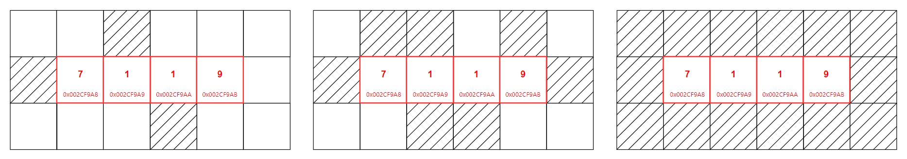

# &#128209; Table of Contents
- [💡 Overview](#-overview)
	- [Introduction](#introduction)
	- [Important Details](#important-details)
	- [Operations](#operations)
- [💻 Implementation](#-implementation)
	- [Design Decisions](#design-decisions)
	- [Iterator Implementation](#iterator-implementation)
	- [Complete Implementation](#complete-implementation)
	- [Detailed Walkthrough](#detailed-walkthrough)
- [📊 Analysis](#-analysis)
	- [Characteristics](#characteristics)
	- [Advantages](#advantages)
	- [Disadvantages](#disadvantages)
- [📝 Application](#-application)
	- [Common Use Cases](#common-use-cases)
	- [Some Practical Problems](#some-practical-problems)
- [🕙 Origins](#-origins)
- [🤝 Contributing](#-contributing)
- [📧 Contacts](#-contacts)
- [🙏 Credits](#-credits)
- [🔏 License](#-license)

# &#128161; Overview
**Static array** is a fixed-size implementation of an array, used when the number of elements is known ahead of time, and memory efficiency is important. The name comes from its fixed size, meaning the size is determined at the time of creation and cannot be changed during runtime. Knowledge and understanding of it lay a solid foundation in designing data structures and optimizing their application.

## Introduction
Currently in Progress...

## Important Details
Currently in Progress...

## Operations
Currently in Progress...

# &#x1F4BB; Implementation 
Currently in Progress...

## Design Decisions
Currently in Progress...

## Iterator Implementation
Currently in Progress...

## Complete Implementation
Currently in Progress...

## Detailed Walkthrough
Currently in Progress...

# &#128202; Analysis
Currently in Progress...

## Characteristics
Currently in Progress...

## Advantages
Currently in Progress...

## Disadvantages
Currently in Progress...

# &#128221; Application
Currently in Progress...

## Common Use Cases
Currently in Progress...

## Some Practical Problems
Currently in Progress...

# &#x1F559; Origins
Currently in Progress...

# &#129309; Contributing
Contributions are highly appreciated! For detailed guidelines, please refer to the [root directory's contributing section](../../#-contributing).

# &#128231; Contacts
For contact details and additional information, please refer to the [root directory's contact information section](../../#-contacts).

# &#128591; Credits
Currently in Progress...

# &#128271; License
This project is licensed under the MIT License — see the [LICENSE](https://github.com/vezzolter/DSA/blob/main/LICENSE) file for details.

