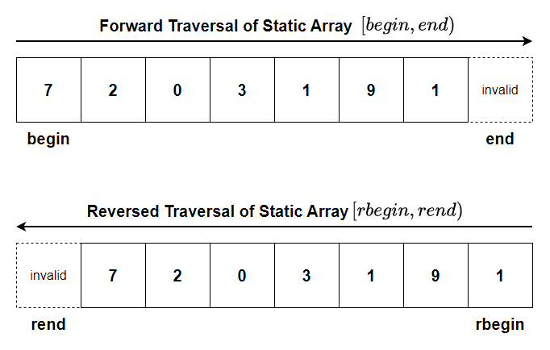
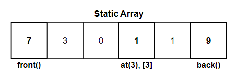
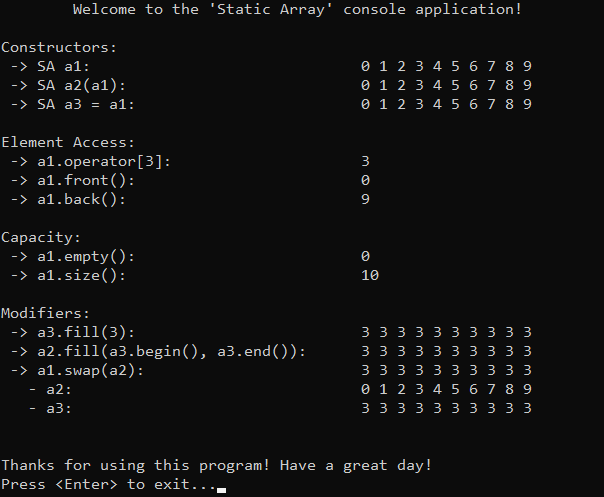
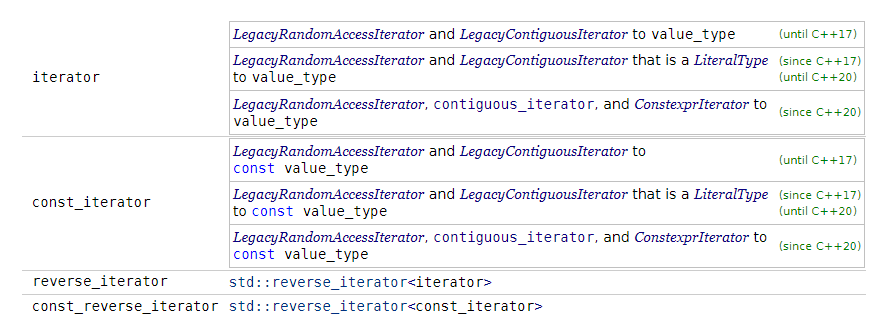

# &#128209; Table of Contents
- [💡 Overview](#-overview)
	- [Important Details](#important-details)
	- [Container Methods](#container-methods)
- [💻 Implementation](#-implementation)
	- [Design Decisions](#design-decisions)
	- [Iterator Implementation](#iterator-implementation)
	- [Container Implementation](#container-implementation)
- [📊 Analysis](#-analysis)
	- [Characteristics](#characteristics)
	- [Trade-Offs](#trade-offs)
- [📝 Application](#-application)
	- [Common Use Cases](#common-use-cases)
	- [Some Practical Problems](#some-practical-problems)
- [🕙 Origins](#-origins)
- [🤝 Contributing](#-contributing)
- [📧 Contacts](#-contacts)
- [🙏 Credits](#-credits)
- [🔏 License](#-license)


# &#128161; Overview
**Static array** is an implementation of an array where the size is fixed, meaning it can't be changed during runtime. Its name comes from this fact. Knowledge and understanding of it lay a solid foundation in designing data structures and optimizing their application.
<p align="center"></p>


## Important Details
1. **Size (Fixed)** — static array has a fixed size, meaning the size can't be changed during runtime.

2. **Time for Allocation (Compile)** — static array requires knowing size at a compile time, meaning its size can only be based on values known during the compilation phase.

3. **Place for Allocation (Stack)** — static array usually allocated in the stack memory section, limiting its size to relatively small amounts (since stack memory is limited). However, static arrays can also be allocated in the global/static/heap memory section, though this is less common.

4. **Memory Management (Automatic)** — static array allocated on stack doesn't require manual memory management, meaning the system automatically handles allocation and deallocation, avoiding risks such as dangling pointers or memory leaks.

5. **Speed of Allocation (Fast)** — static array's allocation on the stack is faster than on the heap, because it doesn't require additional operations or resources to manage memory.


## Container Methods
When working with static array, it's important to note that there is no universal standard defining a strict list of operations or guidelines for how they should be implemented. The design and functionality of a container can vary depending on several factors, such as the programming language, the purpose of the library, performance considerations, etc. Despite these variations, there are still common operations found across most implementations, typically derived from the fundamental needs of data manipulation, like accessing, modifying, or iterating over elements. Since this repository is dedicated to C++, the operations provided will closely resemble those found in `std::array`.

---
**Compiler Generated:**
- **Default Constructor** — creates a new array: for primitive data types allocates space without initializing, for complex data types calls their corresponding constructors.
- **Copy Constructor** — creates a new array by copying elements from another array.
- **Move Constructor** — creates a new array by moving elements from another array, leaving the original array in a valid, but unspecified state. This avoids the overhead of copying and instead merely shifts the ownership of the memory.
- **Copy Assignment Operator** — overwrites every element of already existing array with the corresponding element of another array by copying them.
- **Move Assignment Operator** — overwrites every element of already existing array with the corresponding element of another array by moving them, leaving the original array in a valid, but unspecified state. This avoids the overhead of copying and instead merely shifts the ownership of the memory.
- **Destructor** — performs end-actions on array: for primitive data types does nothing because they don't hold resources that need to be explicitly cleaned up, for complex data types calls the corresponding destructors.

---
<p align="center"></p>

**Iterators:**
- `begin`, `cbegin` — returns an iterator (or constant iterator) to the first element.
- `end`, `cend` — returns an iterator (or constant iterator) to the position one past the last element, making range $[begin, end)$ easy for traversal.
- `rbegin`, `crbegin` — returns an iterator (or constant one) to the last element.
- `rend`, `crend` — returns an iterator (or constant one) to the position one before the first element, making range $[rend, rbegin)$ easy for traversal.

---
<p align="center"></p>

**Element Access:**
- `at()` — returns specified element with bounds checking; if element is not within the range of the container, throws an exception.
- `operator[]` — returns specified element without bounds checking; accessing a nonexistent element through this operator is undefined behavior.
- `front()` — returns the first element in the container; calling on an empty container causes undefined behavior.
- `back()` — returns the last element in the container; calling on an empty container causes undefined behavior.

---
**Capacity:**
- `empty()` — returns `true` if container is empty, otherwise `false`.
- `size()` — returns the number of elements in the container; basically distance from begin to end.

---
**Operations:**
- `assign()` — assigns the given value to the elements.
- `swap()` — exchanges the contents of the container with other given container; doesn't cause iterators and references to associate with the other container.


# &#x1F4BB; Implementation 
The implemented console application demonstrates the basic functionality of the static array by performing various operations and interactions with it. The program provides a clear view of changes made during usage, displaying the state of the data at different stages to illustrate its simplified behavior and characteristics.
<p align="center"></p>


## Design Decisions
To prioritize simplicity and emphasize data structure itself, several design decisions were made:
- Resembling the behavior of `std::array` to provide familiarity for users.
- Replacing certain library implementations with custom solutions to minimize external dependencies.
- Restricting the implementation to the `int` data type to avoid the use of templates.
- Not considering cases where the container is allocated on the heap.
- Opting to use constant as a size, since no heap and no templates.
- Implementing only regular iterator (no reverse, no const).
- Avoiding any exception handling, thus range checks.
- Omitting certain optimizations to the container.


## Iterator Implementation
Since there are various types of iterators that can be implemented (e.g. the image below shows the iterators for `std::array`), it's common practice to define them in separate classes and files. However, despite being implemented separately, their underlying principles are usually similar, with only slight adjustments for specific purposes. To keep things simpler and avoid cluttering the core concepts, this implementation uses a single, regular iterator class. This iterator covers the basic $[begin, end)$ range and demonstrates how typical iterator operations are handled, as well as how the iterator class is integrated into the static array container.
<p align="center"></p>

---
The iterator is implemented within the `SAIterator` class, which is declared in [SAIterator.h](https://github.com/vezzolter/DSA/blob/main/DataStructures/Array/StaticArray/Include/SAIterator.h) header file and defined in [SAIterator.cpp ](https://github.com/vezzolter/DSA/blob/main//DataStructures/Array/StaticArray/Source/SAIterator.cpp)source file. To see the iterator's functionality in action, you can examine the `main()` and `printArray()` functions located in the [Main.cpp](https://github.com/vezzolter/DSA/blob/main/DataStructures/Array/StaticArray/Source/Main.cpp) file. This approach is adopted to ensure encapsulation, modularity and compilation efficiency. While full implementation can be found in the corresponding files, the class declaration below offers a quick overview:

```cpp
class SAIterator {
private:
	int* _ptr = nullptr;

public:
	// Compiler Generated
	SAIterator() = default;
	SAIterator(int* ptr);
	SAIterator(const SAIterator& rhs) = default;
	SAIterator& operator=(const SAIterator& rhs) = default;
	SAIterator(SAIterator&& rhs) = default;
	SAIterator& operator=(SAIterator&& rhs) = default;
	~SAIterator() = default;

	// Overloaded Operators
	int& operator*();
	//const int& operator*() const; // instead use dedicated const itr
	SAIterator& operator++();
	SAIterator operator++(int);
	SAIterator& operator--();
	SAIterator operator--(int);
	friend bool operator==(const SAIterator& lhs, const SAIterator& rhs);
	friend bool operator!=(const SAIterator& lhs, const SAIterator& rhs);
};
```


## Container Implementation
The container is implemented within the `SA` class, which is declared in [StaticArray.h](https://github.com/vezzolter/DSA/blob/main/DataStructures/Array/StaticArray/Include/StaticArray.h) header file and defined in [StaticArray.cpp](https://github.com/vezzolter/DSA/blob/main/DataStructures/Array/StaticArray/Source/StaticArray.cpp) source file. This approach is adopted to ensure encapsulation, modularity and compilation efficiency. To see the container's functionality in action, you can examine the `main()` function located in the [Main.cpp](https://github.com/vezzolter/DSA/blob/main/DataStructures/Array/StaticArray/Source/Main.cpp) file. The full implementation can be found in the corresponding files, while the class declaration below offers a quick overview:

```cpp
class SA {
private:
	static const int _SIZE = 9; // since no heap/template
	int _data[_SIZE];

public:
	// Compiler Generated 
	SA();
	//SA(std::initializer_list<int> values); // external dependencies
	SA(const SA& rhs);
	SA& operator=(const SA& rhs);	
	SA(SA&& rhs) = delete;
	SA& operator=(SA&& rhs) = delete;
	~SA() = default;

	// Iterators
	using iterator = SAIterator;
	iterator begin();
	iterator end();

	// Element Access
	//int& at(const int index); // throws exceptions
	//const int& at(const int index) const; // throws exceptions
	int& operator[](const int index);
	const int& operator[](const int index) const;
	int& front();
	const int& front() const;
	int& back();
	const int& back() const;

	// Capacity
	bool empty() const;
	int size() const;

	// Operations
	void assign(int val);
	void swap(SA& other);
};
```


# &#128202; Analysis
Understanding how to analyze the particular container is crucial for optimizing performance and ensuring efficient resource utilization within the constraints of the given environment. Additionally, knowing its strengths and weaknesses allows for more informed decisions, helping to select the most suitable container for a given problem among similar options.


## Characteristics
🚀 **Time Complexities:**
 - **Access** $O(1)$ — because the address can be computed directly for any position, without needing to traverse the collection.
 - **Insertion** $O(-)$ — because the size of a static array cannot be changed, so deletion is not possible.
 - **Deletion** $O(-)$ — because the size of a static array cannot be changed, so deletion is not possible.
 - **Other** — while more operations exist, they are generally not considered core functionalities to pick a container for.

---
🧠 **Space Expenses:**
- **No overhead** — both operations are conducted and elements are stored without any additional memory (e.g., pointers, extra structures, etc.) required beyond the data itself.


## Trade-Offs
➕ **Advantages:**
- **Compile-Time Storage** — static arrays allow the storage of values at compile time, which removes the need for runtime memory allocation. This leads to better memory management and increased stability in situations where data size and content are known ahead and fixed during program execution.
- **Efficient Random Access** — static arrays facilitate efficient access to the elements within the collection. Regardless of the array's length, accessing elements has a constant time complexity.
- **Efficient Memory Utilization** — static arrays store data in contiguous memory locations, preventing additional memory wastage for tracking elements. Also, ability for the allocation of memory in a single block, reduces memory fragmentation.
- **Multi-Dimensional Representations** — dynamic arrays provide a straightforward and natural way to represent multi-dimensional data structures, especially some type of grids or matrices.

---
➖ **Disadvantages:**
- **Compile-Time Storage** — static arrays don't allow to change size, thus insert and delete elements. Additionally, it requires the size to be known ahead, which is not always possible.
- **Enormous Single Block** — static arrays with large size can be problematic to allocate due to contiguous memory locations, which potentially can cause a crash.
- **Wasted Space** — static arrays that are not not fully populated, may leave lots of memory unused.
- **Out-of-Bound Access** — static arrays make it easy to miscalculate an index, leading to access outside the valid range and causing undefined behavior.


# &#128221; Application
Understanding some of the most well-known use cases of a container is crucial for grasping its practical relevance and potential impact in real-world scenarios. Additionally, familiarizing oneself with common practical problems and practicing their solutions ensures that you remember the essential details and develop a deep, intuitive understanding of the functionality and limitations.


## Common Use Cases
As mentioned in the [Array.md](https://github.com/vezzolter/DSA/blob/main/DataStructures/Array/Array.md), the concrete use cases (and anti use cases) directly derive from the advantages (and disadvantages) of the container, so there is no need for this sort of rephrasing. Since static arrays share the foundational principles of the general concept of arrays, their common usage is best described in the [arrays respective section](../Array.md#-application).


## Some Practical Problems
Since static arrays share the foundational principles of the general concept of arrays, their common problems is best described in the [arrays respective section](../Array.md#-application).


# &#x1F559; Origins
Since static arrays share the foundational principles of the general concept of arrays, their historical development is best described in the [arrays origins section](../Array.md#-origins).


# &#129309; Contributing
Contributions are highly appreciated! For detailed guidelines, please refer to the [root directory's contributing section](../../../#-contributing).


# &#128231; Contacts
For contact details and additional information, please refer to the [root directory's contact information section](../../../#-contacts).


# &#128591; Credits
Since static arrays share the foundational principles of the general concept of arrays, the resources that contributed to their understanding are best described in the [arrays credits section](../Array.md#-credits).


# &#128271; License
This project is licensed under the MIT License — see the [LICENSE](https://github.com/vezzolter/DSA/blob/main/LICENSE) file for details.

[](https://opensource.org/licenses/MIT)