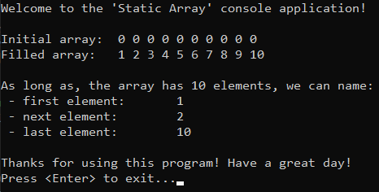

# &#128209; Table of Contents
- [💡 What is the Array as ADT](#-what-is-the-array-as-adt)
- [💻 Implementation](#-implementation)
  - [🧍‍♂️ Static Array](#️-static-array)
  - [🚶‍♂️ Dynamic Array](#️-dynamic-array)
- [📊 Analysis](#-analysis)
- [📝 Application](#-application)
- [⏳ Historical Notes](#-historical-notes)
- [🤝 Contributing](#-contributing)
- [📧 Contact Information](#-contact-information)
- [🙏 Credits](#-credits)
- [🔏 License](#-license)


# &#128161; What is the Array as ADT

An array is a fundamental concept in computer programming. Arrays are widely used not only because they provide a natural, structured way to organize and access data, they also serve as a lower-level mechanism for memory management. The concept of an array encompasses both a basic data structure, as a part of programming language, and an abstract data structure (ADT), which involves a conceptual representation that defines operations without specifying the implementation details. As a part of this repository, this subsection explores the ADT through the illustration of an arrays, because it not only simplifies comprehension, but also establishes a solid foundation for approaching more intricate data structures.


<p align="center"></p>

---

**Array** — is a linear data structure that collects elements of the same data type and stores them in contiguous and adjacent memory locations.

**Element** — each individual data value contained within the array. These data values can be anything from promitive types such as integers to more complex types like instances of classes. Since elements don't have their unique names, the only way to access them is through their respective indices.

**Index** — integer value which specifies the element's position within the array, usually starting with the first as $0$ and concluding with the last as $length-1$, where the $length$ is a number of elements contained in the array.

<p align="center"></p>

---

In C++, name of an array generates a pointer to the first element of the array (index 0), leading to one of the most prominent features of arrays, among various others — the combination of address arithmetic and array indexing.

<p align="center"></p>

**Address (Pointer) Arithmetic** — is a concept of manipulating memory addresses using arithmetic operations, which allows for efficient navigation through data structure.

```cpp
int value = 5;
int *ptr = &value; // points onto variable of type 'int'                         >>>   002CF9A4
cout << ptr + 1;   // point onto next value of int (+4 bytes)                          002CF9A8
cout << ptr - 1;   // point onto prev value of int (-4 bytes)                          002CF9A0
```

**Array Indexing** — process of accessing elements within an array, typically achieved internally through address arithmetic.
```cpp
int arr[5] = {7, 8, 2}; // simple static array                value:    7     8    2
cout << array[1];   //  this                                  index:    0     1    2
cout << *(array+1); //  equals to this                   expression: array  a+1  a+2
```

---

When it comes to implementation, arrays can be broadly classified into two types: static and dynamic. While these types share some common ideas, each possesses distinctive characteristics. The choice between them depends on the specific requirements of the case at hand.

<p align="center"></p>

1. **Static Array** — array with a fixed nature, possesses the following properties:
    - memory is allocated on the stack during compile time;
    - automatic memory management;
    - length can not be changed during runtime.

2. **Dynamic Array** — array with a flexible nature, possesses the following properties:
    - memory is allocated on the heap during runtime;
    - manual memory management (potential issues like dangling pointers and memory leaks);
    - length cannot be changed during runtime, but there is a resourceful alternative: creating a new one, copying values, and performing respective memory operations.


# &#x1F4BB; Implementation 
Discussing ADT, it's evident that well-established and widely recognized implementations already exist for both static and dynamic arrays. In the context of C++, `std::array` is a representative of static arrays, and `std::vector` stands as the counterpart for dynamic arrays. It's commonly recommended to rely on these proven implementations rather than reinventing the wheel. However, within the scope of this subsection, we'll take a closer look at simplified versions of these arrays. This exploration is aimed at gaining a deeper understanding of the fundamental concepts that underlie them.However, within the scope of this subsection, we will closely examine simplified versions of these arrays. This exploration is aimed at gaining a deeper understanding of the fundamental concepts that underlie them.


## 🧍‍♂️ Static Array

**Detailed Overview**:
1. In order to prioritize simplicity and highlight data structure itself, `int` is picked as sole data type.
2. As mentioned earlier, a crucial aspect of arrays lies in the synergy between array indexing and address arithmetic. The illustration of a static array in C++, exemplified by `std::array`, achieves this through the utilization of the entire iterator class as one of its components. In this specific implementation, the iterator related functionality was omitted to streamline the focus on learning ADT basics, e.g. methods like `int* begin();`, `const int* cbegin() const;`, or `int* rbegin();` are absent.
3. Additionally, various types of bounds checking were omitted due to the situational nature of error resolution. As an instance of this omission, one of the ways of element access, known as method `at()` in `std::array` was skipped.
4. The ADT is implemented within the class named `StaticArr`, and this class is divided into two distinct files - header and source. This is done because of encapsulation, modularity and compilation efficiency.
5. The declaration of the class is presented in `StaticArr.h`:

```cpp
class StaticArr
{
private:
	int mLength;
	int* mArr;

public:
	// Special Member Functions
	explicit StaticArr();
	explicit StaticArr(int length); 
	explicit StaticArr(const StaticArr& src) = default;
	StaticArr& operator=(const StaticArr& rhs) = default;
	~StaticArr();


	// Element Access
	int& operator[](const int index);
	int front();
	int back();


	// Capacity
	bool isEmpty() const;
	int size() const;


	// Operations
	void fill(const int val);
};
```

6. While the definition is in `StaticArr.cpp`:

```cpp
// ------------------------
// Special Member Functions
// ------------------------

// Default constructor
StaticArr::StaticArr() : mLength(0), mArr(nullptr) {}

// Parameterized constructor without bounds checking
StaticArr::StaticArr(int length) : mLength(length)
{
	if (length > 0) { mArr = new int[length]; }
	else { mArr = nullptr; }
}

// Destructor
StaticArr::~StaticArr() { delete[] mArr; }


// --------------
// Element Access
// --------------

// Access the element at the specified index without bounds checking
int& StaticArr::operator[](const int index) { return mArr[index]; }

// Access the first element of the container without bounds checking
int StaticArr::front() { return mArr[0]; }

// Access the last element of the container without bounds checking
int StaticArr::back() { return mArr[mLength - 1]; }


// --------
// Capacity
// --------

// Check if the container is empty
bool StaticArr::isEmpty() const { return (mLength == 0); }

// Get the size of the container
int StaticArr::size() const { return (isEmpty() ? 0 : mLength); }


// ----------
// Operations
// ----------

// Fill the container with specified value
void StaticArr::fill(const int val)
{
	for (int i = 0; i < mLength; ++i)
		mArr[i] = val;
}
```

7. A demonstration of the array's capabilities is showcased in the `main()` function, situated within the `main.cpp` file.
```cpp
int main()
{
	// Greetings
	std::cout << "Welcome to the 'Static Array' console application!\n\n";

	// Create the array with 10 uninitialized elements
	StaticArr myArr(10);

	// Fill the array with numbers (0-10)
	for (int i = 0; i < 10; i++)
		myArr[i] = i + 1;

	// Display the array
	std::cout << "Array: ";
	for (int i = 0; i < myArr.size(); i++)
		std::cout << myArr[i] << " ";
	std::cout << std::endl;

	// Showcase of the capacity
	if (myArr.isEmpty()) { std::cout << "The array is empty. It has " << myArr.size() << " elements.\n"; }
	else { std::cout << "The array is not empty. It has " << myArr.size() << " elements.\n"; }

	// Showcase of the element access
	std::cout << "First elements is: " << myArr.front() << std::endl;
	std::cout << "Second elements is: " << myArr[1] << std::endl;
	std::cout << "Last elements is: " << myArr.back() << std::endl;

	// Showcase of the operations
	myArr.fill(1);
	std::cout << "Filling the array with 1: ";
	for (int i = 0; i < myArr.size(); i++)
		std::cout << myArr[i] << " ";
	std::cout << std::endl;

	// Exiting
	std::cout << "\nThanks for using this program! Have a great day!\n";
	std::cout << "Press <Enter> to exit...";
	std::cin.clear(); // ensure that stream is in a good state
	std::cin.ignore(32767, '\n'); // clear from any remaining chars
	std::cin.get();
	return 0;
}
```
<p align="center"></p>

## 🚶‍♂️ Dynamic Array
Currently in Progress...

# &#128202; Analysis
Currently in Progress...


# &#128221; Application

Types of Operations:
- Traversal — traverse through the elements of an array.
- Insertion — inserting a new element in an array.
- Deletion — deleting element from the array.
- Searching — search for an element in the array.
- Sorting — maintaining the order of elements in the array.

---


# &#x23F3; Historical Notes
Currently in Progress...


# &#129309; Contributing
Contributions are highly appreciated! For detailed guidelines, please refer to the [root directory's contributing section](../../../#-contributing).


# &#128231; Contact Information
For contact details and additional information, please refer to the [root directory's contact information section](../../#-contact-information).


# &#128591; Credits
&#128218; **Books:**
- **"Grokking Algorithms"** — by Aditya Bhargava
  - Section 2.1: How memory works
  - Section 2.2: Arrays and linked lists
- **"Algorithms in C++, Parts 1-4"** — by Robert Sedgewick
  - Section 3.2: Arrays
- **"Data Structures and Algorithm Analysis in C++""** — by Mark A. Weiss
  - Section 3.1: Abstract Data Types
  
&#127891;**Courses:**
- [Mastering Data Structures & Algorithms using C and C++](https://www.udemy.com/course/datastructurescncpp/?LSNPUBID=JVFxdTr9V80&ranEAID%3B=JVFxdTr9V80&ranMID%3B=39197&ranSiteID%3B=JVFxdTr9V80-_3GVcwGZFWT4XsSuZYrgGA&utm_source=adwords&utm_medium=udemyads&utm_campaign=DSA_Catchall_la.EN_cc.ROW&utm_content=deal4584&utm_term=_._ag_88010211481_._ad_535397282064_._kw__._de_c_._dm__._pl__._ti_dsa-406594358574_._li_9061020_._pd__._&matchtype=&gad_source=1&gclid=CjwKCAiA3aeqBhBzEiwAxFiOBgRFL7RkV-WJI9tPKml75et478Ai5oJigSKAivJ2txZ9Jhi0mhsTdxoC_foQAvD_BwE) on Udemy
   - Section 6: Arrays Representations
   - Section 7: Array ADT
- [Accelerated Computer Science Fundamentals Specialization](https://www.coursera.org/specializations/cs-fundamentals) from Coursera
   - Course 2: Ordered Data Structures
  
&#127760;**Web-Resources:**
- [Introduction to Arrays](https://www.geeksforgeeks.org/introduction-to-arrays-data-structure-and-algorithm-tutorials/)
- [Pointer Arithmetic](https://hackingcpp.com/cpp/lang/pointer_arithmetic.html)
- [Array (ADT)](https://brilliant.org/wiki/arrays-adt/#:~:text=The%20array%20is%20a%20basic,types%20like%20instances%20of%20classes.)
- [Difference between Static Arrays and Dynamic Arrays](https://www.geeksforgeeks.org/difference-between-static-arrays-and-dynamic-arrays/)
- [std::array](https://en.cppreference.com/w/cpp/container/array)
- [std::vector](https://en.cppreference.com/w/cpp/container/vector)

# &#128271; License
This project is licensed under the MIT License — see the [LICENSE](LICENSE) file for details.

[](https://opensource.org/licenses/MIT)