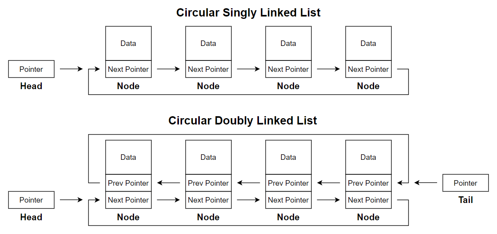
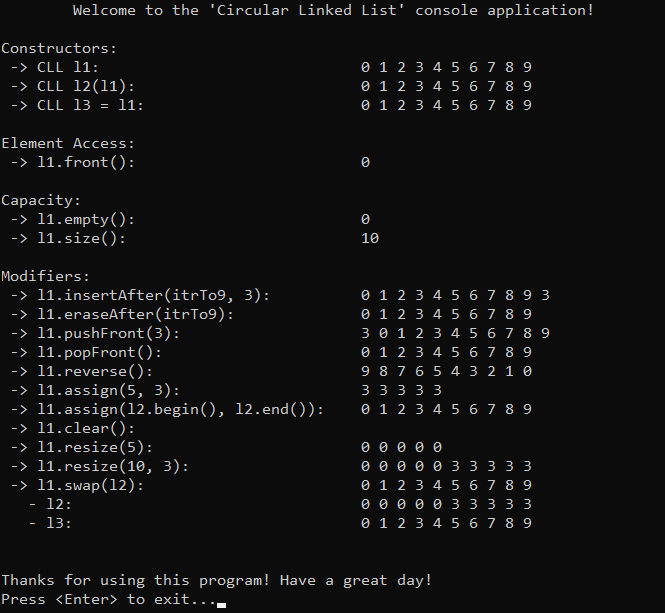

# &#128209; Table of Contents
- [💡 Overview](#-overview)
	- [Important Details](#important-details)
	- [Container Methods](#container-methods)
- [💻 Implementation](#-implementation)
	- [Design Decisions](#design-decisions)
	- [Iterator Implementation](#iterator-implementation)
	- [Container Implementation](#container-implementation)
- [📊 Analysis](#-analysis)
	- [Characteristics](#characteristics)
	- [Trade-Offs](#trade-offs)
- [📝 Application](#-application)
	- [Common Use Cases](#common-use-cases)
	- [Some Practical Problems](#some-practical-problems)
- [🕙 Origins](#-origins)
- [🤝 Contributing](#-contributing)
- [📧 Contacts](#-contacts)
- [🙏 Credits](#-credits)
- [🔏 License](#-license)


# &#128161; Overview
**Circular Linked Lists** are implementations of a linked list where the last node in sequence points back to the first node, allowing for continuous traversal from any node. The name comes from the fact that each node eventually links back to itself, creating a circular sequence. Knowledge and understanding of it lay a solid foundation in designing data structures and optimizing their application.
<p align="center"></p>


## Important Details
1. **Node Composition** — each node in a circular linked list contains a data element and pointers to other nodes just like regular linked lists. In a circular singly linked list, each node has a pointer to the next node, while in a circular doubly linked list, each node has pointers to both the next and previous nodes. 

2. **Continuous Traversal** — circular linked lists allow continuous traversal, as the last node loops back to the head. Starting from any node, traversing will eventually lead back to the same node, making these lists particularly useful for applications that require round-robin access or repeated cycles.

3. **End of List** — since circular linked lists have no `nullptr` to mark the end, identifying the beginning or completing a traversal requires special handling. Typically, this is done by keeping track of the starting node and stopping once we loop back to it.


## Container Methods
When working with a circular linked list, it’s important to note that there is no universal standard defining its operations or implementation guidelines. The design and functionality of a circular linked list container can vary based on factors like programming language, library goals, and performance needs. Although circular linked lists are not natively available in the C++ Standard Library, they can be adapted from `std::forward_list` or `std::list`. Additionally, Boost provides an existing circular data structure, `boost::circular_buffer`, which may meet similar needs.

Circular linked list operations are mostly similar to those of [singly](https://github.com/vezzolter/DSA/blob/split-list/DataStructures/LinkedList/SinglyLinkedList/SinglyLinkedList.md#-overview) or [doubly](https://github.com/vezzolter/DSA/blob/split-list/DataStructures/LinkedList/DoublyLinkedList/DoublyLinkedList.md#-overview) linked lists, but with one key difference: the last node links back to the first, forming a continuous loop with no `nullptr` at the end. This circular structure removes the need for a `nullptr` check at the list's end, meaning traversal or modification operations that typically stop at the last node will continue looping to the head. To avoid infinite loops, implementations often track the starting node or count traversed elements, stopping once all nodes have been visited. In cases requiring multiple iterations over the list, careful control of the iteration process is essential to prevent unintended cycling.


# &#x1F4BB; Implementation 
The implemented console application demonstrates the basic functionality of the singly linked list by performing various operations and interactions with it. The program provides a clear view of changes made during usage, displaying the state of the data at different stages to illustrate its simplified behavior and characteristics.
<p align="center"></p>


## Design Decisions
Currently in Progress...


## Container Implementation
The container is implemented within the `CLL` class, which is declared in [CircularLinkedList.h](https://github.com/vezzolter/DSA/blob/split-list/DataStructures/LinkedList/CircularLinkedList/Include/CircularLinkedList.h) header file and defined in [CircularLinkedList.cpp](https://github.com/vezzolter/DSA/blob/split-list/DataStructures/LinkedList/CircularLinkedList/Source/CircularLinkedList.cpp) source file. This approach is adopted to ensure encapsulation, modularity and compilation efficiency. To see the container's functionality in action, you can examine the `main()` function located in the [Main.cpp](https://github.com/vezzolter/DSA/blob/split-list/DataStructures/LinkedList/CircularLinkedList/Source/Main.cpp) file. The full implementation can be found in the corresponding files, while the class declaration below offers a quick overview:

```cpp
class CLL {
private:
	struct Node;
	int _size;
	Node* _head;

public:
	// --------------------
	//  Compiler Generated
	// --------------------
	CLL();
	CLL(int size, int data);
	CLL(const CLL& other);
	CLL(CLL&& other)          = delete;
	CLL& operator=(const CLL& rhs);
	CLL& operator=(CLL&& rhs) = delete;
	~CLL();

	// -----------
	//  Iterators
	// -----------
	class Iterator;
	using iterator = Iterator;
	iterator begin();
	iterator end();
	class ConstIterator;
	using const_iterator = ConstIterator;
	const_iterator cbegin() const;
	const_iterator cend() const;

	// ----------------
	//  Element Access
	// ----------------
	int& front();
	const int& front() const;

	// ----------
	//  Capacity
	// ----------
	bool empty() const;
	int size() const;

	// -----------
	//  Modifiers
	// -----------
	void insertAfter(iterator pos, const int& data);
	void eraseAfter(iterator pos);
	void pushFront(const int& data);
	void popFront();
	void reverse();
	void assign(int size, const int& data);
	void assign(const_iterator first, const_iterator last);
	void clear();
	void resize(int size, const int& data = 0);
	void swap(CLL& other);
};
```

## Node Implementation
The `Node` structure is defined as a private nested structure within the `CLL` container. This design keeps `Node` as an internal component, accessible only within the container, and enhances encapsulation. Given the simplicity of the `Node` structure, its functions are defined inline within the container's header file.

```cpp
struct CLL::Node {
public:
	int _data;
	Node* _next;

	// --------------------
	//  Compiler Generated
	// --------------------
	Node() : _data(0), _next(nullptr) {}
	Node(const int& data, Node* next = nullptr) : _data(data), _next(next) {}
	Node(const Node& other)          = delete;  // no copying/moving to
	Node(Node&& other)               = delete;  // ensure uniqueness of 
	Node& operator=(const Node& rhs) = delete;  // the node within the list
	Node& operator=(Node&& rhs)      = delete;  // and prevent accidental 
	~Node()                          = default; // duplicates or dangling nodes
};
```

## Iterators Implementation
The `Iterator` class is defined as a public nested class within the `CLL` container. This design makes `Iterator` accessible to users, enabling them to traverse and interact with list elements directly. Given the simplicity of the `Iterator` class, its functions are defined inline within the container's header file.

```cpp
class CLL::Iterator {
private:
	Node* _ptr = nullptr;
	Node* _head = nullptr; // to prevent infinite loops

public:
	// --------------------
	//  Compiler Generated
	// --------------------
	Iterator()                               = default;
	explicit Iterator(Node* ptr, Node* head) : _ptr(ptr), _head(head) {}
	Iterator(const Iterator& other)          = default;
	Iterator(Iterator&& other)               = default;
	Iterator& operator=(const Iterator& rhs) = default;
	Iterator& operator=(Iterator&& rhs)      = default;
	~Iterator()                              = default;

	// ----------------------
	//  Overloaded Operators
	// ----------------------

	// Returns a reference to the data of a node
	int& operator*() { return _ptr->_data; }

	// Returns a pointer to the entire node, allowing access to its members
	Node* operator->() { return _ptr; }

	// Advances the iterator to the next element (pre-increment)
	Iterator& operator++() {
		if (_ptr && _ptr->_next == _head) {
			_ptr = nullptr; // end of traversal
		} else {
			_ptr = _ptr->_next; // move to the next node
		}
		return *this;
	}

	// Advances the iterator to the next element, returning the previous state
	Iterator operator++(int) {
		Iterator temp = *this;
		++(*this); // end handling logic in pre-increment
		return temp;
	}

	// Returns true if two iterators point to the same element
	friend bool operator==(const CLL::Iterator& lhs, const CLL::Iterator& rhs) {
		return lhs._ptr == rhs._ptr;
	}

	// Returns true if two iterators point to different elements
	friend bool operator!=(const CLL::Iterator& lhs, const CLL::Iterator& rhs) {
		return lhs._ptr != rhs._ptr;
	}
};
```
---
The `ConstIterator` class is defined as a public nested class within the `CLL` container. This design makes `ConstIterator` accessible to users, enabling them to traverse and interact with list elements directly. Given the simplicity of the `ConstIterator` class, its functions are defined inline within the container's header file.

```cpp
class CLL::ConstIterator {
private:
	const Node* _ptr = nullptr;
	const Node* _head = nullptr; // to prevent infinite loops

public:
	// --------------------
	//  Compiler Generated
	// --------------------
	ConstIterator()                                    = default;
	explicit ConstIterator(const Node* ptr, const Node* head) : _ptr(ptr), _head(head) {}
	ConstIterator(const ConstIterator& other)          = default;
	ConstIterator(ConstIterator&& other)               = default;
	ConstIterator& operator=(const ConstIterator& rhs) = default;
	ConstIterator& operator=(ConstIterator&& rhs)      = default;
	~ConstIterator()                                   = default;

	// ----------------------
	//  Overloaded Operators
	// ----------------------

	// Returns a const reference to the data of a node
	const int& operator*() const { return _ptr->_data; }

	// Returns a const pointer to the entire node, allowing access to its members
	const Node* operator->() const { return _ptr; }

	// Advances the iterator to the next element (pre-increment)
	ConstIterator& operator++() {
		if (_ptr && _ptr->_next == _head) {
			_ptr = nullptr; // end of traversal
		} else {
			_ptr = _ptr->_next; // move to the next node
		}
		return *this;
	}

	// Advances the iterator to the next element, returning the previous state
	ConstIterator operator++(int) {
		ConstIterator temp = *this;
		++(*this); // end handling logic in pre-increment
		return temp;
	}

	// Returns true if two iterators point to the same element
	friend bool operator==(const CLL::ConstIterator& lhs, const CLL::ConstIterator& rhs) {
		return lhs._ptr == rhs._ptr;
	}

	// Returns true if two iterators point to different elements
	friend bool operator!=(const CLL::ConstIterator& lhs, const CLL::ConstIterator& rhs) {
		return lhs._ptr != rhs._ptr;
	}
};
```


# &#128202; Analysis
Currently in Progress...


## Characteristics
Currently in Progress...


## Trade-Offs
Currently in Progress...


# &#128221; Application
Understanding some of the most well-known use cases of a container is crucial for grasping its practical relevance and potential impact in real-world scenarios. Additionally, familiarizing oneself with common practical problems and practicing their solutions ensures that you remember the essential details and develop a deep, intuitive understanding of the functionality and limitations.


## Common Use Cases
As mentioned in the [LinkedList.md](https://github.com/vezzolter/DSA/blob/split-list/DataStructures/LinkedList/LinkedList.md), the concrete use cases (and anti use cases) directly derive from the advantages (and disadvantages) of the container, so there is no need for this sort of rephrasing. Since circular linked lists share the foundational principles of the general concept of linked lists, their common usage is best described in the [linked lists respective section](../LinkedList.md#-application).


## Some Practical Problems
Since circular linked lists share the foundational principles of the general concept of linked lists, their common problems is best described in the [linked lists respective section](../LinkedList.md#-application).


# &#x1F559; Origins
Since circular linked lists share the foundational principles of the general concept of linked lists, their historical development is best described in the [linked lists respective section](../LinkedList.md#-application).


# &#129309; Contributing
Contributions are highly appreciated! For detailed guidelines, please refer to the [root directory's contributing section](../../../#-contributing).


# &#128231; Contacts
For contact details and additional information, please refer to the [root directory's contact information section](../../../#-contacts).


# &#128591; Credits
Since circular linked lists share the foundational principles of the general concept of linked lists, the resources that contributed to their understanding are best described in the [linked lists credits section](../LinkedList.md#-credits).


# &#128271; License
This project is licensed under the MIT License — see the [LICENSE](https://github.com/vezzolter/DSA/blob/main/LICENSE) file for details.

[](https://opensource.org/licenses/MIT)