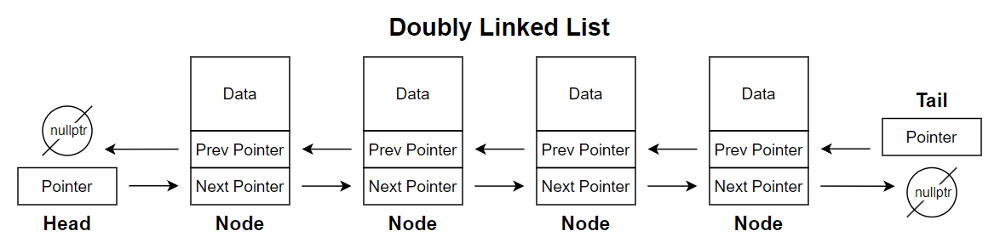
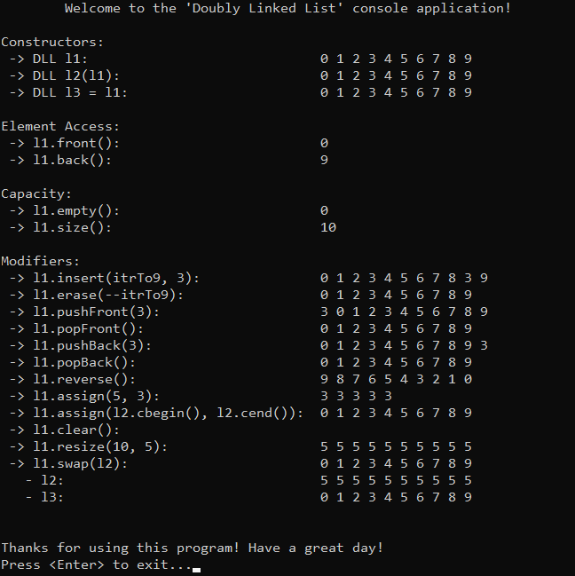

# &#128209; Table of Contents
- [💡 Overview](#-overview)
	- [Important Details](#important-details)
	- [Container Methods](#container-methods)
- [💻 Implementation](#-implementation)
	- [Design Decisions](#design-decisions)
	- [Container Implementation](#container-implementation)
	- [Node Implementation](#node-implementation)
	- [Iterators Implementation](#iterators-implementation)
- [📊 Analysis](#-analysis)
	- [Characteristics](#characteristics)
	- [Trade-Offs](#trade-offs)
- [📝 Application](#-application)
	- [Common Use Cases](#common-use-cases)
	- [Some Practical Problems](#some-practical-problems)
- [🕙 Origins](#-origins)
- [🤝 Contributing](#-contributing)
- [📧 Contacts](#-contacts)
- [🙏 Credits](#-credits)
- [🔏 License](#-license)


# &#128161; Overview
**Doubly Linked List** is an implementation of a linked list where each node, except the first and the last one, points both to the next and to the previous node in the sequence, allowing bidirectional traversal from the first to the last node and back. The name comes from the fact that each node has doubled the number of links, compared to a singly linked list. Knowledge and understanding of it lay a solid foundation in designing data structures and optimizing their application.
<p align="center"></p>


## Important Details
1. **Node Composition** — each node in a doubly linked list contains a data element and two pointers: one pointing to the next node and another pointing to the previous node. While this structure is relatively straightforward, as the list grows, the cumulative memory overhead can become significant, especially in large lists.

2. **Bi-Directional Traversal** — with pointers to both the next and previous nodes, a doubly linked list supports traversal in both directions, from head to tail and tail to head. This enables easier access to nodes from either end and allows for efficient backward traversal.

3. **End of List** — in a doubly linked list, the `next` pointer of the last node points to `nullptr`, marking the list’s end. Similarly, the `prev` pointer of the head node also points to `nullptr`, indicating the start of the list.


## Container Methods
When working with doubly linked list, it's important to note that there is no universal standard defining a strict list of operations or guidelines for how they should be implemented. The design and functionality of a container can vary depending on several factors, such as the programming language, the purpose of the library, performance considerations, etc. Despite these variations, there are still common operations found across most implementations, typically derived from the fundamental needs of data manipulation, like accessing, modifying, or iterating over elements. Since this repository is dedicated to C++, the operations provided will closely resemble those found in `std::list`.

---
**Compiler Generated:**
- `Default Constructor` — creates a new doubly linked list with no nodes.
- `Copy Constructor` — creates a new doubly linked list by copying elements from another list.
- `Move Constructor` — creates a new doubly linked list by moving elements from another list, leaving the original list in a valid, but unspecified state. This avoids the overhead of copying and instead merely shifts the ownership of the memory.
- `Copy Assignment Operator` — overwrites every element of already existing doubly linked list with the corresponding element of another list by copying them.
- `Move Assignment Operator` — overwrites every element of already existing doubly linked list with the corresponding element of another list by moving them, leaving the original list in a valid, but unspecified state. This avoids the overhead of copying and instead merely shifts the ownership of the memory.
- `Destructor` — performs end-actions on doubly linked list: deallocates all nodes in the list, calling destructors for complex data types to ensure resources are cleaned up.

---
**Iterators:**
- `begin`, `cbegin` — returns an iterator (or constant iterator) to the first element.
- `end`, `cend` — returns an iterator (or constant iterator) to the position one past the last element, making range $[begin, end)$ easy for traversal.
- `rbegin`, `crbegin` — returns an iterator (or constant one) to the last element.
- `rend`, `crend` — returns an iterator (or constant one) to the position one before the first element, making range $[rend, rbegin)$ easy for traversal.

---
**Element Access:**
- `front()` — returns the first element in the container; calling on an empty container causes undefined behavior.
- `back()` — returns the last element in the container; calling on an empty container causes undefined behavior.

---
**Capacity:**
- `empty()` — returns `true` if container is empty, otherwise `false`.
- `size()` — returns the number of elements in the container; basically distance from begin to end.
- `maxSize()` — returns the maximum number of elements the container is able to hold theoretically, if all available memory were dedicated to that single container.

---
**Modifiers:**
- `insert()` — inserts an element at a specified position within the container, updating the `next` and `prev` pointers of neighboring nodes to link the new element.
- `erase()` — removes an element at a specified position, updating the `next` and `prev` pointers of neighboring nodes to maintain continuity in the list structure.
- `pushFront()` — inserts the given element at the beginning of the container, updating the head pointer to point to the new node and setting the `prev` pointer of the former first node.
- `pushBack()` — appends the given element to the end of the container, updating the tail pointer to reference the new node and setting the `next` pointer of the former last node.
- `popFront()` — removes the first element from the container, updating the head pointer to point to the next node and setting its `prev` pointer to `nullptr`; calling on an empty container causes undefined behavior.
- `popBack()` — removes the last element of the container, updating the tail pointer to reference the previous node and setting its `next` pointer to `nullptr`; calling on an empty container causes undefined behavior.
- `assign()` — assigns the given value to the elements; any previous values will be replaced; invalidates any references, pointers, and iterators referring to contained elements.
- `clear()` — erases all elements from the container; invalidates any references, pointers, and iterators referring to contained elements.
- `resize()` — resizes the container to contain given amount of elements; if given amount equals to size, does nothing; if given amount is less than size, the container is reduced to its first given elements; if given amount is greater, additional default (or specified) elements are appended.
- `swap()` — exchanges the contents of the container with other given container; doesn't cause iterators and references to associate with the other container.


# &#x1F4BB; Implementation 
The implemented console application demonstrates the basic functionality of the doubly linked list by performing various operations and interactions with it. The program provides a clear view of changes made during usage, displaying the state of the data at different stages to illustrate its simplified behavior and characteristics.
<p align="center"></p>


## Design Decisions
To prioritize simplicity and emphasize data structure itself, several design decisions were made:
- Resembling the behavior of `std::list` to provide familiarity for users.
- Restricting the implementation to the `int` data type to avoid the use of templates.
- Omitting cases where the container (object itself) is created on the heap.
- Relying on manual memory management without using smart pointers.
- Implementing both regular and const iterators.
- Avoiding any exception handling, thus certain range validations.
- Omitting certain optimizations to the container.


## Container Implementation
The container is implemented within the `DLL` class, which is declared in [DoublyLinkedList.h](https://github.com/vezzolter/DSA/blob/split-list/DataStructures/LinkedList/DoublyLinkedList/Include/DoublyLinkedList.h) header file and defined in [DoublyLinkedList.cpp](https://github.com/vezzolter/DSA/blob/split-list/DataStructures/LinkedList/DoublyLinkedList/Source/DoublyLinkedList.cpp) source file. This approach is adopted to ensure encapsulation, modularity and compilation efficiency. To see the container's functionality in action, you can examine the `main()` function located in the [Main.cpp](https://github.com/vezzolter/DSA/blob/split-list/DataStructures/LinkedList/DoublyLinkedList/Source/Main.cpp) file. The full implementation can be found in the corresponding files, while the class declaration below offers a quick overview:

```cpp
class DLL {
private:
	struct Node;
	int _size;
	Node* _head;
	Node* _tail;

public:
	// --------------------
	//  Compiler Generated
	// --------------------
	DLL();
	DLL(int size, int data);
	DLL(const DLL& other);
	DLL(DLL&& other)          = delete;
	DLL& operator=(const DLL& rhs);
	DLL& operator=(DLL&& rhs) = delete;
	~DLL();

	// -----------
	//  Iterators
	// -----------
	class Iterator;
	using iterator = Iterator;
	iterator begin();
	iterator end();
	class ConstIterator;
	using const_iterator = ConstIterator;
	const_iterator cbegin() const;
	const_iterator cend() const;

	// ----------------
	//  Element Access
	// ----------------
	int& front();
	const int& front() const;
	int& back();
	const int& back() const;

	// ----------
	//  Capacity
	// ----------
	bool empty() const;
	int size() const;

	// -----------
	//  Modifiers
	// -----------
	void insert(iterator pos, const int& data);
	void erase(iterator pos);
	void pushFront(const int& data);
	void popFront();
	void pushBack(const int& data);
	void popBack();
	void reverse();
	void assign(int size, const int& data);
	void assign(const_iterator first, const_iterator last);
	void clear();
	void resize(int size, const int& data);
	void swap(DLL& other);
};
```

## Node Implementation
The `Node` structure is defined as a private nested structure within the `DLL` container. This design keeps `Node` as an internal component, accessible only within the container, and enhances encapsulation. Given the simplicity of the `Node` structure, its functions are defined inline within the container's header file.

```cpp
struct DLL::Node {
public:
	int _data;
	Node* _next;
	Node* _prev;

	// --------------------
	//  Compiler Generated
	// --------------------
	Node() : _data(0), _next(nullptr), _prev(nullptr) {}
	Node(const int& data, Node* next = nullptr, Node* prev = nullptr)
		: _data(data), _next(next), _prev(prev) {}
	Node(const Node& other)             = delete;  // no copying/moving to
	Node(Node&& other)                  = delete;  // ensure uniqueness of 
	Node& operator=(const Node& rhs)    = delete;  // the node within the list
	Node& operator=(Node&& rhs)         = delete;  // and prevent accidental 
	~Node()                             = default; // duplicates or dangling nodes
};
```


## Iterators Implementation
The `Iterator` class is defined as a public nested class within the `DLL` container. This design makes `Iterator` accessible to users, enabling them to traverse and interact with list elements directly. Given the simplicity of the `Iterator` class, its functions are defined inline within the container's header file.

```cpp
class DLL::Iterator {
private:
	Node* _ptr = nullptr;

public:
	// --------------------
	//  Compiler Generated
	// --------------------
	Iterator()                                = default;
	explicit Iterator(Node* ptr) : _ptr(ptr) {}
	Iterator(const Iterator& other)           = default;
	Iterator(Iterator&& other)                = default;
	Iterator& operator=(const Iterator& rhs)  = default;
	Iterator& operator=(Iterator&& rhs)       = default;
	~Iterator()                               = default;

	// ----------------------
	//  Overloaded Operators
	// ----------------------

	// Returns a reference to the data of a node
	int& operator*() { return _ptr->_data; }

	// Returns a pointer to the entire node, allowing access to its members
	Node* operator->() { return _ptr; }

	// Advances the iterator to the next element (pre-increment)
	Iterator& operator++() {
		_ptr = _ptr->_next;
		return *this;
	}

	// Advances the iterator to the next element, returning the previous state
	Iterator operator++(int) {
		Iterator temp = *this;
		_ptr = _ptr->_next;
		return temp;
	}

	// Moves the iterator to the previous element (pre-decrement)
	Iterator& operator--() {
		_ptr = _ptr->_prev;
		return *this;
	}

	// Moves the iterator to the previous element, returning the previous state
	Iterator operator--(int) {
		Iterator temp = *this;
		_ptr = _ptr->_prev;
		return temp;
	}

	// Returns true if two iterators point to the same element
	friend bool operator==(const DLL::Iterator& lhs, const DLL::Iterator& rhs) {
		return lhs._ptr == rhs._ptr;
	}

	// Returns true if two iterators point to different elements
	friend bool operator!=(const DLL::Iterator& lhs, const DLL::Iterator& rhs) {
		return lhs._ptr != rhs._ptr;
	}
};
```

---
The `ConstIterator` class is defined as a public nested class within the `DLL` container. This design makes `ConstIterator` accessible to users, enabling them to traverse and interact with list elements directly. Given the simplicity of the `ConstIterator` class, its functions are defined inline within the container's header file.

```cpp
class DLL::ConstIterator {
private:
	const Node* _ptr = nullptr;

public:
	// --------------------
	//  Compiler Generated
	// --------------------
	ConstIterator()                                     = default;
	explicit ConstIterator(const Node* ptr) : _ptr(ptr) {}
	ConstIterator(const ConstIterator& other)           = default;
	ConstIterator(ConstIterator&& other)                = default;
	ConstIterator& operator=(const ConstIterator& rhs)  = default;
	ConstIterator& operator=(ConstIterator&& rhs)       = default;
	~ConstIterator()                                    = default;

	// ----------------------
	//  Overloaded Operators
	// ----------------------

	// Returns a const reference to the data of a node
	const int& operator*() const { return _ptr->_data; }

	// Returns a const pointer to the entire node, allowing access to its members
	const Node* operator->() const { return _ptr; }

	// Advances the iterator to the next element (pre-increment)
	ConstIterator& operator++() {
		_ptr = _ptr->_next;
		return *this;
	}

	// Advances the iterator to the next element, returning the previous state
	ConstIterator operator++(int) {
		ConstIterator temp = *this;
		_ptr = _ptr->_next;
		return temp;
	}

	// Moves the iterator to the previous element (pre-decrement)
	ConstIterator& operator--() {
		_ptr = _ptr->_prev;
		return *this;
	}

	// Moves the iterator to the previous element, returning the previous state
	ConstIterator operator--(int) {
		ConstIterator temp = *this;
		_ptr = _ptr->_prev;
		return temp;
	}

	// Returns true if two iterators point to the same element
	friend bool operator==(const DLL::ConstIterator& lhs, const DLL::ConstIterator& rhs) {
		return lhs._ptr == rhs._ptr;
	}

	// Returns true if two iterators point to different elements
	friend bool operator!=(const DLL::ConstIterator& lhs, const DLL::ConstIterator& rhs) {
		return lhs._ptr != rhs._ptr;
	}
};
```


# &#128202; Analysis
Currently in Progress...


## Characteristics
Currently in Progress...


## Trade-Offs
Currently in Progress...


# &#128221; Application
Understanding some of the most well-known use cases of a container is crucial for grasping its practical relevance and potential impact in real-world scenarios. Additionally, familiarizing oneself with common practical problems and practicing their solutions ensures that you remember the essential details and develop a deep, intuitive understanding of the functionality and limitations.


## Common Use Cases
As mentioned in the [LinkedList.md](https://github.com/vezzolter/DSA/blob/split-list/DataStructures/LinkedList/LinkedList.md), the concrete use cases (and anti use cases) directly derive from the advantages (and disadvantages) of the container, so there is no need for this sort of rephrasing. Since doubly linked lists share the foundational principles of the general concept of linked lists, their common usage is best described in the [linked lists respective section](../LinkedList.md#-application).


## Some Practical Problems
Since doubly linked lists share the foundational principles of the general concept of linked lists, their common problems is best described in the [linked lists respective section](../LinkedList.md#-application).


# &#x1F559; Origins
Since doubly linked lists share the foundational principles of the general concept of linked lists, their historical development is best described in the [linked lists respective section](../LinkedList.md#-application).


# &#129309; Contributing
Contributions are highly appreciated! For detailed guidelines, please refer to the [root directory's contributing section](../../../#-contributing).


# &#128231; Contacts
For contact details and additional information, please refer to the [root directory's contact information section](../../../#-contacts).


# &#128591; Credits
Since doubly linked lists share the foundational principles of the general concept of linked lists, the resources that contributed to their understanding are best described in the [linked lists credits section](../LinkedList.md#-credits).


# &#128271; License
This project is licensed under the MIT License — see the [LICENSE](https://github.com/vezzolter/DSA/blob/main/LICENSE) file for details.

[](https://opensource.org/licenses/MIT)