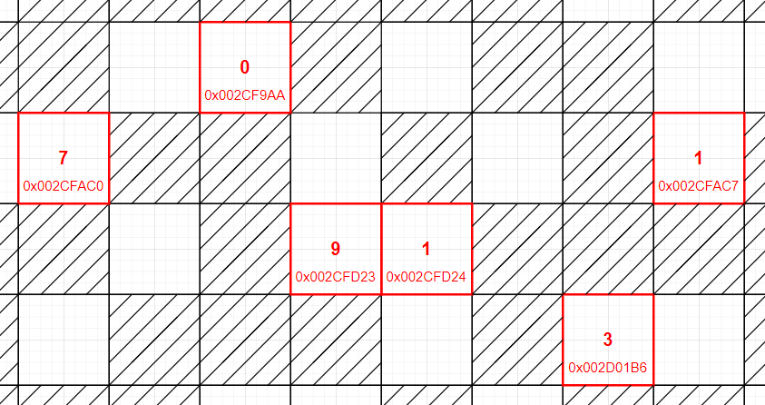
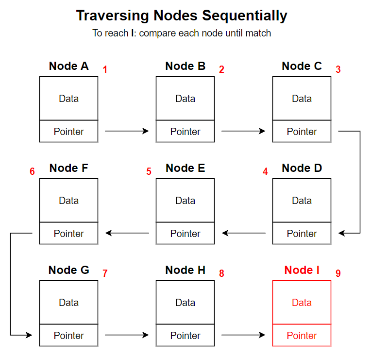
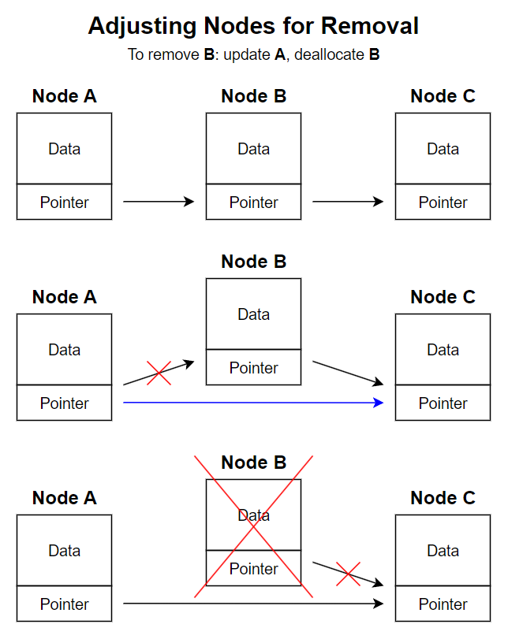
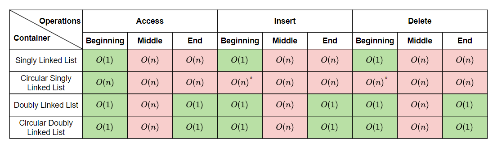

# &#128209; Table of Contents
- [💡 Overview](#-overview)
	- [Essential Terminology](#essential-terminology)
- [💻 Implementation](#-implementation)
	- [Core Mechanics](#core-mechanics)
	- [Existing Solutions](#existing-solutions)
	- [Repository Containers](#repository-containers)
- [📊 Analysis](#-analysis)
	- [Evaluating Characteristics](#evaluating-characteristics)
	- [Comparing Containers](#comparing-containers)
- [📝 Application](#-application)
	- [Common Use Cases](#common-use-cases)
	- [Some Practical Problems](#some-practical-problems)
- [🕙 Origins](#-origins)
- [🤝 Contributing](#-contributing)
- [📧 Contacts](#-contacts)
- [🙏 Credits](#-credits)
- [🔏 License](#-license)

# &#128161; Overview
**Linked List** is a data structure that stores elements as nodes, which are pointing to each other to maintain a sequence, allowing them to be not necessarily adjacent in memory. The name comes from its primary feature of elements being linked together. Knowledge and understanding of it lay a solid foundation in designing data structures and optimizing their application.

## Essential Terminology
- **Data Structure** — a theoretical model of data organization, used to design containers in an efficient or specific ways.
  - **Container** — a concrete implementation of data structure, used to manage actual data through specific operations. Since, in practice, containers are primarily used for the operations they provide and the guarantees they offer. As long as those guarantees are met, the underlying data structure can be changed or adapted.
- **Linked List** — a data structure that stores elements as nodes, which are pointing to each other to maintain a sequence, allowing them to be not necessarily adjacent in memory.
  - **Size** — the number of elements contained in the linked list. 
- **Node** — an individual entity within a collection, typically composed of several components that together form a structure (or class).
  - **Value** — a component of a node, representing the actual information stored within it. It can be anything from primitive types such as integers to more complex types like instances of classes.
  - **Pointer** — a component of a node, stores the memory address of the next node in the chosen sequence, depending on the type of linked list.
- **Head** — an ambiguous term often used to describe either of the following:
  - **Head Pointer** — a pointer to the first node in the linked list (not an actual node itself).
  - **Head Node** — the first node in the linked list.
- **Tail** — an ambiguous term often used to describe either of the following:
  - **Tail Pointer** — a pointer to the last node in the linked list (not an actual node itself).
  - **Tail Node** — the last node in the linked list.

# &#x1F4BB; Implementation 
Understanding the underlying mechanics of a data structure is essential to grasp how it operates and manages data. Since one data structure can have different implementations, it's crucial to recognize these distinctions, especially by learning from existing solutions, which often offer efficient, well-tested approaches to handling data and optimizing performance.

## Core Mechanics
The fundamental characteristic of linked lists is that elements are not stored in contiguous memory locations. This design inherently provides **sequential access**, meaning each node can only be reached by traversing nodes one by one, resulting in a linear time complexity of $O(n)$ for accessing any particular node. Consequently, as the number of nodes grows, the time required to reach any specific node also increases.

---
The true power of linked lists lies in their **dynamic structure**, which allows them to expand or contract as nodes are added or removed, without the limitations of fixed memory allocation. Operations such as insertion and deletion are achieved by updating pointers and performing corresponding memory actions only for involved nodes, without modifying the entire linked list. This approach enables efficient insertion and deletion at any known and accessible position in constant time $O(1)$. However, reaching an arbitrary position, as mentioned earlier, requires linear time $O(n)$.

## Existing Solutions
Quite often in computer science, there is ambiguity between definitions, as the term data structure typically refers to the abstract organization of data, focusing on logical operations such as insertion, deletion, and traversal. However, in practical applications, these data structures are implemented as containers, which not only provide these operations but also manage underlying performance and memory constraints.

---
When it comes to linked lists, there are two primary types (each with modification) tailored for different use cases and optimized for specific performance characteristics. While the detailed differences between these types can be found in their corresponding sections of this repository, here’s a brief description to give you a foundational understanding:
- **Singly Linked List** — a linked list implementation where each node, except the last one, points only to the next node in the sequence, allowing unidirectional forward traversal from the first to the last node.
- **Doubly Linked List** — a linked list implementation where each node, except the first and the last one, points both to the next and to the previous node in the sequence, allowing bidirectional traversal from the first to the last node and back.
- **Circular Linked Lists** — a modification to previous implementations, where where the last node in sequence points back to the first node, allowing for continuous traversal from any node.

---
It's generally recommended to rely on well-established, widely recognized implementations that already exist, rather than reinventing the wheel. Proven implementations provide optimized, reliable solutions while saving time and effort. In the context of C++, the Standard Template Library (STL) offers trusted containers for two types of linked list:
- **std::forward_list** — a container that encapsulates singly-linked list.
- **std::list** — a container that encapsulates doubly-linked list.

You may notice, however, that the STL does not provide built-in support for circular linked lists, either singly or doubly linked. This is because circular linked lists are less commonly used in general programming practice and are often specialized for particular applications, such as implementing circular buffers or round-robin schedulers. Their specific use cases can vary widely, making a general-purpose implementation less practical or beneficial in the standard library.

## Repository Containers
Understanding the design principles and core mechanics of linked list data structure is essential for deeper insight into their efficiency and performance. The following implementations provide simplified versions of singly, doubly, and circular linked lists showcasing key aspects of their design and operation.
- [Singly Linked List](https://github.com/vezzolter/DSA/tree/split-list//DataStructures/LinkedList/SinglyLinkedList) 🎯
- [Doubly Linked List](https://github.com/vezzolter/DSA/tree/split-list/DataStructures/LinkedList/DoublyLinkedList) 🎯
- [Circular Linked List](https://github.com/vezzolter/DSA/tree/split-list/DataStructures/LinkedList/CircularLinkedList) 🎯

# &#128202; Analysis
In practice, when analyzing a data structure, it's really about analyzing the containers that are based on that structure, because data structures themselves are theoretical concepts, whereas containers are the actual implementations you can use. Containers may not only perform the same operations differently, leading to distinct behaviors and performance characteristics, but they may also offer entirely different operations. Moreover, when working with existing solutions, each developer may implement the container in a unique way, resulting in additional variations. Therefore, it's always recommended to first consult the documentation to understand how the specific container operates and what guarantees it provides to the user.

## Evaluating Characteristics
- **Time Complexities** — refers to the speed of operations (e.g. insertion, deletion, etc) at different edge cases (e.g. at the end, in an empty container, etc).
- **Space Expenses** — refers to how much memory the container requires, both in terms of the data stored and any additional overhead (e.g. pointers, resizing buffers, etc). 
- **Special Metrics** — refers to features that define the container's uniqueness in comparison to others (e.g. balancing for trees, specific element order for queues, etc).

## Comparing Containers
For detailed evaluations of specific container characteristics, please refer to the corresponding container directories. Here, I will provide a comparison table that serves as a quick reference for the time complexities of core-defining operations, allowing for easy look-up and comparison across containers for this data structure.

# &#128221; Application
The concrete situations where a data structure is best (and worst) used stem directly from the inherent advantages (and disadvantages) of the container. For example, one advantage of a doubly linked list is its efficient insertion and deletion that don’t require restructuring the entire list. Therefore, a suitable use case would be a scenario with frequent modifications, while an anti-use case would involve situations where the structure remains largely static with few modifications. In order to avoid, this sort of rephrasing, the following section outlines common real-world scenarios where these use cases are frequently encountered. Additionally, familiarizing oneself with common practical problems and practicing their solutions ensures that you remember the essential details and develop a deep, intuitive understanding of the functionality and limitations.

## Common Use Cases
- **Dynamic Data Storage** — linked lists are ideal for handling collections of data that require frequent updates or dynamic resizing, such as in real-time applications. They allocate memory only as needed and allow for efficient insertion and deletion without shifting elements.

- **Implementing Stacks and Queues** — linked lists are often used as the underlying structure for stacks and queues. They allow for efficient insertion and deletion at the beginning or end, which is essential for these data structures.

- **Graph and Tree Representations** — linked lists are often used to represent adjacency lists in graph structures or as nodes in tree structures. They provide efficient ways to store connections between nodes and manage hierarchical data.

- **Circular Buffers** — circular linked lists are commonly used to implement circular buffers, which are essential in situations requiring continuous data processing, such as audio processing or network packet handling. They enable efficient, continuous traversal from the end of the list back to the beginning.

- **Navigation Functionality** — linked lists used in application that can track states, such as browser history or text editors. Each change can be stored as a node, allowing easy traversal through previous and next states.

## Some Practical Problems
**Easy Problems:**
1. [Reverse Linked List](https://leetcode.com/problems/reverse-linked-list)
2. [Merge Two Sorted Lists](https://leetcode.com/problems/merge-two-sorted-lists)
3. [Remove Duplicates from Sorted List](https://leetcode.com/problems/remove-duplicates-from-sorted-list)
4. [Linked List Cycle](https://leetcode.com/problems/linked-list-cycle)
5. [Intersection of Two Linked Lists](https://leetcode.com/problems/intersection-of-two-linked-lists)
6. [Middle of the Linked List](https://leetcode.com/problems/middle-of-the-linked-list)

---
**Medium Problems:** 
1. [Reorder List](https://leetcode.com/problems/reorder-list)
2. [Remove Nth Node From End of List](https://leetcode.com/problems/remove-nth-node-from-end-of-list)
3. [Copy List with Random Pointer](https://leetcode.com/problems/copy-list-with-random-pointer)
4. [Add Two Numbers](https://leetcode.com/problems/add-two-numbers)
5. [LRU Cache](https://leetcode.com/problems/lru-cache)
6. [Partition List](https://leetcode.com/problems/partition-list)
7.  [Split Linked List in Parts](https://leetcode.com/problems/split-linked-list-in-parts)
8.  [Design Browser History](https://leetcode.com/problems/design-browser-history)
9.  [Design Twitter](https://leetcode.com/problems/design-twitter)

---
**Hard Problems:** 
1. [Reverse Nodes in k-Group](https://leetcode.com/problems/reverse-nodes-in-k-group)
2. [Merge k Sorted Lists](https://leetcode.com/problems/merge-k-sorted-lists)
3. [LFU Cache](https://leetcode.com/problems/lfu-cache)
4. [Design Skiplist](https://leetcode.com/problems/design-skiplist)
5. [All O`one Data Structure](https://leetcode.com/problems/all-oone-data-structure)
6. [Design a Text Editor](https://leetcode.com/problems/design-a-text-editor)

# &#x1F559; Origins
The concept of the linked list doesn’t have a single inventor, but it has evolved over time as a solution to dynamic data storage needs in programming. Here are some significant milestones and developments that have shaped the linked list into the fundamental data structure it is today:

- In the **early 1950s**, **RAND Corporation** implemented one of the earliest forms of linked lists for the **ERMA (Electronic Recording Machine, Accounting)** project to handle banking records. This early use case demonstrated the value of linked structures for managing dynamically growing datasets.

- In **1955**, **Allen Newell**, **Cliff Shaw**, and **Herbert Simon** developed a linked list implementation for the **Logic Theory Machine**, one of the first artificial intelligence programs. They used a linked structure to represent mathematical logic proofs, highlighting the flexibility of linked lists for dynamically changing data.

- **1960** saw the introduction of **LISP**, a programming language created by **John McCarthy** that relied heavily on linked lists to represent symbolic expressions. Linked lists became a core structure in LISP, demonstrating their usefulness in languages centered on symbolic computation and recursive data structures.

- In **1972**, the **C programming language** further advanced the use of linked lists by providing low-level memory management capabilities. This allowed programmers to create and manipulate linked lists efficiently by directly controlling pointers, solidifying linked lists as a core structure in system-level programming.

- In the **1980s and 1990s**, with the growth of object-oriented programming, linked lists found renewed importance as languages like **C++** and **Java** provided built-in support for linked lists in their standard libraries. This development made linked lists more accessible to programmers, reinforcing their status as an essential data structure.

# &#129309; Contributing
Contributions are highly appreciated! For detailed guidelines, please refer to the [root directory's contributing section](../../#-contributing).

# &#128231; Contacts
For contact details and additional information, please refer to the [root directory's contact information section](../../#-contacts).

# &#128591; Credits
Currently in Progress...

# &#128271; License
This project is licensed under the MIT License — see the [LICENSE](https://github.com/vezzolter/DSA/blob/main/LICENSE) file for details.

