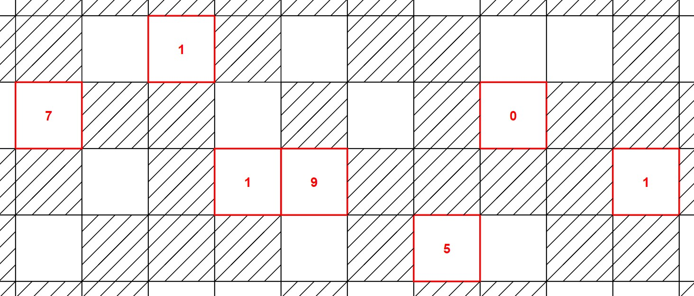
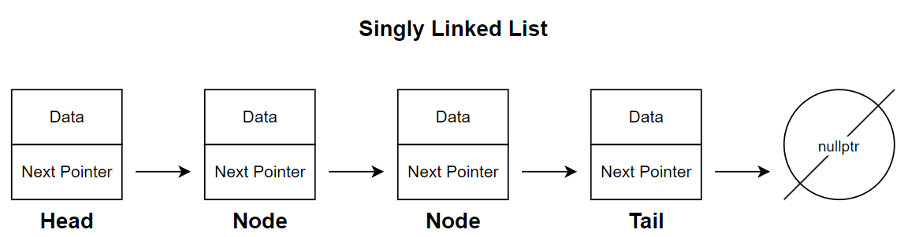
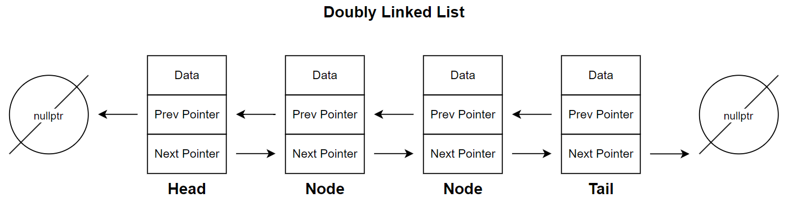
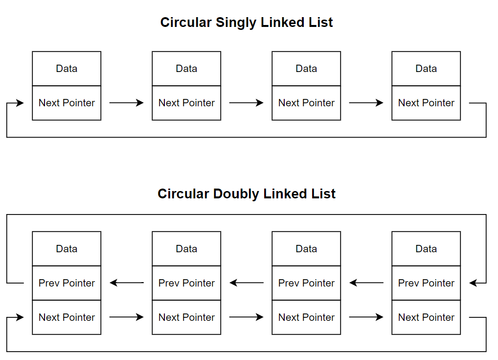
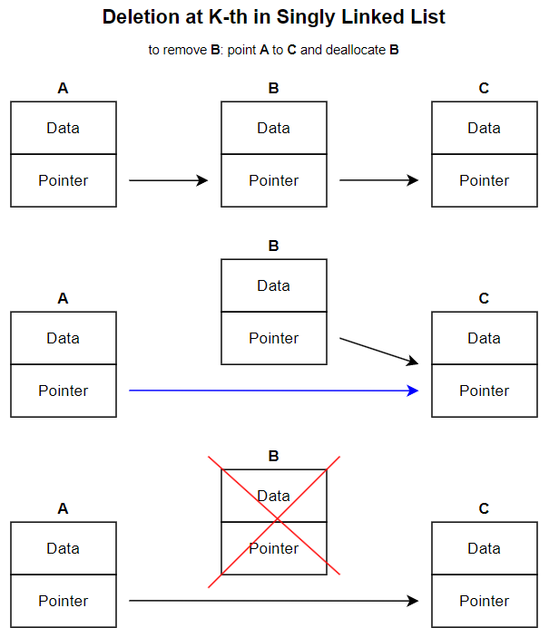
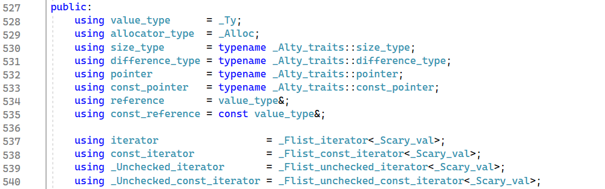
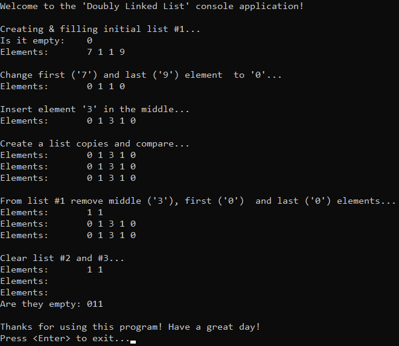
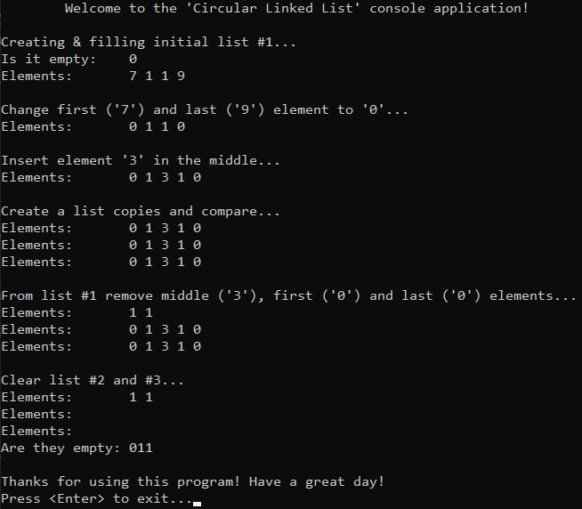

# &#128209; Table of Contents
- [💡 What is the Linked List](#-what-is-the-linked-list)
- [💻 Implementation](#-implementation)
  - [Singly Linked List](#singly-linked-list)
  - [Doubly Linked List](#doubly-linked-list)
  - [Circular Linked List](#circular-linked-list)
- [📊 Analysis](#-analysis)
- [📝 Application](#-application)
- [⏳ Historical Notes](#-historical-notes)
- [🤝 Contributing](#-contributing)
- [📧 Contact Information](#-contact-information)
- [🙏 Credits](#-credits)
- [🔏 License](#-license)


# &#128161; What is the Linked List

A linked list, a fundamental data structure in computer programming, becomes particularly valuable when the primary objective involves traversing a collection of items sequentially, one by one. In contrast to arrays, linked lists allow for non-contiguous memory allocation, offering a dynamic and flexible approach to data organization.

This subsection explores the Abstract Data Type (ADT) of Linked List not only to enhance understanding, but also to establish a solid foundation for approaching more intricate data structures.


<p align="center"></p>

---

**Linked List** — is a linear data structure, consists of elements named as nodes that are linked together using pointers, because they are not necessarily adjacent in memory. It introduces the following essential terms:
- **Node** — each individual element contained within the list. Consists of two main components: data and pointer.
- **Data** — holds the actual value associated with the node.
- **Pointer** — stores the memory address of the next node in the sequence.
- **Head** — first node in the list.
- **Tail** — last node in the list.

---

When it comes to implementation, lists can be broadly classified into three types: singly linked list, doubly linked list and cirular linked list. While these types share some common ideas, each possesses distinctive characteristics. The choice between them depends on the specific requirements of the case at hand.

**Singly Linked List** — is a list, each node contains only one pointer to the next node in the sequence, enabling unidirectional traversal: forward from the head to the tail. The last node's "next pointer" points to nullptr, indicating the end of the list.


<p align="center"></p>

**Doubly Linked List** — is a list, where each node contains an additional pointer to the previous node in the sequence enabling bidirectional traversal: forward from the head to the tail and backward from the tail to the head. The first node's "previous pointer" and the last node's "next pointer" point to nullptr, indicating the start and end of the list, respectively.

<p align="center"></p>

**Circular Linked List** — is a list, where the last node points back to the head node. Allow for circular traversal, which can be unidirectional (if nodes are singly linked) or bidirectional (if nodes are doubly linked).

<p align="center"></p>


---

**Common Operations for ADT Linked List:**
- **Traversal** — iterating through the elements of the list.
- **Acess** — retrieving or updating the value of an existing element.
- **Insertion** — adding a new element to the list.
- **Deletion** — removing an element from the list.
- **Search** — locating a specific element within the list.
- **Sorting** — arranging the elements of the list in a specific order.
- **Merging** — combining two lists into one.
- **Splitting** — dividing the list into two or more parts.
- **Filtering** — selecting specific elements based on certain criteria.


---

**"Size-Consistent" Operations**

Lists provide **sequential access** meaning that we need to traverse the list's elements one by one in order to access them, which certainly requires time. Furthermore, as as the number of nodes in the list increases, the time required to traverse to a particular location also does. This results in the conclusion, that linked lists are not the preferred option in scenarios where you have to perform lots of operation that dona lot or the data structure size remains constant, although they still can be a natural fit for some cases.

<p align="center"></p>

---

**"Size-Manipulating" Operations**

The true power of linked lists lies in the flexible nature of the size. Dynamic memory allocation of lists allow for flexible resizing, making them suitable for scenarios where the size of the data structure needs to change frequently. All of the "size-manipulating operations" are based on the the principle of "updating" nodes' pointers. Rather than delving into the intricacies of every possible operation, I'll illustrate a fundamental example of deleting an element that encapsulates the essence of the concept.

<p align="center"></p>


# &#x1F4BB; Implementation 
Discussing ADT, it's evident that well-established and widely recognized implementations already exist for singly, doubly and circular linked lists. In the context of C++, `std::forward_list` is a representative of singly linked list, and `std::list` stands as the counterpart for doubly linked list. Both of them, can be altered to create circular structure via manual pointers manipulation.  It's commonly recommended to rely on these proven implementations rather than reinventing the wheel. However, within the scope of this subsection, we'll take a closer look at simplified versions of these lists. This exploration is aimed at gaining a deeper understanding of the fundamental concepts that underlie them.


##  Singly Linked List

**Detailed Overview**:
1. Keeping its educational aim in mind, the `SLL` class developed here closely resembles the behavior of `std::forward_list`, with minor adjustments aimed at emphasizing simplicity and focusing on the core aspects of the data structure.
2. One significant simplification is the omission of the iterator classes as a member variables. This decision was made to avoid the complexities associated with navigating the intricate hierarchy of iterator classes and templates found in `std::forward_list`, allowing to maintain focus on the key features of the ADT.

<p align="center"></p>

3. The `SLL` class is declared in `SinglyLinkedList.h` header file and defined in `SinglyLinkedList.cpp` source file. This approach is adopted to ensure encapsulation, modularity and compilation efficiency. Testing of the class functionalities is conducted within the `main()` function located in the `Main.cpp` file.
4. Whole class declaration:
```cpp
template<class T>
class SLL
{
private:
	template<class T>
	struct Node {
	public:
		T _data; 
		Node* _next;

		// Special Member Functions
		Node(const T& newData, Node* nextNode = nullptr) 
			: _data(newData), _next(nextNode) {}
		Node()                           = default;
		Node(const Node& rhs)            = delete;
		Node& operator=(const Node& rhs) = delete;
	};

	int _size;
	Node<T>* _head;

public:
	// Special Member Functions
	SLL();
	// SLL(const std::initializer_list<T>& initList); remove due to init list
	SLL(const SLL& rhs);
	SLL& operator=(const SLL& rhs);
	~SLL();

	// Element Access
	T& operator[](const int index);
	T& operator[](const int index) const;
	T& front();
	const T& front() const;

	// Capacity 
	bool empty() const;
	int size() const;

	// Modifiers
	void clear();
	void insertAfter(const int index, const T& newData);
	void eraseAfter(const int index);
	void pushFront(const T& newData);
	void popFront();
};
```

5. Special member functions:
```cpp
// Default Constructor
template<typename T>
SLL<T>::SLL() : _size(0), _head(nullptr) {}

//// Parametrized constructor
//template<class T>
//SLL<T>::SLL(const std::initializer_list<T>& initList) { }

// Deep copy constructor 
template<class T>
SLL<T>::SLL(const SLL& rhs) {
	// Set corresponding size
	_size = rhs._size;

	// Case: empty list
	if (rhs._head == nullptr) {
		_head = nullptr;
		return;
	}

	// Create corresponding first node
	_head = new Node<T>(rhs._head->_data);

	// Initialize traversal pointers
	Node<T>* currentRhs = rhs._head->_next;
	Node<T>* current = _head;

	// Copy other nodes
	while (currentRhs) {
		current->_next = new Node<T>(currentRhs->_data);
		current = current->_next;
		currentRhs = currentRhs->_next;
	}
}

// Deep copy assignment operator
template<class T>
SLL<T>& SLL<T>::operator=(const SLL& rhs) {
	// Self-assignment guard
	if (this == &rhs)
		return *this;

	// Ensure that the destination list doesn't retain any of its existing elements
	clear();

	// Set corresponding size
	_size = rhs._size;

	// Case: empty list
	if (rhs._head == nullptr) {
		_head = nullptr;
		return *this;
	}

	// Create corresponding first node
	_head = new Node<T>(rhs._head->_data);

	// Initialize traversal pointers
	Node<T>* currentRhs = rhs._head->_next;
	Node<T>* current = _head;

	// Copy other nodes
	while (currentRhs) {
		current->_next = new Node<T>(currentRhs->_data);
		current = current->_next;
		currentRhs = currentRhs->_next;
	}

	_head = current;

	return *this;
}

// Destructor
template<typename T>
SLL<T>::~SLL() { clear(); }
```

6. Element access:
```cpp
// Access the element at the specified index, allows modification
template<class T>
T& SLL<T>::operator[](const int index) {
	// TODO: range check

	// Initialize traversal variables
	int counter = 0;
	Node<T>* current = _head;

	while (current != nullptr) {
		// Return value of matched node
		if (counter == index) {
			return current->_data;
		}
		// Otherwise keep traversing
		current = current->_next;
		counter++;
	}
}

// Access the element at the specified index, denies modification
template<class T>
T& SLL<T>::operator[](const int index) const {
	// TODO: range check

	// Initialize traversal variables
	int counter = 0;
	Node<T>* current = _head;

	while (current != nullptr) {
		// Return value of matched node
		if (counter == index) {
			return current->_data;
		}
		// Otherwise keep traversing
		current = current->_next;
		counter++;
	}
}

// Returns a reference to the first element in the container, allows modification
template<class T>
T& SLL<T>::front() {
	// TODO: handle empty case

	return _head->_data;
}

// Returns a reference to the first element in the container, denies modification
template<class T>
const T& SLL<T>::front() const {
	// TODO: handle empty case

	return _head->_data;
}
```

7. Capacity methods:
```cpp
// Checks if the container has no elements
template<class T>
bool SLL<T>::empty() const { return _size == 0; }

// Returns the number of elements in the container
template<typename T>
int SLL<T>::size() const { return _size; }
```

8. Modifiers:
```cpp
// Erases all elements from the container
template<typename T>
void SLL<T>::clear() {
	// Case: empty list
	if (!_head)
		return;
	
	// Traverse the list and deallocate memory for each node
	while (_head) {
		Node<T>* current = _head;
		_head = _head->_next;
		delete current;
	}

	// Update the state of list
	_size = 0;
	_head = nullptr;
}

// Inserts elements after the specified position in the container
template<class T>
void SLL<T>::insertAfter(const int index, const T& newData) {
	// TODO: range check

	if (index == 0) {
		pushFront(newData);
	}
	else {
		// Create a new node with the given data
		Node<T>* newNode = new Node<T>(newData);

		// Find the node at the specified index
		Node<T>* current = _head;
		for (int i = 0; i < index - 1; i++) {
			current = current->_next;
		}

		// Insert the new node after the current one
		newNode->_next = current->_next;
		current->_next = newNode;

		// Update the size
		++_size;
	}
}

// Removes an element at the specified position
template<class T>
void SLL<T>::eraseAfter(const int index) {
	// TODO: range check

	if (index == 0) {
		popFront();
	}
	else {
		// Traverse to the node before the node to be erased
		Node<T>* current = _head;
		for (int i = 0; i < index; ++i) {
			current = current->_next;
		}

		// Remove
		Node<T>* nodeToDelete = current->_next;
		current->_next = nodeToDelete->_next;
		delete nodeToDelete;

		// Update the size
		--_size;
	}
}

// Prepends the given element value to the beginning of the container
template<typename T>
void SLL<T>::pushFront(const T& newData) {
	// Create a new node with the given data
	Node<T>* newNode = new Node<T>(newData);

	// Case: empty list
	if (_size == 0) {
		_head = newNode;
	}
	else {
		// Push front
		newNode->_next = _head;
		_head = newNode;
	}

	// Update the size
	++_size;
}

// Removes the first element of the container
template<class T>
void SLL<T>::popFront() {
	// TODO: range check

	// Case: one element
	if (_size == 1) {
		clear();
		return;
	}

	// Move the head pointer to the next node
	Node<T>* temp = _head;
	_head = _head->_next;
	delete temp;

	// Update the size
	--_size;
}
```

9. Demonstration:
```cpp
void printList(const SLL<int>& list) {
	std::cout << "Elements:\t";
	for (int i = 0; i < list.size(); i++) {
		std::cout << list[i] << " ";
	}
	std::cout << std::endl;
}

int main()
{
	// Greet
	std::cout << "\tWelcome to the 'Singly Linked List' console application!\n\n";

	// Create initial list
	std::cout << "Creating & filling initial list #1...\n";
	SLL<int> list1;
	list1.pushFront(9);
	list1.pushFront(1);
	list1.pushFront(1);
	list1.pushFront(7);

	// Show list #1
	std::cout << "Is it empty:\t" << list1.empty() << std::endl;
	printList(list1);

	// Modify list #1
	std::cout << "\nChange first element ('7') to '5'...\n";
	list1.front() = 5;
	printList(list1);

	// Insert into list #1
	std::cout << "\nInsert element '3' in the middle...\n";
	list1.insertAfter(list1.size()/2, 3);
	printList(list1);

	// Deep copy functionality
	std::cout << "\nCreate a list copies and compare...\n";
	SLL<int> list2(list1);
	SLL<int> list3 = list1;
	printList(list1);
	printList(list2);
	printList(list3);

	// Remove functionality
	std::cout << "\nFrom list #1 remove first ('5') and last ('9') elements...\n";
	list1.popFront();
	list1.eraseAfter(list1.size() - 2);
	printList(list1);
	printList(list2);
	printList(list3);

	// Clear
	std::cout << "\nClear list #2 and #3...\n";
	list2.clear();
	list3.clear();
	printList(list1);
	printList(list2);
	printList(list3);
	std::cout << "Are they empty: ";
	std::cout << list1.empty();
	std::cout << list2.empty();
	std::cout << list3.empty();
	std::cout << std::endl;

	// Exit
	std::cout << "\nThanks for using this program! Have a great day!\n";
	std::cout << "Press <Enter> to exit...";
	std::cin.clear(); // ensure that stream is in a good state
	std::cin.ignore(32767, '\n'); // clear from any remaining chars
	std::cin.get();
	return 0;
```

<p align="center"></p>


##  Doubly Linked List
**Detailed Overview**:
1. Keeping its educational aim in mind, the `DLL` class developed here closely resembles the behavior of `std::list`, with minor adjustments aimed at emphasizing simplicity and focusing on the core aspects of the data structure.
2. One significant simplification is the omission of the iterator classes as a member variables. This decision was made to avoid the complexities associated with navigating the intricate hierarchy of iterator classes and templates found in `std::list`, allowing to maintain focus on the key features of the ADT.

<p align="center"></p>

3. The `DLL` class is declared in `DoublyLinkedList.h` header file and defined in `DoublyLinkedList.cpp` source file. This approach is adopted to ensure encapsulation, modularity and compilation efficiency. Testing of the class functionalities is conducted within the `main()` function located in the `Main.cpp` file.
4. Whole class declaration:
```cpp
template<class T>
class DLL
{
private:
	template<class T>
	struct Node {
	public:
		T _data;
		Node* _next;
		Node* _prev;
		
		// Special Member Functions
		Node(const T& newData, Node* nextNode = nullptr, Node* prevNode = nullptr)
			: _data(newData), _next(nextNode), _prev(prevNode) {}
		Node()                           = default;
		Node(const Node& rhs)            = delete;
		Node& operator=(const Node& rhs) = delete;
	};

	int _size;
	Node<T>* _head;
	Node<T>* _tail;

	// Facilitator method
	Node<T>* getStartingNode(int index) const; 

public:
	// Special Member Functions
	DLL();
	// DLL(const std::initializer_list<T>& initList); remove due to init list
	DLL(const DLL& rhs);
	DLL& operator=(const DLL& rhs);
	~DLL();

	// Element Access
	T& operator[](const int index);
	T& operator[](const int index) const;
	T& front();
	const T& front() const;
	T& back();
	const T& back() const ;

	// Capacity 
	bool empty() const;
	int size() const;

	// Modifiers
	void clear();
	void insert(const int index, const T& newData);
	void erase(const int index);
	void pushFront(const T& newData);
	void popFront();
	void pushBack(const T& newData);
	void popBack();
};
```

5. Facilitator Method (replaces iterator functionaly of determining whether to start from head or tail):
```cpp
// Determine whether to start traversal from the head or tail
template<typename T>
typename DLL<T>::Node<T>* DLL<T>::getStartingNode(int index) const {
	Node<T>* startingNode;
	int distanceFromHead = index;
	int distanceFromTail = _size - index - 1;

	if (distanceFromHead <= distanceFromTail) {
		startingNode = _head;
		for (int i = 0; i < index; ++i) {
			startingNode = startingNode->_next;
		}
	}
	else {
		startingNode = _tail;
		for (int i = _size - 1; i > index; --i) {
			startingNode = startingNode->_prev;
		}
	}

	return startingNode;
}
```

6. Special member functions:
```cpp
// Default constructor
template<typename T>
DLL<T>::DLL() : _size(0), _head(nullptr), _tail(nullptr) {}

//// Parametrized constructor
//template<class T>
//DLL<T>::DLL(const std::initializer_list<T>& initList) { }

// Deep copy constructor
template<class T>
DLL<T>::DLL(const DLL& rhs) {
	// Set corresponding size
	_size = rhs._size;

	// Case: empty list, avoid dangling pointers
	if (rhs._head == nullptr) {
		_head = _tail = nullptr;
		return;
	}

	// Create corresponding first node
	_head = new Node<T>(rhs._head->_data);

	// Initialize traversal pointers
	Node<T>* currentRhs = rhs._head->_next;
	Node<T>* current = _head;

	// Copy other nodes
	while (currentRhs) {
		current->_next = new Node<T>(currentRhs->_data);
		current->_next->_prev = current;
		current = current->_next;
		currentRhs = currentRhs->_next;
	}

	// Maintain proper reference to the end
	_tail = current;
}

// Deep copy assignment operator
template<class T>
DLL<T>& DLL<T>::operator=(const DLL& rhs) {
	// Self-assignment guard
	if (this == &rhs) 
		return *this;

	// Ensure that the destination list doesn't retain any of its existing elements
	clear();

	// Set corresponding size
	_size = rhs._size;

	// Case: empty list, avoid dangling pointers
	if (rhs._head == nullptr) {
		_head = _tail = nullptr;
		return *this;
	}

	// Create corresponding first node
	_head = new Node<T>(rhs._head->_data);

	// Initialize traversal pointers
	Node<T>* currentRhs = rhs._head->_next;
	Node<T>* current = _head;

	// Copy other nodes
	while (currentRhs) {
		current->_next = new Node<T>(currentRhs->_data);
		current->_next->_prev = current;
		current = current->_next;
		currentRhs = currentRhs->_next;
	}

	// Maintain proper reference to the end
	_tail = current;

	return *this;
}

// Destructor
template<typename T>
DLL<T>::~DLL() { clear(); }
```

6. Element access:
```cpp
// Access the element at the specified index, allows modification
template<class T>
T& DLL<T>::operator[](const int index) {
	// TODO: range check
 
	// Traverse to the required node
	Node<T>* current = getStartingNode(index);

	return current->_data;
}

// Access the element at the specified index, denies modification
template<class T>
T& DLL<T>::operator[](const int index) const {
	// TODO: range check

	// Traverse to the required node
	Node<T>* current = getStartingNode(index);

	return current->_data;
}

// Returns a reference to the first element in the container, allows modification
template<class T>
T& DLL<T>::front() {
	// TODO: handle empty case

	return _head->_data;
}

// Returns a reference to the first element in the container, denies modification
template<class T>
const T& DLL<T>::front() const {
	// TODO: handle empty case

	return _head->_data;
}

// Returns a reference to the last element in the container, allows modification
template<class T>
T& DLL<T>::back() {
	// TODO: handle empty case

	return _tail->_data;
}

// Returns a reference to the last element in the container, denies modification
template<class T>
const T& DLL<T>::back() const {
	// TODO: handle empty case

	return _tail->_data;
}
```

7. Capacity methods:
```cpp
// Checks if the container has no elements
template<class T>
bool DLL<T>::empty() const { return _size == 0; }

// Returns the number of elements in the container
template<typename T>
int DLL<T>::size() const { return _size; }
```

8. Modifiers:
```cpp
// Erases all elements from the container
template<typename T>
void DLL<T>::clear() {
	// Case: empty list
	if (!_head)
		return;

	// Traverse the list and deallocate memory for each node
	while (_head) {
		Node<T>* current = _head;
		_head = _head->_next;
		delete current;
	}

	// Update the state of list
	_size = 0;
	_tail = _head = nullptr;
}

// Inserts elements after the specified position in the container
template<class T>
void DLL<T>::insert(const int index, const T& newData) {
	// TODO: range check

	if (index == 0) {
		pushFront(newData);
	}
	else if (index == _size - 1) {
		pushBack(newData);
	}
	else {
		// Insert new node at specified position
		Node<T>* prevNode = getStartingNode(index - 1);
		Node<T>* newNode = new Node<T>(newData);
		newNode->_next = prevNode->_next;
		newNode->_prev = prevNode;
		prevNode->_next = newNode;

		// Update the size
		++_size;
	}
}

// Removes an element at the specified position
template<class T>
void DLL<T>::erase(const int index) {
	// TODO: range check

	if (index == 0) {
		popFront();
	}
	else if (index == _size - 1) {
		popBack();
	}
	else {
		// Remove specified node
		Node<T>* prevNode = getStartingNode(index - 1);
		Node<T>* nodeToErase = prevNode->_next;
		prevNode->_next = nodeToErase->_next;
		nodeToErase->_next->_prev = prevNode;
		delete nodeToErase;

		// Update the size
		--_size;
	}
}

// Prepends the given element value to the beginning of the container
template<typename T>
void DLL<T>::pushFront(const T& newData) {
	// Create a new node with the given data
	Node<T>* newNode = new Node<T>(newData);

	// Case: empty list
	if (_size == 0) {
		_head = _tail = newNode;
	}
	else {
		// Push front
		_head->_prev = newNode;
		newNode->_next = _head;
		_head = newNode;
	}
	
	// Update the size
	++_size;
}

// Removes the first element of the container
template<class T>
void DLL<T>::popFront() {
	// TODO: range check

	// Case: one element
	if (_size == 1) {
		clear();
		return;
	}
	
	// Move the head pointer to the next node
	Node<T>* temp = _head;
	_head = _head->_next;
	_head->_prev = nullptr;
	delete temp;

	// Update the size
	--_size;
}

// Appends the given element to the end of the container
template<class T>
void DLL<T>::pushBack(const T& newData) {
	// Create a new node with the given data
	Node<T>* newNode = new Node<T>(newData);

	// Case: empty list
	if (_size == 0) { 
		_head = _tail = newNode;
	}
	else {
		// Push back
		_tail->_next = newNode;
		newNode->_prev = _tail;
		_tail = newNode;
	}
	

	// Update the size
	++_size;
}

// Removes the last element of the container
template<class T>
void DLL<T>::popBack() {
	// TODO: range check

	// Case: one element
	if (_size == 1) {
		clear();
		return;
	}

	// Move the tail pointer to the previous node
	_tail = _tail->_prev;
	delete _tail->_next;
	_tail->_next = nullptr;

	// Update the size
	--_size;
}
```

9. Demonstration:
```cpp
void printList(const DLL<int>& list) {
	std::cout << "Elements:\t";
	for (int i = 0; i < list.size(); i++) {
		std::cout << list[i] << " ";
	}
	std::cout << std::endl;
}

int main()
{
	// Greet
	std::cout << "\tWelcome to the 'Doubly Linked List' console application!\n\n";

	// Create initial list
	std::cout << "Creating & filling initial list #1...\n";
	DLL<int> list1;
	list1.pushFront(7);
	list1.pushBack(1);
	list1.pushBack(1);
	list1.pushBack(9);

	// Show list #1
	std::cout << "Is it empty:\t" << list1.empty() << std::endl;
	printList(list1);

	// Modify list #1
	std::cout << "\nChange first ('7') and last ('9') element to '0'...\n";
	list1.front() = 0;
	list1.back() = 0;
	printList(list1);

	// Insert into list #1
	std::cout << "\nInsert element '3' in the middle...\n";
	list1.insert((list1.size() / 2), 3);
    printList(list1);

	// Deep copy functionality
	std::cout << "\nCreate a list copies and compare...\n";
	DLL<int> list2(list1);
	DLL<int> list3 = list1;
	printList(list1);
	printList(list2);
	printList(list3);

	// Remove functionality
	std::cout << "\nFrom list #1 remove middle ('3'), first ('0') and last ('0') elements...\n";
	list1.erase(list1.size() / 2);
	list1.popFront();
	list1.popBack();
	printList(list1);
	printList(list2);
	printList(list3);

	// Clear
	std::cout << "\nClear list #2 and #3...\n";
	list2.clear();
	list3.clear();
	printList(list1);
	printList(list2);
	printList(list3);
	std::cout << "Are they empty: ";
	std::cout << list1.empty();
	std::cout << list2.empty();
	std::cout << list3.empty();
	std::cout << std::endl;

	// Exit
	std::cout << "\nThanks for using this program! Have a great day!\n";
	std::cout << "Press <Enter> to exit...";
	std::cin.clear(); // ensure that stream is in a good state
	std::cin.ignore(32767, '\n'); // clear from any remaining chars
	std::cin.get();
	return 0;
}
```
<p align="center"></p>


##  Circular Linked List
Circular linked lists can be implemented based on either singly or doubly linked lists. This implementation doesn't fundamentally alter the functionality; rather, it changes how operations are performed. Unlike standard linked lists, there isn't a built-in container for circular linked lists in the STL. Therefore, I chose to implement it based on a doubly linked list for personal preference.

The concept behind creating this type of container revolves around ensuring that the tail node's next pointer points to the head and vice versa. This necessitates minor adjustments to the overall structure to avoid circular references. Specifically, it means you can't iterate through the list by checking for nullptr, and it requires assigning proper values to the pointers after making corresponding changes. For the complete implementation, please refer to the [project's directory](https://github.com/vezzolter/DSA/tree/main/DataStructures/LinkedList/CircularLinkedList). Here, I'll provide a simple examples:

You can't iterate via check for nullptr:
```cpp
// Deep copy assignment operator
template<class T>
CLL<T>& CLL<T>::operator=(const CLL& rhs) {
	// Self-assignment guard
	if (this == &rhs)
		return *this;

	clear();
	_size = rhs._size;

	// Case: empty list
	if (rhs._head == nullptr) {
		_head = _tail = nullptr;
		return *this;
	}

	_head = new Node<T>(rhs._head->_data);
	Node<T>* currentRhs = rhs._head->_next;
	Node<T>* current = _head;
	Node<T>* originalHead = rhs._head; // Save the original head of the list

	while (currentRhs != originalHead) {
		current->_next = new Node<T>(currentRhs->_data);
		current->_next->_prev = current;
		current = current->_next;
		currentRhs = currentRhs->_next;
	}

	// Make the list circular
	_tail = current;
	_tail->_next = _head;
	_head->_prev = _tail;

	return *this;
}
```

You have to ensure, that referrences to the tail/head are proper:
```cpp
// Prepends the given element value to the beginning of the container
template<typename T>
void CLL<T>::pushFront(const T& newData) {
	Node<T>* newNode = new Node<T>(newData);

	// Case: empty list
	if (_size == 0) { 
		_head = _tail = newNode;
		newNode->_next = newNode->_prev = newNode; // Make the list circular
	}
	else {
		// Push front
		newNode->_next = _head;
		newNode->_prev = _tail;
		_head->_prev = newNode;
		_head = newNode;

		// Update the tail's next pointer to point to the new head
		_tail->_next = _head;
	}

	++_size;
}
```

Overall, the demonstration looks pretty much the same:
<p align="center"></p>


# &#128202; Analysis

**Advantages:**
- **Efficient Element Rearraging** — elements is efficient due to simple change of pointers, e.g. insertion and deletion takes $O(1)$ time.
- **Diverse Memory Allocation** — in some scenarios, where it is hard to allocate a single-block of memory, linked list can come in handy, due to the distribution of cells throughout the memory.
- **Minimizing Unused Space** — unused nodes can be removed, preventing them from occupying memory cells intended for other data.

---

**Disadvantages:**
- **Inefficient Sequential Access** — in order to reach a specific element, it is necessary to traverse through the other elements first, e.g. access and search takes $O(n)$ time.
- **Additional Memory Consumption** — each node requires memory allocation not only for the data but also for the pointers.


# &#128221; Application

**Some of the Most Well-Known Use Cases:**
- **Algorithms and Data Structures** — graph path traversal algorithms and various data structures like stacks, queues, hash tables, tree and graphs representations often use lists as their underlying structure.

- **Back/Next Functionality** — linked lists are commonly utilized in implementing back/next navigating functionality, such as in web browsers with nodes as web pages or music players with nodes as songs.

- **Undo/Redo Functionality** — something similar to previous point, but desribes the cases, where each action performed by the user is stored as a node in separate linked lists, therefore allowing users to revert to previous states of the application or redo previously undone actions by traversing the respective lists.

- **Scheduling/Ordering** — each task or element is represented as a node in the linked list, and scheduling decisions are made based on the order (by priority, arrival time, or other criteria) of nodes in the list. 

- **File System Management** — lists used in file system management for maintaining directory structures, file metadata, and file allocation tables, where each directory entry or file descriptor is stored as a node, facilitating efficient traversal and manipulation of file system objects.

---

**Common Practical Problems:**
- Reverse a linked list.
- Delete without head pointer.
- Remove duplicate elements from sorted linked list.
- Mergea linked list into another linked list at alternate positions.
- Finding the length of a loop in linked list.
- Occurence of an integer in a Linked List.
- Convert singly linked list into circular linked list.
- Merge two sorted linked lists.
- Intersection point of two Linked Lists.
- Swap Kth node from beginning with Kth node from end in a Linked List.
- Convert a given Binary Tree to Doubly Linked List.
- Rearrange a given linked list in-place.
- Flattening a Linked List.
- Partition a linked list around a given value.
- Move Last Element of Linked List to Front.
- Sort a Linked List which is already sorted on absolute values.


# &#x23F3; Historical Notes

The concept of linked lists, renowned for their efficient dynamic memory management, has evolved over time and there is no single individual behind them, especially because historical origins are not always well-recorded. Documented mention of them comes from **Hans Peter Luhn** in **1953**, who conceived of linked lists as a solution for Chained Hash Maps. Nevertheless, the first notable contribution to the practical implementation of this concept in the field of programming comes from **Allen Newell**, **Cliff Shaw** and **Herbert Alexander Simon**, who developed Information Processing Language in **1955–1956** at RAND Corporation and Carnegie Mellon University. From that point on in programming history, 
linked lists quickly gained widespread adoption and underwent continuous development by programmers worldwide, becoming a fundamental component in various programming languages and data structures.


# &#129309; Contributing
Contributions are highly appreciated! For detailed guidelines, please refer to the [root directory's contributing section](../../#-contributing).


# &#128231; Contact Information
For contact details and additional information, please refer to the [root directory's contact information section](../../#-contact-information).


# &#128591; Credits
&#128218; **Books:**
- **"Grokking Algorithms"** — by Aditya Bhargava
  - Section 2.1: How memory works
  - Section 2.2: Arrays and linked lists
- **"Data Structures and Algorithm Analysis in C++""** — by Mark A. Weiss
  - Section 3.1: Abstract Data Types
  - Section 3.2: The List ADT
  - Section 3.3: `vector` and `list` in the STL
  - Section 3.5: Implementation of `list`
- **"Algorithms in C++, Parts 1-4"** — by Robert Sedgewick
  - Section 3.3: Linked Lists
  - Section 3.4: Elementary List Processing
  - Section 3.5: Memory Allocation for Lists
- **"Introduction to Algorithms"** — by CLRS
  - Section 10.2: Linked Lists

&#127891;**Courses:**
- [Mastering Data Structures & Algorithms using C and C++](https://www.udemy.com/course/datastructurescncpp/?LSNPUBID=JVFxdTr9V80&ranEAID%3B=JVFxdTr9V80&ranMID%3B=39197&ranSiteID%3B=JVFxdTr9V80-_3GVcwGZFWT4XsSuZYrgGA&utm_source=adwords&utm_medium=udemyads&utm_campaign=DSA_Catchall_la.EN_cc.ROW&utm_content=deal4584&utm_term=_._ag_88010211481_._ad_535397282064_._kw__._de_c_._dm__._pl__._ti_dsa-406594358574_._li_9061020_._pd__._&matchtype=&gad_source=1&gclid=CjwKCAiA3aeqBhBzEiwAxFiOBgRFL7RkV-WJI9tPKml75et478Ai5oJigSKAivJ2txZ9Jhi0mhsTdxoC_foQAvD_BwE) on Udemy
   - Section 11: Linked List
- [Accelerated Computer Science Fundamentals Specialization](https://www.coursera.org/specializations/cs-fundamentals) from Coursera
   - Course 2.1: Linear Structures
  
&#127760;**Web-Resources:**  
- [Linked List](https://en.wikipedia.org/wiki/Linked_list) (Wikipedia)
- [Understanding the basics of Linked List](https://www.geeksforgeeks.org/what-is-linked-list/)
- [How Linked Lists Work](https://www.freecodecamp.org/news/how-linked-lists-work/)
- [Linked List Data Structure](https://www.tutorialspoint.com/data_structures_algorithms/linked_list_algorithms.htm)
- [Linked Lists](https://sbme-tutorials.github.io/2020/data-structure-FALL/notes/week03b.html#:~:text=of%20the%20list.-,Singly%20Linked%20Lists,is%20known%20as%20the%20tail.)
- [std::forward_list](https://en.cppreference.com/w/cpp/container/forward_list)
- [std::list](https://en.cppreference.com/w/cpp/container/list)
- [Advantages and Disadvantages of Linked List](https://www.geeksforgeeks.org/advantages-and-disadvantages-of-linked-list/)
- [Practice Coding Problems on Linked List](https://iq.opengenus.org/list-of-linked-list-problems/)
- [Top 50 Problems on Linked List Data Structure asked in SDE Interviews](https://www.geeksforgeeks.org/top-20-linked-list-interview-question/)


# &#128271; License
This project is licensed under the MIT License — see the [LICENSE](LICENSE) file for details.

[](https://opensource.org/licenses/MIT)