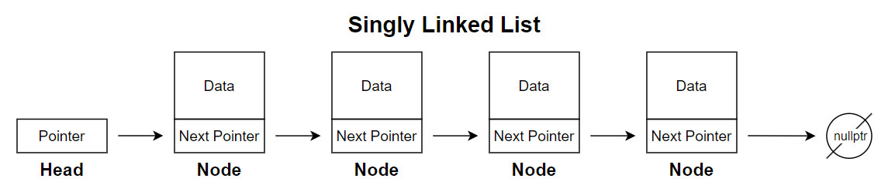
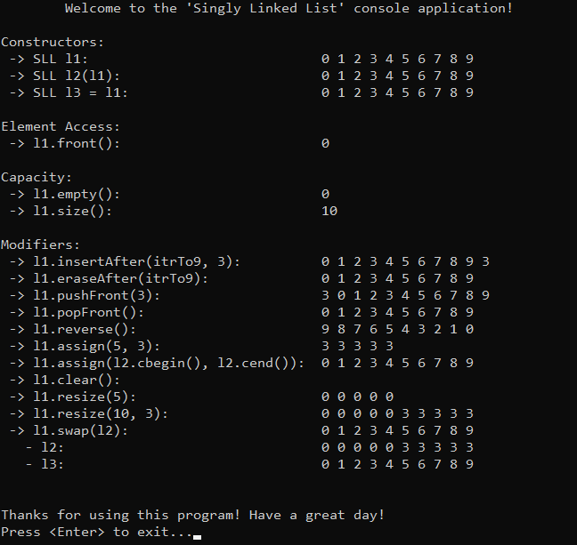
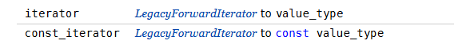

# &#128209; Table of Contents
- [💡 Overview](#-overview)
	- [Important Details](#important-details)
	- [Container Methods](#container-methods)
- [💻 Implementation](#-implementation)
	- [Design Decisions](#design-decisions)
	- [Container Implementation](#container-implementation)
	- [Node Implementation](#node-implementation)
	- [Iterators Implementations](#iterators-implementations)
- [📊 Analysis](#-analysis)
	- [Characteristics](#characteristics)
	- [Trade-Offs](#trade-offs)
- [📝 Application](#-application)
	- [Common Use Cases](#common-use-cases)
	- [Some Practical Problems](#some-practical-problems)
- [🕙 Origins](#-origins)
- [🤝 Contributing](#-contributing)
- [📧 Contacts](#-contacts)
- [🙏 Credits](#-credits)
- [🔏 License](#-license)


# &#128161; Overview
**Singly Linked List** is an implementation of a linked list where each node, except the last one, points only to the next node in the sequence, allowing unidirectional forward traversal from the first to the last node. The name comes from the fact that each node has only a single link. Knowledge and understanding of it lay a solid foundation in designing data structures and optimizing their application.
<p align="center"></p>


## Important Details
1. **Node Composition** — each node in a singly linked list holds a data element and a pointer to the next node, creating a chain of elements connected sequentially. This structure is straightforward in design and requires minimal additional memory.

2. **Single-Directional Traversal** — nodes in a singly linked list can only be accessed in one direction, from the head towards the tail. This one-way traversal restricts operations to forward movement, without the ability to traverse backward through the list.

3. **End of List** — the last node in a singly linked list points to `nullptr`, which signifies the end of the list. This marker allows traversal functions to recognize where the list terminates.


## Container Methods
When working with singly linked list, it's important to note that there is no universal standard defining a strict list of operations or guidelines for how they should be implemented. The design and functionality of a container can vary depending on several factors, such as the programming language, the purpose of the library, performance considerations, etc. Despite these variations, there are still common operations found across most implementations, typically derived from the fundamental needs of data manipulation, like accessing, modifying, or iterating over elements. Since this repository is dedicated to C++, the operations provided will closely resemble those found in `std::forward_list`.

---
**Compiler Generated:**
- `Default Constructor` — creates a new singly linked list with no nodes.
- `Copy Constructor` — creates a new singly linked list by copying elements from another list.
- `Move Constructor` — creates a new singly linked list by moving elements from another list, leaving the original list in a valid, but unspecified state. This avoids the overhead of copying and instead merely shifts the ownership of the memory.
- `Copy Assignment Operator` — overwrites every element of already existing singly linked list with the corresponding element of another list by copying them.
- `Move Assignment Operator` — overwrites every element of already existing singly linked list with the corresponding element of another list by moving them, leaving the original list in a valid, but unspecified state. This avoids the overhead of copying and instead merely shifts the ownership of the memory.
- `Destructor` — performs end-actions on singly linked list: deallocates all nodes in the list, calling destructors for complex data types to ensure resources are cleaned up.

---
**Iterators:**
- `begin`, `cbegin` — returns an iterator (or constant iterator) to the first element.
- `end`, `cend` — returns an iterator (or constant iterator) to the position one past the last element, making range $[begin, end)$ easy for traversal.
- `beforeBegin`, `cBeforeBegin` — returns an iterator (or constant iterator) to the element before beginning, basically gives access to imaginary "position" to perform operations on the actual head node.

---
**Element Access:**
- `front()` — returns the first element in the container; calling on an empty container causes undefined behavior.

---
**Capacity:**
- `empty()` — returns `true` if container is empty, otherwise `false`.
- `size()` — returns the number of elements in the container; basically distance from begin to end.
- `maxSize()` — returns the maximum number of elements the container is able to hold theoretically, if all available memory were dedicated to that single container.

---
**Modifiers:**
- `insertAfter()` — inserts an element after the specified node; requires a valid iterator or node reference and updates the next pointer of the specified node to link the new element into the list.
- `eraseAfter()` — erases the element following the specified node; reassigns the next pointer of the given node to skip over the removed element and connect to the next one, if it exists.
- `pushFront()` — inserts the given element at the beginning of the container, updating the head pointer to point to the new node.
- `popFront()` — removes the first element from the container, updating the head pointer to point to the next node; calling on an empty container causes undefined behavior.
- `assign()` — assigns the given value to the elements; any previous values will be replaced; invalidates any references, pointers, and iterators referring to contained elements.
- `clear()` — erases all elements from the container; invalidates any references, pointers, and iterators referring to contained elements.
- `resize()` — resizes the container to contain given amount of elements; if given amount equals to size, does nothing; if given amount is less than size, the container is reduced to its first given elements; if given amount is greater, additional default (or specified) elements are appended.
- `swap()` — exchanges the contents of the container with other given container; doesn't cause iterators and references to associate with the other container.


# &#x1F4BB; Implementation 
The implemented console application demonstrates the basic functionality of the singly linked list by performing various operations and interactions with it. The program provides a clear view of changes made during usage, displaying the state of the data at different stages to illustrate its simplified behavior and characteristics.
<p align="center"></p>


## Design Decisions
To prioritize simplicity and emphasize data structure itself, several design decisions were made:
- Resembling the behavior of `std::forward_list` to provide familiarity for users.
- Implementing both regular and const iterators.
- Restricting the implementation to the `int` data type to avoid the use of templates.
- Omitting cases where the container (object itself) is created on the heap.
- Excluding move semantics to keep the focus on fundamental mechanics.
- Relying on manual memory management without using smart pointers.
- Avoiding any exception handling, thus certain range validations.
- Omitting certain possible optimizations to the container.


## Container Implementation
The container is implemented within the `SLL` class, which is declared in [SinglyLinkedList.h](https://github.com/vezzolter/DSA/blob/main/DataStructures/LinkedList/SinglyLinkedList/Include/SinglyLinkedList.h) header file and defined in [SinglyLinkedList.cpp](https://github.com/vezzolter/DSA/blob/main/DataStructures/LinkedList/SinglyLinkedList/Source/SinglyLinkedList.cpp) source file. This approach is adopted to ensure encapsulation, modularity and compilation efficiency. To see the container's functionality in action, you can examine the `main()` function located in the [Main.cpp](https://github.com/vezzolter/DSA/blob/main/DataStructures/LinkedList/SinglyLinkedList/Source/Main.cpp) file. The full implementation can be found in the corresponding files, while the class declaration below offers a quick overview:

```cpp
class SLL {
private:
	struct Node;
	int _size;
	Node* _head;

public:
	// --------------------
	//  Compiler Generated
	// --------------------
	SLL();
	SLL(int size, int val);
	SLL(const SLL& other);
	SLL(SLL&& other)          = delete;
	SLL& operator=(const SLL& rhs);
	SLL& operator=(SLL&& rhs) = delete;
	~SLL();

	// -----------
	//  Iterators
	// -----------
	class Iterator;
	using iterator = Iterator;
	iterator begin();
	iterator end();
	class ConstIterator;
	using const_iterator = ConstIterator;
	const_iterator cbegin() const;
	const_iterator cend() const;

	// ----------------
	//  Element Access
	// ----------------
	int& front();
	const int& front() const;

	// ----------
	//  Capacity
	// ----------
	bool empty() const;
	int size() const;

	// -----------
	//  Modifiers
	// -----------
	void insertAfter(iterator pos, const int& val);
	void eraseAfter(iterator pos);
	void pushFront(const int& val);
	void popFront();
	void reverse();
	void assign(int size, const int& val);
	void assign(iterator first, iterator last);
	void clear();
	void resize(int size, const int& val = 0);
	void swap(SLL& other);
};
```


## Node Implementation
The `Node` structure is defined as a private nested structure within the `SLL` container. This design keeps `Node` as an internal component, accessible only within the container, and enhances encapsulation. Given the simplicity of the `Node` structure, its functions are defined inline within the container's header file.

```cpp
struct SLL::Node {
public:
	int _data;
	Node* _next;

	// --------------------
	//  Compiler Generated
	// --------------------
	Node() : _data(0), _next(nullptr) {}
	Node(const int& val, Node* next = nullptr)
	 : _data(val), _next(next) {}
	Node(const Node& other)          = delete; // no copying/moving to
	Node(Node&& other)               = delete; // ensure uniqueness of 
	Node& operator=(const Node& rhs) = delete; // the node within the list
	Node& operator=(Node&& rhs)      = delete; // and prevent accidental 
	~Node()                          = default; // duplicates or dangling nodes
};
```


## Iterators Implementations
Since there are various types of iterators that can be implemented (e.g. the image below shows the iterators for `std::forward_list`), it's common practice to define them in separate classes and files. However, despite being implemented separately, their underlying principles are usually similar, with only slight adjustments for specific purposes. To keep things simpler and avoid cluttering the core concepts, this container implements regular and constant iterator classes. Those iterators cover the basic $[begin, end)$ range and demonstrates how typical iterators operations are handled, as well as how the iterators classes are integrated into the singly linked list container.
<p align="center"></p>

---
The `Iterator` class is defined as a public nested class within the `SLL` container. This design makes `Iterator` accessible to users, enabling them to traverse and interact with list elements directly. Given the simplicity of the `Iterator` class, its functions are defined inline within the container's header file.

```cpp
class SLL::Iterator {
private:
	Node* _ptr = nullptr;

public:
	// --------------------
	//  Compiler Generated
	// --------------------
	Iterator()                               = default;
	explicit Iterator(Node* ptr) : _ptr(ptr) {}
	Iterator(const Iterator& other)          = default;
	Iterator(Iterator&& other)               = default;
	Iterator& operator=(const Iterator& rhs) = default;
	Iterator& operator=(Iterator&& rhs)      = default;
	~Iterator()                              = default;

	// ----------------------
	//  Overloaded Operators
	// ----------------------
	
	// Returns a reference to the data of a node
	int& operator*() { return _ptr->_data; }

	// Returns a pointer to the entire node, allowing access to its members
	Node* operator->() { return _ptr; }

	// Advances the iterator to the next element (pre-increment)
	Iterator& operator++() {
		_ptr = _ptr->_next;
		return *this;
	}

	// Advances the iterator to the next element, returning the previous state
	Iterator operator++(int) {
		Iterator temp = *this;
		_ptr = _ptr->_next;
		return temp;
	}

	// Returns true if two iterators point to the same element
	friend bool operator==(const SLL::Iterator& lhs, const SLL::Iterator& rhs) {
		return lhs._ptr == rhs._ptr;
	}

	// Returns true if two iterators point to different elements
	friend bool operator!=(const SLL::Iterator& lhs, const SLL::Iterator& rhs) {
		return lhs._ptr != rhs._ptr;
	}
};
```
---
The `ConstIterator` class is defined as a public nested class within the `SLL` container. This design makes `ConstIterator` accessible to users, enabling them to traverse and interact with list elements directly. Given the simplicity of the `ConstIterator` class, its functions are defined inline within the container's header file.
```cpp
class SLL::ConstIterator {
private:
	const Node* _ptr = nullptr;

public:
	// --------------------
	//  Compiler Generated
	// --------------------
	ConstIterator()                                    = default;
	explicit ConstIterator(const Node* ptr) : _ptr(ptr) {}
	ConstIterator(const ConstIterator& other)          = default;
	ConstIterator(ConstIterator&& other)               = default;
	ConstIterator& operator=(const ConstIterator& rhs) = default;
	ConstIterator& operator=(ConstIterator&& rhs)      = default; 
	~ConstIterator()                                   = default;

	// ----------------------
	//  Overloaded Operators
	// ----------------------

	// Returns a const reference to the data of a node
	const int& operator*() const { return _ptr->_data; }

	// Returns a const pointer to the entire node, allowing access to its members
	const Node* operator->() const { return _ptr; }

	// Advances the iterator to the next element (pre-increment)
	ConstIterator& operator++() {
		_ptr = _ptr->_next;
		return *this;
	}

	// Advances the iterator to the next element, returning the previous state
	ConstIterator operator++(int) {
		ConstIterator temp = *this;
		_ptr = _ptr->_next;
		return temp;
	}

	// Returns true if two iterators point to the same element
	friend bool operator==(const SLL::ConstIterator& lhs, const SLL::ConstIterator& rhs) {
		return lhs._ptr == rhs._ptr;
	}

	// Returns true if two iterators point to different elements
	friend bool operator!=(const SLL::ConstIterator& lhs, const SLL::ConstIterator& rhs) {
		return lhs._ptr != rhs._ptr;
	}
};
```


# &#128202; Analysis
Understanding how to analyze the particular container is crucial for optimizing performance and ensuring efficient resource utilization within the constraints of the given environment. Additionally, knowing its strengths and weaknesses allows for more informed decisions, helping to select the most suitable container for a given problem among similar options.


## Characteristics
🚀 **Time Complexities:** 
 - **Access:** 
    - **Beginning** $O(1)$ — because operation only requires dereferencing a known pointer, which is a constant time.
    - **Middle** $O(n)$ — since there is no direct access to elements, operation requires prior traversal from the head node, though pointer dereferencing is constant time.
   - **End** $O(n)$ — since there is no direct access to elements and no tail pointer, therefore operation requires prior traversal from the head node, though pointer dereferencing is constant time.
 - **Insertion:**
   - **Beginning** $O(1)$ — because operation only requires pointer adjustments and allocation, which are constant time.
   - **Middle** $O(n)$ — because operation requires prior traversal to the desired position before updating pointers, though pointer adjustments and allocation are constant time.
   - **End** $O(n)$ — because operation requires prior traversal to the desired position before updating pointers, though pointer adjustments and allocation are constant time.
 - **Deletion:**
   - **Beginning** $O(1)$ — because operation only requires pointer adjustments and clean up, which are constant time.
   - **Middle** $O(n)$ — because operation requires prior traversal to that position, though pointer adjustments and clean up are constant time.
   - **End** $O(n)$ — because operation requires prior traversal to that position, though pointer adjustments and clean up are constant time.
 - **Other** — while additional operations exist, they are generally not considered core functionalities for container selection.

---
🧠 **Space Expenses:**
- **Pointer Overhead** — each node stores an additional pointer to the next node.
- **Memory Fragmentation** — nodes are dynamically allocated in separate memory locations, potentially causing fragmentation and reducing cache efficiency.


## Trade-Offs
➕ **Advantages:**
- **Efficient Operations at Beginning** — singly linked lists support efficient insertions and deletions at the head without shifting elements, making them suitable for applications where frequent modifications occur at the start of the list.
- **Flexible Size** — singly linked lists can dynamically grow or shrink as needed without reallocating the entire structure, which also efficient in scenarios where the data size is unknown beforehand.
- **No Wasted Capacity** — singly linked lists do not preallocate extra memory beyond what is needed for their elements, preventing unused space.

---
➖ **Disadvantages:**
- **Slow Access** — singly linked lists require sequential traversal to access elements, resulting in linear time complexity, which is inefficient compared to random-access data structures.
- **Extra Memory for Pointers** — singly linked lists require each node to store a pointer to the next node, adding memory overhead that scales with the list size.
- **Poor Cache Performance** — singly linked lists are less cache-friendly, as each node may be stored at a different memory location. This non-localized storage disrupts cache line utilization, leading to more frequent cache misses and reduced performance.
- **Single-Directional Traversal** — singly linked lists allow only one-way traversal, preventing backward traversal and limiting flexibility, making certain operations more complex or inefficient.


# &#128221; Application
Understanding some of the most well-known use cases of a container is crucial for grasping its practical relevance and potential impact in real-world scenarios. Additionally, familiarizing oneself with common practical problems and practicing their solutions ensures that you remember the essential details and develop a deep, intuitive understanding of the functionality and limitations.


## Common Use Cases
As mentioned in the [LinkedList.md](https://github.com/vezzolter/DSA/blob/main/DataStructures/LinkedList/LinkedList.md), the concrete use cases (and anti use cases) directly derive from the advantages (and disadvantages) of the container, so there is no need for this sort of rephrasing. Since singly linked lists share the foundational principles of the general concept of linked lists, their common usage is best described in the [linked lists respective section](../LinkedList.md#-application).


## Some Practical Problems
Since singly linked lists share the foundational principles of the general concept of linked lists, their common problems is best described in the [linked lists respective section](../LinkedList.md#-application).


# &#x1F559; Origins
Since singly linked lists share the foundational principles of the general concept of linked lists, their historical development is best described in the [linked lists respective section](../LinkedList.md#-origins).


# &#129309; Contributing
Contributions are highly appreciated! For detailed guidelines, please refer to the [root directory's contributing section](../../../#-contributing).


# &#128231; Contacts
For contact details and additional information, please refer to the [root directory's contact information section](../../../#-contacts).


# &#128591; Credits
Since singly linked lists share the foundational principles of the general concept of linked lists, the resources that contributed to their understanding are best described in the [linked lists credits section](../LinkedList.md#-credits).


# &#128271; License
This project is licensed under the MIT License — see the [LICENSE](https://github.com/vezzolter/DSA/blob/main/LICENSE) file for details.

[](https://opensource.org/licenses/MIT)