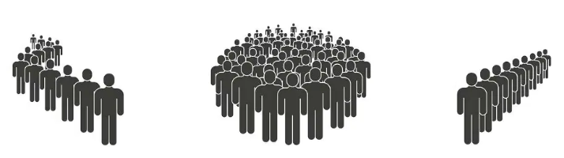
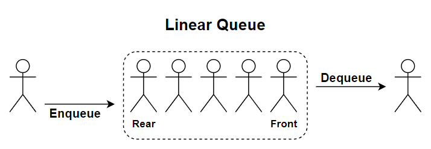
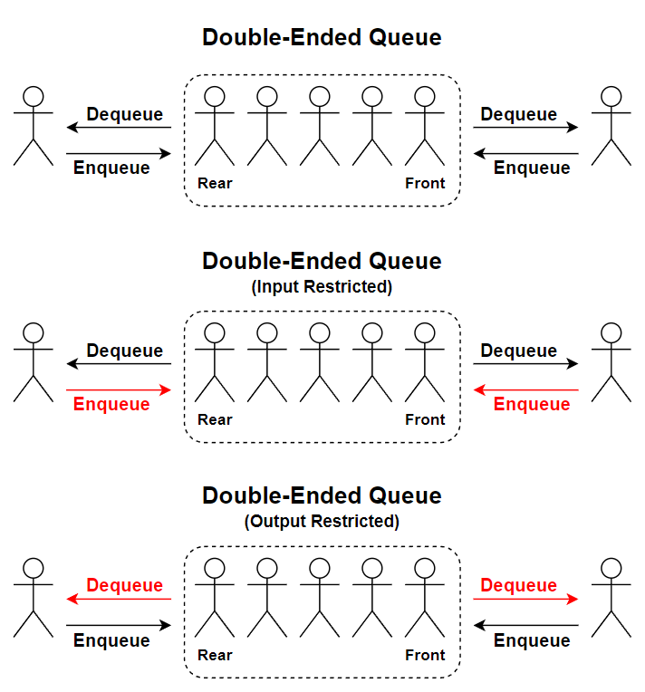
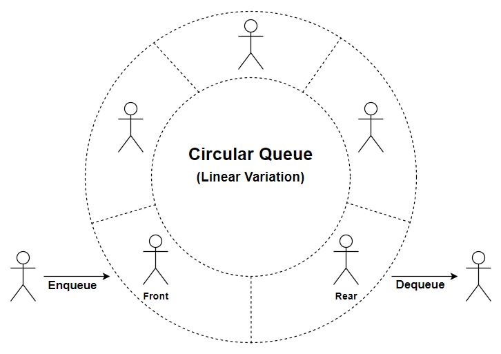
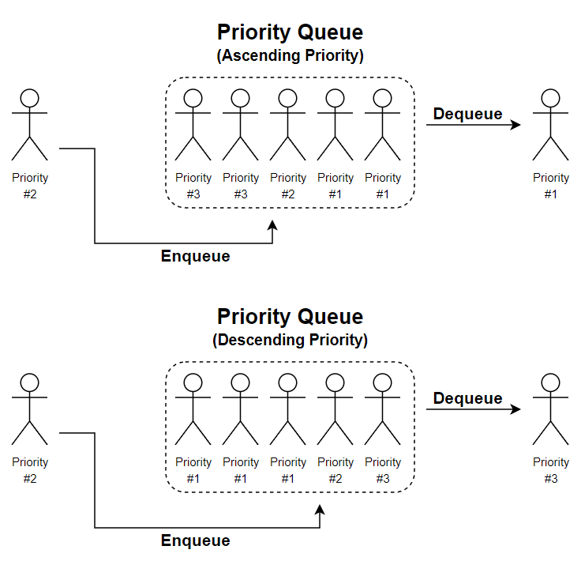
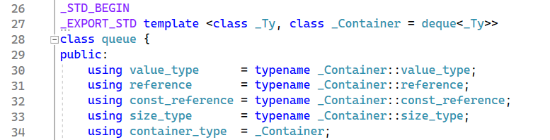

# &#128209; Table of Contents
- [💡 Overview](#-overview)
	- [Essential Terminology](#essential-terminology)
	- [Important Details](#important-details)
	- [Types of Queues](#types-of-queues)
	- [Operation Details](#operation-details)
- [💻 Implementation](#-implementation)
	- [Linear Queue | Design Decisions](#linear-queue--design-decisions)
	- [Linear Queue | Detailed Overview](#linear-queue--detailed-overview)
	- [Double-Ended Queue](#double-ended-queue)
	- [Circular Queue](#circular-queue)
	- [Priority Queue](#priority-queue)
- [📊 Analysis](#-analysis)
	- [How to Analyze](#how-to-analyze)
	- [Advantages](#advantages)
	- [Disadvantages](#disadvantages)
- [📝 Application](#-application)
	- [Some of the Most Well-Known Use Cases](#some-of-the-most-well-known-use-cases)
	- [Common Practical Problems](#common-practical-problems)
- [🕙 Origins](#-origins)
- [🤝 Contributing](#-contributing)
- [📧 Contacts](#-contacts)
- [🙏 Credits](#-credits)
- [🔏 License](#-license)


# &#128161; Overview
The **Queue** as abstract data type (ADT) in computer programming, becomes particularly valuable when you need to manage entities (e.g. data, objects, persons, events, tasks) in a sequential manner, where they are stored and held to be processed later, sort of a buffer. It is named this way, because of how it resembles the behavior of queue (line) in real life. This subsection explores idea of queue not only to enhance comprehension of its concepts, but also to establish a solid foundation for a more complex algorithmic designs and problem-solving strategies.
<p align="center"></p>


## Essential Terminology
- **Collection** — is a data structure (or container), which is used to group multiple elements together.
  - **Linear Collection** — is a type of collection, where elements are arranged in linear sequence, i.e. each element has a predecessor and a succressor, except for the first and last elements.
- **Queue** — is a term used to encompass a variety of ADTs with similar sequential behavior.
- **Front/Head** — is the end of the sequence at which elements are added.
- **Rear/Back/Tail** — is the end of the sequence at which elements are removed.
- **Enqueue** — is an operation of adding an element to the rear.
- **Dequeue** — is an operation of removing an element from the front.


## Important Details
Will be updated in the future...


## Types of Queues
When it comes to classification, there are broadly four types of queues: linear queue, circular queue, double-ended queue, and priority queue. While these specifications share some common ideas, each possesses distinctive characteristics, and some of them can be also combined together (e.g. deque with circular functionality). This variety provides the flexibility in data organization approaches, because the overall choice depends on the specific requirements of the case at hand.
<p align="center"></p>  

**Linear Queue** — all insertions are made at one end of and all deletions at the other, operates on the First-In-First-Out principle.  
**Typical underlying DS:** arrays, linked lists.
<p align="center"></p>

**Deque (Double-Ended Queue)** — allows insertion and deletion of elements from both ends.
  - **Input Restricted Deque** — allows insertion from only one end (either rear or front).
  - **Output Restricted Deque** — allows removal from only one end (either rear or front).
    
**Typical Underlying DS:** arrays, linked lists.
<p align="center"></p>

**Circular Queue** — variation of deque or linear queue, that connects front with rear ends.  
**Typical underlying DS:** arrays, linked lists.
<p align="center"></p>

**Priority Queue** — elements are dequeued based on their priority level, rather than their order of insertion.
  - **Ascending Priority Queue** — elements with higher priority levels are dequed first.
  - **Descending Priority Queue** — elements with lower priority levels are dequed first. 
    
**Typical underlying DS:** max-heaps, min-heaps.  


## Operation Details
- **Access/Peek** — retrieving or updating the value of an existing element at a specific position.
- **Insertion/Enqueue** — adding a new element to the queue.
- **Deletion/Dequeue** — removing an element from the queue.
- **Clear** — removing all elements, resetting it to an empty state.
- **Empty** — checking if the stack contains no elements.
- **Size** — determining the number of elements.


# &#x1F4BB; Implementation 
Discussing ADT, it's evident that well-established and widely recognized implementations already exist for linear, double-ended, circular and priority queues. In the context of C++, `std::queue` is a representative of linear queue, `std::deque` stands for double-ended queue, and `std::priority_queue` for priority queue. First two, can be altered to create circular structure via manual pointers manipulation.  It's commonly recommended to rely on these proven implementations rather than reinventing the wheel. However, within the scope of this subsection, we'll take a closer look at simplified versions of these queues. This exploration is aimed at gaining a deeper understanding of the fundamental concepts that underlie them.


##  Linear Queue | Design Decisions
Keeping its educational aim in mind, the `LQ` class developed here closely resembles the behavior of `std::queue`, with minor adjustments aimed at emphasizing simplicity and focusing on the core aspects of the data structure.
<p align="center"></p>

One significant design decision is the implementation of a linear queue solely based on a linked list. While the library container provides the option to choose whichever fits the application's idea more, by default, it is implemented on the basis of a deque.


##  Linear Queue | Detailed Overview
<p align="center"></p>

Application's control flow and testing of the class is conducted within the [Main.cpp](https://github.com/vezzolter/DSA/tree/main/DataStructures/Queue/LinearQueue/src/Main.cpp) file. The `LQ` class is declared in [SinglyLinkedList.h](https://github.com/vezzolter/DSA/tree/main/DataStructures/Queue/LinearQueue/inc/SinglyLinkedList.h) header file and defined in [SinglyLinkedList.cpp](https://github.com/vezzolter/DSA/tree/main/DataStructures/Queue/LinearQueue/src/SinglyLinkedList.cpp) source file. This approach is adopted to ensure encapsulation, modularity, and compilation efficiency, but for your convenience here is the declaration of the class:
```cpp
template<class T>
class LQ {
private:
	struct Node {
		T _data;
		Node* _next;

		Node(const T& newData) : _data(newData), _next(nullptr) {}
		Node()                           = default;
		Node(const Node& rhs)            = delete;
		Node& operator=(const Node& rhs) = delete;
	};

	size_t _size;
	Node* _front;
	Node* _rear;

public:
	// Special Member Functions
	LQ();
	LQ(const LQ& rhs);
	LQ& operator=(const LQ& rhs);
	~LQ();

	// Element Access
	T& front();
	const T& front() const;
	T& rear();
	const T& rear() const;

	// Capacity 
	bool empty() const;
	size_t size() const;

	// Modifiers
	void push(const T& newData);
	void pop();
};
```


##  Double-Ended Queue
Will be updated in the future...

P.s. the typical implementations of a deque utilize *«a sequence of individually allocated fixed-size arrays, with additional bookkeeping — cppreference»*. Personally, I consider this to be a crucial defining design decision for the deque. However, right now I don't really know how to illustrate it in a simple and accessible manner, neither do I want to merely create a copy of a doubly linked list just to be. If anyone reading this would like to collaborate on this topic, I would gladly welcome the opportunity to finalize this section and hopefully one day help someone with it.


##  Circular Queue
Will be updated in the future...

P.s. Circular queues are not as prevalent in usage compared to other data structures, which may explain their absence from the standard library. Despite their *potential* effectiveness, there seems to be a lack of *practical* examples showcasing their usage. This leaves the question of whether to develop this container open for consideration. If anyone reading this would like to collaborate on this topic, I would gladly welcome the opportunity to finalize this section and hopefully one day help someone with it. 


##  Priority Queue
Will be updated in the future...

P.s. in order to grasp this topic in a better way, I'm going to update this section after respective tree section.


# &#128202; Analysis
Understanding how to analyze the particular implementation of a data structure in terms of time and space complexity is crucial for optimizing performance and ensuring efficient resource utilization within the constraints of the given environment. Additionally, knowing the pros and cons of different data structures allows to make informed decisions, helping to choose the most suitable approach for a given problem.


## How to Analyze
The analysis of queues can be quite confusing. Different implementations have their own set of advantages and disadvantages. However, the information available across various resources can sometimes be overwhelming mix of all types, don't really useful or discussing not existing cases at all. The analysis from point of time and space complexities mostly based on underlaying data structure. Overall, the queues provide the "wrapping" behaviour, that is preffarably can be replaced by a better alternative, and only remaining relevant primarily when the **natural sequential behavior** is crucial.


## Advantages
Will be updated in the future...


## Disadvantages
Will be updated in the future...


# &#128221; Application
Understanding some of the most well-known use cases of a data structure is crucial for grasping its practical relevance and potential impact in real-world scenarios. Additionally, familiarizing oneself with common practical problems and practicing their solutions ensures that you remember the essential details and develop a deep, intuitive understanding of the functionality and limitations.


## Some of the Most Well-Known Use Cases
- **Scheduling** — in scenarios, where it is convenient to represent each element as a node and make decisions based on the order (by priority, arrival time, or other criteria); e.g. task scheduling, traffic management.
- **Buffering** — in various systems, where incoming data packets are stored temorarily before being processed; e.g. user input, layers of BFS algorithm.
- **Resource Allocation** — in resource allocation systems, where resource access based on predefined criteria such as priority, fairness, or availability; e.g. how CPU controls the resources, game mechanics with resources.


## Common Practical Problems
- [First Unique Character in a String](https://leetcode.com/problems/first-unique-character-in-a-string/)
- [Last Stone Weight](https://leetcode.com/problems/last-stone-weight/)
- [Kth Largest Element in a Stream](https://leetcode.com/problems/kth-largest-element-in-a-stream/)
- [Reveal Cards In Increasing Order](https://leetcode.com/problems/reveal-cards-in-increasing-order/)
- [Continuous Subarrays](https://leetcode.com/problems/continuous-subarrays/)
- [K Closest Points to Origin](https://leetcode.com/problems/k-closest-points-to-origin/)
- [Top K Frequent Elements](https://leetcode.com/problems/top-k-frequent-elements/)
- [K-th Smallest Prime Fraction](https://leetcode.com/problems/k-th-smallest-prime-fraction/)
- [Kth Largest Element in an Array](https://leetcode.com/problems/kth-largest-element-in-an-array/)
- [Task Scheduler](https://leetcode.com/problems/task-scheduler/)
- [Desgin Twitter](https://leetcode.com/problems/design-twitter/)
- [Find Median from Data Stream](https://leetcode.com/problems/find-median-from-data-stream/)
- [Max Value of Equation](https://leetcode.com/problems/max-value-of-equation/)
- [The Skyline Problem](https://leetcode.com/problems/the-skyline-problem/)
- [Strong Password Checker](https://leetcode.com/problems/strong-password-checker/)


# &#x1F559; Origins
The concept of queues has evolved over time and its origin cannot be attributed to a single individual, rather it reflects the collective ingenuity of humanity. If anyone reading this would like to collaborate on this topic, I would gladly welcome the opportunity to finalize this section and hopefully one day help someone with it.


# &#129309; Contributing
Contributions are highly appreciated! For detailed guidelines, please refer to the [root directory's contributing section](../../#-contributing).


# &#128231; Contacts
For contact details and additional information, please refer to the [root directory's contact information section](../../#-contacts).


# &#128591; Credits
&#128218; **Books:**
- **"Introduction to Algorithms" (3rd Edition)** — by Thomas H. Cormen, Charles E. Leiserson, Ronald L. Rivest and Clifford Stein
  - Section 10.1: Stacks and Queues
  - Section 10.3: Implementing Pointers and Objects
- **"Algorithms in C++, Parts 1-4: Fundamentals, Data Structure, Sorting, Searching" (3rd Edition)** — by Robert Sedgewick
  - Section 3.7: Compound Data Structures
  - Section 4: Abstract Data Types
- **"Data Structures and Algorithm Analysis in C++" (4th Edition)** — by Mark Allen Weiss
  - Section 3.1: Abstract Data Types
  - Section 3.7: The Queue ADT
- **"The Algorithm Design Manual" (2nd Edition)** — by Steven S. Skiena
  - Section 3.2: Stacks and Queues
  - Section 3.5: Priority Queues
  - Section 12.2: Priority Queues
- **"The Art of Computer Programming, Volume 1: Fundamental Algorithms" (3rd Edition)** — by Donald Ervin Knuth 
  - Section 2.2.1: Stacks, Queues, and Deques
  - Section 2.2.2: Sequential Allocation
  - Section 2.2.2: Linked Allocation
  - Section 2.6: History and Bibliography
---
&#127891; **Courses:**
- [Mastering Data Structures & Algorithms using C and C++](https://www.udemy.com/course/datastructurescncpp/) on Udemy
   - Section 14: Queues
- [Accelerated Computer Science Fundamentals Specialization](https://www.coursera.org/specializations/cs-fundamentals) from Coursera
   - Course 2.1: Linear Structures

---  
&#127760; **Web-Resources:**  
- [Queue (abstract data structure)](https://en.wikipedia.org/wiki/Linked_list) (Wikipedia)
- [Queue Data Structure](https://www.programiz.com/dsa/queue)
- [std::queue](https://en.cppreference.com/w/cpp/container/queue)
- [Applications, Advantages and Disadvantages of Queue](https://www.geeksforgeeks.org/applications-advantages-and-disadvantages-of-queue/)
- [Double-ended queue](https://en.wikipedia.org/wiki/Double-ended_queue) (Wikipedia)
- [Deque Data Structure](https://www.programiz.com/dsa/deque)
- [std::deque](https://en.cppreference.com/w/cpp/container/deque)
- [Applications, Advantages and Disadvantages of Deque](https://www.geeksforgeeks.org/applications-advantages-and-disadvantages-of-deque/)
- [Circular buffer](https://en.wikipedia.org/wiki/Circular_buffer) (Wikipedia)
- [Introduction to Circular Queue](https://www.geeksforgeeks.org/introduction-to-circular-queue/)
- [Circular Queue](https://www.programiz.com/dsa/circular-queue)
- [Applications, Advantages and Disadvantages of Circular Queue](https://www.geeksforgeeks.org/applications-advantages-and-disadvantages-of-circular-queue/)
- [Priority Queue](https://en.wikipedia.org/wiki/Priority_queue) (Wikipedia)
- [Priority Queue](https://www.programiz.com/dsa/priority-queue)
- [std::priority_queue](https://en.cppreference.com/w/cpp/container/priority_queue)
- [Applications of Priority Queue](https://www.geeksforgeeks.org/applications-priority-queue/)
- [Different Types of Queues and its Applications](https://www.geeksforgeeks.org/different-types-of-queues-and-its-applications/)
- [Array-Based Queues vs List-Based Queues](https://www.geeksforgeeks.org/array-based-queues-vs-list-based-queues/)
- [Performance of a Circular Buffer vs. Vector, Deque, and List](https://www.codeproject.com/Articles/1185449/Performance-of-a-Circular-Buffer-vs-Vector-Deque-a)
- [Top 50 Problems on Queue Data Structure asked in SDE Interviews](https://www.geeksforgeeks.org/top-50-problems-on-queue-data-structure-asked-in-sde-interviews/)
- [Top 25 Queue (Data Structure) Interview Questions and Answers](https://interviewprep.org/queue-data-structure-interview-questions-2/)


# &#128271; License
This project is licensed under the MIT License — see the [LICENSE](https://github.com/vezzolter/DSA/blob/main/LICENSE) file for details.

[](https://opensource.org/licenses/MIT)