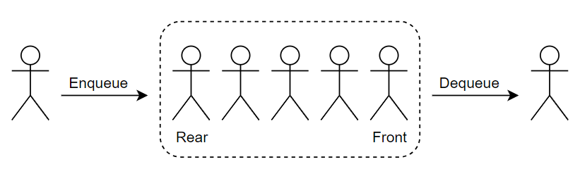
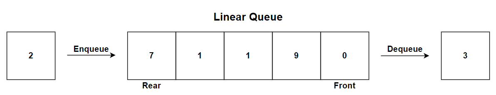
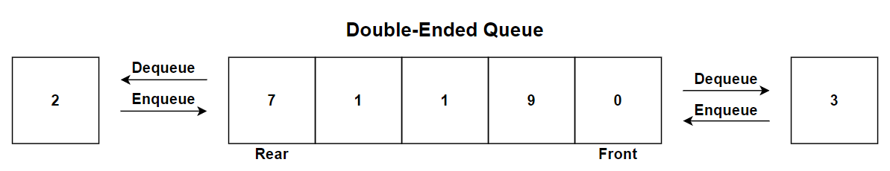
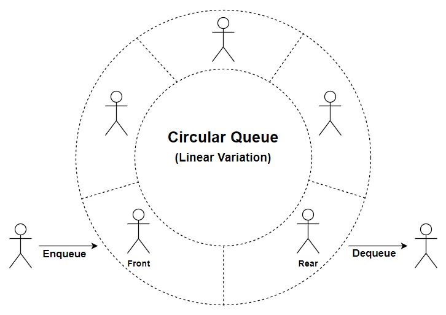
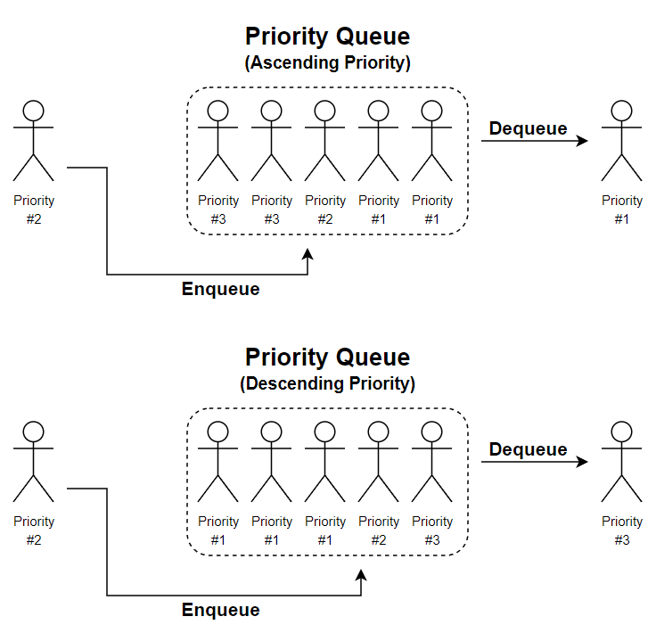
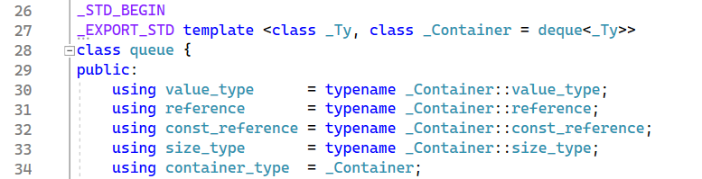
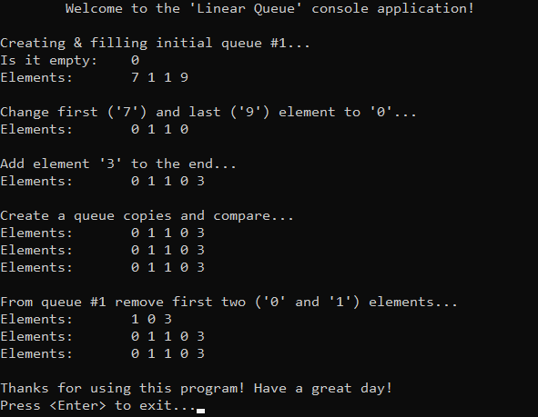

# &#128209; Table of Contents
- [💡 What is the Queue](#-what-is-the-queue)
- [💻 Implementation](#-implementation)
	- [Linear Queue](#linear-queue)
	- [Double-Ended Queue](#double-ended-queue)
	- [Circular Queue](#circular-queue)
	- [Priority Queue](#priority-queue)
- [📊 Analysis](#-analysis)
- [📝 Application](#-application)
- [⏳ Historical Notes](#-historical-notes)
- [🤝 Contributing](#-contributing)
- [📧 Contact Information](#-contact-information)
- [🙏 Credits](#-credits)
- [🔏 License](#-license)


# &#128161; What is the Queue
The Queue as a linear ADT (abstract data structure) in computer programming, becomes particularly valuable when you need to manage entities (e.g. data, objects, persons, events, tasks) in a sequential manner, where they are stored and held to be processed later, sort of a buffer. This subsection explores the ADT of Queue not only to enhance comprehension of its concepts, but also to establish a solid foundation for algorithmic design and problem-solving strategies.
<p align="center"></p>


---
**Queue** — is a term used to encompass a variety of ADTs with similar sequential behavior. It introduces the following essential terms:
- **Front/Head** — the end of the sequence at which elements are added.
- **Rear/Back/Tail** — the end of the sequence at which elements are removed.
- **Enqueue** — operation of adding an element to the rear.
- **Dequeue** — operation of removing an element from the front.


---
When it comes to implementation, queues can be broadly classified into four types: linear queue, circular queue, double-ended queue, and priority queue. While these specifications share some common ideas, each possesses distinctive characteristics, and some of them can be also combined together (e.g. deque with circular functionality). This variety provides the flexibility in data organization approaches, because the overall choice depends on the specific requirements of the case at hand.

1. **Linear Queue** — all insertions are made at one end of and all deletions at the other, operates on the First-In-First-Out principle.  
**Typical underlying DS:** arrays, linked lists.
<p align="center"></p>

2. **Deque (Double-Ended Queue)** — allows insertion and deletion of elements from both ends.
    - **Input Restricted Deque** — allows insertion from only one end (either rear or front).
    - **Output Restricted Deque** — allows removal from only one end (either rear or front).
    
   **Typical Underlying DS:** arrays, linked lists.
<p align="center"></p>

3. **Circular Queue** — variation of deque or linear queue, that connects front with rear ends.  
**Typical underlying DS:** arrays, linked lists.
<p align="center"></p>

4. **Priority Queue** — elements are dequeued based on their priority level, rather than their order of insertion.
    - **Ascending Priority Queue** — elements with higher priority levels are dequed first.
    - **Descending Priority Queue** — elements with lower priority levels are dequed first. 
    
   **Typical underlying DS:** max-heaps, min-heaps.  
<p align="center"></p>


---
**Common Operations for Queues:**
- **Accessing Specific Elements** — retrieving or updating the value of an existing element at a specific position.
- **Enqueueing (Insertion)** — adding a new element to the queue.
- **Dequeueing (Deletion)** — removing an element from the queue.


# &#x1F4BB; Implementation 
Discussing ADT, it's evident that well-established and widely recognized implementations already exist for linear, double-ended, circular and priority queues. In the context of C++, `std::queue` is a representative of linear queue, `std::deque` stands for double-ended queue, and `std::priority_queue` for priority queue. First two, can be altered to create circular structure via manual pointers manipulation.  It's commonly recommended to rely on these proven implementations rather than reinventing the wheel. However, within the scope of this subsection, we'll take a closer look at simplified versions of these queues. This exploration is aimed at gaining a deeper understanding of the fundamental concepts that underlie them.


##  Linear Queue
Keeping its educational aim in mind, the `LQ` class developed here closely resembles the behavior of `std::queue`, with minor adjustments aimed at emphasizing simplicity and focusing on the core aspects of the data structure.

One significant design decision is the implementation of a linear queue solely based on a linked list. While the library container provides the option to choose whichever fits the application's idea more, by default, it is implemented on the basis of a deque.
<p align="center"></p>

**Detailed Overview**:
1. The `LQ` class is declared in `LinearQueue.h` header file and defined in `LinearQueu.cpp` source file. This approach is adopted to ensure encapsulation, modularity and compilation efficiency. Testing of the class functionalities is conducted within the `main()` function located in the `Main.cpp` file.
2. Whole class declaration:
```cpp
template<class T>
class LQ {
private:
	struct Node {
		T _data;
		Node* _next;

		Node(const T& newData) : _data(newData), _next(nullptr) {}
		Node()                           = default;
		Node(const Node& rhs)            = delete;
		Node& operator=(const Node& rhs) = delete;
	};

	size_t _size;
	Node* _front;
	Node* _rear;

public:
	// Special Member Functions
	LQ();
	LQ(const LQ& rhs);
	LQ& operator=(const LQ& rhs);
	~LQ();

	// Element Access
	T& front();
	const T& front() const;
	T& rear();
	const T& rear() const;

	// Capacity 
	bool empty() const;
	size_t size() const;

	// Modifiers
	void push(const T& newData);
	void pop();
};
```
3. Special member functions:
```cpp
// Default constructor
template<class T>
LQ<T>::LQ() : _size(0), _front(nullptr), _rear(nullptr) {}

// Deep copy constructor
template<class T>
LQ<T>::LQ(const LQ& rhs) : _size(rhs._size), _front(nullptr), _rear(nullptr) {
	// Case: empty queue
	if (rhs._front == nullptr)
		return;

	// Create corresponding first node
	_front = new Node(rhs._front->_data);
	_rear = _front;

	// Copy other nodes
	Node* currentRhs = rhs._front->_next;
	while (currentRhs) {
		_rear->_next = new Node(currentRhs->_data);
		_rear = _rear->_next;
		currentRhs = currentRhs->_next;
	}
}

// Deep copy assignment operator
template<class T>
LQ<T>& LQ<T>::operator=(const LQ& rhs) {
	// Self-assignment guard
	if (this == &rhs)
		return *this;

	// Ensure that the destination list doesn't retain any of its existing elements
	while (_front) {
		Node* temp = _front;
		_front = _front->_next;
		delete temp;
	}

	// Set corresponding size
	_size = rhs._size;

	// Case: empty queue
	if (rhs._front == nullptr) {
		_front = _rear = nullptr;
	}
	else {
		// Create corresponding first node
		_front = new Node(rhs._front->_data);
		_rear = _front;

		// Copy other nodes
		Node* currentRhs = rhs._front->_next;
		while (currentRhs) {
			_rear->_next = new Node(currentRhs->_data);
			_rear = _rear->_next;
			currentRhs = currentRhs->_next;
		}
	}

	return *this;
}

// Destructor
template<class T>
LQ<T>::~LQ() {
	while (_front) {
		Node* temp = _front;
		_front = _front->_next;
		delete temp;
	}

	// Update the state
	_rear = nullptr;
	_size = 0;
}
```
4. Element access:
```cpp
// Accesses the first element in the container, no range check, allows modification
template<class T>
T& LQ<T>::front() { return _front->_data; }

// Accesses the first element in the container, no range check, denies modification
template<class T>
const T& LQ<T>::front() const { return _front->_data; }

// Accesses the last element in the container, no range check, allows modification
template<class T>
T& LQ<T>::rear() { return _rear->_data; }

// Accesses the last element in the container, no range check, denies modification
template<class T>
const T& LQ<T>::rear() const { return _rear->_data; }
```
5. Capacity methods:
```cpp
// Checks if the container has no elements
template<class T>
bool LQ<T>::empty() const { return _size == 0; }

// Returns the number of elements in the container
template<typename T>
size_t LQ<T>::size() const { return _size; }
```
6. Modifiers:
```cpp
// Pushes the given element to the end of the queue
template<class T>
void LQ<T>::push(const T& newData) {
	// Create a new node with the given data
	Node* newNode = new Node(newData);

	// Case: empty queue
	if (_front == nullptr) {
		_front = _rear = newNode;
	}
	else {
		_rear->_next = newNode;
		_rear = newNode;
	}

	// Update the size
	++_size;
}

// Removes an element from the front of the queue
// Note: with no bounds check, assumes that queue contains at least 1 element
template<class T>
void LQ<T>::pop() {
	// Case: empty queue
	if (_front == nullptr)
		return;
	
	// Move the head pointer to the next node
	Node* temp = _front;
	_front = _front->_next;
	delete temp;

	// Case: last element
	if (_front == nullptr)
		_rear = nullptr;

	// Update the size
	--_size;
}
```
7. Demonstration:
```cpp
// via copy of queue
void printQueue(const LQ<int>& q) {
	LQ<int> tempQueue(q);
	std::cout << "Elements:\t";
	while (!tempQueue.empty()) {
		std::cout << tempQueue.front() << " ";
		tempQueue.pop();
	}
	std::cout << std::endl;
	
}

int main()
{
	// Greet
	std::cout << "\tWelcome to the 'Linear Queue' console application!\n";

	// Create initial queue
	std::cout << "\nCreating & filling initial queue #1...\n";
	LQ<int> q1;
	q1.push(7);
	q1.push(1);
	q1.push(1);
	q1.push(9);

	// Show queue #1
	std::cout << "Is it empty:\t" << q1.empty() << std::endl;
	printQueue(q1);

	// Modify queue #1
	std::cout << "\nChange first ('7') and last ('9') element to '0'...\n";
	q1.front() = 0;
	q1.rear() = 0;
	printQueue(q1);

	// Insert into queue #1
	std::cout << "\nAdd element '3' to the end...\n";
	q1.push(3);
	printQueue(q1);

	// Deep copy functionality
	std::cout << "\nCreate a queue copies and compare...\n";
	LQ<int> q2(q1);
	LQ<int> q3 = q1;
	printQueue(q1);
	printQueue(q2);
	printQueue(q3);

	// Remove functionality
	std::cout << "\nFrom queue #1 remove first two ('0' and '1') elements...\n";
	q1.pop();
	q1.pop();
	printQueue(q1);
	printQueue(q2);
	printQueue(q3);

	// Exit
	std::cout << "\nThanks for using this program! Have a great day!\n";
	std::cout << "Press <Enter> to exit...";
	std::cin.clear(); // ensure that stream is in a good state
	std::cin.ignore(32767, '\n'); // clear from any remaining chars
	std::cin.get();
	return 0;
}
```
<p align="center"></p>


##  Double-Ended Queue
Will be updated in the future...

P.s. the typical implementations of a deque utilize *«a sequence of individually allocated fixed-size arrays, with additional bookkeeping — cppreference»*. Personally, I consider this to be a crucial defining design decision for the deque. However, right now I don't really know how to illustrate it in a simple and accessible manner, neither do I want to merely create a copy of a doubly linked list just to be. If anyone reading this would like to collaborate on this topic, I would gladly welcome the opportunity to finalize this section and hopefully one day help someone with it.


##  Circular Queue
Will be updated in the future...

P.s. Circular queues are not as prevalent in usage compared to other data structures, which may explain their absence from the standard library. Despite their *potential* effectiveness, there seems to be a lack of *practical* examples showcasing their usage. This leaves the question of whether to develop this container open for consideration. If anyone reading this would like to collaborate on this topic, I would gladly welcome the opportunity to finalize this section and hopefully one day help someone with it. 


##  Priority Queue
Will be updated in the future...

P.s. in order to grasp this topic in a better way, I'm going to update this section after respective tree section.


# &#128202; Analysis
The analysis of queues can be quite confusing. Different implementations have their own set of advantages and disadvantages. However, the information available across various resources can sometimes be overwhelming mix of all types, don't really useful or discussing not existing cases at all. The analysis from point of time and space complexities mostly based on underlaying data structure. Overall, the queues provide the "wrapping" behaviour, that is preffarably can be replaced by a better alternative, and only remaining relevant primarily when the **natural sequential behavior** is crucial.


# &#128221; Application
**Some of the Most Well-Known Use Cases:**
- **Scheduling** — in scenarios, where it is convenient to represent each element as a node and make decisions based on the order (by priority, arrival time, or other criteria); e.g. task scheduling, traffic management.
- **Buffering** — in various systems, where incoming data packets are stored temorarily before being processed; e.g. user input, layers of BFS algorithm.
- **Resource Allocation** — in resource allocation systems, where resource access based on predefined criteria such as priority, fairness, or availability; e.g. how CPU controls the resources, game mechanics with resources.

---
**Common Practical Problems:**
- Reverse first k elements of queue.
- BFS for a graph.
- Check whether a given graph is Bipartite or not.
- Flood fill algorithm.
- Maximum cost path from source node to destination.
- Turn a queue into a priority queue.
- Design a Sliding Window maximum algorithm.
- Find Maximum Non-decreasing Array Length.


# &#x23F3; Historical Notes

The concept of queues has evolved over time and its origin cannot be attributed to a single individual, rather it reflects the collective ingenuity of humanity. If anyone reading this would like to collaborate on this topic, I would gladly welcome the opportunity to finalize this section and hopefully one day help someone with it.


# &#129309; Contributing
Contributions are highly appreciated! For detailed guidelines, please refer to the [root directory's contributing section](../../#-contributing).


# &#128231; Contact Information
For contact details and additional information, please refer to the [root directory's contact information section](../../#-contact-information).


# &#128591; Credits
&#128218; **Books:**
- **"Data Structures and Algorithm Analysis in C++" (4th Edition)** — by Mark Allen Weiss
  - Section 3.7: The Queue ADT
- **"Algorithms in C++, Parts 1-4: Fundamentals, Data Structure, Sorting, Searching" (3rd Edition)** — by Robert Sedgewick
  - Section 4: Abstract Data Types
- **"Introduction to Algorithms" (3rd Edition)** — by Thomas H. Cormen, Charles E. Leiserson, Ronald L. Rivest and Clifford Stein
  - Section 10.1: Stacks and Queues.
- **"The Art of Computer Programming, Volume 1: Fundamental Algorithms" (3rd Edition)** — by Donald Ervin Knuth 
  - Section 2.2.1: Stacks, Queues, and Deques
  - Section 2.2.2: Sequential Allocation
  - Section 2.2.2: Linked Allocation

---
&#127891; **Courses:**
- [Mastering Data Structures & Algorithms using C and C++](https://www.udemy.com/course/datastructurescncpp/) on Udemy
   - Section 14: Queues
- [Accelerated Computer Science Fundamentals Specialization](https://www.coursera.org/specializations/cs-fundamentals) from Coursera
   - Course 2.1: Linear Structures

---  
&#127760; **Web-Resources:**  
- [Queue (abstract data structure)](https://en.wikipedia.org/wiki/Linked_list) (Wikipedia)
- [Queue Data Structure](https://www.programiz.com/dsa/queue)
- [std::queue](https://en.cppreference.com/w/cpp/container/queue)
- [Applications, Advantages and Disadvantages of Queue](https://www.geeksforgeeks.org/applications-advantages-and-disadvantages-of-queue/)
- [Double-ended queue](https://en.wikipedia.org/wiki/Double-ended_queue) (Wikipedia)
- [Deque Data Structure](https://www.programiz.com/dsa/deque)
- [std::deque](https://en.cppreference.com/w/cpp/container/deque)
- [Applications, Advantages and Disadvantages of Deque](https://www.geeksforgeeks.org/applications-advantages-and-disadvantages-of-deque/)
- [Circular buffer](https://en.wikipedia.org/wiki/Circular_buffer) (Wikipedia)
- [Introduction to Circular Queue](https://www.geeksforgeeks.org/introduction-to-circular-queue/)
- [Circular Queue](https://www.programiz.com/dsa/circular-queue)
- [Applications, Advantages and Disadvantages of Circular Queue](https://www.geeksforgeeks.org/applications-advantages-and-disadvantages-of-circular-queue/)
- [Priority Queue](https://en.wikipedia.org/wiki/Priority_queue) (Wikipedia)
- [Priority Queue](https://www.programiz.com/dsa/priority-queue)
- [std::priority_queue](https://en.cppreference.com/w/cpp/container/priority_queue)
- [Applications of Priority Queue](https://www.geeksforgeeks.org/applications-priority-queue/)
- [Different Types of Queues and its Applications](https://www.geeksforgeeks.org/different-types-of-queues-and-its-applications/)
- [Array-Based Queues vs List-Based Queues](https://www.geeksforgeeks.org/array-based-queues-vs-list-based-queues/)
- [Performance of a Circular Buffer vs. Vector, Deque, and List](https://www.codeproject.com/Articles/1185449/Performance-of-a-Circular-Buffer-vs-Vector-Deque-a)
- [Top 50 Problems on Queue Data Structure asked in SDE Interviews](https://www.geeksforgeeks.org/top-50-problems-on-queue-data-structure-asked-in-sde-interviews/)
- [Top 25 Queue (Data Structure) Interview Questions and Answers](https://interviewprep.org/queue-data-structure-interview-questions-2/)


# &#128271; License
This project is licensed under the MIT License — see the [LICENSE](https://github.com/vezzolter/DSA/blob/main/LICENSE) file for details.

[](https://opensource.org/licenses/MIT)