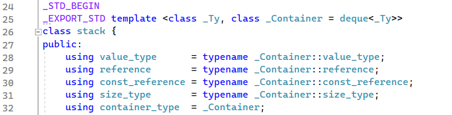
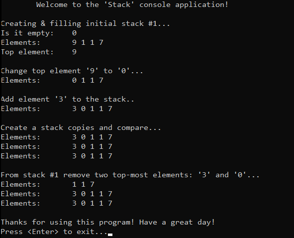

# &#128209; Table of Contents
- [💡 Overview](#-overview)
	- [Essential Terminology](#essential-terminology)
	- [Important Details](#important-details)
	- [Operation Details](#operation-details)
- [💻 Implementation](#-implementation)
	- [Design Decisions](#design-decisions)
	- [Detailed Overview](#detailed-overview)
- [📊 Analysis](#-analysis)
	- [How to Analyze](#how-to-analyze)
	- [Advantages](#advantages)
	- [Disadvantages](#disadvantages)
- [📝 Application](#-application)
	- [Some of the Most Well-Known Use Cases](#some-of-the-most-well-known-use-cases)
	- [Common Practical Problems](#common-practical-problems)
- [🕙 Origins](#-origins)
- [🤝 Contributing](#-contributing)
- [📧 Contacts](#-contacts)
- [🙏 Credits](#-credits)
- [🔏 License](#-license)


# &#128161; Overview
The **Stack** stands out as one of the most fundamental abstract data type (ADT) in computer science that serves as a linear collection of elements, which becomes particularly valuable when you need to manage entities (e.g. data, objects, persons, events, tasks) in a last-in-first-out (LIFO) manner. It is named this way, because of how it resembles the behavior of adding or removing items from the top of a physical stack.  This subsection explores stack to establish a solid knowledge of the ideas behind it, as it helps to create elegant and efficient algorithmic designs for all manner of applications.
<p align="center"></p>

## Essential Terminology
- **Stack** — is a ADT that serves as a linear collection that operates on the LIFO principle.
- **Top** — is the end of the of a collection at which elements are added and removed.
- **Bottom** — is the end of the of a collection opposite to the top.
- **Push** — is an operation of adding an element to the top.
- **Pop** — is an operation of removing an element from the top.
- **Peek** — is an operation of returning a value of element at the top.
- **Overflow** — is a condition that occurs when trying to push an element onto a full stack.
- **Underflow** — is a condition that occurs when trying to pop an element from an empty stack.

## Important Details
Stack generally can be broadly classified based on underlaying data structure into two types: 
- **Array-Based Stack** — utilizes a fixed-size or dynamic array to store elements.  
- **List-Based Stack** — utilizes a singly, doubly or circular linked list to store elements.

While these types share some common ideas, each possesses distinctive characteristics related to the "base" of ADT. For example, while frequent insertion/removal on array can lead to a quite resourceful reallocation, those same operations in linked list require dereferencing. Overall the choice between them depends on the specific requirements of the case at hand. But most of the time people use list-based stack.

## Operation Details
- **Access/Peek** — retrieving or updating the value of last element.
- **Insertion/Push** — adding a new element to the stack.
- **Deletion/Pop** — removing an element from the stack.
- **Clear** — removing all elements, resetting it to an empty state.
- **Empty** — checking if the stack contains no elements.
- **Size** — determining the number of elements.


# &#x1F4BB; Implementation
Discussing ADT, it's evident that well-established and widely recognized implementations already exist for stack. In the context of C++, `std::stack` is a such representative. It's commonly recommended to rely on these proven implementations rather than reinventing the wheel. However, within the scope of this subsection, we'll take a closer look at simplified version of thhis collection. This exploration is aimed at gaining a deeper understanding of the fundamental concepts that underlie them.

## Design Decisions
Keeping its educational aim in mind, the `Stack` class developed here closely resembles the behavior of `std::stack`, with minor adjustments aimed at emphasizing simplicity and focusing on the core aspects of the data structure.
<p align="center"></p>

One significant design decision is the implementation of a stack solely based on a linked list. While the library container provides the option to choose whichever fits the application's idea more, by default, it is implemented on the basis of a deque (which can "blur" the comprehension of the topic, because of how intricate it is implemented - neither like array or list, rather a mix of those two).

## Detailed Overview
<p align="center"></p>

Application's control flow and testing of the class is conducted within the [Main.cpp](https://github.com/vezzolter/DSA/tree/main/DataStructures/Stack/src/Main.cpp) file. The `Stack` class is declared in [Stack.h](https://github.com/vezzolter/DSA/tree/main/DataStructures/Stack/inc/Stack.h) header file and defined in [Stack.cpp](https://github.com/vezzolter/DSA/tree/main/DataStructures/Stack/src/Stack.cpp) source file. This approach is adopted to ensure encapsulation, modularity, and compilation efficiency, but for your convenience here is the declaration of the class:

```cpp
template<class T>
class Stack {
private:
	class Node {
	public:
		T _data;
		Node* _next;

		Node(T data) : _data(data), _next(nullptr) {}
		Node()                           = default;
		Node(const Node& rhs)            = delete;
		Node& operator=(const Node& rhs) = delete;
	};

	int _size;
	Node* _top;

public:
	// Special Member Functions
	Stack();
	Stack(const Stack& rhs);
	Stack& operator=(const Stack& rhs);
	~Stack();

	// Element Access
	T& peek();
	const T& peek() const;

	// Capacity 
	bool empty() const;
	int size() const;

	// Modifiers
	void push(const T& newData);
	void pop();
};
```


# &#128202; Analysis
Understanding how to analyze the particular implementation of a data structure in terms of time and space complexity is crucial for optimizing performance and ensuring efficient resource utilization within the constraints of the given environment. Additionally, knowing the pros and cons of different data structures allows to make informed decisions, helping to choose the most suitable approach for a given problem.

## How to Analyze  
Overall, stack provides «wrapping» behaviour, therefore analysis in terms of space and time complexities mostly based on the underlaying data structure coupled with additional intended logic.

## Advantages
- **LIFO** — stack allows to modify/remove/access only top element, which can find numerous applications.
- **Constant Time Complexity** — stack usually allows to have $O(1)$ time complexity for push, pop and peek operations.

## Disadvantages
- **LIFO** — stack allows to modify/remove/access only top element, making it unsuitable for many scenarios; e.g. searching, sorting, random access.


# &#128221; Application
Understanding some of the most well-known use cases of a data structure is crucial for grasping its practical relevance and potential impact in real-world scenarios. Additionally, familiarizing oneself with common practical problems and practicing their solutions ensures that you remember the essential details and develop a deep, intuitive understanding of the functionality and limitations.

## Some of the Most Well-Known Use Cases
- **Call Stack** — stack is used in programming languages to keep track of function calls. Whenever function is called its respective information is pushed onto the call stack, and when function returns it is popped off from the stack.
- **Exception Handling** — stack is invloved in exception handling mechanisms to propagate and handle exceptions. Technique known as stack unwinding implies the process of stack "unwound" or traversal backwards to find the appropriate exception handler.
- **Backtracking Algorithms** — stack is used in backtracking algorithms to keep track of the current path or state. Whenever those algorithms reach a dead-end, they can backtrack by popping elements off the stack.
- **Undo Mechanics** — stack is used in different applications to implement undo functionality. Each action performed is recorded as an operation on the stack, allowing to undo certain actions by popping off the stack in reverse order.
- **Expression Evaluation** — stack is used in reverse Polish notation to evaluate expressions. It helps to track the order of operations allowing to evaluate the result linearly; e.g. the conventional notation expression $3-4+5$ in Polish becomes $34-5+$, adding each entity sequentially to the stack.

## Common Practical Problems
- [Valid Parentheses](https://leetcode.com/problems/valid-parentheses/)
- [Reverse a string](https://leetcode.com/problems/reverse-string/)
- [Min stack](https://leetcode.com/problems/min-stack/)
- Arithmetic expression evaluation
- [Evaluate Reverse Polish Notation](https://leetcode.com/problems/evaluate-reverse-polish-notation/)
- Celebrity problem
- Convert a queue into the stack
- [Largest Rectangle in Histogram](https://leetcode.com/problems/largest-rectangle-in-histogram/)
- Sort a stack using recursion
- [Max Stack](https://leetcode.com/problems/max-stack/)


# &#x1F559; Origins
Due to the simple and natural concept of this data structure it was quite common in computer programming from the earliest days and its origins cannot be attributed to a single individual, rather it reflects the collective ingenuity of humanity. However, it is still possible to retrace a few notable contributions to understanding of stack to the following people **Jan Lukasiewicz**, **Konrad Zuse**, **Alan Mathison Turing**, **Charles Leonard Hamblin** and most notably **Klaus Samelson** with **Friedirch Ludwig Bauer**, who in March 1988 received the IEEE Computer Pioneer Award for the invention of the stack principle.


# &#129309; Contributing
Contributions are highly appreciated! For detailed guidelines, please refer to the [root directory's contributing section](../../#-contributing).


# &#128231; Contacts
For contact details and additional information, please refer to the [root directory's contact information section](../../#-contacts).


# &#128591; Credits
&#128218; **Books:**
- **"Introduction to Algorithms" (3rd Edition)** — by Thomas H. Cormen, Charles E. Leiserson, Ronald L. Rivest and Clifford Stein
  - Section 10.1: Stacks and Queues
  - Section 10.3: Implementing Pointers and Objects
- **"Algorithms in C++, Parts 1-4: Fundamentals, Data Structure, Sorting, Searching" (3rd Edition)** — by Robert Sedgewick
  - Section 3.7: Compound Data Structures
  - Section 4: Abstract Data Types
- **"Data Structures and Algorithm Analysis in C++" (4th Edition)** — by Mark Allen Weiss
  - Section 3.1: Abstract Data Types
  - Section 3.6: The Stack ADT
- **"The Algorithm Design Manual" (2nd Edition)** — by Steven S. Skiena
  - Section 3.1: Contiguous vs. Linked Data Structures
  - Section 3.2: Stacks and Queues
- **"The Art of Computer Programming, Volume 1: Fundamental Algorithms" (3rd Edition)** — by Donald Ervin Knuth 
  - Section 2.2.1: Stacks, Queues, and Deques
  - Section 2.2.2: Sequential Allocation
  - Section 2.2.3: Linked Allocation
  - Section 2.6: History and Bibliography

---
&#127891; **Courses:**
- [Mastering Data Structures & Algorithms using C and C++](https://www.udemy.com/course/datastructurescncpp/) on Udemy
   - Section 13: Stack
- [Accelerated Computer Science Fundamentals Specialization](https://www.coursera.org/specializations/cs-fundamentals) from Coursera
   - Course 2.1: Linear Structures

---  
&#127760; **Web-Resources:**  
- [Stack (abstract data type)](https://en.wikipedia.org/wiki/Stack_(abstract_data_type)) (Wikipedia)
- [Stack Data Structure](https://www.geeksforgeeks.org/stack-data-structure/)
- [Stack Data Structures](https://www.codesdope.com/course/data-structures-stacks/)
- [std::stack](https://en.cppreference.com/w/cpp/container/stack)
- [A brief history of the stack](https://www.sigcis.org/files/A%20brief%20history.pdf)
- [Second-Generation Stack Computer Architecture](http://fpgacpu.ca/publications/Second-Generation_Stack_Computer_Architecture.pdf)
- [Top 25 Stacks Interview Questions And Answers](https://www.fullstack.cafe/interview-questions/stacks)


# &#128271; License
This project is licensed under the MIT License — see the [LICENSE](https://github.com/vezzolter/DSA/blob/main/LICENSE) file for details.

[](https://opensource.org/licenses/MIT)