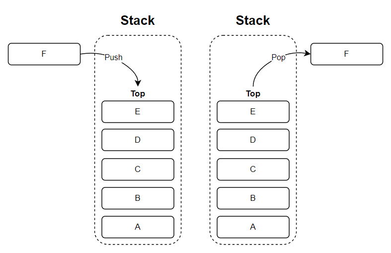
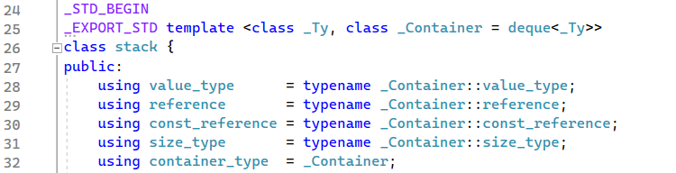
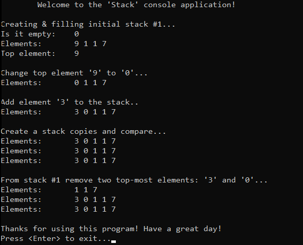

# &#128209; Table of Contents
- [💡 What is the Stack](#-what-is-the-stack)
- [💻 Implementation](#-implementation)
- [📊 Analysis](#-analysis)
- [📝 Application](#-application)
- [⏳ Historical Notes](#-historical-notes)
- [🤝 Contributing](#-contributing)
- [📧 Contact Information](#-contact-information)
- [🙏 Credits](#-credits)
- [🔏 License](#-license)


# &#128161; What is the Stack
The **Stack** stands out as one of the most fundamental abstract data type (ADT) in computer science that serves as a linear collection of elements, which becomes particularly valuable when you need to manage entities (e.g. data, objects, persons, events, tasks) in a last-in-first-out (LIFO) manner. It is named this way, because of how it resembles the behavior of adding or removing items from the top of a physical stack. This subsection explores the stack ADT not only to enhance comprehension of its concepts, but also to establish a solid foundation for a more complex algorithmic designs and problem-solving strategies.
<p align="center"></p>

---
**Essential Terminology:**
- **Stack** — is a ADT that serves as a linear collection that operates on the LIFO principle.
- **Top** — is the end of the of a collection at which elements are added and removed.
- **Bottom** — is the end of the of a collection opposite to the top.
- **Push** — is an operation of adding an element to the top.
- **Pop** — is an operation of removing an element from the top.
- **Peek** — is an operation of returning a value of element at the top.
- **Overflow** — is a condition that occurs when trying to push an element onto a full stack.
- **Underflow** — is a condition that occurs when trying to pop an element from an empty stack.

---
What identifies the data structure as stack is not the implementation but the interface: the user is only allowed to pop or push elements with few other helper operations. The interface includes next common operations:
- **push** — inserts element at the top.
- **pop** — removes the top element.
- **peek** — accesses the top element.
- **empty** — checks whether the container adaptor is empty.
- **size** — returns the number of elements.

---
When it comes to the underlaying data structure, a stack generally can be broadly classified into two types: 
- **Array-Based Stack** — utilizes a fixed-size or dynamic array to store elements.  
- **List-Based Stack** — utilizes a singly, doubly or circular linked list to store elements.

While these types share some common ideas, each possesses distinctive characteristics related to the "base" of ADT. For example, while frequent insertion/removal on array can lead to a quite resourceful reallocation, those same operations in linked list require dereferencing. Overall the choice between them depends on the specific requirements of the case at hand.  


# &#x1F4BB; Implementation
Discussing ADT, it's evident that well-established and widely recognized implementations already exist for stack. In the context of C++, `std::stack` is a such representative. It's commonly recommended to rely on these proven implementations rather than reinventing the wheel. However, within the scope of this subsection, we'll take a closer look at simplified version of thhis collection. This exploration is aimed at gaining a deeper understanding of the fundamental concepts that underlie them.

---
Keeping its educational aim in mind, the `Stack` class developed here closely resembles the behavior of `std::stack`, with minor adjustments aimed at emphasizing simplicity and focusing on the core aspects of the data structure.
<p align="center"></p>

One significant design decision is the implementation of a stack solely based on a linked list. While the library container provides the option to choose whichever fits the application's idea more, by default, it is implemented on the basis of a deque (which can "blur" the comprehension of the topic, because of how intricate it is implemented - neither like array or list, rather a mix of those two).

---
<p align="center"></p>

**Detailed Overview**:
1. The `Stack` class is declared in `Stack.h` header file and defined in `Stack.cpp` source file. This approach is adopted to ensure encapsulation, modularity and compilation efficiency. Testing of the class functionalities is conducted within the `main()` function located in the `Main.cpp` file.
2. Whole class declaration:
```cpp
template<class T>
class Stack {
private:
	class Node {
	public:
		T _data;
		Node* _next;

		Node(T data) : _data(data), _next(nullptr) {}
		Node()                           = default;
		Node(const Node& rhs)            = delete;
		Node& operator=(const Node& rhs) = delete;
	};

	int _size;
	Node* _top;

public:
	// Special Member Functions
	Stack();
	Stack(const Stack& rhs);
	Stack& operator=(const Stack& rhs);
	~Stack();

	// Element Access
	T& peek();
	const T& peek() const;

	// Capacity 
	bool empty() const;
	int size() const;

	// Modifiers
	void push(const T& newData);
	void pop();
};
```

5. Special member functions:
```cpp
// Default constructor
template<typename T>
Stack<T>::Stack() : _size(0), _top(nullptr) {}

// Deep copy constructor
template<class T>
Stack<T>::Stack(const Stack& rhs) : _size(0), _top(nullptr) {
	// Iterate through the nodes of rhs stack and copy each element
	Node* rhsCurrent = rhs._top;
	Node* prevNode = nullptr;
	while (rhsCurrent != nullptr) {
		// Create a new node with the same data
		Node* newNode = new Node(rhsCurrent->_data);

		// Attach the new node to the current stack
		if (prevNode == nullptr)
			_top = newNode;
		else
			prevNode->_next = newNode;

		// Move to the next node in rhs stack
		prevNode = newNode;
		rhsCurrent = rhsCurrent->_next;
	}

	// Update the size
	_size = rhs._size;
}

// Deep copy assignment operator
template<class T>
Stack<T>& Stack<T>::operator=(const Stack& rhs) {
	// Self-assignnment guard
	if (this == &rhs)
		return *this;

	// Ensure that the destination stack doesn't retain any of its existing elements
	while (!empty())
		pop();

	// Set corresponding size
	_size = rhs._size;

	// Case: empty stack
	if (rhs._top == nullptr) {
		_top = nullptr;
	}
	else {
		// Perform deep copy from rhs to this stack
		Node* rhsCurrent = rhs._top;
		while (rhsCurrent != nullptr) {
			push(rhsCurrent->data);
			rhsCurrent = rhsCurrent->next;
		}
	}

	return *this;
}

// Destructor
template<typename T>
Stack<T>::~Stack() {
	while (!empty())
		pop();
}
```

6. Element access:
```cpp
// Accesses the last element in the container, no range validation, allows modification
template<class T>
T& Stack<T>::peek() { return _top->_data; }

// Accesses the last element in the container, no range validation, denies modification
template<class T>
const T& Stack<T>::peek() const { return _top->_data; };

```

7. Capacity methods:
```cpp
// Checks if the container has no elements
template<class T>
bool Stack<T>::empty() const { return _size == 0; }

// Returns the number of elements in the container
template<typename T>
int Stack<T>::size() const { return _size; }
```

8. Modifiers:
```cpp
// Appends the given element to the end of the container
template<class T>
void Stack<T>::push(const T& newData) {
	// Create a new node with the given data
	Node* newNode = new Node(newData);

	// Case: empty stack
	if (_top == nullptr) {
		_top = newNode;
	}
	else {
		newNode->_next = _top;
		_top = newNode;
	}

	// Update the size
	++_size;
}

// Removes the last element of the container
// Note: with no bounds check, assumes that stack contains at least 1 element
template<class T>
void Stack<T>::pop() {
	// Case: empty stack
	if (_top == nullptr)
		return;

	// Move the top ptr to the next node
	Node* temp = _top;
	_top = _top->_next;
	delete temp;

	// Update the size
	--_size;
}
```


# &#128202; Analysis
Currently in progress...


# &#128221; Application
Currently in progress...


# &#x23F3; Historical Notes
Currently in progress...


# &#129309; Contributing
Contributions are highly appreciated! For detailed guidelines, please refer to the [root directory's contributing section](../../#-contributing).


# &#128231; Contact Information
For contact details and additional information, please refer to the [root directory's contact information section](../../#-contact-information).


# &#128591; Credits
&#128218; **Books:**
- **"Data Structures and Algorithm Analysis in C++" (4th Edition)** — by Mark Allen Weiss
  - Section 3.1: Abstract Data Types
  - Section 3.6: The Stack ADT
- **"Algorithms in C++, Parts 1-4: Fundamentals, Data Structure, Sorting, Searching" (3rd Edition)** — by Robert Sedgewick
  - Section 4: Abstract Data Types
- **"Introduction to Algorithms" (3rd Edition)** — by Thomas H. Cormen, Charles E. Leiserson, Ronald L. Rivest and Clifford Stein
  - Section 10.1: Stacks and Queues
- **"The Art of Computer Programming, Volume 1: Fundamental Algorithms" (3rd Edition)** — by Donald Ervin Knuth 
  - Section 2.2.1: Stacks, Queues, and Deques
  - Section 2.2.2: Sequential Allocation
  - Section 2.2.3: Linked Allocation

---
&#127891; **Courses:**
- [Mastering Data Structures & Algorithms using C and C++](https://www.udemy.com/course/datastructurescncpp/) on Udemy
   - Section 13: Stack
- [Accelerated Computer Science Fundamentals Specialization](https://www.coursera.org/specializations/cs-fundamentals) from Coursera
   - Course 2.1: Linear Structures

---  
&#127760; **Web-Resources:**  
- [Stack (abstract data type)](https://en.wikipedia.org/wiki/Stack_(abstract_data_type)) (Wikipedia)
- [Stack Data Structure](https://www.geeksforgeeks.org/stack-data-structure/)
- [std::stack](https://en.cppreference.com/w/cpp/container/stack)
- [Stack Data Structures](https://www.codesdope.com/course/data-structures-stacks/)


# &#128271; License
This project is licensed under the MIT License — see the [LICENSE](https://github.com/vezzolter/DSA/blob/main/LICENSE) file for details.

[](https://opensource.org/licenses/MIT)