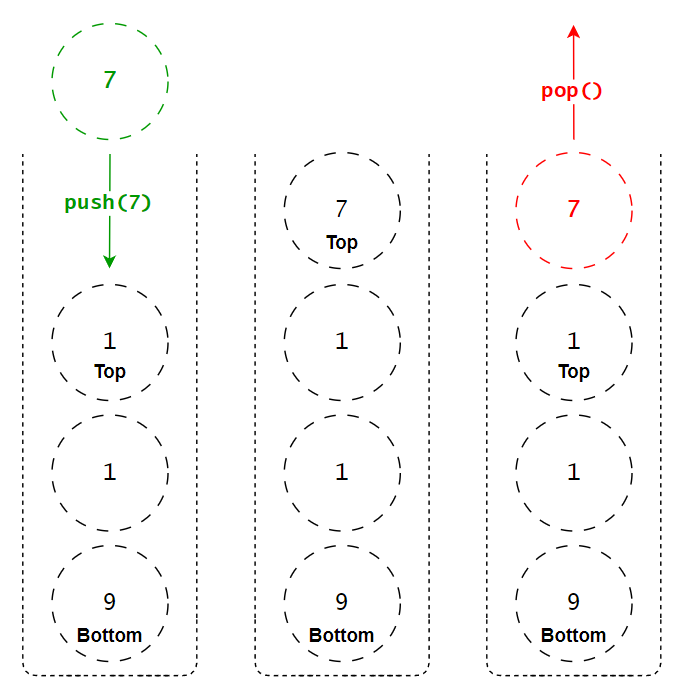
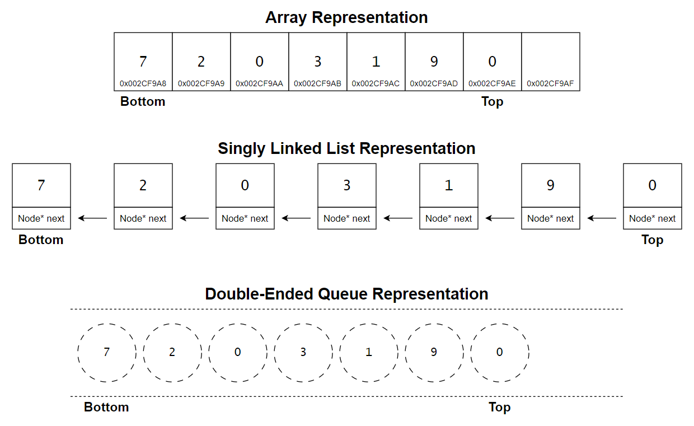
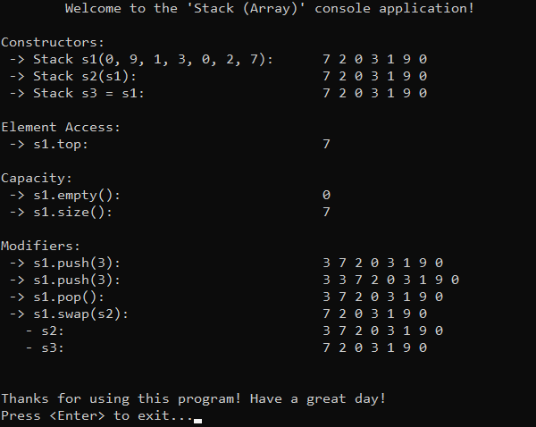

# &#128209; Table of Contents
- [💡 Overview](#-overview)
	- [Essential Terminology](#essential-terminology)
	- [Core Mechanics](#core-mechanics)
	- [Container Methods](#container-methods)
- [💻 Implementation](#-implementation)
	- [Design Decisions](#design-decisions)
	- [Container Implementation](#container-implementation)
	- [Iterator Implementation](#iterator-implementation)
- [📊 Analysis](#-analysis)
	- [Characteristics](#characteristics)
	- [Trade-Offs](#trade-offs)
- [📝 Application](#-application)
	- [Common Use Cases](#common-use-cases)
	- [Some Practical Problems](#some-practical-problems)
- [🕙 Origins](#-origins)
- [🤝 Contributing](#-contributing)
- [📧 Contacts](#-contacts)
- [🙏 Credits](#-credits)
- [🔏 License](#-license)


# &#128161; Overview
**Stack** refers to both an abstract data structure and a concrete container, that operates on a Last-In-First-Out (LIFO) principle. The term _«stack»_ comes from this real-world analogy of stacking objects on top of each other, much like stack of dishes where the topmost item is the first to be accessed. Knowledge and understanding of it lay a solid foundation in designing data structures and optimizing their application.
<p align="center"></p>


## Essential Terminology
- **Abstract Data Structure** — is a theoretical model that defines a set of operations and guarantees for organizing and manipulating data, independent of memory organization or specific implementation details.
  - **Data Structure** — is a theoretical model of data organization in memory, used to design containers in an efficient or specific ways.
  - **Container** — is a concrete implementation, used to manage actual data through specific operations. Containers are primarily defined by the operations and guarantees they provide, which can originate from the data structure itself or from an abstract data structure. As long as those guarantees are fulfilled, the underlying model can be modified or replaced.
- **Stack** — refers to both an abstract data structure and a concrete container, that operates on a LIFO principle. This dual nature arises from its ability to represent a conceptual guarantee of functionality while being implemented in diverse ways.
  - **Top** — is the end of the collection at which elements are added and removed.
  - **Bottom** — is the end of the collection opposite to the top.


## Core Mechanics
Work of many computer programs is organized in a way that naturally aligns with how a stack operates. Programs frequently postpone certain tasks to handle others, and often need to return to the most recently postponed task. This behavior reflects the **LIFO** principle, making the stack a fundamental data structure for managing tasks in a wide range of algorithms.

To better understand the stack, specific terms are introduced to describe its structure and operations. The end of the collection where elements are added and removed is called the **top**, while the **bottom** refers to the opposite end, which remains fixed unless the stack is emptied. The design of a stack enforces the LIFO principle by restricting operations to the top. Elements can be added (an operation known as **push**) or removed (**pop**) only from this end. Many implementations also include a **peek** operation, allowing the value of the top element to be viewed without modifying the stack. These constraints have their own advantages and disadvantages, which are discussed in the [Trade-Offs](#trade-offs) section.

---
At its core, a stack is simply a collection that enforces the LIFO principle, and it imposes no strict requirements on how it must be implemented. While the most common implementations allow users to choose the underlying data structure, by default they rely on **arrays** and then on **linked lists**, although stack can also be built using other data structures in specialized contexts.
<p align="center"></p>

Most stack implementations rely on arrays due to their simplicity, efficiency, and excellent memory locality, which improves performance for sequential processing. In array-based stacks, elements are stored in contiguous memory, with a pointer or index used to track the top of the stack. This design ensures $O(1)$ performance for push and pop operations under normal conditions. Additionally, arrays eliminate the need for dynamic memory allocation during individual operations, reducing overhead. In contrast to linked lists, arrays benefit from superior cache locality and lower memory overhead. However, this approach comes with limitations: fixed-size arrays require a predefined capacity, leading to potential **overflow**. To address this, modern implementations often use dynamically resizable arrays, which double their size when full, balancing efficiency and memory management. 


## Container Methods
When working with stack, it's important to note that there is no universal standard defining a strict list of operations or guidelines for how they should be implemented. The design and functionality of a container can vary depending on several factors, such as the programming language, the purpose of the library, performance considerations, etc. Despite these variations, there are still common operations found across most implementations, typically derived from the fundamental needs of data manipulation, like accessing, modifying, or iterating over elements. Since this repository is dedicated to C++, the operations provided will closely resemble those found in `std::stack`.

---
**Compiler Generated:**
- `Default Constructor` — creates an empty stack, initializing its internal structure to represent a collection with no elements. Metadata such as size is set to indicate an empty state.
- `Copy Constructor` — creates a new stack by copying elements and metadata from another stack.
- `Move Constructor` — creates a new stack by transferring ownership of elements and metadata from another stack, leaving the original stack in a valid but unspecified state. This avoids the overhead of copying by efficiently reusing memory through ownership transfer.
- `Copy Assignment Operator` — overwrites the existing stack with the elements and metadata of another stack by copying them.
- `Move Assignment Operator` — overwrites the existing stack with the elements and metadata of another stack by transferring ownership, leaving the original stack in a valid but unspecified state. This avoids the overhead of copying by reusing the original memory.
- `Destructor` — performs cleanup on the stack: deallocates memory for stored elements and ensures no memory leaks.

---
**Iterators:**
- **Not Typically Provided** — stack implementations, such as `std::stack`, do not provide iterators because stacks are designed to enforce the LIFO principle, restricting access to only the top element. This ensures that the stack abstraction remains intact and prevents iteration, which could violate the conceptual constraints of the data structure. If iteration is needed, it is typically performed by accessing the underlying container (e.g. `std::deque`, `std::vector`, `std::list`).


---
**Element Access:**
- `top()` — retrieves a reference to the top element of the stack.
  - accessing the top element of an empty stack causes undefined behavior;
  - the returned reference allows for modification of the top element if the stack is not const-qualified.

---
**Capacity:**
- `empty()` — returns `true` if the stack is empty, otherwise `false`.
- `size()` — returns the number of elements currently stored in the stack.

---
**Modifiers:**
- `push()` — adds an element to the top of the stack.
  - if the underlying container is full and cannot grow dynamically, this may cause an overflow error or require resizing.
- `emplace()` — constructs a new element in place at the top of the stack.
  - avoids unnecessary copies by directly constructing the element in the storage.
- `pop()` — removes the top element of the stack.
  - calling `pop()` on an empty stack causes undefined behavior.
- `swap()` — exchanges the contents of two stacks.
  - does not invalidate iterators but associates them with the swapped stacks.


# &#x1F4BB; Implementation
The implemented console application demonstrates the basic functionality of the stack container based on dynamic array by performing various operations and interactions with it. The program provides a clear view of changes made during usage, displaying the state of the data at different stages to illustrate its simplified behavior and characteristics.
<p align="center"></p>


## Design Decisions
To prioritize simplicity and emphasize data structure itself, several design decisions were made:
- Resembling the behavior of `std::stack` to provide familiarity for users.
- Doubling the capacity whenever reallocation occurs.
- Do not implementing iterators.
- Omitting cases where the container (object itself) is created on the heap.
- Excluding move semantics to keep the focus on fundamental mechanics.
- Relying on manual memory management without using smart pointers.
- Avoiding any exception handling, thus certain range validations.
- Omitting certain possible optimizations to the container.


## Container Implementation
The container is implemented within the `Stack` class, which is declared in [Stack.h](https://github.com/vezzolter/DSA/blob/stack/DataStructures/Stack/Include/Stack.h) header file and defined in [Str.cpp](https://github.com/vezzolter/DSA/blob/stack/DataStructures/Stack/Include/Stack.cpp) source file. This approach is adopted to ensure encapsulation, modularity and compilation efficiency. To see the container's functionality in action, you can examine the `main()` function located in the [Main.cpp](https://github.com/vezzolter/DSA/blob/stack/DataStructures/Stack/Include/Main.cpp) file. The full implementation can be found in the corresponding files, while the class declaration below offers a quick overview:

```cpp
class Stack {
private:
	int _size;
	int _capacity;
	int* _data;

public:
	// --------------------
	//  Compiler Generated
	// --------------------
	Stack();
	Stack(const Stack& other);
	Stack(Stack&& other)          = delete;
	Stack& operator=(const Stack& rhs);
	Stack& operator=(Stack&& rhs) = delete;
	~Stack();

	// ----------------
	//  Element Access
	// ----------------
	int& top();
	const int& top() const;

	// ----------
	//  Capacity
	// ----------
	bool empty() const;
	int size() const;

	// -----------
	//  Modifiers
	// -----------
	void push(const int& val);
	void pop();
	void swap(Stack& other);
};
```

## Iterator Implementation
Currently in Progress...


# &#128202; Analysis
Currently in Progress...


## Characteristics
Currently in Progress...


## Trade-Offs
Currently in Progress...


# &#128221; Application
The concrete situations where a data structure is best (and worst) used stem directly from the inherent advantages (and disadvantages) of the container. Аor example, one advantage of stacks is their ability to manage data using the LIFO principle, making them suitable for scenarios where tasks need to be processed in reverse order, such as undo operations or managing function calls. Conversely, a disadvantage of stacks is their restriction to sequential access, which makes them a poor choice for situations requiring direct access to arbitrary elements within the collection. In order to avoid this sort of rephrasing, the following section outlines common real-world scenarios where these use cases are frequently encountered. Additionally, familiarizing oneself with common practical problems and practicing their solutions ensures that you remember the essential details and develop a deep, intuitive understanding of the functionality and limitations.


## Common Use Cases
- **Call Stack** — stack is used in programming languages to keep track of function calls. Whenever function is called its respective information is pushed onto the call stack, and when function returns it is popped off from the stack.

- **Exception Handling** — stack is involved in exception handling mechanisms to propagate and handle exceptions. Technique known as stack unwinding implies the process of stack "unwound" or traversal backwards to find the appropriate exception handler.

- **Backtracking Algorithms** — stack is used in backtracking algorithms to keep track of the current path or state. Whenever those algorithms reach a dead-end, they can backtrack by popping elements off the stack.

- **Undo Mechanics** — stack is used in different applications to implement undo functionality. Each action performed is recorded as an operation on the stack, allowing to undo certain actions by popping off the stack in reverse order.

- **Expression Evaluation** — stack is used in reverse Polish notation to evaluate expressions. It helps to track the order of operations allowing to evaluate the result linearly; e.g. the conventional notation expression «$3-4+5$» in Polish becomes «$+-345$», adding each entity sequentially to the stack.


## Some Practical Problems
**Easy Problems:**
1. [Valid Parentheses](https://leetcode.com/problems/valid-parentheses)
2. [Backspace String Compare](https://leetcode.com/problems/backspace-string-compare)
3. [Baseball Game](https://leetcode.com/problems/baseball-game)
4. [Next Greater Element I](https://leetcode.com/problems/next-greater-element-i)
5. [Clear Digits](https://leetcode.com/problems/clear-digits)
6. [Implement Stack using Queues](https://leetcode.com/problems/implement-stack-using-queues)

---
**Medium Problems:** 
1. [Min stack](https://leetcode.com/problems/min-stack)
2. [Evaluate Reverse Polish Notation](https://leetcode.com/problems/evaluate-reverse-polish-notation)
3. [Daily Temperatures](https://leetcode.com/problems/daily-temperatures)
4. [132 Pattern](https://leetcode.com/problems/132-pattern)
5. [Remove K Digits](https://leetcode.com/problems/remove-k-digits)
6. [Online Stock Span](https://leetcode.com/problems/online-stock-span)
7. [Simplify Path](https://leetcode.com/problems/simplify-path)
8. [Decode String](https://leetcode.com/problems/decode-string)
9. [Valid Parenthesis String](https://leetcode.com/problems/valid-parenthesis-string)
10. [Asteroid Collision](https://leetcode.com/problems/asteroid-collision)
11. [Score of Parentheses](https://leetcode.com/problems/score-of-parentheses)
12. [Design Browser History](https://leetcode.com/problems/design-browser-history)

---
**Hard Problems:** 
1. [Longest Valid Parentheses](https://leetcode.com/problems/longest-valid-parentheses)
2. [Basic Calculator](https://leetcode.com/problems/basic-calculator)
3. [Maximum Frequency Stack](https://leetcode.com/problems/maximum-frequency-stack)
4. [Trapping Rain Water](https://leetcode.com/problems/trapping-rain-water)
5. [Largest Rectangle in Histogram](https://leetcode.com/problems/largest-rectangle-in-histogram)
6. [Maximal Rectangle](https://leetcode.com/problems/maximal-rectangle)


# &#x1F559; Origins
Due to the simple and natural concept of this data structure it was quite common in computer programming from the earliest days and its origins cannot be attributed to a single individual, rather it reflects the collective ingenuity of humanity. However, it is still possible to retrace a few notable contributions to understanding of stack to the following people **Jan Lukasiewicz**, **Konrad Zuse**, **Alan Mathison Turing**, **Charles Leonard Hamblin** and most notably **Klaus Samelson** with **Friedirch Ludwig Bauer**, who in March 1988 received the IEEE Computer Pioneer Award for the invention of the stack principle.


# &#129309; Contributing
Contributions are highly appreciated! For detailed guidelines, please refer to the [root directory's contributing section](../../#-contributing).


# &#128231; Contacts
For contact details and additional information, please refer to the [root directory's contact information section](../../#-contacts).


# &#128591; Credits
&#128218; **Books:**
- **"Introduction to Algorithms" (3rd Edition)** — by Thomas H. Cormen, Charles E. Leiserson, Ronald L. Rivest and Clifford Stein
  - Section 10.1: Stacks and Queues
- **"Algorithms in C++, Parts 1-4: Fundamentals, Data Structure, Sorting, Searching" (3rd Edition)** — by Robert Sedgewick
  - Section 4.2: Pushdown Stack ADT
  - Section 4.3: Examples of Stack ADT Clients
  - Section 4.4: Stack ADT Implementations
  - Section 4.5: Creation of a New ADT
- **"Data Structures and Algorithm Analysis in C++" (4th Edition)** — by Mark Allen Weiss
  - Section 3.1: Abstract Data Types (ADTs)
  - Section 3.6: The Stack ADT
- **"The Algorithm Design Manual" (2nd Edition)** — by Steven S. Skiena
  - Section 3.2: Stacks and Queues
- **"The Art of Computer Programming, Volume 1: Fundamental Algorithms" (3rd Edition)** — by Donald Ervin Knuth 
  - Section 2.2.1: Stacks, Queues, and Deques
  - Section 2.6: History and Bibliography

---
&#127891; **Courses:**
- [Mastering Data Structures & Algorithms using C and C++](https://www.udemy.com/course/datastructurescncpp/) on Udemy
   - Section 13: Stack
- [Accelerated Computer Science Fundamentals Specialization](https://www.coursera.org/specializations/cs-fundamentals) from Coursera
   - Course 2.1: Linear Structures

---  
&#127760; **Web-Resources:**  
- [Stack (abstract data type)](https://en.wikipedia.org/wiki/Stack_(abstract_data_type)) (Wikipedia)
- [std::stack](https://en.cppreference.com/w/cpp/container/stack) (Documentation)
- [Second-Generation Stack Computer Architecture](http://fpgacpu.ca/publications/Second-Generation_Stack_Computer_Architecture.pdf) (Research Paper)


# &#128271; License
This project is licensed under the MIT License — see the [LICENSE](https://github.com/vezzolter/DSA/blob/main/LICENSE) file for details.

[](https://opensource.org/licenses/MIT)