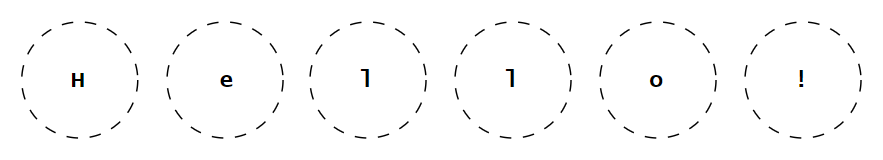

# 📑 Table of Contents
- [💡 Overview](#-overview)
  - [Essential Terminology](#essential-terminology)
  - [Core Mechanics](#core-mechanics)
  - [Container Methods](#container-methods)
- [💻 Implementation](#-implementation)
  - [Design Decisions](#design-decisions)
  - [Container Implementation](#container-implementation)
  - [Iterator Implementation](#iterator-implementation)
- [📊 Analysis](#-analysis)
  - [Characteristics](#characteristics)
  - [Trade-Offs](#trade-offs)
- [📝 Application](#-application)
  - [Common Use Cases](#common-use-cases)
  - [Some Practical Problems](#some-practical-problems)
- [🕙 Origins](#-origins)
- [🤝 Contributing](#-contributing)
- [📧 Contacts](#-contacts)
- [🙏 Credits](#-credits)
- [🔏 License](#-license)

# 💡 Overview
**String** refers to both an abstract data structure and a concrete container, embodying a sequence of characters designed for storing and manipulating text or symbolic data. This dual nature arises from its ability to represent a conceptual guarantee of functionality while being implemented in diverse ways. The term _«string»_ comes from its resemblance to a string of characters, much like beads strung together on a physical string. Knowledge and understanding of it lay a solid foundation in designing data structures and optimizing their application.

## Essential Terminology
Currently in Progress...

## Core Mechanics
Currently in Progress...

## Container Methods
Currently in Progress...

# &#x1F4BB; Implementation 
Currently in Progress...

## Design Decisions
Currently in Progress...

## Container Implementation
Currently in Progress...

## Iterator Implementation
Currently in Progress...

# &#128202; Analysis
Currently in Progress...

## Characteristics
Currently in Progress...

## Trade-Offs
Currently in Progress...

 

# &#128221; Application
Currently in Progress...

## Common Use Cases
Currently in Progress...

## Some Practical Problems
Currently in Progress...

# &#x1F559; Origins
Currently in Progress...

# &#129309; Contributing
Contributions are highly appreciated! For detailed guidelines, please refer to the [root directory's contributing section](../../#-contributing).

# &#128231; Contacts
For contact details and additional information, please refer to the [root directory's contact information section](../../#-contacts).

# &#128591; Credits
&#128218; **Books:**
- **"Algorithms in C++, Parts 1-4: Fundamentals, Data Structure, Sorting, Searching" (3rd Edition)** — by Robert Sedgewick
  - Section 3.6: Strings

---
&#127891; **Courses:**
- [Mastering Data Structures & Algorithms using C and C++](https://www.udemy.com/course/datastructurescncpp/) on Udemy
   - Section 8: Strings

--- 
&#127760; **Web-Resources:**
- [String (computer science)](https://en.wikipedia.org/wiki/String_(computer_science)) (Wikipedia)
- [Character (computing)](https://en.wikipedia.org/wiki/Character_(computing)) (Wikipedia)
- [Writing an ITERATOR in C++](https://www.youtube.com/watch?app=desktop&v=F9eDv-YIOQ0) (Video)

# &#128271; License
This project is licensed under the MIT License — see the [LICENSE](https://github.com/vezzolter/DSA/blob/main/LICENSE) file for details.

