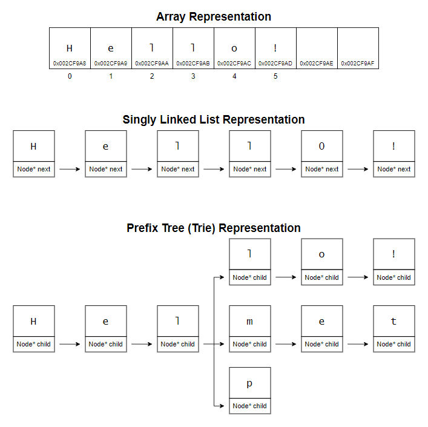

# &#128209; Table of Contents
- [💡 Overview](#-overview)
  - [Essential Terminology](#essential-terminology)
  - [Core Mechanics](#core-mechanics)
  - [Container Methods](#container-methods)
- [💻 Implementation](#-implementation)
  - [Design Decisions](#design-decisions)
  - [Container Implementation](#container-implementation)
  - [Iterator Implementation](#iterator-implementation)
- [📊 Analysis](#-analysis)
  - [Characteristics](#characteristics)
  - [Trade-Offs](#trade-offs)
- [📝 Application](#-application)
  - [Common Use Cases](#common-use-cases)
  - [Some Practical Problems](#some-practical-problems)
- [🕙 Origins](#-origins)
- [🤝 Contributing](#-contributing)
- [📧 Contacts](#-contacts)
- [🙏 Credits](#-credits)
- [🔏 License](#-license)

# &#128161; Overview
**String** refers to both an abstract data structure and a concrete container, embodying a sequence of characters designed for storing and manipulating text or symbolic data. The term _«string»_ comes from its resemblance to a string of characters, much like beads strung together on a physical string. Knowledge and understanding of it lay a solid foundation in designing data structures and optimizing their application.

## Essential Terminology
- **Abstract Data Structure** — is a theoretical model that defines a set of operations and guarantees for organizing and manipulating data, independent of memory organization or specific implementation details.
  - **Data Structure** — is a theoretical model of data organization in memory, used to design containers in an efficient or specific ways.
  - **Container** — is a concrete implementation, used to manage actual data through specific operations. Containers are primarily defined by the operations and guarantees they provide, which can originate from the data structure itself or from an abstract data structure. As long as those guarantees are fulfilled, the underlying model can be modified or replaced.
- **String** — refers to both an abstract data structure and a concrete container, embodying a sequence of characters designed for storing and manipulating text or symbolic data. This dual nature arises from its ability to represent a conceptual guarantee of functionality while being implemented in diverse ways.
  - **Character** — the smallest unit of a text that has semantic value.

## Core Mechanics
In programming, there was a need to compactly represent characters, such as letters, digits, and symbols, in a way that both humans and computers could interpret. A character is essentially the smallest unit of text, and strings are sequences of these characters grouped together to represent text. Characters are mapped to binary representations (sequence of bits) via **character encodings**, allowing computers to store and process text in a machine-readable format, while humans see it as readable text. 

Different mappings exist to efficiently represent diverse characters, symbols, and languages, while balancing memory usage, compatibility, and performance across systems. While fixed-length encodings allow constant-time indexing $O(1)$, variable-length encodings require traversing the string to decode each character, resulting in $O(n)$ complexity for accessing characters by index. 

**Some Popular Encodings:**
- **ASCII (American Standard Code for Information Interchange)** — is a standard for encoding basic English text and control symbols.
  - **ASCII** — is a fixed-length encoding, which uses $7$ bits per character.
  - **Extended ASCII** — is fixed-length encoding, which uses $8$ bits per character.
  

- **UTF (Unicode Transformation Format)** — is a universal standard designed to represent characters from all languages, symbols, and emojis, using multibyte encodings that allow a single character to occupy more than one byte.
  - **UTF-8** — is a variable-length encoding, which uses $1$ to $4$ bytes per character.
  - **UTF-16** — is variable-length encoding, which uses $2$ bytes for most characters, with some requiring $4$ bytes.
  - **UTF-32** — is fixed-length encoding, which uses $4$ bytes per character.
  

---
At its core, a string is simply a representation of a sequence of characters, and it imposes no strict requirements on how it must be implemented. While the most common implementations rely on **arrays**, strings can also be built using linked lists, trees, or other data structures in specialized contexts.

Most string implementations rely on arrays because of their simplicity, efficiency in accessing elements, and excellent memory locality, which optimizes performance for sequential processing. This is why, in the C language, strings are represented as contiguous arrays of characters, with a **null terminator** «`\0`» marking the end of the sequence. This design enables string-processing functions to traverse the array until they encounter the null character, making it lightweight and straightforward. However, this approach has limitations: it requires manual memory management, lacks built-in size tracking, and is prone to issues like buffer overflows if not carefully handled. Despite these challenges, null-terminated strings remain widely used today, particularly in low-level programming and embedded systems, due to their minimal overhead.

Modern programming languages, particularly with the advent of object-oriented programming, have enhanced the concept of array-based strings by introducing string containers as dedicated classes. These classes encapsulate string functionality, providing built-in methods for operations such as concatenation, slicing, and searching, while abstracting away low-level details like resizing, size tracking with null-terminator (however, it can be added to maintain compatibility when necessary), and memory management. This design significantly improves safety, flexibility, and ease of use compared to traditional string implementations.

## Container Methods
When working with strings, it's important to note that there is no universal standard defining a strict list of operations or guidelines for how they should be implemented. The design and functionality of a container can vary depending on several factors, such as the programming language, the purpose of the library, performance considerations, etc. Despite these variations, there are still common operations found across most implementations, typically derived from the fundamental needs of data manipulation, like accessing, modifying, or iterating over elements. Since this repository is dedicated to C++, the operations provided will closely resemble those found in `std::string`.

---
**Compiler Generated:**
- `Default Constructor` — creates an empty string, initializing its internal structure to represent a sequence with no characters. If applicable, metadata such as size or capacity is set to indicate an empty state.
- `Copy Constructor` — creates a new string by copying characters and metadata from another string.
- `Move Constructor` — creates a new string by transferring ownership of characters and metadata from another string, leaving the original string in a valid, but unspecified state. This avoids the overhead of copying by efficiently reusing the original memory through a simple transfer of ownership.
- `Copy Assignment Operator` — overwrites the existing string with the characters and metadata of another string by copying them.
- `Move Assignment Operator` — overwrites the existing string with the characters and metadata of another string by transferring ownership, leaving the original string in a valid but unspecified state. This avoids the overhead of copying by efficiently reusing the original memory through a simple transfer of ownership.
- `Destructor` — performs cleanup on the string: deallocates memory for stored characters and properly handles any associated resources or metadata, ensuring there are no memory leaks.

---

**Iterators:**
- `begin`, `cbegin` — returns an iterator (or constant iterator) to the first element.
- `end`, `cend` — returns an iterator (or constant iterator) to the position one past the last element, making range $[begin, end)$ easy for traversal.
- `rbegin`, `crbegin` — returns an iterator (or constant one) to the last element.
- `rend`, `crend` — returns an iterator (or constant one) to the position one before the first element, making range $[rend, rbegin)$ easy for traversal.

---

**Element Access:**
- `at()` — returns the specified element with bounds checking.
  - if the element is not within the range of the container, throws an exception.
- `operator[]` — returns the specified element without bounds checking.
  - accessing a nonexistent element through this operator is undefined behavior.
- `front()` — returns the first element in the container.
  - calling on an empty container causes undefined behavior.
- `back()` — returns the last element in the container.
  - calling on an empty container causes undefined behavior.
- `data()` — returns a pointer to the underlying array serving as character storage.
  - the returned pointer is valid only as long as the string is not modified.
- `c_str()` — returns a pointer to a null-terminated character array with data equivalent to those stored in the string.
  - the returned pointer is valid only as long as the string is not modified.

---
**Capacity:**
- `empty()` — returns `true` if container is empty, otherwise `false`.
- `size()` — returns the number of elements in the container, i.e. basically distance from begin to end.
- `maxSize()` — returns the maximum number of elements the container is able to hold theoretically, if all available memory were dedicated to that single container.
- `capacity()` — returns the number of elements that can be held in currently allocated storage.
- `reserve()` — increases the capacity of the string to a value that's greater or equal to the given capacity.
  - if the given capacity is greater than current, new storage is allocated; otherwise, does nothing.
- `shrinkToFit()` — reduces the capacity to the size of the string.

---
**Modifiers:**
- `insert()` — inserts character(s), substring(s), or another string into the string at the specified position. 
  - requires proper valid indices/iterators in order to avoid exceptions or undefined behaviors;
  - if after the operations size is greater than capacity a reallocations takes place.
- `erase()` — erases the specified character(s) or substring from the string. 
  - requires valid indices or iterators to avoid exceptions or undefined behavior;
  - invalidates iterators pointing to elements after the erased range.
- `push_back()` — appends the given character to the end of the string. 
  - if, after the operation, the size is greater than the capacity, a reallocation takes place.
- `pop_back()` — removes the last character of the string. 
  - calling on an empty string causes undefined behavior.
- `assign()` — replaces the entire content of the string with the given value (characters, substring, or another string). 
  - any previous values will be replaced, invalidating any references, pointers, and iterators referring to contained characters.
- `clear()` — erases all characters from the string. 
  - invalidates any references, pointers, and iterators to the contained characters;
  - does not change the string's capacity.
- `resize()` — resizes the string to contain the specified number of characters.
  - if the new size is smaller, the string is truncated to the first `n` characters;
  - if the new size is greater, additional characters are appended and initialized to a default or specified value;
  - if the new size exceeds the capacity, reallocation occurs.
- `swap()` — exchanges the contents of the string with another given string. 
  - does not invalidate iterators or references but associates them with the swapped strings.
- `append()` — appends character(s), substring(s), or another string to the end of the string. 
  - if the new size exceeds the capacity, a reallocation takes place.
- `operator+=` — concatenates character(s), substring(s), or another string to the current string, modifying it in place. 
  - behaves similarly to `append()`.
- `operator+` — concatenates character(s), substring(s), or another string to the current string, returning a new string as a result. 
  - does not modify the original strings;
  - can involve additional memory allocation for the result.
- `replace()` — replaces a portion of the string with character(s), substring(s), or another string.
  - requires valid indices or iterators to avoid exceptions or undefined behavior;
  - if the resulting size exceeds the capacity, a reallocation takes place.
- `copy()` — copies a substring of the string into a provided character array. 
  - requires valid indices to avoid exceptions;
  - does not null-terminate the copied characters unless explicitly handled by the user.

---
**Operations:**
- `find()` — searches for the first occurrence of a character, substring, or another string within the string.
  - returns the index of the first occurrence if found; 
  - returns a special value (often `npos`) if the search fails.
- `rfind()` — searches for the last occurrence of a character, substring, or another string within the string.
  - returns the index of the last occurrence if found; 
  - returns a special value (often `npos`) if the search fails.
- `compare()` — compares the string with another string or substring lexicographically.
  - returns `0` if the strings are equal, a negative value if the current string is less, and a positive value if it's greater.
- `substr()` — extracts a substring starting from a specified position for a given length.
  - returns a new string containing the requested substring; 
  - throws an exception (e.g. `std::out_of_range`) if the position is invalid.

---
**Numeric Conversions:**
- `stoi()` — converts a string to an `int`.
  - throws an exception if the conversion fails (e.g. invalid format or out of range).
- `stol()` — converts a string to a `long`.
  - throws an exception if the conversion fails (e.g. invalid format or out of range).
- `stoll()` — converts a string to a `long long`.
  - throws an exception if the conversion fails (e.g. invalid format or out of range).
- `stoul()` — converts a string to an `unsigned long`.
  - throws an exception if the conversion fails (e.g. invalid format or out of range).
- `stoull()` — converts a string to an `unsigned long long`.
  - throws an exception if the conversion fails (e.g. invalid format or out of range).
- `stof()` — converts a string to a `float`.
  - throws an exception if the conversion fails (e.g. invalid format or out of range).
- `stod()` — converts a string to a `double`.
  - throws an exception if the conversion fails (e.g. invalid format or out of range).
- `stold()` — converts a string to a `long double`.
  - throws an exception if the conversion fails (e.g. invalid format or out of range).
- `to_string()` — converts a numeric value to a string.
  - supports various data types such as `int`, `long`, `float`, `double`, etc.

# &#x1F4BB; Implementation 
Currently in Progress...

## Design Decisions
Currently in Progress...

## Container Implementation
Currently in Progress...

## Iterator Implementation
Currently in Progress...

# &#128202; Analysis
Currently in Progress...

## Characteristics
Currently in Progress...

## Trade-Offs
Currently in Progress...

 

# &#128221; Application
Currently in Progress...

## Common Use Cases
Currently in Progress...

## Some Practical Problems
Currently in Progress...

# &#x1F559; Origins
Currently in Progress...

# &#129309; Contributing
Contributions are highly appreciated! For detailed guidelines, please refer to the [root directory's contributing section](../../#-contributing).

# &#128231; Contacts
For contact details and additional information, please refer to the [root directory's contact information section](../../#-contacts).

# &#128591; Credits
&#128218; **Books:**
- **"Algorithms in C++, Parts 1-4: Fundamentals, Data Structure, Sorting, Searching" (3rd Edition)** — by Robert Sedgewick
  - Section 3.6: Strings

---
&#127891; **Courses:**
- [Mastering Data Structures & Algorithms using C and C++](https://www.udemy.com/course/datastructurescncpp/) on Udemy
   - Section 8: Strings

--- 
&#127760; **Web-Resources:**
- [String (computer science)](https://en.wikipedia.org/wiki/String_(computer_science)) (Wikipedia)
- [Character (computing)](https://en.wikipedia.org/wiki/Character_(computing)) (Wikipedia)
- [Character encoding](https://en.wikipedia.org/wiki/Character_encoding) (Wikipedia)
- [ASCII Table](https://www.ascii-code.com)
- [UTF-8 encoding table and Unicode characters](https://www.utf8-chartable.de)
- [What is character encoding? Exporing Unicode, UTF8, ASCII, and more](https://youtu.be/4i0beu7qct0?si=b6blUlFWpxhDletM) (Video)
- [Writing an ITERATOR in C++](https://www.youtube.com/watch?app=desktop&v=F9eDv-YIOQ0) (Video)

# &#128271; License
This project is licensed under the MIT License — see the [LICENSE](https://github.com/vezzolter/DSA/blob/main/LICENSE) file for details.

