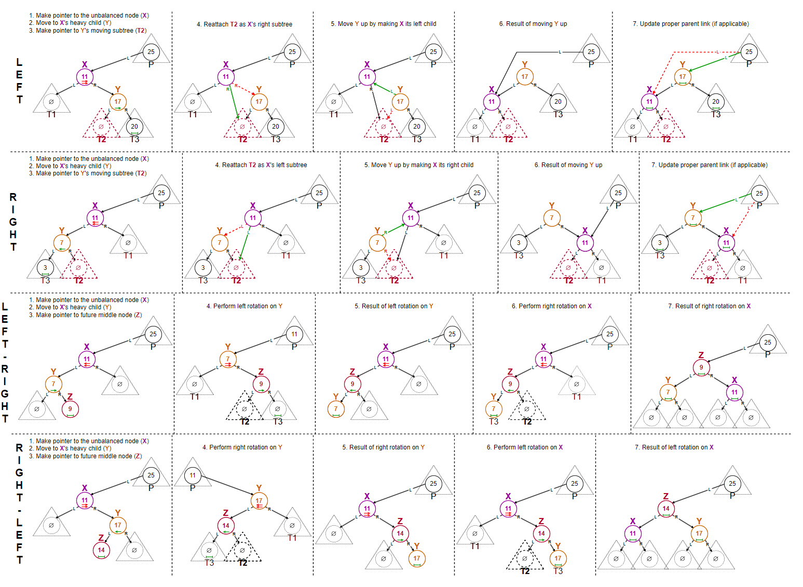
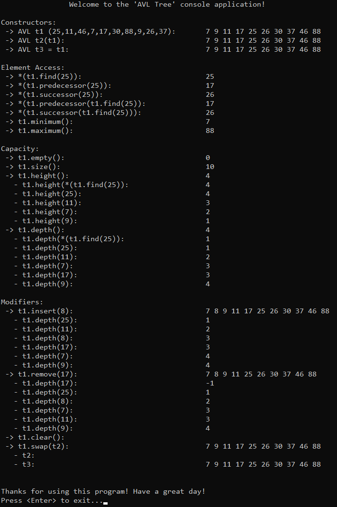

# &#128209; Table of Contents
- [💡 Overview](#-overview)
  - [Important Details](#important-details)
  - [Container Methods](#container-methods)
- [💻 Implementation](#-implementation)
  - [Design Decisions](#design-decisions)
  - [Container Implementation](#container-implementation)
  - [Node Implementation](#node-implementation)
  - [Iterator Implementation](#iterator-implementation)
- [📊 Analysis](#-analysis)
  - [Characteristics](#characteristics)
  - [Trade-Offs](#trade-offs)
- [📝 Application](#-application)
  - [Common Use Cases](#common-use-cases)
  - [Some Practical Problems](#some-practical-problems)
- [🕙 Origins](#-origins)
- [📖 Resources](#-resources)
- [🤝 Contributing](#-contributing)
- [🔏 License](#-license)


# &#128161; Overview
The **AVL Tree** is a self-balancing implementation of the binary search tree (BST) that strictly maintains height balance by enforcing a maximum difference of 1 between subtree heights at every node. The tree is named after its two Soviet inventors, Georgy Adelson-Velsky and Evgenii Landis, who introduced it in 1962 as the first self-balancing BST. Knowledge and understanding of it lay a solid foundation in designing data structures and optimizing their application.
<p align="center"></p>


## Important Details
1. **Self-Balancing BST** — self-balancing BST is a type of tree that will adjust itself (automatically update pointers to reorganize the nodes) in specific moments (whenever an operation causes an imbalance) in order to prevent performance degradation seen in unbalanced BSTs, where certain operations degrade from $O(\log{n})$ to $O(n)$ due to excessive skewing.

2. **BST Ordering Property** — for any given node (`x`), all values in the left subtree are less than the node's value (`left` $<$ `x`), and all values in the right subtree are greater than the node's value (`right` $>$ `x`). This property is the core of BSTs, ensuring a hierarchical structure that supports efficient operations; any violation compromises the tree's integrity and reliability.

3. **AVL Height-Balancing Property** — for any given node, the height difference between its left and right subtrees is at most $1$, which can be expressed as $|$ `leftHeight` $-$ `rightHeight` $| \leqslant 1$. This constraint prevents the tree from becoming excessively skewed, ensuring that its height remains logarithmic in relation to the number of nodes. 

4. **Balance Factor (BF)** — is a numerical value that represents the height difference between a node's left and right subtrees, calculated as `BF` $=$ `leftHeight` - `rightHeight` (although some people reverse the formula, the idea remains the same). Basically it is a metric that enforces the AVL height-balancing property, because it allows determining whether node is balanced or not, and if at any time `BF` exceeds the balanced range (i.e. node becomes unbalanced), rebalancing is performed to restore that property. The node is considered:
   - **balanced** if its `BF` equals $-1$, $0$, or $1$;
   - **right-heavy** if its `BF` $< -1$ (because right subtree is taller);
   - **left-heavy** if its `BF` $> 1$ (because left subtree is taller).
   
   Pretty often, to simplify height calculations, some implementations define the height of a leaf's child pointers as $-1$, this way the formula for height $max($ `leftHeight`, `rightHeight` $) + 1$ results in $max(-1,-1) + 1 = -1 + 1 = 0$, which correctly represents the height of a leaf node (it takes $0$ steps to get from a leaf to a itself).
   
5. **Rebalancing via Rotations** — the process of rebalancing are build upon operations called rotations. Basically, these are local restructuring operations that modify the tree's structure to restore balance without altering its in-order sequence. Rotations are common in various self-balancing trees, but AVL trees enforce their own **strict** balance conditions, making rotations essential. There are four types of rotation based on the type of imbalance:
   - **Left Rotation (\\)** — applied when the imbalance is in a straight-line pattern in the right subtree (e.g. 5 -> 10 -> 15);
   - **Right Rotation (/)** — applied when the imbalance is in a straight-line pattern in the left subtree (e.g. 15 -> 10 -> 5);
   - **Left-Right Rotation (<)** — applied when the imbalance is in a zig-zag pattern, where the middle node is in the left subtree (e.g. 15 -> 5 -> 10)
   - **Right-Left Rotation (>)** — applied when the imbalance is in a zig-zag pattern, where the middle node is in the right subtree (e.g. 5 -> 15 -> 10).
   
   The details of each rotation will be covered in the [container methods](#container-methods) section. Although they are internal operations, explaining them in the container methods section keeps all crucial tree operations organized in one place while maintaining a clear separation between modifiers and rotations categories.

6. **Only Two Bits** — is currently in progress...

7. **Fibonacci Relation** — is currently in progress...

8.  **Duplicates** — while some implementations of AVLs disallow duplicates altogether, others allow them but require consistent handling. A common approach is to add a counter to each node to track the frequency of duplicate values, or to consistently place duplicates in either the left or right subtree. The decision is left to the developer and depends on the specific use case, but consistent handling is crucial to maintaining the AVL’s structure.


## Container Methods
When working with AVL trees, it's important to note that there is no universal standard defining a strict list of operations or guidelines for how they should be implemented. Moreover, raw AVLs are rarely implemented directly in modern programming libraries. Instead, Red-Black Trees are preferred for their balance between performance and rebalancing overhead, making them the internal choice for implementing higher-level containers such as  `std::map` (C++), `TreeMap` (Java), or `SortedSet` (C#). Since the design and functionality of containers vary significantly depending on several factors, it is difficult to pinpoint a definitive list of operations. Therefore, in this repository, the container methods aim to replicate some of the fundamental operations present in most implementations.

---
**Compiler Generated**:
- `Default Constructor` — creates an empty AVL.
- `Parametrized Constructors` — there are usually many ways to construct and initialize the container, and it’s often up to the developer to decide which ones to implement based on the container’s needs.
- `Copy Constructor` — creates a new AVL by copying the structure and values of another AVL.
  - if the other AVL is empty, initializes an empty AVL.
- `Move Constructor` — creates a new AVL by transferring ownership of the memory from another AVL, leaving the original AVL in a valid but unspecified state.
  - if the other AVL is empty, initializes an empty AVL.
- `Copy Assignment Operator` — overwrites each element of already existing AVL with the corresponding element of another AVL by copying them.
  - if the other AVL is empty, initializes an empty AVL.
- `Move Assignment Operator` — overwrites each element of already existing AVL with the corresponding element of another AVL by transferring ownership of the memory from another AVL, leaving the original AVL in a valid but unspecified state.
  - if the other AVL is empty, initializes an empty AVL.
- `Destructor` — releases the AVL's allocated memory, calling destructors for complex data types to ensure proper cleanup of resources.

---
<p align="center"></p>

**Iterators:**
- `begin`, `cbegin` — returns an iterator (or constant iterator) pointing to the smallest node in the tree (in-order traversal).
- `end`, `cend` — returns an iterator (or constant iterator) pointing past the largest node in the tree.
- `rbegin`, `crbegin` — returns an iterator (or constant iterator) pointing to the largest node in the tree (reverse in-order traversal).
- `rend`, `crend` — returns an iterator (or constant iterator) pointing past the smallest node in reverse traversal.

---
<p align="center"></p>

**Elements Access**:
- `find(val)` — returns a pointer or iterator to the node containing the specified value.
  - returns `nullptr` or equivalent, if the value is not found.
- `min()` — returns an iterator to the node with the smallest value in the tree.
  - returns `nullptr` or equivalent, if the tree is empty.
- `max()` — returns an iterator to the node with the largest value in the tree.
  - returns `nullptr` or equivalent, if the tree is empty.
- `successor(val)` — returns a pointer or iterator to the node with the smallest value greater than the specified value (in-order successor).
   - returns `nullptr` or equivalent, if specified value has no successor (e.g. the largest value, sole value).
- `predecessor(val)` — returns a pointer or iterator to the node with the largest value smaller than the specified value (in-order predecessor).
  - returns `nullptr` or equivalent, if specified value has no predecessor (e.g. the largest value, sole value).

---
<p align="center"></p>

**Capacity**:
- `empty()` — returns `true` if the tree contains no nodes; otherwise `false`.
- `size()` — returns the total number of nodes in the tree.
- `maxSize()` — returns the maximum number of elements the container is able to hold theoretically based on system's memory limitations, if all available memory were dedicated to that single container.
- `height(val)` — returns the height of the given's value node, which is the length (number of edges) of the longest path from the node to a leaf.
  - if the value is not found in the tree, it returns `-1`;
  - the height of a leaf node is `0`.
- `depth(val)` — returns the depth of the given's value node, which is the length (number of edges) of the path from the root to the node.
  - if the value is not found in the tree, it returns `-1`;
  - the depth of the root node is `0`.


---
<p align="center"></p>

**Modifiers**:
- `insert(val)` — inserts a new node with the specified value into the tree, maintaining the BST ordering property and ensuring balance by applying rotations if needed.
- `erase(val)` — removes the node with the specified value from the tree, adjusting the structure as needed to maintain the ordering property and restoring balance via rotations if required.
  - if the node has no children (leaf), simply remove node;
  - if the node has one child, replace the node with its child;
  - if the node has two children, it is replaced with its in-order successor or predecessor, depending on the design decision.
- `clear()` — removes all nodes from the tree, resetting it to its initial state.
- `swap(other)` — exchanges the contents of the current tree with another tree, avoiding expensive deep copies.
  - assigning a tree to itself has no effect, as the function exits early without performing any operations.

---
<p align="center"></p>

**Rotations (Private Part):**
- `rotateLeft(node)` — performs a left rotation on the given node to restore balance when its right subtree is too tall. It's also used to perform left-right and right-left rotations on zig-zag shapes of branches that are too tall.
- `rotateRight(node)` — performs a right rotation on the given node to restore balance when its left subtree is too tall. It's also used to perform left-right and right-left rotations on zig-zag shapes of branches that are too tall.


# &#x1F4BB; Implementation 
The implemented console application demonstrates the basic functionality of the AVL by performing various operations and interactions with it. The program provides a clear view of changes made during usage, displaying the state of the data at different stages to illustrate its simplified behavior and characteristics.
<p align="center"></p>


## Design Decisions
To prioritize simplicity and emphasize data structure itself, several design decisions were made:
- Disallowing the addition of duplicate elements.
- Height calculations use `0` for non-existing nodes, depth is `+1` to match.
- Implementing only regular and const iterators (no reverse).
- Limiting iterator functions to receive only one type of iterators to avoid templates.
- Restricting the container to `int` to avoid templates.
- Omitting cases where the container (object itself) is created on the heap.
- Excluding move semantics to keep the focus on fundamental mechanics.
- Relying on manual memory management without using smart pointers.
- Avoiding any exception handling, thus certain range validations.
- Omitting certain possible optimizations to the container.


## Container Implementation
The container is implemented within the `AVL` class, which is declared in [AVL.h](https://github.com/vezzolter/DSA/blob/avl/DataStructures/Tree/AVL/Include/AVL.h) header file and defined in [AVL.cpp](https://github.com/vezzolter/DSA/blob/avl/DataStructures/Tree/AVL/Source/AVL.cpp) source file. This approach is adopted to ensure encapsulation, modularity and compilation efficiency. To see the container's functionality in action, you can examine the `main()` function located in the [Main.cpp](https://github.com/vezzolter/DSA/blob/avl/DataStructures/Tree/AVL/Source/Main.cpp) file. The full implementation can be found in the corresponding files, while the class declaration below offers a quick overview:

```cpp
class AVL {
private:
    int _size;
    struct Node;
    Node* _root;

    // -----------------
    //  Utility Methods
    // -----------------
    Node* copySubtree(Node* src, Node* parent);
    void destroySubtree(Node* node);
    Node* removeNode(Node* root, const int& val, Node*& parent);
    Node * findLeftmost(Node * node) const;
    Node* findRightmost(Node* node) const;
    int computeDepth(Node* node) const;
    int computeBF(Node* node) const;
    int getHeight(Node* node) const;
    void updateHeight(Node* node);
    void leftRotate(Node* node);
    void rightRotate(Node* node);

public:
    // --------------------
    //  Compiler Generated
    // --------------------
    AVL();
    AVL(const AVL& other);
    AVL(AVL&& other)          = delete;
    AVL& operator=(const AVL& rhs);
    AVL& operator=(AVL&& rhs) = delete;
    ~AVL();

    // -----------
    //  Iterators
    // -----------
    class Iterator;
    using iterator = Iterator;
    iterator begin();
    iterator end();
    class ConstIterator;
    using const_iterator = ConstIterator;
    const_iterator begin() const;
    const_iterator end() const;
    const_iterator cbegin() const;
    const_iterator cend() const;

    // ----------------
    //  Element Access
    // ----------------
    iterator find(const int& val);
    const_iterator find(const int& val) const;
    iterator predecessor(const int& val);
    const_iterator predecessor(const int& val) const;
    iterator successor(const int& val);
    const_iterator successor(const int& val) const;
    iterator predecessor(const iterator& it);
    const_iterator predecessor(iterator& it) const;
    iterator successor(const iterator& it);
    const_iterator successor(iterator& it) const;
    int minimum() const;
    int maximum() const;

    // ----------
    //  Capacity
    // ----------
    bool empty() const;
    int size() const;
    int height() const;
    int height(const int& val) const;
    int height(const iterator& it) const;
    int depth() const;
    int depth(const int& val) const;
    int depth(const iterator& it) const;

    // -----------
    //  Modifiers
    // -----------
    void insert(const int& val);
    void remove(const int& val);
    void clear();
    void swap(AVL& other);
};
```

## Node Implementation
The `Node` structure is defined as a private nested structure within the `AVL` container. This design keeps `Node` as an internal component, accessible only within the container, and enhances encapsulation. Given the simplicity of the `Node` structure, its functions are defined inline within the container's header file.

```cpp
struct AVL::Node {
public:
    int data;
    int height; // any node start as a leaf (1)
    Node* parent;
    Node* left;
    Node* right;

    // --------------------
    //  Compiler Generated
    // --------------------
    Node() : data(0), height(1), parent(nullptr), left(nullptr), right(nullptr) {}
    Node(const int& val, Node* parent = nullptr) : data(val), height(1), parent(parent), left(nullptr), right(nullptr) {}
    Node(const Node& other)          = delete;  // no copying or moving to ensure 
    Node(Node&& other)               = delete;  // uniqueness of the node within    
    Node& operator=(const Node& rhs) = delete;  // the tree and prevent accidental 
    Node& operator=(Node&& rhs)      = delete;  // duplicates or dangling nodes
    ~Node()                          = default;
};
```

## Iterator Implementation
Since there are various types of iterators that can be implemented (e.g. forward, const forward, reverse, const reverse), it's common practice to define them in separate classes and files. However, despite being implemented separately, their underlying principles are usually similar, with only slight adjustments for specific purposes. To keep things simpler and avoid cluttering the core concepts, this container implements regular and constant iterator classes. Those iterators cover the basic $[begin, end)$ range and demonstrates how typical iterators operations are handled, as well as how the iterators classes are integrated into the AVL container.

---
The `Iterator` class is defined as a public nested class within the `AVL` container. This design makes `Iterator` accessible to users, enabling them to traverse and interact with list elements directly. Given the simplicity of the `Iterator` class, its functions are defined inline within the container's header file.

```cpp
class AVL::Iterator {
private:
    friend class AVL; // to handle iterator-based methods in AVL
    Node* _curr;

    // -----------------
    //  Utility Methods
    // -----------------

    // Find the leftmost node starting from the given node (the smallest)
    static Node* findLeftmost(Node* node) {
        for (; node && node->left; ) { node = node->left; }
        return node;
    }

    // Find the next node of the given node (in-order successor)
    static Node* findNext(Node* node) {
        if (!node) { return nullptr; }

        // Case 1: if the 'given' has a right subtree, 'next' is the leftmost node in that subtree
        if (node->right) { return findLeftmost(node->right); }

        // Case 2: otherwise 'next' is the first parent node, where the 'given' is in the left subtree
        Node* parent = node->parent;
        for (; parent && node == parent->right; ) {
            node = parent;
            parent = parent->parent;
        }
        return parent;
    }

public:
    // --------------------
    //  Compiler Generated
    // --------------------
    Iterator() : _curr(nullptr) {}
    explicit Iterator(Node* node) : _curr(node) {}
    Iterator(const Iterator& other)          = default;
    Iterator(Iterator&& other)               = default;
    Iterator& operator=(const Iterator& rhs) = default;
    Iterator& operator=(Iterator&& rhs)      = default;
    ~Iterator()                              = default;

    // ----------------------
    //  Overloaded Operators
    // ----------------------

    // Returns a reference to the data of the current node
    int& operator*() { 
        return _curr->data;
    }

    // Advances the iterator to the next element in in-order traversal (pre-increment)
    Iterator& operator++() {
        _curr = findNext(_curr);
        return *this;
    }

    // Advances the iterator to the next element, returning the previous state (post-increment)
    Iterator operator++(int) {
        Iterator temp(_curr);
        _curr = findNext(_curr);
        return temp;
    }

    // Returns true if two iterators point to the same node
    friend bool operator==(const AVL::Iterator& lhs, const AVL::Iterator& rhs) {
        return lhs._curr == rhs._curr;
    }

    // Returns true if two iterators point to different nodes
    friend bool operator!=(const AVL::Iterator& lhs, const AVL::Iterator& rhs) {
        return lhs._curr != rhs._curr;
    }
};
```


---
The `ConstIterator` class is defined as a public nested class within the `AVL` container. This design makes `ConstIterator` accessible to users, enabling them to traverse and interact with list elements directly. Given the simplicity of the `ConstIterator` class, its functions are defined inline within the container's header file.

```cpp
class AVL::ConstIterator {
private:
    friend class AVL; // to handle iterator-based methods in AVL
    const Node* _curr;

    // -----------------
    //  Utility Methods
    // -----------------

    // Find the leftmost node starting from the given node (the smallest)
    static const Node* findLeftmost(Node* node) {
        for (; node && node->left; ) { node = node->left; }
        return node;
    }

    // Find the next node of the given node (in-order successor)
    static const Node* findNext(const Node* node) {
        if (!node) { return nullptr; }

        // Case 1: if the 'given' has a right subtree, 'next' is the leftmost node in that subtree
        if (node->right) { return findLeftmost(node->right); }

        // Case 2: otherwise 'next' is the first parent node, where the 'given' is in the left subtree
        const Node* parent = node->parent;
        for (; parent && node == parent->right; ) {
            node = parent;
            parent = parent->parent;
        }
        return parent;
    }

public:
    // --------------------
    //  Compiler Generated
    // --------------------
    ConstIterator() : _curr(nullptr){}
    ConstIterator(const Node* node) : _curr(node) {}
    ConstIterator(const ConstIterator& other)          = default;
    ConstIterator(ConstIterator&& other)               = default;
    ConstIterator& operator=(const ConstIterator& rhs) = default;
    ConstIterator& operator=(ConstIterator&& rhs)      = default;
    ~ConstIterator()                                   = default;

    // ----------------------
    //  Overloaded Operators
    // ----------------------

    // Returns a const reference to the data of the current node
    const int& operator*() const {
        return _curr->data;
    }

    // Advances the iterator to the next element in in-order traversal (pre-increment)
    ConstIterator& operator++() {
        _curr = findNext(_curr);
        return *this;
    }

    // Advances the iterator to the next element, returning the previous state (post-increment)
    ConstIterator operator++(int) {
        ConstIterator temp = *this;
        _curr = findNext(_curr);
        return temp;
    }

    // Returns true if two iterators point to the same node
    friend bool operator==(const AVL::ConstIterator& lhs, const AVL::ConstIterator& rhs) {
        return lhs._curr == rhs._curr;
    }

    // Returns true if two iterators point to different nodes
    friend bool operator!=(const AVL::ConstIterator& lhs, const AVL::ConstIterator& rhs) {
        return lhs._curr != rhs._curr;
    }
};
```


# &#128202; Analysis
Currently in Progress...


## Characteristics
Currently in Progress...


## Trade-Offs
Currently in Progress...


# &#128221; Application
Understanding some of the most well-known use cases of a container is crucial for grasping its practical relevance and potential impact in real-world scenarios. Additionally, familiarizing oneself with common practical problems and practicing their solutions ensures that you remember the essential details and develop a deep, intuitive understanding of the functionality and limitations.


## Common Use Cases
- **Databases & Indexing** — AVL trees are used in database management systems to optimize search operations. Database engines leverage the height-balanced guarantee to maintain consistent query response times even during peak write loads, preventing individual queries from timing out when the data becomes unevenly distributed. Examples: PostgreSQL's earlier index implementations, MySQL InnoDB's adaptive hash indexes.

- **Memory Allocation** — AVL trees are used in memory managers to track available memory blocks. Their strict balancing ensures allocation requests remain efficient even in highly fragmented memory scenarios, allowing real-time systems to quickly find and allocate the best-fitting memory block without excessive overhead. Examples: dlmalloc memory allocator, FreeBSD's kernel memory allocator.

- **File Systems** — AVL trees are used in file systems to maintain directory structures efficiently. Their ability to keep lookup times logarithmic prevents slowdowns in large directories with frequent insertions and deletions, ensuring that file access performance remains stable regardless of directory size. Examples: Reiser4 file system, XFS directory structures.

- **Symbol Tables** — AVL trees are used in compilers to manage symbol tables during compilation. Their worst-case logarithmic lookup times ensure predictable performance when resolving variable and function names, enabling efficient compilation of large codebases with deeply nested scopes and thousands of identifiers. Examples: GCC versions prior to 4.0, IBM XL compilers.

- **Network Routing** — AVL trees are used in network routing algorithms to maintain fast and efficient lookup structures for forwarding tables. Their balancing properties prevent performance degradation as routing tables grow, allowing routers to quickly adapt to dynamic topology changes while maintaining low-latency packet forwarding. Examples: Cisco IOS routing tables, Juniper JUNOS route lookups.


## Some Practical Problems
Since AVL share the foundational principles of the general concept of trees, their common problems is best described in the [tree's respective section](../Tree.md#-some-practical-problems).


# &#x1F559; Origins
The AVL tree was introduced in **1962** by Soviet mathematicians **Georgy Adelson-Velsky** and **Evgenii Landis** as the first self-balancing BST. Their motivation was to address the fundamental weakness of unbalanced BSTs — unbounded growth in height, which severely degraded search performance. By enforcing a strict balance factor constraint and applying rotations when necessary, they ensured that AVL trees maintained logarithmic height, preserving efficient operations.

While AVL trees provided a robust solution to the balancing problem, their frequent rotations made insertion and deletion more expensive compared to later self-balancing structures. This led to the development of alternative balancing methods, starting with **B-Trees (1970)**, which extended AVL principles to multi-way trees and became the foundation of modern database indexing. Later, **Red-Black Trees (1972)** relaxed balance constraints to reduce rotations, making them the preferred choice for many standard libraries. **Splay Trees (1985)** introduced self-adjusting heuristics to optimize access patterns, further expanding the landscape of balanced search trees. Over time, numerous other balancing techniques have been explored, each tailored to specific use cases. While many of these have overtaken AVL trees in mainstream usage, AVL trees laid the foundation for all future balanced search trees, influencing the design of efficient search algorithms and data structures.


# &#128214; Resources
&#128218; **Books:**
- **"Data Structures and Algorithm Analysis in C++" (4th Edition)** — by Mark Allen Weiss
  - Section 4.4: AVL Trees
- **"The Art of Computer Programming, Volume 3: Sorting and Searching" (2nd Edition)** — by Donald Ervin Knuth
  - Section 6.2.3: Balanced Trees

---
&#127891; **Courses:**
- [Accelerated Computer Science Fundamentals Specialization](https://www.coursera.org/specializations/cs-fundamentals) on Coursera
  - Section 2.3: Advanced Tree Structures
- [Mastering Data Structures & Algorithms using C and C++](https://www.udemy.com/course/datastructurescncpp/) on Udemy
  - Section 17: AVL Trees

---
&#127916; **Recordings:**
- [Lecture 6: AVL Trees, AVL Sort](https://www.youtube.com/watch?v=FNeL18KsWPc) (Lecture)
- [Balanced binary search tree rotations](https://www.youtube.com/watch?v=q4fnJZr8ztY) (Video)

---  
&#127760; **Web-Pages:**  
- [AVL tree](https://en.wikipedia.org/wiki/AVL_tree) (Wikipedia)
- [Self-balancing binary search tree](https://en.wikipedia.org/wiki/Self-balancing_binary_search_tree) (Wikipedia)
- [Tree rotation](https://en.wikipedia.org/wiki/Tree_rotation) (Wikipedia)
- [An anlgorithm for the organization of information](https://zhjwpku.com/assets/pdf/AED2-10-avl-paper.pdf) (Research Paper)


# &#129309; Contributing
Contributions are highly appreciated! For detailed guidelines, contact details, and additional information, please refer to the [root directory's contributing section](../../../#-contributing).


# &#128271; License
This project is licensed under the MIT License — see the [LICENSE](https://github.com/vezzolter/DSA/blob/main/LICENSE) file for details.

[](https://opensource.org/licenses/MIT)