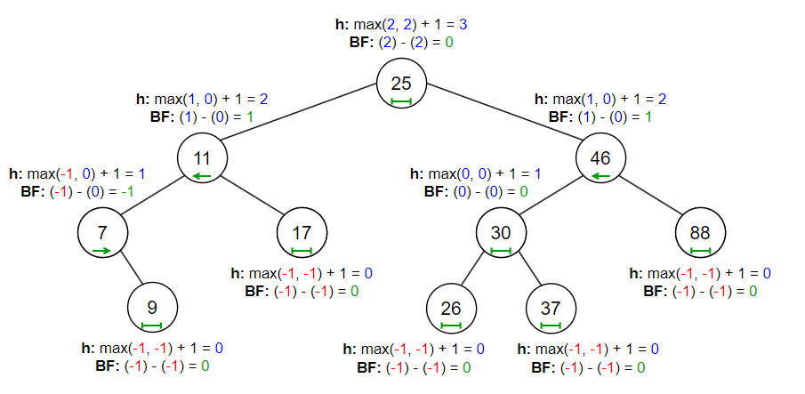

# &#128209; Table of Contents
- [💡 Overview](#-overview)
  - [Important Details](#important-details)
  - [Container Methods](#container-methods)
- [💻 Implementation](#-implementation)
  - [Design Decisions](#design-decisions)
  - [Container Implementation](#container-implementation)
  - [Node Implementation](#node-implementation)
  - [Iterator Implementation](#iterator-implementation)
- [📊 Analysis](#-analysis)
  - [Characteristics](#characteristics)
  - [Trade-Offs](#trade-offs)
- [📝 Application](#-application)
  - [Common Use Cases](#common-use-cases)
  - [Some Practical Problems](#some-practical-problems)
- [🕙 Origins](#-origins)
- [📖 Resources](#-resources)
- [🤝 Contributing](#-contributing)
- [🔏 License](#-license)

# &#128161; Overview
The **AVL Tree** is a self-balancing implementation of the binary search tree (BST) that strictly maintains height balance by enforcing a maximum difference of 1 between subtree heights at every node. The tree is named after its two Soviet inventors, Georgy Adelson-Velsky and Evgenii Landis, who introduced it in 1962 as the first self-balancing BST. Knowledge and understanding of it lay a solid foundation in designing data structures and optimizing their application.

## Important Details
1. **Self-Balancing BST** — self-balancing BST is a type of tree that will adjust itself (automatically update pointers to reorganize the nodes) in specific moments (whenever an operation causes an imbalance) in order to prevent performance degradation seen in unbalanced BSTs, where certain operations degrade from $O(\log{n})$ to $O(n)$ due to excessive skewing.

2. **BST Ordering Property** — for any given node (`x`), all values in the left subtree are less than the node's value (`left` $<$ `x`), and all values in the right subtree are greater than the node's value (`right` $>$ `x`). This property is the core of BSTs, ensuring a hierarchical structure that supports efficient operations; any violation compromises the tree's integrity and reliability.

3. **AVL Height-Balancing Property** — for any given node, the height difference between its left and right subtrees is at most $1$, which can be expressed as $|$ `leftHeight` $-$ `rightHeight` $| \leqslant 1$. This constraint prevents the tree from becoming excessively skewed, ensuring that its height remains logarithmic in relation to the number of nodes. 

4. **Balance Factor (BF)** — is a numerical value that represents the height difference between a node's left and right subtrees, calculated as `BF` $=$ `leftHeight` - `rightHeight` (although some people reverse the formula, the idea remains the same). Basically it is a metric that enforces the AVL height-balancing property, because it allows determining whether node is balanced or not, and if at any time `BF` exceeds the balanced range (i.e. node becomes unbalanced), rebalancing is performed to restore that property. The node is considered:
   - **balanced** if its `BF` equals $-1$, $0$, or $1$;
   - **right-heavy** if its `BF` $< -1$ (because right subtree is taller);
   - **left-heavy** if its `BF` $> 1$ (because left subtree is taller).
   
   Pretty often, to simplify height calculations, some implementations define the height of a leaf's child pointers as $-1$, this way the formula for height $max($ `leftHeight`, `rightHeight` $) + 1$ results in $max(-1,-1) + 1 = -1 + 1 = 0$, which correctly represents the height of a leaf node (it takes $0$ steps to get from a leaf to a itself).
   
5. **Only Two Bits** — is currently in progress...

6. **Rebalancing via Rotations** — will be covered later, since the topic of rotations is common for multiple trees and [Tree.md](https://github.com/vezzolter/DSA/blob/avl/DataStructures/Tree/Tree.md) is still in progress...

7. **Fibonacci Relation** — is currently in progress...

8.  **Duplicates** — while some implementations of AVLs disallow duplicates altogether, others allow them but require consistent handling. A common approach is to add a counter to each node to track the frequency of duplicate values, or to consistently place duplicates in either the left or right subtree. The decision is left to the developer and depends on the specific use case, but consistent handling is crucial to maintaining the AVL’s structure.

## Container Methods
When working with AVL trees, it's important to note that there is no universal standard defining a strict list of operations or guidelines for how they should be implemented. Moreover, raw AVLs are rarely implemented directly in modern programming libraries. Instead, Red-Black Trees are preferred for their balance between performance and rebalancing overhead, making them the internal choice for implementing higher-level containers such as  `std::map` (C++), `TreeMap` (Java), or `SortedSet` (C#). Since the design and functionality of containers vary significantly depending on several factors, it is difficult to pinpoint a definitive list of operations. Therefore, in this repository, the container methods aim to replicate some of the fundamental operations present in most implementations.

---
**Compiler Generated**:
- `Default Constructor` — creates an empty AVL.
- `Parametrized Constructors` — there are usually many ways to construct and initialize the container, and it’s often up to the developer to decide which ones to implement based on the container’s needs.
- `Copy Constructor` — creates a new AVL by copying the structure and values of another AVL.
  - if the other AVL is empty, initializes an empty AVL.
- `Move Constructor` — creates a new AVL by transferring ownership of the memory from another AVL, leaving the original AVL in a valid but unspecified state.
  - if the other AVL is empty, initializes an empty AVL.
- `Copy Assignment Operator` — overwrites each element of already existing AVL with the corresponding element of another AVL by copying them.
  - if the other AVL is empty, initializes an empty AVL.
- `Move Assignment Operator` — overwrites each element of already existing AVL with the corresponding element of another AVL by transferring ownership of the memory from another AVL, leaving the original AVL in a valid but unspecified state.
  - if the other AVL is empty, initializes an empty AVL.
- `Destructor` — releases the AVL's allocated memory, calling destructors for complex data types to ensure proper cleanup of resources.

---

**Iterators:**
- `begin`, `cbegin` — returns an iterator (or constant iterator) pointing to the smallest node in the tree (in-order traversal).
- `end`, `cend` — returns an iterator (or constant iterator) pointing past the largest node in the tree.
- `rbegin`, `crbegin` — returns an iterator (or constant iterator) pointing to the largest node in the tree (reverse in-order traversal).
- `rend`, `crend` — returns an iterator (or constant iterator) pointing past the smallest node in reverse traversal.

---

**Elements Access**:
- `find(val)` — returns a pointer or iterator to the node containing the specified value.
  - returns `nullptr` or equivalent, if the value is not found.
- `min()` — returns an iterator to the node with the smallest value in the tree.
  - returns `nullptr` or equivalent, if the tree is empty.
- `max()` — returns an iterator to the node with the largest value in the tree.
  - returns `nullptr` or equivalent, if the tree is empty.
- `successor(val)` — returns a pointer or iterator to the node with the smallest value greater than the specified value (in-order successor).
   - returns `nullptr` or equivalent, if specified value has no successor (e.g. the largest value, sole value).
- `predecessor(val)` — returns a pointer or iterator to the node with the largest value smaller than the specified value (in-order predecessor).
  - returns `nullptr` or equivalent, if specified value has no predecessor (e.g. the largest value, sole value).

---

**Capacity**:
- `empty()` — returns `true` if the tree contains no nodes; otherwise `false`.
- `size()` — returns the total number of nodes in the tree.
- `maxSize()` — returns the maximum number of elements the container is able to hold theoretically based on system's memory limitations, if all available memory were dedicated to that single container.
- `height(val)` — returns the height of the given's value node, which is the length (number of edges) of the longest path from the node to a leaf.
  - if the value is not found in the tree, it returns `-1`;
  - the height of a leaf node is `0`.
- `depth(val)` — returns the depth of the given's value node, which is the length (number of edges) of the path from the root to the node.
  - if the value is not found in the tree, it returns `-1`;
  - the depth of the root node is `0`.

---

**Modifiers**:
- `insert(val)` — inserts a new node with the specified value into the tree, maintaining the BST ordering property and ensuring balance by applying rotations if needed.
- `erase(val)` — removes the node with the specified value from the tree, adjusting the structure as needed to maintain the ordering property and restoring balance via rotations if required.
  - if the node has no children (leaf), simply remove node;
  - if the node has one child, replace the node with its child;
  - if the node has two children, it is replaced with its in-order successor or predecessor, depending on the design decision.
- `clear()` — removes all nodes from the tree, resetting it to its initial state.
- `swap(other)` — exchanges the contents of the current tree with another tree, avoiding expensive deep copies.
  - assigning a tree to itself has no effect, as the function exits early without performing any operations.

---
Currently in Progress...

# &#x1F4BB; Implementation 
Currently in Progress...

## Design Decisions
Currently in Progress...

## Container Implementation
Currently in Progress...

## Node Implementation
Currently in Progress...

## Iterator Implementation
Currently in Progress...

# &#128202; Analysis
Currently in Progress...

## Characteristics
Currently in Progress...

## Trade-Offs
Currently in Progress...

# &#128221; Application
Currently in Progress...

## Common Use Cases
Currently in Progress...

## Some Practical Problems
Currently in Progress...

# &#x1F559; Origins
The AVL tree was introduced in **1962** by Soviet mathematicians **Georgy Adelson-Velsky** and **Evgenii Landis** as the first self-balancing BST. Their motivation was to address the fundamental weakness of unbalanced BSTs — unbounded growth in height, which severely degraded search performance. By enforcing a strict balance factor constraint and applying rotations when necessary, they ensured that AVL trees maintained logarithmic height, preserving efficient operations.

While AVL trees provided a robust solution to the balancing problem, their frequent rotations made insertion and deletion more expensive compared to later self-balancing structures. This led to the development of alternative balancing methods, starting with **B-Trees (1970)**, which extended AVL principles to multi-way trees and became the foundation of modern database indexing. Later, **Red-Black Trees (1972)** relaxed balance constraints to reduce rotations, making them the preferred choice for many standard libraries. **Splay Trees (1985)** introduced self-adjusting heuristics to optimize access patterns, further expanding the landscape of balanced search trees. Over time, numerous other balancing techniques have been explored, each tailored to specific use cases. While many of these have overtaken AVL trees in mainstream usage, AVL trees laid the foundation for all future balanced search trees, influencing the design of efficient search algorithms and data structures.

# &#128214; Resources
&#128218; **Books:**
- **"Data Structures and Algorithm Analysis in C++" (4th Edition)** — by Mark Allen Weiss
  - Section 4.4: AVL Trees
- **"The Art of Computer Programming, Volume 3: Sorting and Searching" (2nd Edition)** — by Donald Ervin Knuth
  - Section 6.2.3: Balanced Trees

---
&#127891; **Courses:**
- [Accelerated Computer Science Fundamentals Specialization](https://www.coursera.org/specializations/cs-fundamentals) on Coursera
  - Section 2.3: Advanced Tree Structures
- [Mastering Data Structures & Algorithms using C and C++](https://www.udemy.com/course/datastructurescncpp/) on Udemy
  - Section 17: AVL Trees

---
&#127916; **Recordings:**
- [Lecture 6: AVL Trees, AVL Sort](https://www.youtube.com/watch?v=FNeL18KsWPc) (Lecture)
- [Balanced binary search tree rotations](https://www.youtube.com/watch?v=q4fnJZr8ztY) (Video)

---  
&#127760; **Web-Pages:**  
- [AVL tree](https://en.wikipedia.org/wiki/AVL_tree) (Wikipedia)
- [Self-balancing binary search tree](https://en.wikipedia.org/wiki/Self-balancing_binary_search_tree) (Wikipedia)
- [Tree rotation](https://en.wikipedia.org/wiki/Tree_rotation) (Wikipedia)
- [An anlgorithm for the organization of information](https://zhjwpku.com/assets/pdf/AED2-10-avl-paper.pdf) (Research Paper)

# &#129309; Contributing
Contributions are highly appreciated! For detailed guidelines, contact details, and additional information, please refer to the [root directory's contributing section](../../../#-contributing).

# &#128271; License
This project is licensed under the MIT License — see the [LICENSE](https://github.com/vezzolter/DSA/blob/main/LICENSE) file for details.

