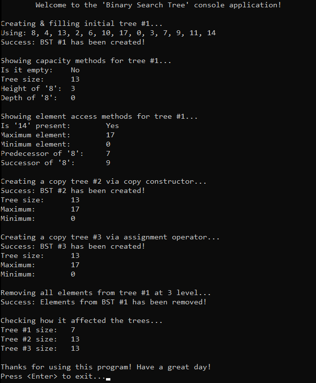

# &#128209; Table of Contents
- [💡 Overview](#-overview)
- [💻 Implementation](#-implementation)
- [📊 Analysis](#-analysis)
- [📝 Application](#-application)
- [🕙 Origins](#-origins)
- [🤝 Contributing](#-contributing)
- [📧 Contacts](#-contacts)
- [🙏 Credits](#-credits)
- [🔏 License](#-license)


# &#128161; Overview
The **Binary Search Tree (BST)** stands out as one of the most common implementation of a binary tree. Its name is derived from one of the main operations performed on it, which is searching for a specific element This subsection explores BST to establish a solid knowledge of the ideas behind it, as it helps to create elegant and efficient algorithmic designs for all manner of applications.
<p align="center"></p>

---
**Binary Search Tree** — is a binary tree, which organizes elements in a sorted manner by following this **property:** for every node, all values in the left subtree are less than the value of the node, and all values in the right subtree are greater than the value of the node.

---
**Important Details:**
- **Duplicates** — while some implementations disallow duplicates elements, some allow. The question is how to handle them is up to developer, one common approach can be either to add counter to each node and simply update it, or entirely skip duplicates.
- **Balance** — insertions and deletions can affect the balance of the BST, meaning that the heights of the left and right subtrees of nodes may differ significantly. If that happens tree may still function correctly, but it may exhibit degraded performance (both space and time), especially for large datasets. To prevent this, balancing mechanisms may be employed (e.g. AVL, Red-Black).

---
**Operations:**  
Currently in Progress...


# &#x1F4BB; Implementation 
Since it's commonly recommended to rely on proven implementations rather than reinventing the wheel, you might think that there must be some well-established and widely recognized containers. The truth is that in the context of C++, people usually refer to [std::map](https://en.cppreference.com/w/cpp/container/map) or [std::set](https://en.cppreference.com/w/cpp/container/set) to fulfill the access characteristics. This happens because people choose containers based on guarantees and not based on how the containers are implemented (even though map and set are usually implemented as Red-Black trees). An alternative to this approach is to use some of the containers from [Boost Graph Library](https://www.boost.org/doc/libs/?view=category_containers). Long story short, there is no container exactly replicating a BST, and there are reasons for this. Therefore, this section explores only a simplified version to gain a deeper understanding of the fundamental concepts underlying this data structure.

---
<p align="center"></p>

**Implementation Overview:**
1. One significant design decision is the implementation of a container without the iterator class. Generally speaking, most BST functions are supposed to return a pointer to a node. Since the node is a private part of the class, there is no way to store or access this type of node outside the class. In order to allow this behavior, classes have iterator classes, but it slightly adds to the overall complexity and shifts the focus from how operations are done to an additional layer of processing. Therefore, to remove this additional layer, the class primarily operates on the data and some additional functions. Basically, all the ideas behind are the same; once you grasp them (which is much easier directly), you will see that updating the class for iterators is not going to change approaches drastically, but rather the return types and comparing values. (This decision is still under review).

2. Application's control flow and testing of the class is conducted within the [Main.cpp](https://github.com/vezzolter/DSA/blob/bin-tree/DataStructures/Tree/BST/src/Main.cpp) file. The `BST` class is declared in [BST.h](https://github.com/vezzolter/DSA/tree/bin-tree/DataStructures/Tree/BST/inc) header file and defined in [BST.cpp](https://github.com/vezzolter/DSA/blob/bin-tree/DataStructures/Tree/BST/src/BST.cpp) source file. This approach is adopted to ensure encapsulation, modularity, and compilation efficiency. Here's the class declaration for convenience:
```cpp
  template <typename T>
  class BST {
  private:
      struct Node {
          T _data;
          Node* _left;
          Node* _right;

          Node(const T& val) : _data(val), _left(nullptr), _right(nullptr) {}
      };

      Node* _root;
      int _size;

      // Helper functions (due to lack of iterator class)
      Node* copyNodes(Node* root);
      int heightHelper(Node* root, const T& value) const;
      int depthHelper(Node* root, const T& value, int depth) const;

  public:
      // Special Member Functions
      BST();
      BST(const BST& rhs);
      BST& operator=(const BST& rhs);
      ~BST();

      // Element Access
      bool search(const T& value) const;
      T maximum() const;
      T minimum() const;
      T predecessor(const T& value) const;
      T successor(const T& value) const;

      // Capacity
      bool empty() const;
      int size() const;
      int height(const T& value) const;
      int depth(const T& value) const;

      // Modifiers
      void insert(const T& value);
      void remove(const T& value);
      void clear();
  };
```


# &#128202; Analysis
**Advantages:**
- **Efficient Operations** — due to ordered structure searching space reduces in half at each step, e.g. insertion, deletion, search on average takes $O(logn)$ time and only in some cases when tree is highly disbalanced it can reach $O(n)$.

---
**Disadvantages:**
- **Lack of Balance** — as mentioned earlier, the lack of balance can degrade performance, so to avoid this you should either implement balancing techniques or provide specific input.
- **Handling Duplicates** — also mentioned earlier, handling duplicates can introduce ambiguity and additional complexity, which can affect the design.


# &#128221; Application
**Some of the Most Well-Known Use Cases:**
- **Tree Data Structures** — BST trees are used as base for other trees, specifically balanced and string trees. They all use this data structure for its property of maintaining sorted order but modify it for its needs.
- **Subset of Tree Cases** — BST trees also can be modified to fit in numerous other types of [trees'](https://github.com/vezzolter/DSA/blob/bin-tree/DataStructures/Tree/Tree.md) applications, such as file systems, database indexing, networking.

---
**Common Practical Problems:**
- Find median of BST
- Find the node with minimum value
- Lowest Common Ancestor
- Count of pairs violating BST property
- Balance a BST
- Find the maximum sum leaf to root path
- Find a pair with given sum in a balanced BST
- Merge BSTs to create single BST
- Range sum of BST


# &#x1F559; Origins
The concept of Binary Search Trees as a data structure is attributed to the work of several computer scientists and mathematicians over the years. This list includes **A.S. Douglas(?)**, **P.F. Windley(?)**, **Andrew Donald Booth**, **Andrew John Theodore Colin** and **Thomas Nathaniel Hibbard**. All of them contributed in some way to the idea of BST around **1959-1962**. Establishing the starting point for the development of new types of trees, such as balanced and string versions.


# &#129309; Contributing
Contributions are highly appreciated! For detailed guidelines, please refer to the [root directory's contributing section](../../../#-contributing).


# &#128231; Contacts
For contact details and additional information, please refer to the [root directory's contact information section](../../../#-contacts).


# &#128591; Credits
&#128218; **Books:**
- **"Introduction to Algorithms" (3rd Edition)** — by Thomas H. Cormen, Charles E. Leiserson, Ronald L. Rivest and Clifford Stein
  - Section 12: Binary Search Trees
- **"Algorithms in C++, Parts 1-4: Fundamentals, Data Structure, Sorting, Searching" (3rd Edition)** — by Robert Sedgewick
  - Section 12: Symbol Tables and BSTs
- **"Data Structures and Algorithm Analysis in C++" (4th Edition)** — by Mark Allen Weiss
  - Section 4: Trees
- **"The Algorithm Design Manual" (2nd Edition)** — by Steven S. Skiena
  - Section 3.4: Binary Search Trees
- **"The Art of Computer Programming, Volume 1: Fundamental Algorithms" (3rd Edition)** — by Donald Ervin Knuth
  - Section: 2.3: Trees

---
&#127891; **Courses:**
- [Accelerated Computer Science Fundamentals Specialization](https://www.coursera.org/specializations/cs-fundamentals) on Coursera
  - Section 2.2: Introduction to Tree Strcutures
- [Mastering Data Structures & Algorithms using C and C++](https://www.udemy.com/course/datastructurescncpp/) on Udemy
  - Section 16: Binary Search Trees

---  
&#127760; **Web-Resources:**  
- [Binary search tree](https://en.wikipedia.org/wiki/Binary_search_tree) (Wikipedia)
- [How to handle duplicates in BST?](https://www.geeksforgeeks.org/how-to-handle-duplicates-in-binary-search-tree/)
- [Balancing a binary search tree](https://appliedgo.net/balancedtree/)
- [Top 50 Binary Search Tree Coding Problems for Interviews](https://www.geeksforgeeks.org/top-50-binary-search-tree-coding-problems-for-interviews/)
- [On the efficiency of a new method of dictionary construction](https://www.sciencedirect.com/science/article/pii/S0019995860909013)
- [More combinatorial properties of certain trees](http://comjnl.oxfordjournals.org/content/7/4/299.full.pdf)


# &#128271; License
This project is licensed under the MIT License — see the [LICENSE](https://github.com/vezzolter/DSA/blob/main/LICENSE) file for details.

[](https://opensource.org/licenses/MIT)