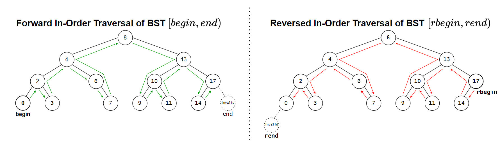
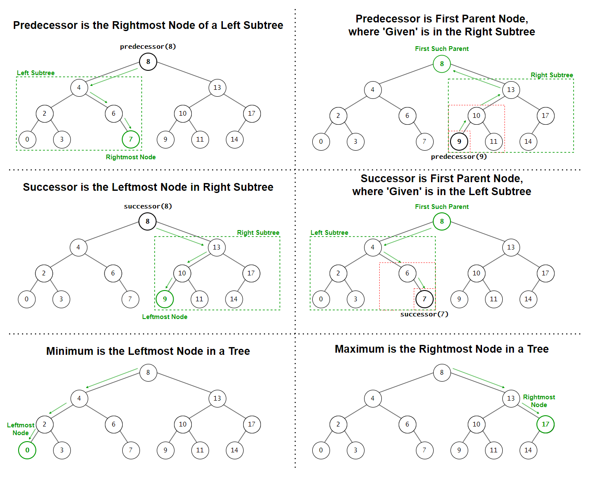

# &#128209; Table of Contents
- [💡 Overview](#-overview)
  - [Important Details](#important-details)
  - [Container Methods](#container-methods)
- [💻 Implementation](#-implementation)
  - [Design Decisions](#design-decisions)
  - [Container Implementation](#container-implementation)
  - [Node Implementation](#node-implementation)
  - [Iterator Implementation](#iterator-implementation)
- [📊 Analysis](#-analysis)
  - [Characteristics](#characteristics)
  - [Trade-Offs](#trade-offs)
- [📝 Application](#-application)
  - [Common Use Cases](#common-use-cases)
  - [Some Practical Problems](#some-practical-problems)
- [🕙 Origins](#-origins)
- [📖 Resources](#-resources)
- [🤝 Contributing](#-contributing)
- [🔏 License](#-license)


# &#128161; Overview
**Binary Search Tree (BST)** is an implementation of binary tree, designed to organize data for efficient search, insertion, and deletion operations. The name reflects its key feature: enabling fast searches by maintaining a sorted hierarchical structure. Knowledge and understanding of it lay a solid foundation in designing data structures and optimizing their application.
<p align="center"></p>


## Important Details
1. **Ordering Property** — for any given node, all values in the left subtree are less than the nodes's value, and all the values in the right subtree are greater than the node's value. This property is the core of BST, ensuring a hierarchical structure that supports efficient operations; any violation compromises the tree's integrity and reliability.

2. **Duplicates** — while some implementations of BSTs disallow duplicates altogether, others allow them but require consistent handling. A common approach is to add a counter to each node to track the frequency of duplicate values, or to consistently place duplicates in either the left or right subtree. The decision is left to the developer and depends on the specific use case, but consistent handling is crucial to maintaining the BST’s structure.

3. **Balancing** — insertions and deletions can affect the balance of a BST, causing the heights of the left and right subtrees to differ significantly. While the tree may still function correctly in such cases, its performance (both in terms of time and space) can degrade, particularly for large datasets. Without rebalancing, a BST can degenerate into a structure resembling a linked list, with a height of $O(n)$, where $n$ is the number of nodes, resulting in lookup performance equivalent to linear search. To maintain efficiency, balancing mechanisms are employed to keep the tree height bounded by $O(\log n)$, ensuring optimal performance even during updates (e.g. AVL, Red-Black).


## Container Methods
When working with BSTs, it's important to note that there is no universal standard defining a strict list of operations or guidelines for how they should be implemented. Moreover, raw BSTs are rarely implemented directly in modern programming libraries. Instead, **self-balancing trees** (e.g. Red-Black Trees, AVL Trees) are used to maintain efficient $O(\log n)$ operations and are employed **internally** to implement higher-level containers such as `std::map` (C++), `TreeMap` (Java), or `SortedSet` (C#). Since the design and functionality of containers vary significantly depending on several factors, it is difficult to pinpoint a definitive list of operations. Therefore, in this repository, the container methods aim to replicate some of the fundamental operations present in most implementations.

---
**Compiler Generated**:
- `Default Constructor` — creates an empty BST.
- `Parametrized Constructors` — there are usually many ways to construct and initialize the container, and it’s often up to the developer to decide which ones to implement based on the container’s needs.
- `Copy Constructor` — creates a new BST by copying the structure and values of another BST.
  - if the other BST is empty, initializes an empty BST.
- `Move Constructor` — creates a new BST by transferring ownership of the memory from another BST, leaving the original BST in a valid but unspecified state.
  - if the other BST is empty, initializes an empty BST.
- `Copy Assignment Operator` — overwrites each element of already existing BST with the corresponding element of another BST by copying them.
  - if the other BST is empty, initializes an empty BST.
- `Move Assignment Operator` — overwrites each element of already existing BST with the corresponding element of another BST by transferring ownership of the memory from another BST, leaving the original BST in a valid but unspecified state.
  - if the other BST is empty, initializes an empty BST.
- `Destructor` — releases the BST's allocated memory, calling destructors for complex data types to ensure proper cleanup of resources.

---
<p align="center"></p>

**Iterators:**
- `begin`, `cbegin` — returns an iterator (or constant iterator) pointing to the smallest node in the tree (in-order traversal).
- `end`, `cend` — returns an iterator (or constant iterator) pointing past the largest node in the tree.
- `rbegin`, `crbegin` — returns an iterator (or constant iterator) pointing to the largest node in the tree (reverse in-order traversal).
- `rend`, `crend` — returns an iterator (or constant iterator) pointing past the smallest node in reverse traversal.

---
<p align="center"></p>

**Elements Access**:
- `find(val)` — returns a pointer or iterator to the node containing the specified value.
  - returns `nullptr` or equivalent, if the value is not found.
- `min()` — returns an iterator to the node with the smallest value in the tree.
  - returns `nullptr` or equivalent, if the tree is empty.
- `max()` — returns an iterator to the node with the largest value in the tree.
  - returns `nullptr` or equivalent, if the tree is empty.
- `successor(val)` — returns a pointer or iterator to the node with the smallest value greater than the specified value (in-order successor).
   - returns `nullptr` or equivalent, if specified value has no successor (e.g. the largest value, sole value).
- `predecessor(val)` — returns a pointer or iterator to the node with the largest value smaller than the specified value (in-order predecessor).
  - returns `nullptr` or equivalent, if specified value has no predecessor (e.g. the largest value, sole value).

---
<p align="center"></p>

**Capacity**:
- `empty()` — returns `true` if the tree contains no nodes; otherwise `false`.
- `size()` — returns the total number of nodes in the tree.
- `maxSize()` — returns the maximum number of elements the container is able to hold theoretically based on system's memory limitations, if all available memory were dedicated to that single container.
- `height(val)` — returns the height of the given's value node, which is the length (number of edges) of the longest path from the node to a leaf.
  - if the value is not found in the tree, it returns `-1`;
  - the height of a leaf node is `0`.
- `depth(val)` — returns the depth of the given's value node, which is the length (number of edges) of the path from the root to the node.
  - if the value is not found in the tree, it returns `-1`;
  - the depth of the root node is `0`.

---
<p align="center"></p>

**Modifiers**:
- `insert(val)` — inserts a new node with the specified value into the tree, maintaining the BST ordering property.
- `erase(val)` — removes the node with the specified value from the tree, adjusting the structure as needed to maintain the ordering property.
  - if the node has no children (leaf), simply remove node;
  - if the node has one child, replace the node with its child;
  - if the node has two children, it is replaced with its in-order successor or predecessor, depending on the design decision.
- `clear()` — removes all nodes from the tree,  resetting it to its initial state.
- `swap(other)` — exchanges the contents of the current tree with another tree, avoiding expensive deep copies.
  - assigning a tree to itself has no effect, as the function exits early without performing any operations.


# &#x1F4BB; Implementation 
The implemented console application demonstrates the basic functionality of the BST by performing various operations and interactions with it. The program provides a clear view of changes made during usage, displaying the state of the data at different stages to illustrate its simplified behavior and characteristics.
<p align="center"></p>


## Design Decisions
To prioritize simplicity and emphasize data structure itself, several design decisions were made:
- Disallowing the addition of duplicate elements.
- Implementing only regular and const iterators (no reverse).
- Limiting iterator functions to receive only one type of iterators to avoid templates.
- Restricting the container to `int` to avoid templates.
- Omitting cases where the container (object itself) is created on the heap.
- Excluding move semantics to keep the focus on fundamental mechanics.
- Relying on manual memory management without using smart pointers.
- Avoiding any exception handling, thus certain range validations.
- Omitting certain possible optimizations to the container.


## Container Implementation
The container is implemented within the `BST` class, which is declared in [BST.h](https://github.com/vezzolter/DSA/blob/main/DataStructures/Tree/BST/Include/BST.h) header file and defined in [BST.cpp](https://github.com/vezzolter/DSA/blob/main/DataStructures/Tree/BST/Source/BST.cpp) source file. This approach is adopted to ensure encapsulation, modularity and compilation efficiency. To see the container's functionality in action, you can examine the `main()` function located in the [Main.cpp](https://github.com/vezzolter/DSA/blob/main/DataStructures/Tree/BST/Source/Main.cpp) file. The full implementation can be found in the corresponding files, while the class declaration below offers a quick overview:

```cpp
class BST {
private:
    int _size;
    struct Node;
    Node* _root;

    // -----------------
    //  Utility Methods
    // -----------------

    // For self-balancing trees, the copy constructor and copy assignment operator
    // often rely on iterators, because insertions automatically balance the tree,
    // but for BST, balancing isn't a concern, so it would add unnecessary complexity
    Node* copyNodes(Node* src, Node* parent);
    Node* findLeftmost(Node* node) const;

public:
    // --------------------
    //  Compiler Generated
    // --------------------
    BST();
    BST(const BST& other);
    BST(BST&& other)          = delete;
    BST& operator=(const BST& rhs);
    BST& operator=(BST&& rhs) = delete;
    ~BST();

    // -----------
    //  Iterators
    // -----------
    class Iterator;
    using iterator = Iterator;
    iterator begin();
    iterator end();
    class ConstIterator;
    using const_iterator = ConstIterator;
    const_iterator begin() const;
    const_iterator end() const;
    const_iterator cbegin() const;
    const_iterator cend() const;

    // ----------------
    //  Element Access
    // ----------------
    iterator find(const int& val);
    const_iterator find(const int& val) const;
    iterator predecessor(const int& val);
    const_iterator predecessor(const int& val) const;
    iterator successor(const int& val);
    const_iterator successor(const int& val) const;
    iterator predecessor(const iterator& it);
    const_iterator predecessor(iterator& it) const;
    iterator successor(const iterator& it);
    const_iterator successor(iterator& it) const;
    int minimum() const;
    int maximum() const;

    // ----------
    //  Capacity
    // ----------
    bool empty() const;
    int size() const;
    int height(const int& val) const;
    int depth(const int& val) const;

    // -----------
    //  Modifiers
    // -----------
    void insert(const int& val);
    void remove(const int& val);
    void clear();
    void swap(BST& other);
};
```


## Node Implementation
The `Node` structure is defined as a private nested structure within the `BST` container. This design keeps `Node` as an internal component, accessible only within the container, and enhances encapsulation. Given the simplicity of the `Node` structure, its functions are defined inline within the container's header file.

```cpp
struct BST::Node {
public:
    int _data;
    Node* _parent;
    Node* _left;
    Node* _right;

    // --------------------
    //  Compiler Generated
    // --------------------
    Node() : _data(0), _parent(nullptr), _left(nullptr), _right(nullptr) {}
    Node(const int& val, Node* parent = nullptr)
        : _data(val), _parent(parent), _left(nullptr), _right(nullptr) {}
    Node(const Node& other)          = delete;  // no copying or moving to ensure 
    Node(Node&& other)               = delete;  // uniqueness of the node within    
    Node& operator=(const Node& rhs) = delete;  // the tree and prevent accidental 
    Node& operator=(Node&& rhs)      = delete;  // duplicates or dangling nodes
    ~Node()                          = default; 
};
```


## Iterator Implementation
Since there are various types of iterators that can be implemented (e.g. forward, const forward, reverse, const reverse), it's common practice to define them in separate classes and files. However, despite being implemented separately, their underlying principles are usually similar, with only slight adjustments for specific purposes. To keep things simpler and avoid cluttering the core concepts, this container implements regular and constant iterator classes. Those iterators cover the basic $[begin, end)$ range and demonstrates how typical iterators operations are handled, as well as how the iterators classes are integrated into the BST container.

---
The `Iterator` class is defined as a public nested class within the `BST` container. This design makes `Iterator` accessible to users, enabling them to traverse and interact with list elements directly. Given the simplicity of the `Iterator` class, its functions are defined inline within the container's header file.

```cpp
class BST::Iterator {
private:
    friend class BST; // So that itr-based element access fcn would work
    Node* _curr;
    const BST* _tree; // Eases some operations (traversing, reversing, sentinel, caching, etc)

    // -----------------
    //  Utility Methods
    // -----------------

    // Find the leftmost node starting from the given node (begin/smallest)
    Node* findLeftmost(Node* node) const { return _tree->findLeftmost(node); }

    // Find the next node of the given node (in-order successor)
    Node* findNext(Node* node) const {
        // Case: empty node
        if (!node) { return nullptr; }

        // Case: if the 'given' has a right subtree, 'next' is the leftmost node in that subtree
        if (node->_right) { return findLeftmost(node->_right); }

        // Case: otherwise 'next' is the first parent node, where the 'given' is in the left subtree
        Node* parent = node->_parent;
        for (; parent && node == parent->_right; ) {
            node = parent;
            parent = parent->_parent;
        }
        return parent;
    }

public:
    // --------------------
    //  Compiler Generated
    // --------------------
    Iterator() : _curr(nullptr), _tree(nullptr) {}
    Iterator(Node* node, const BST* tree) : _curr(node), _tree(tree) {}
    Iterator(const Iterator& other)          = default;
    Iterator(Iterator&& other)               = default;
    Iterator& operator=(const Iterator& rhs) = default;
    Iterator& operator=(Iterator&& rhs)      = default;
    ~Iterator()                              = default;

    // ----------------------
    //  Overloaded Operators
    // ----------------------

    // Returns a reference to the data of the current node
    int& operator*() { return _curr->_data; }

    // Advances the iterator to the next element in in-order traversal (pre-increment)
    Iterator& operator++() {
        _curr = findNext(_curr);
        return *this;
    }

    // Advances the iterator to the next element, returning the previous state (post-increment)
    Iterator operator++(int) {
        Iterator temp(_curr, _tree);
        _curr = findNext(_curr);
        return temp;
    }

    // Returns true if two iterators point to the same node
    friend bool operator==(const BST::Iterator& lhs, const BST::Iterator& rhs) {
        return lhs._curr == rhs._curr;
    }

    // Returns true if two iterators point to different nodes
    friend bool operator!=(const BST::Iterator& lhs, const BST::Iterator& rhs) {
        return lhs._curr != rhs._curr;
    }
};
```

---
The `ConstIterator` class is defined as a public nested class within the `BST` container. This design makes `ConstIterator` accessible to users, enabling them to traverse and interact with list elements directly. Given the simplicity of the `ConstIterator` class, its functions are defined inline within the container's header file.

```cpp
class BST::ConstIterator {
private:
    friend class BST; // So that itr-based element access fcn would work
    const Node* _curr;
    const BST* _tree; // Eases some operations (traversing, reversing, sentinel, caching, etc)

    // -----------------
    //  Utility Methods
    // -----------------

    // Find the leftmost node starting from the given node (begin/smallest)
    const Node* findLeftmost(Node* node) const { return _tree->findLeftmost(node); }

    // Find the next node of the given node (in-order successor)
    const Node* findNext(const Node* node) const {
        // Case: empty node
        if (!node) { return nullptr; }

        // Case: if the 'given' has a right subtree, 'next' is the leftmost node in that subtree
        if (node->_right) { return findLeftmost(node->_right); }

        // Case: otherwise 'next' is the first parent node, where the 'given' is in the left subtree
        const Node* parent = node->_parent;
        for (; parent && node == parent->_right; ) {
            node = parent;
            parent = parent->_parent;
        }
        return parent;
    }

public:
    // --------------------
    //  Compiler Generated
    // --------------------

    ConstIterator() : _curr(nullptr), _tree(nullptr) {}
    ConstIterator(const Node* node, const BST* tree) : _curr(node), _tree(tree) {}
    ConstIterator(const ConstIterator& other)          = default;
    ConstIterator(ConstIterator&& other)               = default;
    ConstIterator& operator=(const ConstIterator& rhs) = default;
    ConstIterator& operator=(ConstIterator&& rhs)      = default;
    ~ConstIterator()                                   = default;

    // ----------------------
    //  Overloaded Operators
    // ----------------------

    // Returns a const reference to the data of the current node
    const int& operator*() const { return _curr->_data; }

    // Advances the iterator to the next element in in-order traversal (pre-increment)
    ConstIterator& operator++() {
        _curr = findNext(_curr);
        return *this;
    }

    // Advances the iterator to the next element, returning the previous state (post-increment)
    ConstIterator operator++(int) {
        ConstIterator temp = *this;
        _curr = findNext(_curr);
        return temp;
    }

    // Returns true if two iterators point to the same node
    friend bool operator==(const BST::ConstIterator& lhs, const BST::ConstIterator& rhs) {
        return lhs._curr == rhs._curr;
    }

    // Returns true if two iterators point to different nodes
    friend bool operator!=(const BST::ConstIterator& lhs, const BST::ConstIterator& rhs) {
        return lhs._curr != rhs._curr;
    }
};
```


# &#128202; Analysis
Understanding how to analyze the particular container is crucial for optimizing performance and ensuring efficient resource utilization within the constraints of the given environment. Additionally, knowing its strengths and weaknesses allows for more informed decisions, helping to select the most suitable container for a given problem among similar options.


## Characteristics
🚀 **Time Complexities:**  
- **Access:**
   - **Access** $O(height)$ — while the actual dereferencing of a pointer for any access operation is pretty straightforward $O(1)$, the prior traversal step determines the overall complexity, and it depends entirely on the height of the tree. In a balanced tree, the operation takes $O(\log n)$ as the number of elements is halved at each level; however, in an unbalanced tree (which BSTs can quickly degrade into), the operation takes $O(n)$ due to its skewed structure, resembling a linked list.
- **Insertion:**
   - **Beginning** $O(height)$ — while the actual pointer adjustment and allocation during insertion is $O(1)$, the prior traversal step determines the overall complexity, and it depends entirely on the height of the tree. In a balanced tree, the operation takes $O(\log n)$ as the number of elements is halved at each level; however, in an unbalanced tree (which BSTs can quickly degrade into), the operation takes $O(n)$ due to its skewed structure, resembling a linked list.
- **Deletion:**
   - **Deletion** $O(height)$ — while the actual pointer adjustment and clean up during deletion is $O(1)$, the operation depends on two factors:
     - **Height of the Tree** — in a balanced tree, the operation takes $O(\log n)$ as the number of elements is halved at each level; however, in an unbalanced tree (which BSTs can quickly degrade into), the operation takes $O(n)$ due to its skewed structure, resembling a linked list.
     - **Amount of Children** — for a node with no children the removal is direct $O(1)$; for a node with one child, the removal also requires reassigning of pointers $O(1)$; and for a node with two children, the removal also requires an additional $O(height)$ to locate the in-order successor/predecessor.
- **Other** — while additional operations exist, they are generally not considered core functionalities for container selection.

---
🧠 **Space Expenses:**
- **Pointer Overhead** — each node contains three pointers: one to its parent, one to its left child, and one to its right child, resulting in additional space proportional to the number of nodes.
- **Memory Fragmentation** — nodes are dynamically allocated in separate memory locations, which may lead to fragmentation and reduced cache locality, especially for large trees.
- **Call Stack Usage** — many tree operations, such as traversal, height, or depth computation, rely on recursion, which consumes call stack space. The required stack depth is proportional to the height of the tree, similarly to time complexities. In a balanced tree, this usage is $O(\log n)$ as the number of elements is halved at each level; however, in an unbalanced tree (which BSTs can quickly degrade into), it increases to $O(n)$ due to the deeper recursive call stack.


## Trade-Offs
> **Note**: You should be aware of the fact that trade-offs are inherently dualistic and not intrinsic properties of objects or concepts; rather, they are human interpretations based on context, perspective, and priorities. Also, you should consider taking into account that more of them doesn’t always mean better decisions — the weight of impactful factors plays a role. The idea of trade-offs is that they are a heuristic tool (a mental shortcut for solving problems in a quick way that delivers a result sufficient enough to be useful given time constraints), meaning that they are not proof but cues to explore more, accept imperfect knowledge and make the best choice with the available data.

---
➕ **Advantages:**
- **Efficient Search, Insert, and Delete** — in a balanced tree, all these operations have a time complexity of $O(\log n)$ on average due to the binary search property.
- **Ordered Data** — BSTs naturally store data in sorted order, enabling efficient in-order traversal to retrieve elements in ascending order without additional sorting operations.
- **Flexible Size** — BSTs can dynamically grow or shrink as elements are inserted or removed, without reallocating the entire structure, which also efficient in scenarios where the data size is unknown beforehand.
- **No Wasted Capacity** — BSTs do not preallocate extra memory beyond what is needed for their elements, preventing unused space.

---
➖ **Disadvantages:**
- **No Direct Access** — BSTs do not support direct indexing of elements; accessing a specific value requires traversal, which depends on the height of the tree, which can be faster then linked list, but not as fast as direct index calculation.
- **Skewed Trees** — without balancing mechanisms, a BST can degrade into a linked list if elements are inserted in sorted or nearly sorted order, resulting in $O(n)$ time complexity for operations.
- **Recursive Overhead** — many operations (like traversal, insertion, or height computation) involve recursion, which consumes additional call stack space proportional to the tree’s height, leading to $O(n)$ overhead in the worst case.
- **Extra Memory for Pointers** — each node requires memory for three pointers (parent, left child, right child), regardless of whether the node actually has children or not.
- **Complex Linked Structure** — BST are more complex due to the need to maintain main property and properly adjust pointers for each node. This increases the chance for errors in pointer updates, making certain operations more error-prone and potentially harder to debug.


# &#128221; Application
Understanding some of the most well-known use cases of a container is crucial for grasping its practical relevance and potential impact in real-world scenarios. Additionally, familiarizing oneself with common practical problems and practicing their solutions ensures that you remember the essential details and develop a deep, intuitive understanding of the functionality and limitations.


## Common Use Cases
- **Efficient Searching** — BSTs are used for searching elements efficiently, as they maintain a hierarchical ordering of data. In a well-structured BST, searches can be performed in $O(\log n)$ time on average, leveraging the ordering property to reduce comparisons.

- **Data Sorting** — BSTs are utilized for sorting data dynamically through their in-order traversal. This traversal produces a sorted sequence of elements, leveraging the hierarchical structure of the tree to organize data efficiently.

- **Range Queries** — BSTs are applied to retrieve all elements within a specific range of values. By traversing only the relevant portions of the tree, range queries efficiently access the data while maintaining the overall structure.

- **Educational Purposes** — BSTs are frequently used in education to demonstrate core concepts in data structures. Their simplicity helps in understanding recursion, tree traversals, and hierarchical ordering of data, also they serve as a starting point for understanding how balancing affects performance.


## Some Practical Problems
Since BST share the foundational principles of the general concept of trees, their common problems is best described in the [tree's respective section](../Tree.md#some-practical-problems).


# &#x1F559; Origins
The BST is a data structure whose origins are intertwined with the collaborative contributions of early computer scientists. It is difficult to attribute its creation to a single individual, as it emerged through incremental developments and applications. However, several key figures played a pivotal role in its formalization and early implementations:  

- **Alexander Shafto "Sandy" Douglas (1959)** — introduced the concept of "binary chopping," which laid the foundation for binary search operations and likely influenced the development of BSTs.  
- **P. F. Windley (1960)** — provided formal insights into tree-based data structures, including ideas foundational to the BST.  
- **Andrew Donald Booth and Andrew John Theodore Colin (1960)** — described efficient dictionary construction methods that align closely with the principles of BSTs.  
- **Thomas Nathaniel Hibbard (1962)** — introduced and analyzed sequence search trees, laying out combinatorial properties and practical applications such as sorting and searching. Hibbard's paper also contributed to the deletion algorithm still commonly used in BSTs today.  
- **William C. Lynch (1966)** — analyzed the combinatorial and probabilistic properties of trees, refining the understanding of BST performance and complementing earlier work by Hibbard and others.


# &#128214; Resources
&#128218; **Books:**
- **"Introduction to Algorithms" (3rd Edition)** — by Thomas H. Cormen, Charles E. Leiserson, Ronald L. Rivest and Clifford Stein
  - Section 12: Binary Search Trees
- **"Algorithms in C++, Parts 1-4: Fundamentals, Data Structure, Sorting, Searching" (3rd Edition)** — by Robert Sedgewick
  - Section 12.5: Binary Search Trees (BSTs)
  - Section 12.6: Performance Characteristics of BSTs
  - Section 12.8: Insertion at the Root of BSTs
  - Section 12.9: BST Implementations of Other ADT Functions
- **"Data Structures and Algorithm Analysis in C++" (4th Edition)** — by Mark Allen Weiss
  - Section 4.3: The Search Tree ADT — Binary Search Trees
- **"The Algorithm Design Manual" (2nd Edition)** — by Steven S. Skiena
  - Section 3.4: Binary Search Trees
- **"The Art of Computer Programming, Volume 1: Fundamental Algorithms" (3rd Edition)** — by Donald Ervin Knuth
  - Section: 2.3.2: Binary Tree Representation of Trees

---
&#127891; **Courses:**
- [Accelerated Computer Science Fundamentals Specialization](https://www.coursera.org/specializations/cs-fundamentals) on Coursera
  - Section 2.2: Introduction to Tree Structures
- [Mastering Data Structures & Algorithms using C and C++](https://www.udemy.com/course/datastructurescncpp/) on Udemy
  - Section 16: Binary Search Trees

---  
&#127760; **Web-Pages:**  
- [Binary search tree](https://en.wikipedia.org/wiki/Binary_search_tree) (Wikipedia)
- [How to handle duplicates in BST?](https://www.geeksforgeeks.org/how-to-handle-duplicates-in-binary-search-tree/) (Article)
- [Balancing a binary search tree](https://appliedgo.net/balancedtree/) (Article)
- [Techniques for the Recording of, and Reference to data in a Computer](http://comjnl.oxfordjournals.org/content/2/1/1.full.pdf#page%3D1%26view%3DFitH) (Research Paper)
- [Trees, Forests and Rearranging](https://academic.oup.com/comjnl/article-pdf/3/2/84/1358330/030084.pdf) (Research Paper)
- [On the efficiency of a new method of dictionary construction](https://www.sciencedirect.com/science/article/pii/S0019995860909013) (Research Paper)
- [Some Combinatorial Properties of Certain Trees](https://dl.acm.org/doi/abs/10.1145/321105.321108) (Research Paper)
- [More combinatorial properties of certain trees](http://comjnl.oxfordjournals.org/content/7/4/299.full.pdf) (Research Paper)


# &#129309; Contributing
Contributions are highly appreciated! For detailed guidelines, contact details, and additional information, please refer to the [root directory's contributing section](../../../#-contributing).


# &#128271; License
This project is licensed under the MIT License — see the [LICENSE](https://github.com/vezzolter/DSA/blob/main/LICENSE) file for details.

[](https://opensource.org/licenses/MIT)