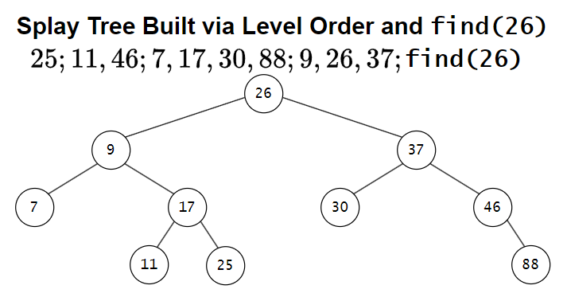

# &#128209; Table of Contents
- [💡 Overview](#-overview)
  - [Important Details](#important-details)
  - [Container Methods](#container-methods)
- [💻 Implementation](#-implementation)
  - [Design Decisions](#design-decisions)
  - [Container Implementation](#container-implementation)
  - [Node Implementation](#node-implementation)
  - [Iterator Implementation](#iterator-implementation)
- [📊 Analysis](#-analysis)
  - [Characteristics](#characteristics)
  - [Trade-Offs](#trade-offs)
- [📝 Application](#-application)
  - [Common Use Cases](#common-use-cases)
  - [Some Practical Problems](#some-practical-problems)
- [🕙 Origins](#-origins)
- [📖 Resources](#-resources)
- [🤝 Contributing](#-contributing)
- [🔏 License](#-license)

# &#128161; Overview
The **Splay Tree** is a self-adjusting implementation of the binary search tree (BST) that restructures itself by moving accessed nodes to the root through rotations. The tree is named after the splay operation, introduced by Daniel Sleator and Robert Tarjan in 1985, which refers to the process of moving a node to the root to optimize access over time. Knowledge and understanding of it lay a solid foundation in designing data structures and optimizing their application.

## Important Details
1. **Self-Adjusting Structure** — self-adjusting structure implies that tree adjusts itself (automatically updates pointers to reorganize the nodes) based on access patterns - no extra metadata, rebalancing logic, or fixed structural invariants required.

2. **BST Ordering Property** — for any given node (`x`), all values in the left subtree are less than the node's value (`left` $<$ `x`), and all values in the right subtree are greater than the node's value (`right` $>$ `x`). This property is the core of BSTs, ensuring a hierarchical structure that supports efficient operations; any violation compromises the tree's integrity and reliability.

3. **Access-Based Adjusting** — the tree has no balancing criteria to maintain (e.g. height in AVL, color in Red-Black). Instead, it restructures itself after every operation by promoting the accessed node to the root. This favors elements that are used frequently or recently, helping the tree match real usage patterns. While individual operations can take up to $O(n)$ time, the amortized cost — meaning that expensive operations are rare and the average stays low — is $O(\log n)$ per operation over a sequence.
   
4. **Adjusting via Splaying** — the process of adjusting is built upon rotations called splay operations. Basically, these are small local changes that shift nodes upward to bring a target element to the root, without changing the in-order sequence. There are three types of splay steps based on the relative position of the node, its parent, and its grandparent:
   - **Zig** — applied when the node is a direct child of the root;
   - **Zig-Zig** — applied when the node and its parent are on the same side (e.g. left-left or right-right);
   - **Zig-Zag** — applied when the node and its parent are on opposite sides (e.g. left-right or right-left).
   
   The details of each rotation will be covered in the [container methods](#container-methods) section. Although they are internal operations, explaining them in the container methods section keeps all crucial tree operations organized in one place while maintaining a clear separation between modifiers and rotations categories.

5. **Skewness is Possible** — since splay trees don’t maintain strict balance, the structure can become temporarily skewed, especially after a sequence of operations targeting the same side. This is considered valid behavior and doesn’t break the tree — over time, splaying naturally reshapes it.

6. **Duplicates** — splay trees don’t have a standard way of handling duplicate values, and most implementations simply avoid them. It’s possible to support duplicates by adding a counter to each node or consistently placing them to one side, but it makes the splaying logic more complex and error-prone. Because of that, duplicates are rarely used in practice — most developers just disallow them entirely.

## Container Methods
Currently in Progress...

# &#x1F4BB; Implementation 
Currently in Progress...

## Design Decisions
Currently in Progress...

## Container Implementation
Currently in Progress...

## Node Implementation
Currently in Progress...

## Iterator Implementation
Currently in Progress...

# &#128202; Analysis
Currently in Progress...

## Characteristics
Currently in Progress...

## Trade-Offs
Currently in Progress...

# &#128221; Application
Understanding some of the most well-known use cases of a container is crucial for grasping its practical relevance and potential impact in real-world scenarios. Additionally, familiarizing oneself with common practical problems and practicing their solutions ensures that you remember the essential details and develop a deep, intuitive understanding of the functionality and limitations.

## Common Use Cases
- **Not very popular** — unfortunately, I couldn’t find any confirmed uses of splay trees in modern software development, not even in niche applications. While there are some mentions in the context of dynamic graph libraries, most of them are from older sources; the majority of current references come from textbooks and university courses, where splay trees are mainly used to demonstrate amortized analysis and how self-adjusting behavior affects performance.

## Some Practical Problems
Since splay trees share the foundational principles of the general concept of trees, their common problems is best described in the [tree's respective section](../Tree.md#some-practical-problems).

# &#x1F559; Origins
Splay trees were introduced in **1985** by computer scientists **Daniel Dominic Kaplan Sleator** and **Robert Endre Tarjan** in their paper «Self-Adjusting Binary Search Trees» published in the Journal of the ACM. 

Their motivation was to design a binary search tree that could reorganize itself based on access patterns. Instead of tracking balance with extra metadata like AVL or Red-Black trees, they introduced a single operation — the splay — to move recently accessed nodes to the root. This made the structure adapt automatically to how it was used, favoring frequently accessed elements. To support this behavior, they applied amortized analysis to show that even though individual operations might be expensive, the overall cost across many operations stays efficient. It became one of the first well-known data structures where amortized cost was a core part of the design.

Despite the interesting idea, splay trees didn’t gain real-world popularity. The main reason is their unpredictable worst-case time, which makes them unreliable for systems that need consistent performance.

# &#128214; Resources
&#128218; **Books:**
- **"Data Structures and Algorithm Analysis in C++" (4th Edition)** — by Mark Allen Weiss
  - Section 4.5: Splay Trees
  - Section 11.5: Splay Trees
  - Section 12.1: Top-Down Splay Trees
- **"Algorithms in C++, Parts 1-4: Fundamentals, Data Structure, Sorting, Searching" (3rd Edition)** — by Robert Sedgewick
  - Section 13.2: Splay BSTs
- **"The Art of Computer Programming, Volume 3: Sorting and Searching" (2nd Edition)** — by Donald Ervin Knuth
  - Section 6.2.3: Balanced Trees

---
&#127916; **Recordings:**
- [DSA-10: Search Trees: AVL-tree, Splay-tree](https://youtu.be/cuEwDXwh300?si=4MfN4NxwRYj8n-RP) (Lecture)

---  
&#127760; **Web-Pages:**  
- [Splay tree](https://en.wikipedia.org/wiki/Splay_tree) (Wikipedia)
- [Self-Adjusting Binary Search Trees](https://www.cs.cmu.edu/~sleator/papers/self-adjusting.pdf) (Research Paper)

# &#129309; Contributing
Contributions are highly appreciated! For detailed guidelines, contact details, and additional information, please refer to the [root directory's contributing section](../../../#-contributing).

# &#128271; License
This project is licensed under the MIT License — see the [LICENSE](https://github.com/vezzolter/DSA/blob/main/LICENSE) file for details.

