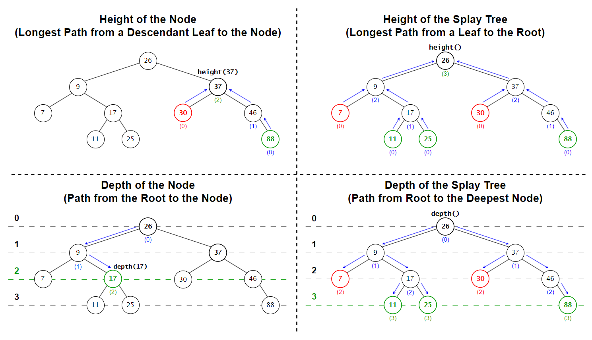
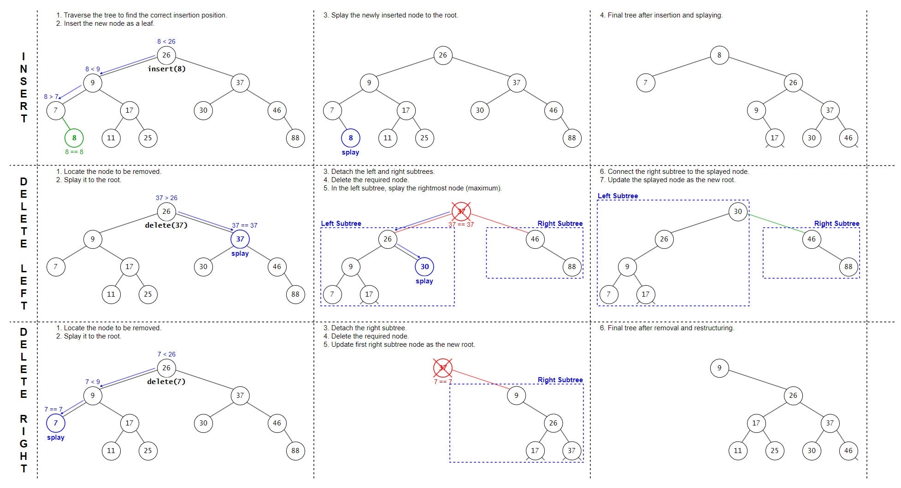
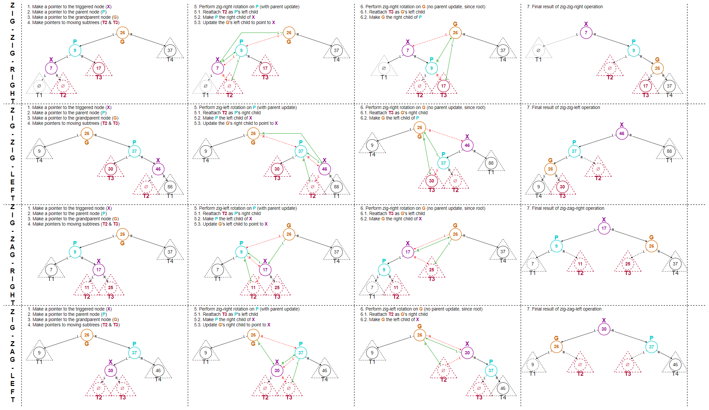

# &#128209; Table of Contents
- [💡 Overview](#-overview)
  - [Important Details](#important-details)
  - [Container Methods](#container-methods)
- [💻 Implementation](#-implementation)
  - [Design Decisions](#design-decisions)
  - [Container Implementation](#container-implementation)
  - [Node Implementation](#node-implementation)
  - [Iterator Implementation](#iterator-implementation)
- [📊 Analysis](#-analysis)
  - [Characteristics](#characteristics)
  - [Trade-Offs](#trade-offs)
- [📝 Application](#-application)
  - [Common Use Cases](#common-use-cases)
  - [Some Practical Problems](#some-practical-problems)
- [🕙 Origins](#-origins)
- [📖 Resources](#-resources)
- [🤝 Contributing](#-contributing)
- [🔏 License](#-license)


# &#128161; Overview
The **Splay Tree** is a self-adjusting implementation of the binary search tree (BST) that restructures itself by moving accessed nodes to the root through rotations. The tree is named after the splay operation, introduced by Daniel Sleator and Robert Tarjan in 1985, which refers to the process of moving a node to the root to optimize access over time. Knowledge and understanding of it lay a solid foundation in designing data structures and optimizing their application.
<p align="center"></p>


## Important Details
1. **Self-Adjusting Structure** — self-adjusting structure implies that tree adjusts itself (automatically updates pointers to reorganize the nodes) based on access patterns - no extra metadata, rebalancing logic, or fixed structural invariants required.

2. **BST Ordering Property** — for any given node (`x`), all values in the left subtree are less than the node's value (`left` $<$ `x`), and all values in the right subtree are greater than the node's value (`right` $>$ `x`). This property is the core of BSTs, ensuring a hierarchical structure that supports efficient operations; any violation compromises the tree's integrity and reliability.

3. **Access-Based Adjusting** — the tree has no balancing criteria to maintain (e.g. height in AVL, color in Red-Black). Instead, it restructures itself after every operation by promoting the accessed node to the root. This favors elements that are used frequently or recently, helping the tree match real usage patterns. While individual operations can take up to $O(n)$ time, the amortized cost — meaning that expensive operations are rare and the average stays low — is $O(\log n)$ per operation over a sequence.
   
4. **Adjusting via Splaying** — the process of adjusting is built upon rotations called splay operations. Basically, these are small local changes that shift nodes upward to bring a target element to the root, without changing the in-order sequence. There are three types of splay steps based on the relative position of the node, its parent, and its grandparent:
   - **Zig** — applied when the node is a direct child of the root;
   - **Zig-Zig** — applied when the node and its parent are on the same side (e.g. left-left or right-right);
   - **Zig-Zag** — applied when the node and its parent are on opposite sides (e.g. left-right or right-left).
   
   The details of each rotation will be covered in the [container methods](#container-methods) section. Although they are internal operations, explaining them in the container methods section keeps all crucial tree operations organized in one place while maintaining a clear separation between modifiers and rotations categories.

5. **Skewness is Possible** — since splay trees don’t maintain strict balance, the structure can become temporarily skewed, especially after a sequence of operations targeting the same side. This is considered valid behavior and doesn’t break the tree — over time, splaying naturally reshapes it.

6. **Duplicates** — splay trees don’t have a standard way of handling duplicate values, and most implementations simply avoid them. It’s possible to support duplicates by adding a counter to each node or consistently placing them to one side, but it makes the splaying logic more complex and error-prone. Because of that, duplicates are rarely used in practice — most developers just disallow them entirely.


## Container Methods
When working with Splay Trees, it's important to note that there is no universal standard defining a strict list of operations or guidelines for how they should be implemented. In fact, raw splay trees are not commonly used in modern programming libraries, primarily because of their unpredictable worst-case performance. Instead, Red-Black Trees are preferred in most production containers such as `std::map` (C++), `TreeMap` (Java), or `SortedSet` (C#), due to their consistent $O(\log n)$ guarantees. Since the design and functionality of containers vary significantly depending on implementation goals, the list of operations provided in this repository is meant to capture the most fundamental and representative methods one would expect when implementing or experimenting with splay trees.

---
**Compiler Generated**:
- `Default Constructor` — creates an empty tree.
- `Parametrized Constructors` — there are usually many ways to construct and initialize the container, and it’s often up to the developer to decide which ones to implement based on the container’s needs.
- `Copy Constructor` — creates a new tree by copying the structure and values of another tree.
  - if the other tree is empty, initializes an empty tree.
- `Move Constructor` — creates a new tree by transferring ownership of the memory from another tree, leaving the original tree in a valid but unspecified state.
  - if the other tree is empty, initializes an empty tree.
- `Copy Assignment Operator` — overwrites each element of an already existing tree with the corresponding element of another tree by copying them.
  - if the other tree is empty, initializes an empty tree.
- `Move Assignment Operator` — overwrites each element of an already existing tree with the corresponding element of another tree by transferring ownership of the memory, leaving the original tree in a valid but unspecified state.
  - if the other tree is empty, initializes an empty tree.
- `Destructor` — releases the tree's allocated memory, calling destructors for complex data types to ensure proper cleanup of resources.

---
<p align="center"></p>

**Iterators:**
- `begin`, `cbegin` — returns an iterator (or constant iterator) pointing to the smallest node in the tree (in-order traversal).
- `end`, `cend` — returns an iterator (or constant iterator) pointing past the largest node in the tree.
- `rbegin`, `crbegin` — returns an iterator (or constant iterator) pointing to the largest node in the tree (reverse in-order traversal).
- `rend`, `crend` — returns an iterator (or constant iterator) pointing past the smallest node in reverse traversal.

---
<p align="center"></p>

**Elements Access**:
- `find(val)` — returns a pointer or iterator to the node containing the specified value.
  - returns `nullptr` or equivalent if the value is not found;
  - if the value is found, the corresponding node is splayed to the root.
- `min()` — returns an iterator to the node with the smallest value in the tree.
  - returns `nullptr` or equivalent if the tree is empty.
- `max()` — returns an iterator to the node with the largest value in the tree.
  - returns `nullptr` or equivalent if the tree is empty.
- `successor(val)` — returns a pointer or iterator to the node with the smallest value greater than the specified value (in-order successor).
  - returns `nullptr` or equivalent if the specified value has no successor (e.g. the largest value, sole value);
  - if the successor exists, the successor node is splayed to the root.
- `predecessor(val)` — returns a pointer or iterator to the node with the largest value smaller than the specified value (in-order predecessor).
  - returns `nullptr` or equivalent if the specified value has no predecessor (e.g. the smallest value, sole value);
  - if the predecessor exists, the predecessor node is splayed to the root.

---
<p align="center"></p>

**Capacity**:
- `empty()` — returns `true` if the tree contains no nodes; otherwise `false`.
- `size()` — returns the total number of nodes in the tree.
- `maxSize()` — returns the maximum number of elements the container is able to hold theoretically based on system's memory limitations, if all available memory were dedicated to that single container.
- `height(val)` — returns the height of the given value's node, which is the length (number of edges) of the longest path from the node to a leaf.
  - if the value is not found in the tree, it returns `-1`;
  - the height of a leaf node is `0`.
- `depth(val)` — returns the depth of the given value's node, which is the length (number of edges) of the path from the root to the node.
  - if the value is not found in the tree, it returns `-1`;
  - the depth of the root node is `0`.

---
<p align="center"></p>

**Modifiers**:
- `insert(val)` — inserts a new node with the specified value into the tree, maintaining the BST ordering property and splaying the new node to the root to preserve the access-based structure.
- `erase(val)` — removes the node with the specified value from the tree, maintaining the BST ordering property and splaying either the parent or a replacement node to the root to restore the access-based structure.
  - if the node has no children (leaf), simply remove the node;
  - if the node has one child, replace the node with its child;
  - if the node has two children, it is replaced with its in-order successor or predecessor, depending on the design decision;
- `clear()` — removes all nodes from the tree, resetting it to its initial state.
- `swap(other)` — exchanges the contents of the current tree with another tree, avoiding expensive deep copies.
  - assigning a tree to itself has no effect, as the function exits early without performing any operations.

---
<p align="center"></p>
<p align="center"></p>

**Splaying (Private Part):**
- `splay(node)` — brings the specified node to the root by repeatedly performing rotations during splaying operations, following Zig, Zig-Zig, and Zig-Zag restructuring cases.
- `rotateRight(node)` — performs a right rotation on the given node to restructure left-leaning paths during splaying.
- `rotateLeft(node)` — performs a left rotation on the given node to restructure right-leaning paths during splaying.

> **Note:** To clearly follow each pointer change and structural update, view the diagrams in fullscreen.


# &#x1F4BB; Implementation 
The implemented console application demonstrates the basic functionality of the Splay Tree by performing various operations and interactions with it. The program provides a clear view of changes made during usage, displaying the state of the data at different stages to illustrate its simplified behavior and characteristics.
<p align="center"></p>


## Design Decisions
To prioritize simplicity and emphasize data structure itself, several design decisions were made:
- Applied splaying for access, insertion, and removal (not used in iterators or capacity queries).
- Disallowed duplicate elements to avoid ambiguity in access paths and rotation results.
- Treated non-existing nodes as height `-1`, making leaf nodes start from height `0`;
- Implemented only standard and const iterators (excluded reverse and range-based iterations).
- Limited iterator-based functions to a single iterator type to avoid introducing templates.
- Restricting the container to `int` to keep the focus on structure, not generalization.
- Omitted cases where the container is created on the heap.
- Skipped support for const-qualified container objects.
- Excluded move semantics to reduce lifecycle complexity and highlight copy behavior.
- Used raw pointers and manual memory control instead of smart pointers or automatic ownership.
- Avoided exception handling, including validation for invalid accesses or range errors.
- Omitted certain low-level optimizations.


## Container Implementation
The container is implemented within the `SplayTree` class, which is declared in [SplayTree.h](https://github.com/vezzolter/DSA/blob/splay-tree/DataStructures/Tree/SplayTree/Include/SplayTree.h) header file and defined in [SplayTree.cpp](https://github.com/vezzolter/DSA/blob/splay-tree/DataStructures/Tree/SplayTree/Source/SplayTree.cpp) source file. This approach is adopted to ensure encapsulation, modularity and compilation efficiency. To see the container's functionality in action, you can examine the `main()` function located in the [Main.cpp](https://github.com/vezzolter/DSA/blob/splay-tree/DataStructures/Tree/SplayTree/Source/Main.cpp) file. The full implementation can be found in the corresponding files, while the class declaration below offers a quick overview:

```cpp
class SplayTree {
private:
    int _size;
    struct Node;
    Node* _root;

    // -----------------
    //  Utility Methods
    // -----------------
    Node* copySubtree(Node* src, Node* parent);
    void destroySubtree(Node* src);
    Node* findLeftmost(Node* node) const;
    Node* findRightmost(Node* node) const;
    int computeHeight(Node* node) const;
    int computeDepth(Node* node) const;
    void rightRotate(Node* node);
    void leftRotate(Node* node);
    void splay(Node* x);

public:
    // --------------------
    //  Compiler Generated
    // --------------------
    SplayTree();
    SplayTree(const SplayTree& other);
    SplayTree(SplayTree&& other)          = delete;
    SplayTree& operator=(const SplayTree& rhs);
    SplayTree& operator=(SplayTree&& rhs) = delete;
    ~SplayTree();

    // -----------
    //  Iterators
    // -----------
    class Iterator;
    using iterator = Iterator;
    iterator begin();
    iterator end();
    class ConstIterator;
    using const_iterator = ConstIterator;
    const_iterator begin() const;
    const_iterator end() const;
    const_iterator cbegin() const;
    const_iterator cend() const;

    // ----------------
    //  Element Access
    // ----------------
    iterator find(const int& val);
    iterator predecessor(const int& val);
    iterator predecessor(iterator& it);
    iterator successor(const int& val);
    iterator successor(iterator& it);
    iterator minimum();
    iterator maximum();

    // ----------
    //  Capacity
    // ----------
    bool empty() const;
    int size() const;
    int height() const;
    int height(const int& val) const;
    int height(const iterator& it) const;
    int depth() const;
    int depth(const int& val) const;
    int depth(const iterator& it) const;

    // -----------
    //  Modifiers
    // -----------
    void insert(const int& val);
    void remove(const int& val);
    void remove(iterator pos);
    void clear();
    void swap(SplayTree& other);
};
```


## Node Implementation
The `Node` structure is defined as a private nested structure within the `SplayTree` container. This design keeps `Node` as an internal component, accessible only within the container, and enhances encapsulation. Given the simplicity of the `Node` structure, its functions are defined inline within the container's header file.

```cpp
struct SplayTree::Node {
public:
    int data;
    Node* parent;
    Node* left;
    Node* right;

    // --------------------
    //  Compiler Generated
    // --------------------
    Node() : data(0), parent(nullptr), left(nullptr), right(nullptr) {}
    Node(const int& val, Node* parent = nullptr) : data(val), parent(parent), left(nullptr), right(nullptr) {};
    Node(const Node& other)          = delete; // no copying or moving to ensure 
    Node(Node&& other)               = delete; // uniqueness of the node within    
    Node& operator=(const Node& rhs) = delete; // the tree and prevent accidental 
    Node& operator=(Node&& rhs)      = delete; // duplicates or dangling nodes
    ~Node()                          = default;
};
```


## Iterator Implementation
Since there are various types of iterators that can be implemented (e.g. forward, const forward, reverse, const reverse), it's common practice to define them in separate classes and files. However, despite being implemented separately, their underlying principles are usually similar, with only slight adjustments for specific purposes. To keep things simpler and avoid cluttering the core concepts, this container implements regular and constant iterator classes. Those iterators cover the basic $[begin, end)$ range and demonstrates how typical iterators operations are handled, as well as how the iterators classes are integrated into the SplayTree container.

---
The `Iterator` class is defined as a public nested class within the `SplayTree` container. This design makes `Iterator` accessible to users, enabling them to traverse and interact with list elements directly. Given the simplicity of the `Iterator` class, its functions are defined inline within the container's header file.

```cpp
class SplayTree::Iterator {
private:
    friend class SplayTree; // to handle iterator-based methods in SplayTree
    Node* _curr;

    // -----------------
    //  Utility Methods
    // -----------------

    // Find the leftmost node starting from the given node (the smallest)
    static Node* findLeftmost(Node* node) {
        for (; node && node->left; ) { node = node->left; }
        return node;
    }

    // Find the next node of the given node (in-order successor)
    static Node* findNext(Node* node) {
        if (!node) { return nullptr; }

        // Case 1: if the 'given' has a right subtree, 'next' is the leftmost node in that subtree
        if (node->right) { return findLeftmost(node->right); }

        // Case 2: otherwise 'next' is the first parent node, where the 'given' is in the left subtree
        Node* parent = node->parent;
        for (; parent && node == parent->right; ) {
            node = parent;
            parent = parent->parent;
        }
        return parent;
    }

public:
    // --------------------
    //  Compiler Generated
    // --------------------
    Iterator() : _curr(nullptr) {}
    explicit Iterator(Node* node) : _curr(node) {} // prevents from 'node' to 'itr'
    Iterator(const Iterator& other)          = default;
    Iterator(Iterator&& other)               = default;
    Iterator& operator=(const Iterator& rhs) = default;
    Iterator& operator=(Iterator&& rhs)      = default;
    ~Iterator()                              = default;

    // ----------------------
    //  Overloaded Operators
    // ----------------------

    // Returns a CONST reference to the data of the current node
    const int& operator*() {
        return _curr->data;
    }

    // Advances the iterator to the next element in in-order traversal (pre-increment)
    Iterator& operator++() {
        _curr = findNext(_curr);
        return *this;
    }

    // Advances the iterator to the next element, returning the previous state (post-increment)
    Iterator operator++(int) {
        Iterator temp(_curr);
        _curr = findNext(_curr);
        return temp;
    }

    // Returns true if two iterators point to the same node
    friend bool operator==(const SplayTree::Iterator& lhs, const SplayTree::Iterator& rhs) {
        return lhs._curr == rhs._curr;
    }

    // Returns true if two iterators point to different nodes
    friend bool operator!=(const SplayTree::Iterator& lhs, const SplayTree::Iterator& rhs) {
        return lhs._curr != rhs._curr;
    }
};
```


---
The `ConstIterator` class is defined as a public nested class within the `SplayTree` container. This design makes `ConstIterator` accessible to users, enabling them to traverse and interact with list elements directly. Given the simplicity of the `ConstIterator` class, its functions are defined inline within the container's header file.

```cpp
class SplayTree::ConstIterator {
private:
    friend class SplayTree; // to handle iterator-based methods in SplayTree
    const Node* _curr;

    // -----------------
    //  Utility Methods
    // -----------------

    // Find the leftmost node starting from the given node (the smallest)
    static const Node* findLeftmost(Node* node) {
        for (; node && node->left; ) { node = node->left; }
        return node;
    }

    // Find the next node of the given node (in-order successor)
    static const Node* findNext(const Node* node) {
        if (!node) { return nullptr; }

        // Case 1: if the 'given' has a right subtree, 'next' is the leftmost node in that subtree
        if (node->right) { return findLeftmost(node->right); }

        // Case 2: otherwise 'next' is the first parent node, where the 'given' is in the left subtree
        const Node* parent = node->parent;
        for (; parent && node == parent->right; ) {
            node = parent;
            parent = parent->parent;
        }
        return parent;
    }

public:
    // --------------------
    //  Compiler Generated
    // --------------------
    ConstIterator() : _curr(nullptr) {}
    explicit ConstIterator(const Node* node) : _curr(node) {} // prevents from 'node' to 'itr'
    ConstIterator(const Iterator& other) : _curr(other._curr) {} // allows from 'regular_itr' to 'const_itr'
    ConstIterator(const ConstIterator& other)          = default;
    ConstIterator(ConstIterator&& other)               = default;
    ConstIterator& operator=(const ConstIterator& rhs) = default;
    ConstIterator& operator=(ConstIterator&& rhs)      = default;
    ~ConstIterator()                                   = default;

    // ----------------------
    //  Overloaded Operators
    // ----------------------

    // Returns a const reference to the data of the current node
    const int& operator*() const {
        return _curr->data;
    }

    // Advances the iterator to the next element in in-order traversal (pre-increment)
    ConstIterator& operator++() {
        _curr = findNext(_curr);
        return *this;
    }

    // Advances the iterator to the next element, returning the previous state (post-increment)
    ConstIterator operator++(int) {
        ConstIterator temp = *this;
        _curr = findNext(_curr);
        return temp;
    }

    // Returns true if two iterators point to the same node
    friend bool operator==(const SplayTree::ConstIterator& lhs, const SplayTree::ConstIterator& rhs) {
        return lhs._curr == rhs._curr;
    }

    // Returns true if two iterators point to different nodes
    friend bool operator!=(const SplayTree::ConstIterator& lhs, const SplayTree::ConstIterator& rhs) {
        return lhs._curr != rhs._curr;
    }
};
```


# &#128202; Analysis
Currently in Progress...


## Characteristics
Currently in Progress...


## Trade-Offs
Currently in Progress...


# &#128221; Application
Understanding some of the most well-known use cases of a container is crucial for grasping its practical relevance and potential impact in real-world scenarios. Additionally, familiarizing oneself with common practical problems and practicing their solutions ensures that you remember the essential details and develop a deep, intuitive understanding of the functionality and limitations.


## Common Use Cases
- **Not very popular** — unfortunately, I couldn’t find any confirmed uses of splay trees in modern software development, not even in niche applications. While there are some mentions in the context of dynamic graph libraries, most of them are from older sources; the majority of current references come from textbooks and university courses, where splay trees are mainly used to demonstrate amortized analysis and how self-adjusting behavior affects performance.


## Some Practical Problems
Since splay trees share the foundational principles of the general concept of trees, their common problems is best described in the [tree's respective section](../Tree.md#some-practical-problems).


# &#x1F559; Origins
Splay trees were introduced in **1985** by computer scientists **Daniel Dominic Kaplan Sleator** and **Robert Endre Tarjan** in their paper «Self-Adjusting Binary Search Trees» published in the Journal of the ACM. 

Their motivation was to design a binary search tree that could reorganize itself based on access patterns. Instead of tracking balance with extra metadata like AVL or Red-Black trees, they introduced a single operation — the splay — to move recently accessed nodes to the root. This made the structure adapt automatically to how it was used, favoring frequently accessed elements. To support this behavior, they applied amortized analysis to show that even though individual operations might be expensive, the overall cost across many operations stays efficient. It became one of the first well-known data structures where amortized cost was a core part of the design.

Despite the interesting idea, splay trees didn’t gain real-world popularity. The main reason is their unpredictable worst-case time, which makes them unreliable for systems that need consistent performance.


# &#128214; Resources
&#128218; **Books:**
- **"Data Structures and Algorithm Analysis in C++" (4th Edition)** — by Mark Allen Weiss
  - Section 4.5: Splay Trees
  - Section 11.5: Splay Trees
  - Section 12.1: Top-Down Splay Trees
- **"Algorithms in C++, Parts 1-4: Fundamentals, Data Structure, Sorting, Searching" (3rd Edition)** — by Robert Sedgewick
  - Section 13.2: Splay BSTs
- **"The Art of Computer Programming, Volume 3: Sorting and Searching" (2nd Edition)** — by Donald Ervin Knuth
  - Section 6.2.3: Balanced Trees

---
&#127916; **Recordings:**
- [DSA-10: Search Trees: AVL-tree, Splay-tree](https://youtu.be/cuEwDXwh300?si=4MfN4NxwRYj8n-RP) (Lecture)

---  
&#127760; **Web-Pages:**  
- [Splay tree](https://en.wikipedia.org/wiki/Splay_tree) (Wikipedia)
- [Self-Adjusting Binary Search Trees](https://www.cs.cmu.edu/~sleator/papers/self-adjusting.pdf) (Research Paper)


# &#129309; Contributing
Contributions are highly appreciated! For detailed guidelines, contact details, and additional information, please refer to the [root directory's contributing section](../../../#-contributing).


# &#128271; License
This project is licensed under the MIT License — see the [LICENSE](https://github.com/vezzolter/DSA/blob/main/LICENSE) file for details.

[](https://opensource.org/licenses/MIT)