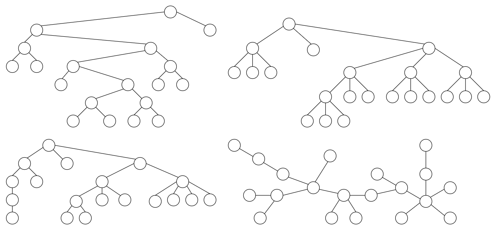
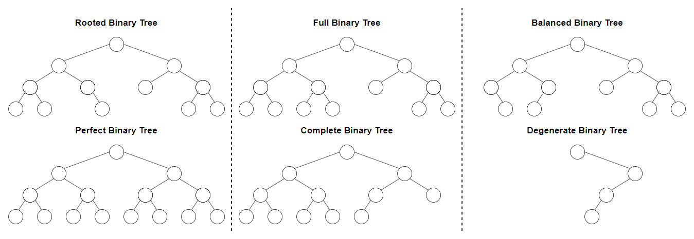

# &#128209; Table of Contents
- [💡 Overview](#-overview)
- [💻 Implementation](#-implementation)
  - [Binary Tree](#binary-tree)
- [📊 Analysis](#-analysis)
- [📝 Application](#-application)
- [⏳ Origins](#-origins)
- [🤝 Contributing](#-contributing)
- [📧 Contacts](#-contacts)
- [🙏 Credits](#-credits)
- [🔏 License](#-license)

# &#128161; Overview
The **Tree** stands out as one of the most fundamental concept in computer science. Trees represents a category of collections that mirror the hierarchical behaviour of trees in nature, making them a particularly well-suited choice for depicting relationships that have a parent-child or ancestor-descendant structure. This subsection explores trees to establish a solid foundation of understanding, as it helps to create elegant and efficient algorithmic designs for all manner of applications.

---
**Essential Terminology:**
- **Collection** — is a data structure (or container) used to group multiple elements together.
  - **Tree** — is a collection consisting of nodes and edges that satisfies requirements based on the tree type and maintains ascendant-descendant relationships.
  - **Subtree** — is a tree within a tree formed by selecting a node and all its descendants.
- **Node** — is an each individual element contained within the tree, containing actual information stored within and pointers (or references) to other nodes.
  - **Root** — the topmost node serving as a starting point, thus having no parent.
  - **Parent** — is a node that has one or more child nodes connected to it.
  - **Child** — is a node connected to a parent node.
  - **Siblings** — nodes that share the same parent.
  - **External Node/Leaf** — is a node with no children.
  - **Internal Node** — is a node with children.
  - **Ancestor/Predecessor** — is a node located above another node, along the path leading from the root node to that node.
  - **Descendant/Successor** — is a node located below another node, along the path leading from the root node to that node.
  - **Neighbour of a Node** — any other node that is directly connected to particular node by an edge.
- **Edge** — is a connection between two nodes in a tree, which helps to manage the relationships.
- **Path** — is a sequence of nodes and edges from one node to another one, which must be **only one** for any pair of nodes, otherwise it is a graph.
  - **Length of Path** — is a number of edges (sometimes people consider nodes) that path contains.
  - **Shortest Path** — is a path with minimum length, i.e. the path that requires the fewest number of edges to traverse from one node to another.
  - **Longest Path** — is a path with maximum length, i.e. the path that requires the greatest number of edges to traverse from one node to another.
- **Height of the Node** — is a number of edges from leaf node to a particular node in the longest path.
  - **Height of the Tree** — is a number of edges from leaf node to a root in the longest path.
- **Depth of the Node** — is a number of egdes from root node to a particular node.
  - **Depth of the Tree** — is a number of egdes from root node to a leaf node in the longest path.
- **Level of the Node** — is a number of egdes from root (level 0) down to the particular node (depth - 1).
  - **Width of the Tree** — is the maximum number of nodes among all the levels.
  - **Breadth of the Tree** — is the number of nodes at the last level of the tree, i.e. number of leaves.
- **Degree of a Node** — is a total number of children of a particular node.
  - **Degreee of a Tree** — is the highest degree among all the nodes.

---
**Tree May Include Operations For:**
- **Access/Search** — finding a specific element, checking if an element exists in the tree, or retrieving elements based on certain criteria (e.g. minimum, maximum, predecessor, successor)
- **Insertion/Grafting** — inserting a new element (or whole section) into the tree, while maintaining the tree's properties.
- **Removal/Pruning** — removing specific elements (or whole section) or based on certain criteria.
- **Clear** — removing all elements, resetting it to an empty state.
- **Empty** — checking if the tree contains no elements.
- **Size** — determining the number of elements (nodes).
- **Height** — determining the height or depth of elements/tree.
- **Traversal** — visiting all the elements (nodes) in a specific order.

# &#x1F4BB; Implementation 
When it comes to the implementation of abstract data types (ADTs), there are many different ways to represent trees. While some share common ideas, each possesses distinctive characteristics. To cover them all, it's essential to understand the fundamental concept behind the most well-known representations and make slight adjustments to the chosen tree structure.

Note that it is commonly recommended to rely on proven, well-established, and widely recognized implementations that already exist, rather than reinventing the wheel. In the context of C++, these could include tree-based containers (e.g. `boost::multiway_tree`, `boost::tree`) from the **Boost Graph Library**, or several containers (e.g. `std::set`, `std::map`) from the **STL**, which can be used to implement trees. Although trees can be implemented via arrrays (binary heaps), typically they are implemented similarly to [linked lists](https://github.com/vezzolter/DSA/blob/main/DataStructures/LinkedList/List.md), where each node is a structure or class containing information, pointers, and optional logic.

Within the scope of this repository, we'll take a closer look at simplified versions of popular trees to gain a deeper understanding of the fundamental concepts that underlie them. After this section, it would be beneficial to examine previously mentioned implementations in practice (e.g., pet-projects, LeetCode-like sites) to solidify the knowledge

## Binary Tree

**Binary Tree** — is a tree structure in which each node can have a maximum of two child nodes, referred to as the left child and the right child. It can be broadly characterized using the following terms:
  - **Rooted (Default)** — all nodes have a maximum of $2$ children.
  - **Perfect** — all nodes have two children and all leaves have the same level.
  - **Full** — all nodes have either $0$ or $2$ children.
  - **Complete** — all levels are filled with the maximum amount of nodes ($2$), except last one.
  - **Balanced** — the maximum difference in height between all subtrees must be $1$.
  - **Degenerate (Pathological)** — all nodes have only $1$ child.

# &#128202; Analysis
Currently in Progress...

# &#128221; Application
Currently in Progress...

# &#x23F3; Origins
Currently in Progress...

# &#129309; Contributing
Contributions are highly appreciated! For detailed guidelines, please refer to the [root directory's contributing section](../../#-contributing).

# &#128231; Contacts
For contact details and additional information, please refer to the [root directory's contact information section](../../#-contacts).

# &#128591; Credits
&#128218; **Books:**
- **"Introduction to Algorithms" (3rd Edition)** — by Thomas H. Cormen, Charles E. Leiserson, Ronald L. Rivest and Clifford Stein
  - Section 12: Binary Search Trees
  - Section 13: Red-Black Trees
  - Section 14: Augmenting Data Structures
  - Section 18: B-Trees
- **"Algorithms in C++, Parts 1-4: Fundamentals, Data Structure, Sorting, Searching" (3rd Edition)** — by Robert Sedgewick
  - Section 5: Recursion and Trees
  - Section 12: Symbol Tables and BSTs
  - Section 13: Balanced Trees
  - Section 15.1: Digital Search Trees
  - Section 15.2: Tries
  - Section 15.3: Patricia Tries
  - Section 15.4: Multiway Tries and TSTs
  - Section 16.3: B Trees
- **"Data Structures and Algorithm Analysis in C++" (4th Edition)** — by Mark Allen Weiss
  - Section 4: Trees
  - Section 12: Advanced Data Structures
- **"The Algorithm Design Manual" (2nd Edition)** — by Steven S. Skiena
  - Section 3.4: Binary Search Trees
  - Section 12.3: Suffix Trees and Arrays
  - Section 12.6: Kd-Trees
- **"The Art of Computer Programming, Volume 1: Fundamental Algorithms" (3rd Edition)** — by Donald Ervin Knuth
  - Section: 2.3: Trees

---
&#127891; **Courses:**
- [Accelerated Computer Science Fundamentals Specialization](https://www.coursera.org/specializations/cs-fundamentals) on Coursera
  - Section 2.2: Introduction to Tree Strcutures
  - Section 2.3: Advanced Tree Structures
- [Mastering Data Structures & Algorithms using C and C++](https://www.udemy.com/course/datastructurescncpp/) on Udemy
  - Section 15: Trees
  - Section 16: Binary Search Trees
  - Section 17: AVL Trees
  - Section 18: Search Trees

---  
&#127760; **Web-Resources:**  
- [Tree (data structure)](https://en.wikipedia.org/wiki/Tree_(data_structure)) (Wikipedia)
- [Tree - Terminology](http://www.btechsmartclass.com/data_structures/tree-terminology.html)

# &#128271; License
This project is licensed under the MIT License — see the [LICENSE](https://github.com/vezzolter/DSA/blob/main/LICENSE) file for details.

