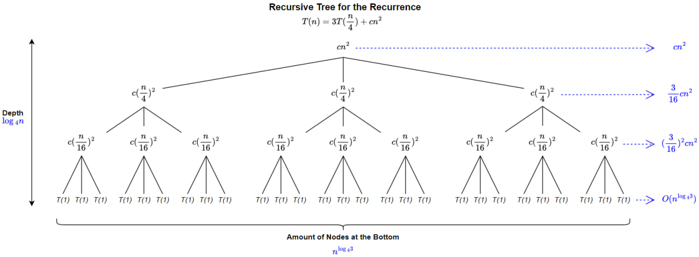

# &#128209; Table of Contents
- [💡 Overview](#-overview)
- [📊 Recurrence Relation](#-recurrence-relation)
- [🤝 Contributing](#-contributing)
- [📧 Contacts](#-contacts)
- [🙏 Credits](#-credits)
- [🔏 License](#-license)

# &#128161; Overview
Certainly, by evaluating multiple candidate algorithms for a given problem, we can pinpoint the most efficient one. The process can be quite complex, considering various factors such as the implementation of a memory model, the size of the input, the extent of randomness, the programming language, and more. To address this complexity, people have developed two widely adopted measurements to analyze algorithms:
1. **Space Complexity** — how the memory usage grows with the input size.
2. **Time Complexity** — how the time requirements grow with the input size.

# &#128202; Recurrence Relation
When an algorithm containts a recursive call to itself, it is possible to describe running time as reccurence relation, which can be solved in order to provide different bounds on performance, such as lower ($\Omega$), tight ($\Theta$) or upper bound ($O$) each serving its own purpose.

**Recurrence Relation** — is an equation (or inequality), which recursively defines a sequence in which any term is defined by its previous terms. Used to analyze the time complexity of recursive algorithms in terms of input size.

**Methods to Solve Recurrences:**
1. **Substitution** — guess a bound, than prove with mathematical induction. Beneficial when encounter non-trivial cases or you have a good guess.
2. **Recursion Tree** — visualize the recurrence as a tree and calculating nodes sum per level together. Primarly used for generating good guesses to substitution method and also provides proof to master method.
3. **Master Theorem** — provides solution for recurrences of the particular form, which pretty frequently occurs in many commonly encountered algorithms.

Analyzing and solving recurrences is a nuanced process, and the choice of method depends on the characteristics of the recurrence relation. Each method has its strengths, making it well-suited for certain types of recurrences. In simple terms, if recurrence is not solvable by Master Theorem, you can try Substitution and tree can help in both cases. Detailed overview of each of these methods and CLRS examples you can find below.

---
**Substitution Method** — guess a bound, than prove with mathematical induction. Method is powerful, but in order to apply there must be good guess of a form and there is no general way to do so, it takes experience and creativity, although heuristics and recursion trees can help generate those guesses. Beneficial when encounter non-trivial cases or you have a good guess.

**Induction** — proving method, which's key idea is to establish the base case and then prove that a statement is true for all natural numbers.

**Example**   
Determine upper bound $O(n)$ for the next recurrence relation $T(n) = 2T(\lfloor \frac{n}{2} \rfloor) + n$

1. Make a guess, that solution is $T(n) = O(n×log{_2}{n})$.
2. Prove, that $T(n) \leqslant O(n×log{_2}{n})$ for an appropiate choice of `const` $c>0$.
3. Assume that this bound holds for all positive $m < n$, in particular for $m = \lfloor \frac{n}{2} \rfloor$.  

4. This yields with $T(\lfloor \frac{n}{2} \rfloor) \leqslant c \lfloor \frac{n}{2} \rfloor × log{_2}({\lfloor \frac{n}{2} \rfloor})$, which we simply substitute into a recurrence $T(n) = 2T(\lfloor \frac{n}{2} \rfloor) + n$.

5. And then solving the default mathematical relation:  
$T(n) \leqslant 2 \left( c \lfloor \frac{n}{2} \rfloor log{_2}({\lfloor \frac{n}{2} \rfloor})\right) + n$; (rule: expending brackets)   
$T(n) \leqslant cnlog{_2}({\lfloor \frac{n}{2} \rfloor}) + n$; (rule: $log{_a}{b}=log{_2}{a}-log{_2}{b}$)  
$T(n) = cnlog{_2}{n} - cnlog{_2}{2} + n$; (rule: $log{_a}{a^k}=k$)  
$T(n) = cnlog{_2}{n} - cn + n$; (`const` is not much valuable for asymptotic notation)  
$T(n) \leqslant cn×log{_2}{n}$; (holds as long as $c \leqslant 1$ )

---
**Recursion Tree Method**  — visualize the recurrence as a tree, where each node represents the cost of a single subproblem, those costs on each tree level form a per-level costs, and the sum of those per-level costs is the overall complexity. If there is no need to prove anything in master theorem, this method allows for a degree of flexibility or informality in the analysis for generating guesses.

**Example**   
Making a good guess for the next recurrence relation $T(n) = 3T(\frac{n}{4}) + cn^2$.

Having in mind, that this is a guess and not a proof case, the assumption, that $n$ can be a power of $4$ can be tolerated due to the possible flexibility. This is done, so the number of subproblems would be an integer and thus building a tree would be easier.

   

The $cn^2$ term at the root represents the cost at the top level of recursion. 
Three subtrees represent the costs (each $c(\frac{n}{4})^2$) incurred by the subproblems of size $\frac{n}{4}$. This process of expending the nodes by breaking them into smaller parts continues until the bottom of a tree.

Because problem decrease by a factor of $4$ each level, the subproblem size for a node at depth $i$ is $\frac{n}{4^i}$, thus size hits $n=1$, when $\frac{n}{4^i}=1$, or equivalently when $i=\log{_4}{n}$, thus tree has $\log{_4}{n} + 1$ levels.

Each level has $3$ times more nodes, so number of nodes at $i$ level has $3^i$. Because subproblem sizes reduce by a factor of $4$ for each level, each node at depth $i$ for $i = 0, 1, 2, ..., \log{_4}{n} - 1$ has cost of $c(\frac{_n}{4^i})^2$. By multiplying it is observable, that total costs over all nodes at depth $i$ is $3^i c(\frac{n}{4^i})^2 = (\frac{_3}{16})^i cn^2$. The bottom level, at depth $\log{_4}{n}$ has $3^{\log{_4}{n}} = n^{\log{_4}{3}}$ nodes, each contributing cost $T(1)$, for a total cost of $n^{\log{_4}{3}}T(1)$, which is $\theta(n^{\log{_4}{3}})$.

In order, to determine the cost for the entire tree, we need to add up costs over all levels, resulting in the next recurrence equation:  
$T(n) = cn^2 + \frac{3}{16} cn^2 + (\frac{3}{16})^2 cn^2 + ... + (\frac{3}{16})^{\log{_4}{n} - 1}cn^2 + \theta(n^{\log{_4}{3}})$  

$T(n) = \sum_{i=0}^{\log{_4}{n} - 1}(\frac{_3}{16})^i cn^2 + \theta(n^{\log{_4}{3}})$   

$T(n) = \frac{\frac{3}{16}^{\log{_4}{n}}-1}{\frac{3}{16}-1} cn^2 + \theta(n^{\log{_4}{3}})$  

Where it is possible to take advantage of a flexibility and use a infinite decreasing geometric series as an upper bound:

$T(n) = \sum_{i=0}^{\log{_4}{n} - 1}(\frac{_3}{16})^i cn^2 + \theta(n^{\log{_4}{3}})$  

$T(n) < \sum_{i=0}^{\inf}(\frac{_3}{16})^i cn^2 + \theta(n^{\log{_4}{3}})$  

$T(n) = \frac{1}{1-\frac{3}{16}} cn^2 + \theta(n^{\log{_4}{3}})$  

$T(n) = \frac{16}{13}cn^2 + \theta(n^{\log{_4}{3}})$

$T(n) = O(n^2)$

So the result of building the tree is a guess of $T(n) = O(n^2)$, which is actually true if you try to prove it with substitution method.

---
**Master Theorem Method** — provides solution for recurrences of the form $T(n) = aT(\frac{n}{b}) + f(n)$, where:
- $f(n)$ — is asymptotically positive function, represents cost of the work done outside the recursive call (with merging and dividing);
- `const` $a \geqslant 1$ — number of subproblems; 
- $n$ — size of input;
- `const` $b > 1$ — the factor by which the problem size ($n$) is reduced in each recursive step, therefore $\frac{n}{b}$ size of each subproblem;

Master Theorem works in a way it provides cases, which are quick way to determine the time complexity of a wide range of recursive algorithms without having to go through detailed mathematical derivations, like previous methods did.

**Main Cases:**
1. **Case "Polynomially not faster"** — if $f(n) = O(n^{\log_b{a} - \epsilon})$ for some `const` $\epsilon > 0$, then $T(n) = \Theta(n^{\log_b{a}})$
2. **Case "Polynomially the same"** — if $f(n) = \Theta(n^{\log_b{a}})$, then $T(n) = \Theta(n^{\log_b{a}} \log{n})$
3. **Case "Polynomially not slower"** — if $f(n) = \Omega(n^{\log_b{a} + \epsilon})$ for some `const`  $\epsilon > 0$ (and if $af(\frac{n}{b}) \leqslant cf(n)$ for `const` $c<1$), then $T(n) = \Theta(f(n))$

**Example for case 1**  
$T(n) = 9T(\frac{n}{3}) + n$
We have $a=9, b=3, f(n) = n$, thus $n^{\log{_b}{a}} = n^{\log{_3}{9}} = \Theta(n^2)$  
Since $f(n) = O(n^{\log{_b}{a} - \epsilon})$, where $\epsilon = 1$, we can apply case 1 and conclude $T(n) = \Theta(n^2)$.

**Example for case 2**  
$T(n) =T(\frac{2n}{3}) + 1$  
We have $a=1, b=\frac{3}{2}, f(n) = 1$, thus $n^{\log{_b}{a}}=n^0=1$  
Since $f(n) = \Theta(n^{\log{_b}{a}}) = \Theta(1)$, we can apply case 2 and conclude $T(n) = \Theta(\log{_2}{n})$.

**Example for case 3**  
$T(n) = 3T(\frac{n}{4}) + n\log{_2}{n}$  
We have $a=3, b=4, f(n) = n\log{_2}{n}$, thus $n^{\log{_b}{a}} = n^{\log{_4}{3}} = O(n^{0.793})$  
Since $f(n) = \Omega(n^{\log{_b}{a} + \epsilon})$, where $\epsilon = 0.2$, we can apply case 3 but only if we can show that the regularity condition holds for $f(n)$ for sufficiently large $n$, we have that $af(\frac{n}{b}) = 3(\frac{n}{4})\log{_2}{\frac{n}{4}} \leqslant \frac{3}{4}n\log{_2}{n} = cf(n)$ for $c=\frac{3}{4}$. Consequently, conducting case 3, the solution is $T(n) = \Theta(n\log{_2}{n})$

**Example for no match**  
$T(n) = 2T(\frac{n}{2}) + n\log{_2}{n}$  
This recurrence is not solvable via Master Theorem, because $f(n) = n\log{_2}{n}$, is not polynomially larger than $n^{\log{_b}{a}} = b$

# &#129309; Contributing
Contributions are highly appreciated! For detailed guidelines, please refer to the [root directory's contributing section](../../#-contributing).

# &#128231; Contacts
For contact details and additional information, please refer to the [root directory's contact information section](../../#-contacts).

# &#128591; Credits
&#128218; **Books:**
- **"Introduction to Algorithms" (3rd Edition)** — by Thomas H. Cormen, Charles E. Leiserson, Ronald L. Rivest and Clifford Stein
  - Section 4: Divide-and-Conquer.

---
&#127891; **Courses:**
- [Mastering Data Structures & Algorithms using C and C++](https://www.udemy.com/course/datastructurescncpp/) on Udemy
   - Section 5: Recursion

---
&#127760; **Web-Resources:**
- [Time Complexity Analysis of Recursive Function in DSA](https://www.enjoyalgorithms.com/blog/time-complexity-analysis-of-recursion-in-programming)
- [Recurrence Relations](https://youtu.be/NESmtDBA6Cw?si=Mr9Pl_mPC98pp9WZ) (Lecture)

# &#128271; License
This project is licensed under the MIT License — see the [LICENSE](https://github.com/vezzolter/DSA/blob/main/LICENSE) file for details.

